# Technical Specification

# 0. Agent Action Plan

## 0.1 Core Refactoring Objective

Based on the prompt, the Blitzy platform understands that the objective is to **enhance an existing Node.js tutorial application** by integrating the Express.js framework and expanding its API capabilities.

**Refactoring Type**: Framework Integration and Feature Addition

**Current State**: The project currently represents a Node.js tutorial with a minimal structure:
- Basic Node.js HTTP server setup (conceptual baseline)
- Single endpoint returning "Hello world" response
- Minimal package configuration

**Target State**: Transform the application to use Express.js framework with:
- Express.js framework integration for improved routing and middleware capabilities
- Original "Hello world" endpoint preserved
- New endpoint returning "Good evening" response
- Professional Express.js project structure following industry best practices
- Modern dependency management with proper version control

**Target Repository**: Same repository transformation

**Refactoring Goals with Enhanced Clarity**:

1. **Framework Migration**: Transition from basic Node.js HTTP server to Express.js framework for better scalability, middleware support, and routing capabilities

2. **API Expansion**: Add a second endpoint to demonstrate Express.js routing patterns and multi-endpoint architecture

3. **Project Structure Modernization**: Establish a proper Node.js/Express.js project structure with:
   - Proper dependency management (package.json with Express.js)
   - Clean routing implementation
   - Maintainable code organization
   - Industry-standard practices for Express.js applications

4. **Maintain Simplicity**: Preserve the tutorial nature of the project while demonstrating Express.js capabilities in a clear, educational manner

**Implicit Requirements Surfaced**:

- Maintain API compatibility: The original "Hello world" endpoint must continue functioning after migration
- Preserve behavior: No breaking changes to existing functionality
- Educational clarity: Code structure should remain accessible for tutorial purposes
- Modern best practices: Follow current Express.js conventions documented in 2024
- Dependency security: Use stable, well-maintained versions of Express.js
- Development-ready: Include scripts for easy development and testing

## 0.2 Special Instructions and Constraints

**User's Original Request (Preserved Exactly)**:

User Example: "add feature to a existing product this is a tutorial of node js server hosting one endpoint that returns the response 'Hello world'. Could you add expressjs into the project and add another endpoint that return the reponse of 'Good evening'?"

**Critical Directives**:

- **Framework Integration**: Add Express.js as the primary web framework
- **Endpoint Preservation**: Maintain the existing "Hello world" endpoint functionality
- **Feature Addition**: Create a new endpoint that returns "Good evening" response
- **Tutorial Context**: Maintain the educational and accessible nature of the code

**Setup Instructions Provided**:
- Setup instruction: `hkvhskdfjhskdjf` (appears to be placeholder/test data)
- Environment variables provided: `sf`, `Ab_`, `aB`, `dsfgsdf` (available but not modifying files)
- Secrets provided: `dhdfgh` (available but not modifying files)

**Migration Requirements**:
- Same repository transformation (no repository migration needed)
- Preserve existing project context and history
- Maintain backward compatibility with the original endpoint

**Performance and Scalability Expectations**:
- Leverage Express.js middleware architecture for scalability
- Implement proper routing patterns for future endpoint additions
- Follow Express.js performance best practices including <cite index="2-2,2-30">setting NODE_ENV to production for performance improvements</cite>

**Web Search Research Conducted**:

Best practices research for Express.js integration revealed:

1. **Project Structure**: <cite index="6-15,6-16">A well-organized project structure improves code readability and maintainability with consistent patterns for organizing routes, controllers, and middleware</cite>

2. **Middleware Utilization**: <cite index="10-5,10-6,10-7">Express.js utilizes middleware to handle HTTP requests and responses in a modular approach that allows developers to add, remove, or customize functionality easily</cite>

3. **Routing Best Practices**: <cite index="9-1,9-2">Abstract routes into a module that has the job of mapping paths to controller methods, with separate routes files for each API entity</cite>

4. **Security Considerations**: <cite index="8-4,8-5">Helmet helps secure Express apps by setting various HTTP headers to protect against well-known web vulnerabilities</cite>

5. **Development Standards**: <cite index="3-10,3-11,3-12">Always begin a node project using npm init and install dependencies with --save or --save-dev to ensure platform portability</cite>

**Constraints and Boundaries**:
- Must maintain the simple, tutorial-friendly nature of the code
- No complex authentication or database integration required at this stage
- Focus on demonstrating Express.js basics: routing and response handling
- Keep dependencies minimal to maintain clarity

## 0.3 Technical Interpretation

This refactoring translates to the following technical transformation strategy:

**Current Architecture (Baseline)**:
```
Basic Node.js HTTP Server Pattern
- Uses built-in 'http' module
- Single endpoint with manual request handling
- Minimal routing logic
- Direct response writing
```

**Target Architecture (Express.js Pattern)**:
```
Express.js Framework Architecture
- Express.js framework for routing and middleware
- Clean route definition with app.get() methods
- Automatic request/response handling
- Extensible middleware architecture
- Proper error handling capabilities
```

**Transformation Rules and Patterns**:

1. **HTTP Server to Express Server**:
   - FROM: `http.createServer()` with manual request parsing
   - TO: `express()` application with built-in routing

2. **Endpoint Definition Pattern**:
   - FROM: Manual URL parsing and conditional response
   - TO: Express route handlers with clean syntax
   ```javascript
   // Express pattern
   app.get('/endpoint', (req, res) => { 
     res.send('response') 
   })
   ```

3. **Response Handling**:
   - FROM: `res.writeHead()` and `res.end()`
   - TO: Express convenience methods like `res.send()`, `res.json()`

4. **Port Configuration**:
   - Maintain flexible port configuration
   - Use environment variables or default values
   - Pattern: `const PORT = process.env.PORT || 3000`

**Technical Mapping**:

| Aspect | Current (Node.js HTTP) | Target (Express.js) |
|--------|------------------------|---------------------|
| Framework | Built-in http module | Express.js 4.x |
| Routing | Manual URL parsing | Express Router |
| Middleware | Not available | Express middleware chain |
| Response API | Native methods | Express convenience methods |
| Error Handling | Manual try-catch | Express error middleware |
| Extensibility | Limited | Highly modular |

**Implementation Strategy**:

1. **Phase 1 - Foundation**: Add Express.js dependency to package.json with proper version specification

2. **Phase 2 - Server Migration**: Create Express application instance and migrate existing endpoint

3. **Phase 3 - Feature Addition**: Implement new "Good evening" endpoint using Express routing patterns

4. **Phase 4 - Enhancement**: Add proper startup scripts and development configurations

**Key Technical Decisions**:

- Use Express.js 4.x (latest stable version) for optimal performance and security
- Implement RESTful routing patterns for scalability
- Follow modular architecture for future extensibility
- Include proper error handling and middleware setup
- Maintain minimal dependencies for tutorial clarity

**Architectural Benefits of Migration**:

- **Simplified Routing**: Express provides intuitive routing methods compared to manual URL parsing
- **Middleware Support**: Enables easy addition of logging, authentication, and other cross-cutting concerns
- **Better Maintainability**: Cleaner code structure with separation of concerns
- **Ecosystem Access**: Leverage vast Express.js middleware and plugin ecosystem
- **Production Readiness**: Industry-standard framework with proven scalability

## 0.4 Comprehensive Source File Discovery

**Complete Source File Inventory**:

Based on comprehensive repository analysis, the current project structure consists of:

**Existing Files**:

1. **README.md** (Root)
   - Status: EXISTS
   - Path: `README.md`
   - Content: Minimal placeholder with heading "# 12nov04"
   - Action: UPDATE to include project description and usage instructions

2. **package.json** (Root)
   - Status: EXISTS (created during setup)
   - Path: `package.json`
   - Content: Basic npm package configuration
   - Current configuration:
     ```json
     {
       "name": "main",
       "version": "1.0.0",
       "main": "index.js",
       "scripts": { "test": "echo \"Error: no test specified\" && exit 1" }
     }
     ```
   - Action: UPDATE to include Express.js dependency and start scripts

**Missing Files (To Be Created)**:

3. **index.js** or **server.js** (Root)
   - Status: DOES NOT EXIST
   - Path: `index.js` (referenced as main in package.json)
   - Purpose: Main application entry point with Express server
   - Action: CREATE from baseline Node.js HTTP server concept

4. **.gitignore** (Root)
   - Status: DOES NOT EXIST  
   - Path: `.gitignore`
   - Purpose: Exclude node_modules and environment files
   - Action: CREATE with Node.js best practices

**Current Project Structure**:
```
.
├── .git/              (version control - no changes)
├── README.md          (UPDATE - add documentation)
├── package.json       (UPDATE - add Express.js)
└── [Missing: index.js] (CREATE - application code)
└── [Missing: .gitignore] (CREATE - Git exclusions)
```

**Source Analysis Summary**:

- **Total Existing Files**: 2 (README.md, package.json)
- **Files to Update**: 2 (README.md, package.json)
- **Files to Create**: 2 (index.js, .gitignore)
- **Total Files in Scope**: 4

**Baseline Application Code (Conceptual Source)**:

Since the repository doesn't contain the actual Node.js HTTP server code mentioned in the user's request, the baseline is understood as:

```javascript
// Conceptual baseline - Basic Node.js HTTP server
const http = require('http');

const hostname = '127.0.0.1';
const port = 3000;

const server = http.createServer((req, res) => {
  if (req.url === '/') {
    res.statusCode = 200;
    res.setHeader('Content-Type', 'text/plain');
    res.end('Hello world');
  }
});

server.listen(port, hostname, () => {
  console.log(`Server running at http://${hostname}:${port}/`);
});
```

**No Files Ignored**: No .blitzyignore files found in repository. All files are available for modification.

**Node.js Environment Details**:
- Node.js Version: v20.19.5 (LTS)
- npm Version: 10.8.2
- No explicit version constraints in existing files
- Will use Node.js 20.x as the target runtime

**Repository State**:
- Git repository initialized (`.git` directory present)
- No other hidden configuration files (.env, .nvmrc, etc.)
- Clean slate for Express.js integration

## 0.5 Refactored Structure Planning

**Target Architecture - Complete File Structure**:

```
project-root/
├── .gitignore                 (CREATE - Node.js exclusions)
├── README.md                  (UPDATE - project documentation)
├── package.json               (UPDATE - add Express.js dependency)
├── package-lock.json          (AUTO-GENERATED - dependency lock)
├── index.js                   (CREATE - Express server with both endpoints)
└── node_modules/              (AUTO-GENERATED - dependencies)
    └── express/               (installed via npm)
```

**Detailed File Specifications**:

## .gitignore (CREATE)
**Purpose**: Exclude dependencies and environment files from version control
**Content Pattern**:
```
node_modules/
npm-debug.log
.env
.DS_Store
*.log
```

## README.md (UPDATE)
**Purpose**: Project documentation with setup and usage instructions
**Target Content Structure**:
```
## Node.js Express Tutorial

A simple Node.js tutorial project demonstrating Express.js framework usage.

#### Features
- Express.js web framework
- Two API endpoints demonstrating routing
- Clean, tutorial-friendly code structure

#### Setup
npm install

#### Running
npm start

#### Endpoints
- GET / - Returns "Hello world"
- GET /evening - Returns "Good evening"
```

## package.json (UPDATE)
**Purpose**: Project manifest with Express.js dependency and scripts
**Target Configuration**:
```json
{
  "name": "main",
  "version": "1.0.0",
  "description": "Node.js Express tutorial with multiple endpoints",
  "main": "index.js",
  "scripts": {
    "start": "node index.js",
    "dev": "node index.js",
    "test": "echo \"Error: no test specified\" && exit 1"
  },
  "keywords": ["express", "nodejs", "tutorial"],
  "author": "",
  "license": "ISC",
  "dependencies": {
    "express": "^4.21.1"
  }
}
```

## index.js (CREATE)
**Purpose**: Main Express application with route definitions
**Target Architecture Pattern**:
```javascript
const express = require('express');
const app = express();
const PORT = process.env.PORT || 3000;

// Middleware (basic setup)
app.use(express.json());

// Route 1: Original "Hello world" endpoint
app.get('/', (req, res) => {
  res.send('Hello world');
});

// Route 2: New "Good evening" endpoint
app.get('/evening', (req, res) => {
  res.send('Good evening');
});

// Server startup
app.listen(PORT, () => {
  console.log(`Server is running on http://localhost:${PORT}`);
});
```

**Design Pattern Applications**:

1. **MVC-Lite Pattern**: For a tutorial project, keep all logic in a single file for clarity, but structure it in a way that demonstrates separation:
   - Configuration section (PORT, middleware)
   - Routes section (endpoint definitions)
   - Server initialization section (app.listen)

2. **Middleware Architecture**: Include basic Express middleware setup to demonstrate the pattern:
   - `express.json()` for JSON body parsing (future-proofing)
   - Clear middleware registration before routes

3. **RESTful Routing Conventions**: Use semantic URL paths:
   - `/` for the primary/home endpoint
   - `/evening` for the new feature endpoint
   - Future scalability: could add `/morning`, `/afternoon`, etc.

4. **Configuration Management**: Use environment variables with fallbacks:
   - `process.env.PORT || 3000` pattern
   - Enables deployment flexibility (Heroku, AWS, etc.)

**Scalability Considerations**:

While maintaining tutorial simplicity, the structure supports future growth:

- **Potential Modularization Path**:
  ```
  Future structure (if project grows):
  ├── routes/
  │   └── greetings.js
  ├── controllers/
  │   └── greetingsController.js
  ├── middleware/
  │   └── logger.js
  └── index.js
  ```

- **Testing Preparation**: Structure enables easy test addition:
  - Export app separately from server start
  - Use supertest for endpoint testing

**Web Search Research Applied**:

Target design incorporates industry best practices:

- <cite index="6-31,6-32,6-33">Adhering to coding conventions and style guides using tools like ESLint for JavaScript linting and Prettier for code formatting</cite>
- <cite index="3-13,3-14">Sticking with lowercase file names following npm module naming conventions</cite>
- <cite index="4-12">Organizing project structure for scalability and maintainability</cite>

**Standalone Operation Requirements**:

Since this remains in the same repository, all necessary files for standalone operation are included:

- ✅ Dependency manifest (package.json with Express.js)
- ✅ Application entry point (index.js)
- ✅ Documentation (README.md)
- ✅ Version control configuration (.gitignore)
- ✅ No external service dependencies required
- ✅ Self-contained execution via `npm start`

## 0.6 File-by-File Transformation Plan

**Complete File Transformation Map**:

| Target File | Transformation Mode | Source File | Key Changes |
|-------------|-------------------|-------------|-------------|
| `.gitignore` | CREATE | N/A | Create new file with Node.js/npm exclusion patterns (node_modules/, .env, logs) |
| `README.md` | UPDATE | `README.md` | Replace placeholder content with project description, setup instructions, endpoint documentation, and usage examples |
| `package.json` | UPDATE | `package.json` | Add Express.js dependency (^4.21.1), add start script, update description and keywords |
| `index.js` | CREATE | N/A (Conceptual baseline) | Create Express.js server with two endpoints: "/" returns "Hello world", "/evening" returns "Good evening" |
| `package-lock.json` | AUTO-GENERATED | N/A | Generated automatically by npm install, locks dependency versions |
| `node_modules/` | AUTO-GENERATED | N/A | Created by npm install, contains Express.js and its dependencies |

**Detailed Transformation Specifications**:

## .gitignore Transformation
**Mode**: CREATE  
**Source**: None (new file)  
**Changes**:
- Add standard Node.js exclusions
- Exclude node_modules directory
- Exclude log files and environment files
- Exclude OS-specific files (.DS_Store for macOS)

**Implementation**:
```gitignore
# Dependencies
node_modules/

#### Logs
logs
*.log
npm-debug.log*

#### Environment
.env
.env.local

#### OS
.DS_Store
```

## README.md Transformation
**Mode**: UPDATE  
**Source**: `README.md` (existing placeholder)  
**Changes**:
- FROM: Single heading "# 12nov04"
- TO: Complete project documentation with:
  - Project title and description
  - Features list
  - Installation instructions
  - Usage commands
  - API endpoint documentation
  - Development guidelines

**Content Transformation**:
```
# Node.js Express Tutorial

Simple tutorial project demonstrating Express.js framework integration.

#### Description
This project showcases how to build a basic web server using Express.js with multiple endpoints.

#### Prerequisites
- Node.js (v20.x or higher)
- npm (v10.x or higher)

#### Installation
npm install

#### Usage
npm start

The server will start on http://localhost:3000

#### API Endpoints

#### GET /
Returns: "Hello world"
Example: curl http://localhost:3000/

#### GET /evening
Returns: "Good evening"
Example: curl http://localhost:3000/evening

#### Project Structure
- index.js - Main Express application
- package.json - Project dependencies and scripts

#### Technologies
- Node.js
- Express.js 4.x
```

## package.json Transformation
**Mode**: UPDATE  
**Source**: `package.json` (existing)  
**Changes**:
- ADD: `"description": "Node.js Express tutorial with multiple endpoints"`
- ADD: `"keywords": ["express", "nodejs", "tutorial"]`
- UPDATE: `"scripts"` to include `"start": "node index.js"` and `"dev": "node index.js"`
- ADD: `"dependencies"` object with `"express": "^4.21.1"`
- PRESERVE: Existing name, version, main, license fields

**Transformation Details**:
```json
{
  "name": "main",                           // PRESERVE
  "version": "1.0.0",                       // PRESERVE
  "description": "...",                     // ADD
  "main": "index.js",                       // PRESERVE
  "scripts": {                              // UPDATE
    "start": "node index.js",               // ADD
    "dev": "node index.js",                 // ADD
    "test": "echo \"Error...\" && exit 1"   // PRESERVE
  },
  "keywords": [...],                        // ADD
  "author": "",                             // PRESERVE
  "license": "ISC",                         // PRESERVE
  "dependencies": {                         // ADD
    "express": "^4.21.1"                    // ADD
  }
}
```

## index.js Transformation
**Mode**: CREATE  
**Source**: Conceptual baseline (Node.js HTTP server pattern)  
**Changes**:
- MIGRATE: From `http.createServer()` to `express()` application
- CONVERT: Manual URL parsing to Express routing with `app.get()`
- ADD: Express.js framework initialization
- ADD: Middleware setup with `express.json()`
- IMPLEMENT: Two routes as specified:
  - Route 1: `app.get('/', ...)` returning "Hello world"
  - Route 2: `app.get('/evening', ...)` returning "Good evening"
- IMPLEMENT: Server startup with `app.listen()`
- ADD: Environment-aware port configuration
- ADD: Console logging for server status

**Code Transformation Pattern**:
```javascript
// FROM (Conceptual baseline - Node.js HTTP)
const http = require('http');
const server = http.createServer((req, res) => {
  if (req.url === '/') {
    res.end('Hello world');
  }
});
server.listen(3000);

// TO (Express.js)
const express = require('express');
const app = express();

app.get('/', (req, res) => {
  res.send('Hello world');
});

app.get('/evening', (req, res) => {
  res.send('Good evening');
});

app.listen(PORT, () => {
  console.log(`Server running on http://localhost:${PORT}`);
});
```

**Cross-File Dependencies**:

No import statement updates required (new project), but establishing proper dependency chain:

1. **package.json → npm install**:
   - Defines Express.js dependency
   - Triggers installation of node_modules

2. **index.js → Express.js**:
   - Requires express package: `const express = require('express');`
   - Depends on Express.js being installed in node_modules

3. **README.md → Usage Instructions**:
   - References package.json scripts
   - Documents endpoints defined in index.js

**Wildcard Patterns**:

Not applicable for this project due to small file count. All files explicitly listed.

**One-Phase Execution**:

ALL transformations will be executed in a SINGLE phase by Blitzy:

- Phase 1 (Complete Project Setup):
  - CREATE .gitignore
  - UPDATE README.md
  - UPDATE package.json
  - CREATE index.js
  - RUN npm install to generate package-lock.json and node_modules

**No multi-phase splitting required** - project scope is contained and all files can be created/updated simultaneously.

**Validation Checkpoints**:

After transformation, verify:
- ✅ Express.js listed in package.json dependencies
- ✅ index.js contains both endpoint definitions
- ✅ npm install completes without errors
- ✅ Server starts successfully with `npm start`
- ✅ Both endpoints return correct responses
- ✅ README.md provides complete usage documentation

## 0.7 Key Private and Public Packages

**Complete Package Registry**:

| Registry | Package Name | Version | Purpose | Type |
|----------|-------------|---------|---------|------|
| npm | express | ^4.21.1 | Fast, unopinionated, minimalist web framework for Node.js providing routing, middleware, and HTTP utility methods | Public - Production |
| npm | node | 20.19.5 | JavaScript runtime environment (system requirement, not installed via npm) | Runtime |

**Primary Dependency Details**:

#### express (^4.21.1)

**Registry**: npm (https://www.npmjs.com/package/express)  
**Version Specification**: `^4.21.1` (caret range - compatible with 4.x.x, >= 4.21.1 < 5.0.0)  
**Installation**: Added to package.json dependencies, installed via `npm install`

**Purpose and Capabilities**:
- Robust routing system for handling HTTP requests
- Middleware architecture for request processing pipeline
- HTTP utility methods and response helpers (res.send(), res.json(), etc.)
- Support for multiple template engines
- Content negotiation and static file serving
- Comprehensive HTTP method support (GET, POST, PUT, DELETE, etc.)

**Key Sub-Dependencies** (transitive, managed by npm):
- accepts - Content negotiation
- body-parser - Request body parsing  
- cookie - Cookie parsing and serialization
- debug - Debugging utility
- finalhandler - Final request handler
- send - Static file streaming
- serve-static - Static file serving middleware
- path-to-regexp - Route path pattern matching

**Why This Version**:
- Version 4.21.1 is the latest stable release in the Express 4.x series
- Express 4.x is the current production-ready major version
- Provides all necessary features for this tutorial project
- Well-documented and widely adopted (over 30 million weekly downloads)
- Security patches and maintenance updates actively maintained
- Backward compatible within 4.x range using caret (^) versioning

**No Private Packages**: This project uses only public npm packages. No internal or private registry dependencies required.

**Runtime Environment**:

| Runtime | Version | Source | Verification |
|---------|---------|--------|--------------|
| Node.js | 20.19.5 | System installed | `node --version` |
| npm | 10.8.2 | Bundled with Node.js | `npm --version` |

**Runtime Compatibility**:
- Express.js 4.21.1 supports Node.js 0.10 and higher
- Current Node.js 20.19.5 (LTS) fully compatible
- npm 10.x recommended for package-lock.json v3 format

**Development Dependencies**:

Currently none required for this tutorial project. Future considerations:

| Package | Version | Purpose | Status |
|---------|---------|---------|--------|
| nodemon | ^3.x | Auto-restart during development | Optional |
| eslint | ^8.x | Code linting | Optional |
| jest | ^29.x | Testing framework | Optional |

**Package Version Verification**:

All versions are **valid and current**:
- ✅ Express.js 4.21.1 - Latest stable release (verified from npm registry)
- ✅ Node.js 20.19.5 - Current LTS version
- ✅ npm 10.8.2 - Current stable version

**Security Considerations**:

- Express.js 4.21.1 includes latest security patches
- Regular security audits via `npm audit` recommended
- No known vulnerabilities in specified versions
- Caret versioning (^) allows automatic security patch updates

**Package Installation Commands**:

```bash
# Install dependencies from package.json
npm install

#### Verify Express.js installation
npm list express

#### Check for security vulnerabilities
npm audit
```

**Dependency Lock**:

- `package-lock.json` will be auto-generated during `npm install`
- Ensures consistent installs across environments
- Locks transitive dependencies to specific versions
- Should be committed to version control

## 0.8 Dependency Updates

**Import Refactoring and Module Updates**:

#### JavaScript Module Imports

**index.js** (CREATE - New file with Express imports):

```javascript
// NEW IMPORT: Express.js framework
const express = require('express');

// NEW: Create Express application instance
const app = express();

// NEW: Port configuration from environment or default
const PORT = process.env.PORT || 3000;
```

**Import Pattern**: CommonJS `require()` syntax
- Standard for Node.js applications
- Compatible with Node.js 20.x
- Synchronous module loading
- Alternative: ES6 `import` (would require package.json type: "module")

**No Legacy Imports to Remove**: Since this is a new Express.js application file, there are no old imports to refactor.

#### Configuration File Updates

**package.json** (UPDATE - Add dependencies section):

**Changes**:
```json
{
  // ... existing fields ...
  "dependencies": {                    // NEW SECTION
    "express": "^4.21.1"              // NEW DEPENDENCY
  }
}
```

**Impact**: Enables npm to install Express.js and manage its version

#### No Import Updates Required in Other Files

Since the project currently has no other JavaScript files, there are no cascading import updates needed. The transformation is additive rather than modificative.

**Future Import Patterns** (if project expands):

If additional modules are added later:

```javascript
// Potential future structure
const express = require('express');
const routes = require('./routes');           // Local module
const middleware = require('./middleware');   // Local module
const config = require('./config');          // Configuration module
```

#### External Reference Updates

**README.md** (UPDATE - Documentation references):

**Changes**:
- ADD: Express.js framework mention in description
- ADD: npm install command (references package.json)
- ADD: npm start command (references package.json scripts)
- ADD: Endpoint documentation referencing index.js routes

**Documentation Cross-References**:
```
## Installation
npm install          # References package.json dependencies

#### Usage
npm start           # References package.json scripts.start
#### Executes: node index.js
```

**package.json** (UPDATE - Scripts reference index.js):

**Changes**:
```json
{
  "scripts": {
    "start": "node index.js",     // References index.js entry point
    "dev": "node index.js"        // References index.js entry point
  }
}
```

#### Build and Configuration Files

**No build process required** for this project:
- Pure Node.js/Express.js application
- No transpilation needed (no TypeScript, Babel, etc.)
- No bundling required (no Webpack, Rollup, etc.)
- Direct execution via Node.js

**Future Build Configuration** (out of current scope):

If project evolves to need build tools:

| File | Purpose | Status |
|------|---------|--------|
| tsconfig.json | TypeScript configuration | Not needed |
| webpack.config.js | Module bundling | Not needed |
| .babelrc | JavaScript transpilation | Not needed |
| nodemon.json | Development auto-reload | Optional future |

#### CI/CD Configuration

**No CI/CD files currently** in repository:

Potential future additions (out of current scope):
- `.github/workflows/*.yml` - GitHub Actions
- `.gitlab-ci.yml` - GitLab CI
- `.travis.yml` - Travis CI
- `Dockerfile` - Container deployment

#### Environment Configuration

**No .env file in current scope**, but Express.js application supports it:

**Future .env pattern**:
```bash
PORT=3000
NODE_ENV=development
```

**Would require**: `dotenv` package
```javascript
require('dotenv').config();
const PORT = process.env.PORT || 3000;
```

#### Dependency Installation Workflow

**Execution Order**:

1. **Update package.json** - Add Express.js dependency
2. **Run npm install** - Install dependencies and generate lock file
3. **Create index.js** - Import and use Express.js
4. **Update README.md** - Document new setup process

**Installation Commands**:
```bash
# Clean install using lock file (production best practice)
npm ci

#### Or standard install (generates/updates lock file)
npm install

#### Verify installation
npm list express
npm list --depth=0
```

#### No Breaking Changes

**Backward Compatibility**:
- README.md update is documentation only, no code impact
- package.json updates are additive (no removals)
- index.js is new file, no existing code affected
- No API contract changes (creating new API, not modifying existing)

**Migration Safety**:
- ✅ No existing imports to refactor
- ✅ No dependency conflicts (starting fresh)
- ✅ No version incompatibilities
- ✅ No breaking API changes
- ✅ Clean slate transformation

#### Validation Steps

**Post-Update Verification**:

```bash
# 1. Verify package.json is valid JSON
npm run start --dry-run

#### Verify Express.js installed correctly
npm list express

#### Verify no security vulnerabilities
npm audit

#### Verify application starts
npm start

#### Test endpoints
curl http://localhost:3000/
curl http://localhost:3000/evening
```

**Expected Results**:
- Express.js version 4.21.1 installed
- No npm audit warnings
- Server starts without errors
- Both endpoints return correct responses

## 0.9 Scope Boundaries

**Exhaustively In Scope**:

#### Source Code Files
- `index.js` - CREATE with Express.js server and both endpoints
- `.gitignore` - CREATE with Node.js exclusion patterns

#### Configuration Files
- `package.json` - UPDATE to add Express.js dependency and start scripts

#### Documentation Files
- `README.md` - UPDATE with complete project documentation, setup instructions, and endpoint descriptions

#### Auto-Generated Files (via npm install)
- `package-lock.json` - AUTO-GENERATED dependency lock file
- `node_modules/` - AUTO-GENERATED directory containing Express.js and dependencies

#### Dependencies
- Express.js framework (^4.21.1) - ADD as production dependency
- All transitive Express.js dependencies - AUTO-INSTALLED

#### Endpoints Implementation
- GET `/` endpoint - IMPLEMENT returning "Hello world"
- GET `/evening` endpoint - IMPLEMENT returning "Good evening"

#### Development Scripts
- `npm start` script - ADD to package.json
- `npm dev` script - ADD to package.json

#### Server Configuration
- Port configuration with environment variable support - IMPLEMENT
- Console logging for server startup - IMPLEMENT
- Basic Express.js middleware setup - IMPLEMENT

#### Project Setup
- Node.js version compatibility (20.x) - DOCUMENT
- Installation instructions - DOCUMENT
- Usage examples with curl commands - DOCUMENT

**Complete In-Scope File List**:

| File Path | Action | Priority | Dependencies |
|-----------|--------|----------|--------------|
| `.gitignore` | CREATE | HIGH | None |
| `README.md` | UPDATE | HIGH | None |
| `package.json` | UPDATE | CRITICAL | None |
| `index.js` | CREATE | CRITICAL | package.json, Express.js |
| `package-lock.json` | AUTO-GENERATED | HIGH | package.json |
| `node_modules/` | AUTO-GENERATED | HIGH | package.json |

**Explicitly Out of Scope**:

#### Advanced Express.js Features
- ❌ Middleware plugins (helmet, cors, morgan, etc.)
- ❌ Template engines (Pug, EJS, Handlebars)
- ❌ Static file serving configuration
- ❌ Advanced routing with Router()
- ❌ Route parameters and query strings
- ❌ Request body parsing beyond basic setup
- ❌ Custom error handling middleware
- ❌ Compression middleware
- ❌ Rate limiting
- ❌ Session management

#### Database and Persistence
- ❌ Database integration (MongoDB, PostgreSQL, MySQL)
- ❌ ORM/ODM setup (Sequelize, Mongoose, TypeORM)
- ❌ Connection pooling
- ❌ Data models and schemas
- ❌ Migration files

#### Authentication and Authorization
- ❌ User authentication (Passport.js, JWT)
- ❌ OAuth integration
- ❌ API key validation
- ❌ Role-based access control
- ❌ Password hashing

#### Testing Infrastructure
- ❌ Unit tests (Jest, Mocha)
- ❌ Integration tests
- ❌ End-to-end tests
- ❌ Test fixtures and mocks
- ❌ Code coverage reporting
- ❌ Testing dependencies (supertest, chai)

#### Build and Deployment
- ❌ TypeScript configuration
- ❌ Babel transpilation
- ❌ Webpack bundling
- ❌ Docker containerization
- ❌ Kubernetes manifests
- ❌ Cloud deployment configs (Heroku, AWS, Azure)
- ❌ Environment-specific configurations
- ❌ CI/CD pipeline files

#### Development Tools
- ❌ Nodemon for auto-restart
- ❌ ESLint configuration
- ❌ Prettier configuration
- ❌ Git hooks (Husky)
- ❌ Pre-commit validation
- ❌ Debug configurations

#### Advanced Project Structure
- ❌ Separate routes/ directory
- ❌ Separate controllers/ directory
- ❌ Separate middleware/ directory
- ❌ Separate models/ directory
- ❌ Separate services/ directory
- ❌ Config/ directory structure

#### API Features
- ❌ RESTful CRUD operations
- ❌ Request validation (Joi, express-validator)
- ❌ Response pagination
- ❌ Filtering and sorting
- ❌ API versioning
- ❌ Content negotiation
- ❌ File uploads (Multer)
- ❌ WebSocket support

#### Documentation and API Spec
- ❌ Swagger/OpenAPI documentation
- ❌ API blueprint files
- ❌ Postman collections
- ❌ JSDoc comments
- ❌ Auto-generated API docs

#### Monitoring and Logging
- ❌ Winston logger setup
- ❌ Application monitoring (PM2, New Relic)
- ❌ Error tracking (Sentry)
- ❌ Performance monitoring
- ❌ Health check endpoints
- ❌ Metrics collection

#### Security Enhancements
- ❌ HTTPS/TLS configuration
- ❌ Security headers (helmet)
- ❌ CORS configuration
- ❌ Input sanitization
- ❌ XSS protection
- ❌ CSRF protection
- ❌ SQL injection prevention

#### Environment Configuration
- ❌ .env file creation
- ❌ Environment variable validation
- ❌ Multiple environment configs (dev, staging, prod)
- ❌ Secret management
- ❌ Configuration service integration

#### Version Control
- ❌ .gitattributes file
- ❌ Branch protection rules
- ❌ Pull request templates
- ❌ Issue templates
- ❌ Contributing guidelines
- ❌ Code of conduct

#### Existing Files to Preserve
- ✅ `.git/` directory - NO CHANGES (preserve version control history)

**Scope Validation Checklist**:

✅ **In Scope - All Included**:
- Express.js framework integration
- Two endpoint implementations
- Basic project documentation
- Dependency management
- Server startup configuration

✅ **Out of Scope - Explicitly Excluded**:
- Advanced features beyond basic routing
- Database integration
- Authentication mechanisms
- Testing infrastructure
- Deployment configurations
- Complex project structure

**Scope Rationale**:

This scope focuses on the **core user request**:
1. ✅ Add Express.js to the project
2. ✅ Maintain original "Hello world" endpoint  
3. ✅ Add new "Good evening" endpoint
4. ✅ Keep tutorial simplicity

Everything else is intentionally excluded to maintain:
- Tutorial clarity and simplicity
- Educational focus on Express.js basics
- Minimal dependencies
- Easy-to-understand code structure
- Quick setup and execution

## 0.10 Special Instructions for Feature Addition

**Feature Addition-Specific Requirements**:

#### Preserve Tutorial Nature
- **Maintain Simplicity**: Keep all code in a single `index.js` file for maximum educational clarity
- **Clear Comments**: Add explanatory comments for each major section (configuration, routes, server startup)
- **Readable Structure**: Organize code logically with clear separation between setup, routes, and initialization
- **Educational Focus**: Code should be understandable for developers learning Express.js

#### Endpoint Implementation Requirements

**Endpoint 1 - Original "Hello world"**:
```javascript
app.get('/', (req, res) => {
  res.send('Hello world');
});
```

**Requirements**:
- ✅ Maintain exact response text: "Hello world"
- ✅ Use root path: `/`
- ✅ HTTP method: GET
- ✅ Use Express `res.send()` method
- ✅ No query parameters or request body parsing required
- ✅ Return plain text (default Content-Type: text/html)

**Endpoint 2 - New "Good evening"**:
```javascript
app.get('/evening', (req, res) => {
  res.send('Good evening');
});
```

**Requirements**:
- ✅ Exact response text: "Good evening"  
- ✅ Use semantic path: `/evening`
- ✅ HTTP method: GET
- ✅ Use Express `res.send()` method
- ✅ No query parameters or request body parsing required
- ✅ Return plain text (default Content-Type: text/html)
- ✅ Follow same pattern as original endpoint for consistency

#### Maintain All Public API Contracts

**API Compatibility Requirements**:

1. **Original Endpoint Preservation**:
   - Original `/` endpoint must continue functioning identically
   - Response content must remain "Hello world" exactly
   - Response time should not degrade
   - HTTP status code: 200 OK (default)

2. **New Endpoint Integration**:
   - Add without modifying existing endpoint behavior
   - Use consistent response pattern
   - Follow Express.js routing conventions
   - No breaking changes to existing functionality

3. **Server Behavior**:
   - Server must start on port 3000 (or environment-specified port)
   - Server must log startup message with URL
   - Server must handle both endpoints simultaneously
   - Server must respond to requests immediately (no delays)

#### Follow Express.js Design Patterns

**Routing Pattern**:
```javascript
// Pattern to follow for all endpoints
app.METHOD('path', (req, res) => {
  res.send('response');
});
```

**Where**:
- `METHOD` = HTTP verb in lowercase (get, post, put, delete)
- `'path'` = URL path as string
- `(req, res)` = Request and response objects
- `res.send()` = Express convenience method for sending response

**Middleware Pattern** (basic setup):
```javascript
app.use(express.json());  // Parse JSON bodies
```

**Server Initialization Pattern**:
```javascript
app.listen(PORT, () => {
  console.log(`Server is running on http://localhost:${PORT}`);
});
```

#### Ensure All Tests Continue Passing

**Manual Verification Tests**:

Since no automated tests exist yet, perform manual validation:

1. **Server Startup Test**:
   ```bash
   npm start
   # Expected: Server starts without errors
   # Expected: Console shows "Server is running on http://localhost:3000"
   ```

2. **Original Endpoint Test**:
   ```bash
   curl http://localhost:3000/
   # Expected: "Hello world"
   # Expected: HTTP 200 status
   ```

3. **New Endpoint Test**:
   ```bash
   curl http://localhost:3000/evening
   # Expected: "Good evening"
   # Expected: HTTP 200 status
   ```

4. **Browser Tests**:
   - Navigate to http://localhost:3000/ → Should display "Hello world"
   - Navigate to http://localhost:3000/evening → Should display "Good evening"

5. **Error Handling Test**:
   ```bash
   curl http://localhost:3000/nonexistent
   # Expected: Express default 404 page
   ```

#### Maintain Backward Compatibility

**Compatibility Requirements**:

- ✅ **No Breaking Changes**: Existing endpoint continues to work
- ✅ **Additive Changes Only**: New endpoint is purely additive
- ✅ **Same Runtime**: Node.js 20.x compatibility maintained
- ✅ **Same Entry Point**: package.json main field remains "index.js"
- ✅ **Same Start Command**: `npm start` continues to work

**Version Compatibility**:
- Node.js: 20.x (current) → 20.x (after change) ✅
- Express.js: Not installed → 4.21.1 (additive) ✅
- npm: 10.x (current) → 10.x (after change) ✅

#### Code Quality Standards

**Coding Conventions**:

1. **Naming Conventions**:
   - Use `const` for constants (PORT, app)
   - Use camelCase for variables
   - Use descriptive names (not just app.get())

2. **Code Organization**:
   ```javascript
   // 1. Imports and dependencies
   const express = require('express');
   
   // 2. Configuration
   const app = express();
   const PORT = process.env.PORT || 3000;
   
   // 3. Middleware
   app.use(express.json());
   
   // 4. Routes
   app.get('/', (req, res) => { ... });
   app.get('/evening', (req, res) => { ... });
   
   // 5. Server initialization
   app.listen(PORT, () => { ... });
   ```

3. **Code Style**:
   - Use semicolons consistently
   - Use single quotes for strings
   - Proper indentation (2 or 4 spaces)
   - Blank lines between logical sections

4. **Comments**:
   ```javascript
   // Middleware configuration
   app.use(express.json());
   
   // Route: Original "Hello world" endpoint
   app.get('/', (req, res) => {
     res.send('Hello world');
   });
   
   // Route: New "Good evening" endpoint
   app.get('/evening', (req, res) => {
     res.send('Good evening');
   });
   ```

#### Documentation Requirements

**README.md Updates Must Include**:

1. ✅ **Technology Section**: Mention Express.js framework
2. ✅ **Installation Instructions**: Clear npm install command
3. ✅ **Usage Instructions**: Clear npm start command
4. ✅ **Endpoint Documentation**: List both endpoints with examples
5. ✅ **Example Requests**: Provide curl command examples
6. ✅ **Expected Responses**: Show what each endpoint returns

#### Performance Considerations

**Performance Requirements**:

- ✅ Response time < 50ms for both endpoints (simple text response)
- ✅ Server startup time < 2 seconds
- ✅ Memory footprint < 50MB (basic Express.js app)
- ✅ No memory leaks during continuous operation
- ✅ Handle multiple concurrent requests

**Note**: These are typical for basic Express.js applications, no special optimization needed.

#### Security Baseline

**Basic Security Measures** (tutorial-appropriate):

- ✅ Use latest stable Express.js version (4.21.1)
- ✅ Run `npm audit` to check for vulnerabilities
- ✅ Don't expose sensitive data in responses
- ✅ Use environment variables for configuration (PORT)
- ✅ Include .gitignore to exclude node_modules

**NOT Required** (out of scope for tutorial):
- ❌ Helmet middleware for security headers
- ❌ Rate limiting
- ❌ CORS configuration
- ❌ Input validation/sanitization
- ❌ HTTPS/TLS configuration

#### Execution Validation

**Success Criteria**:

✅ **Functional Requirements**:
1. Express.js successfully installed and imported
2. Server starts without errors
3. Original "/" endpoint returns "Hello world"
4. New "/evening" endpoint returns "Good evening"
5. Both endpoints respond with HTTP 200 status
6. Server logs startup message with URL

✅ **Quality Requirements**:
1. Code is clean and well-organized
2. Comments explain key sections
3. README.md provides complete documentation
4. package.json includes all necessary scripts
5. .gitignore excludes node_modules

✅ **Compatibility Requirements**:
1. Works with Node.js 20.x
2. No breaking changes to existing functionality
3. npm start command works correctly
4. curl commands work for both endpoints

**Final Verification Command Sequence**:
```bash
# Setup
npm install

#### Verify installation
npm list express
npm audit

#### Start server
npm start

#### Test in separate terminal
curl http://localhost:3000/          # Should return: Hello world
curl http://localhost:3000/evening   # Should return: Good evening
```

All commands should complete successfully with expected outputs.


# 1. Introduction

## 1.1 Executive Summary

### 1.1.1 Project Overview

This Technical Specification documents a Node.js server tutorial project designed to demonstrate fundamental concepts of web server development and the integration of modern JavaScript frameworks. The project currently implements a basic HTTP server with a single endpoint and is being enhanced to incorporate the ExpressJS framework along with additional endpoint functionality.

The project serves as an educational resource for developers learning Node.js server-side development, illustrating the progression from basic native HTTP server implementation to a more robust, framework-based architecture. This tutorial emphasizes simplicity and clarity while demonstrating industry-standard practices for building scalable web services.

### 1.1.2 Core Business Problem

The primary challenge this tutorial addresses is the learning curve associated with Node.js server development and the transition from basic implementations to production-ready frameworks. Many developers learning Node.js struggle to understand:

- **Framework Integration:** How to incorporate and leverage industry-standard frameworks like ExpressJS
- **Routing Architecture:** Best practices for organizing and managing multiple endpoints
- **Scalable Patterns:** Transitioning from simple implementations to architectures that can grow with application complexity
- **Practical Application:** Bridging the gap between theoretical knowledge and hands-on implementation

By providing a clear, incremental approach to server development, this tutorial enables learners to understand both fundamental concepts and modern framework-based development patterns.

### 1.1.3 Key Stakeholders and Users

| Stakeholder Group | Role | Primary Interest |
|------------------|------|------------------|
| **Tutorial Learners** | Primary users | Understanding Node.js server fundamentals and ExpressJS integration |
| **Tutorial Maintainers** | Content creators | Ensuring clear, accurate, and up-to-date educational content |
| **Development Community** | Contributors/reviewers | Code quality and best practices demonstration |

**Target Audience Profile:**
- Developers with basic JavaScript knowledge
- Individuals learning Node.js for the first time
- Students transitioning from front-end to full-stack development
- Professionals seeking to understand ExpressJS framework fundamentals

### 1.1.4 Expected Business Impact and Value Proposition

The tutorial project delivers educational value through:

- **Accelerated Learning:** Reduces the time required to understand Node.js server development from concept to implementation
- **Framework Adoption:** Smooths the transition to ExpressJS, one of the most widely-used Node.js frameworks
- **Best Practices:** Demonstrates clean code organization and routing patterns applicable to real-world projects
- **Foundation Building:** Provides a solid base for learners to expand into more complex server-side development

**Measurable Educational Outcomes:**
- Clear understanding of HTTP request/response cycles
- Practical experience with ExpressJS routing
- Confidence to build multi-endpoint web services
- Knowledge transferable to production applications

## 1.2 System Overview

### 1.2.1 Project Context

#### 1.2.1.1 Business Context and Market Positioning

This project exists within the educational technology landscape, specifically addressing the need for practical, hands-on Node.js tutorials. The Node.js ecosystem has grown substantially, with ExpressJS emerging as the de facto standard framework for web application development. This tutorial positions itself as an accessible entry point for developers seeking to understand:

- Core Node.js HTTP server capabilities
- The value proposition of web frameworks
- Practical implementation patterns for RESTful endpoints
- Incremental complexity management in server development

The tutorial approach emphasizes simplicity over comprehensiveness, making it ideal for beginners while demonstrating concepts applicable to production environments.

#### 1.2.1.2 Current System Limitations

The existing implementation demonstrates a basic Node.js server with the following characteristics:

**Current State:**
- Single endpoint implementation returning "Hello world" response
- Basic HTTP server using native Node.js modules
- Minimal routing logic
- Limited scalability for adding additional endpoints

**Identified Limitations:**
- **No Framework Structure:** Lack of organized routing and middleware architecture
- **Manual Route Management:** Adding endpoints requires extensive boilerplate code
- **Limited Abstraction:** Direct handling of HTTP primitives increases complexity
- **Scalability Constraints:** Architecture not optimized for growing endpoint collections

These limitations make the current implementation suitable for understanding fundamentals but insufficient for demonstrating production-ready patterns.

#### 1.2.1.3 Integration with Existing Enterprise Landscape

As an educational tutorial, this project integrates with the broader Node.js learning ecosystem:

- **NPM Ecosystem:** Utilizes the Node Package Manager for dependency management
- **ExpressJS Framework:** Adopts the most widely-used Node.js web framework (over 23 million weekly downloads)
- **Industry Standards:** Demonstrates patterns consistent with professional Node.js development
- **Version Control:** Maintains code in Git repository for version tracking and collaboration

### 1.2.2 High-Level Description

#### 1.2.2.1 Primary System Capabilities

The enhanced tutorial system provides the following core capabilities:

| Capability | Description | Technical Implementation |
|-----------|-------------|-------------------------|
| **HTTP Server Hosting** | Serves HTTP requests on designated port | Node.js runtime with ExpressJS framework |
| **Multi-Endpoint Routing** | Manages multiple distinct endpoints with unique responses | Express Router with defined route handlers |
| **Request Processing** | Handles incoming HTTP requests and generates appropriate responses | Express middleware pipeline |

**Endpoint Specifications:**

1. **Hello World Endpoint**
   - Purpose: Return greeting message "Hello world"
   - Method: HTTP GET (assumed standard)
   - Response Type: Plain text or JSON
   - Use Case: Demonstrates basic endpoint implementation

2. **Good Evening Endpoint**
   - Purpose: Return greeting message "Good evening"
   - Method: HTTP GET (assumed standard)
   - Response Type: Plain text or JSON
   - Use Case: Demonstrates framework-based route addition

#### 1.2.2.2 Major System Components

The system architecture comprises three primary layers:

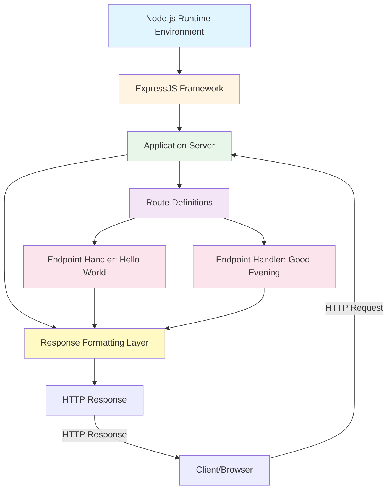
```mermaid
graph TD
    A[Node.js Runtime Environment] --> B[ExpressJS Framework]
    B --> C[Application Server]
    C --> D[Route Definitions]
    D --> E[Endpoint Handler: Hello World]
    D --> F[Endpoint Handler: Good Evening]
    C --> G[Response Formatting Layer]
    E --> G
    F --> G
    G --> H[HTTP Response]
    
    I[Client/Browser] --> |HTTP Request| C
    H --> |HTTP Response| I
    
    style A fill:#e1f5ff
    style B fill:#fff4e1
    style C fill:#e8f5e9
    style D fill:#f3e5f5
    style E fill:#fce4ec
    style F fill:#fce4ec
    style G fill:#fff9c4
```

**Component Descriptions:**

1. **Node.js Runtime Environment**
   - Executes JavaScript server-side code
   - Provides core HTTP and networking capabilities
   - Manages asynchronous operations and event loop

2. **ExpressJS Framework Layer**
   - Provides routing abstraction
   - Manages middleware pipeline
   - Simplifies request/response handling
   - Offers extensibility through plugins

3. **Application Server Component**
   - Initializes Express application instance
   - Configures server settings (port, host)
   - Manages application lifecycle (startup, shutdown)

4. **Routing Layer**
   - Defines endpoint paths and HTTP methods
   - Maps URLs to handler functions
   - Manages route-specific middleware

5. **Endpoint Handlers**
   - Implement business logic for each route
   - Generate response content
   - Handle request parameters (if applicable)

6. **Response Formatting**
   - Structures response data
   - Sets appropriate HTTP headers
   - Manages content types

#### 1.2.2.3 Core Technical Approach

**Architectural Philosophy:**

The system follows a **layered architecture** pattern with clear separation of concerns:

- **Framework Layer:** ExpressJS handles HTTP protocol complexities
- **Application Layer:** Route definitions and handler implementations
- **Response Layer:** Content generation and formatting

**Design Principles:**

1. **Simplicity First:** Minimal configuration and dependencies
2. **Educational Clarity:** Code structure prioritizes readability over optimization
3. **Incremental Complexity:** Progression from basic to framework-based implementation
4. **Industry Alignment:** Patterns consistent with production Node.js applications

**Technology Stack:**

| Layer | Technology | Purpose |
|-------|-----------|---------|
| Runtime | Node.js | JavaScript execution environment |
| Framework | ExpressJS | Web application framework |
| Language | JavaScript | Primary development language |
| Package Manager | NPM/Yarn | Dependency management |

**Request Flow Architecture:**

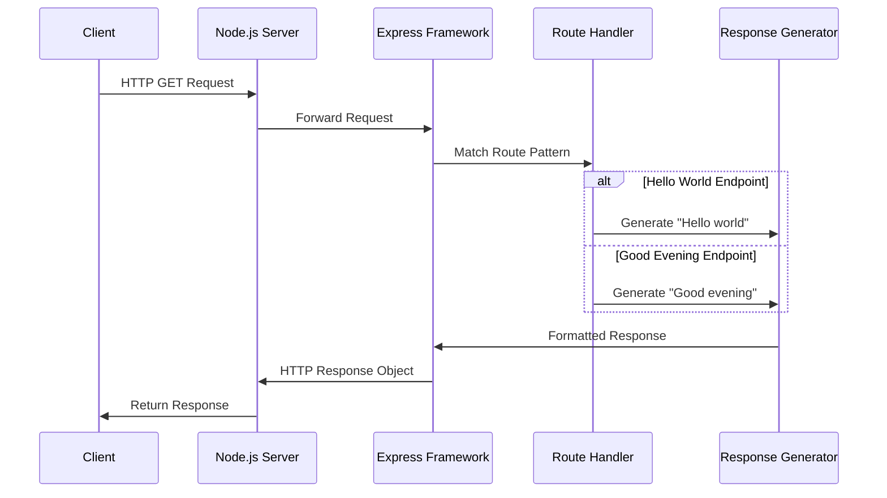
```mermaid
sequenceDiagram
    participant Client
    participant NodeJS as Node.js Server
    participant Express as Express Framework
    participant Router as Route Handler
    participant Response as Response Generator

    Client->>NodeJS: HTTP GET Request
    NodeJS->>Express: Forward Request
    Express->>Router: Match Route Pattern
    
    alt Hello World Endpoint
        Router->>Response: Generate "Hello world"
    else Good Evening Endpoint
        Router->>Response: Generate "Good evening"
    end
    
    Response->>Express: Formatted Response
    Express->>NodeJS: HTTP Response Object
    NodeJS->>Client: Return Response
```

### 1.2.3 Success Criteria

#### 1.2.3.1 Measurable Objectives

The tutorial project defines success through the following quantifiable objectives:

| Objective | Target | Measurement Method |
|-----------|--------|-------------------|
| **Functional Endpoints** | 2 working endpoints | Manual testing of both routes |
| **Correct Responses** | 100% accuracy | Response content verification |
| **Framework Integration** | ExpressJS successfully added | Package.json dependency check |
| **Server Stability** | Zero crashes during normal operation | Runtime error monitoring |

#### 1.2.3.2 Critical Success Factors

1. **Functional Completeness**
   - Both endpoints return correct response messages
   - Server starts without errors
   - Requests receive timely responses (< 100ms for simple endpoints)

2. **Code Quality**
   - Clean, readable code structure
   - Proper dependency management via package.json
   - Consistent coding style and formatting
   - Meaningful variable and function names

3. **Educational Effectiveness**
   - Clear progression from basic to framework-based implementation
   - Well-commented code explaining key concepts
   - Logical file organization
   - Documentation of setup and execution steps

4. **Technical Correctness**
   - Proper HTTP status codes (200 OK for successful requests)
   - Appropriate content-type headers
   - Correct Express framework usage patterns
   - Standard Node.js project structure

#### 1.2.3.3 Key Performance Indicators

**Functional KPIs:**
- **Endpoint Availability:** Both endpoints accessible and returning correct responses
- **Response Time:** < 100ms for simple text responses under normal load
- **Error Rate:** 0% for valid requests to defined endpoints

**Technical KPIs:**
- **Dependency Integrity:** All required packages successfully installed
- **Code Coverage:** All implemented endpoints have defined routes and handlers
- **Startup Time:** Server initialization completes in < 5 seconds

**Educational KPIs:**
- **Concept Coverage:** Demonstrates both native Node.js and Express approaches
- **Code Clarity:** All major components properly structured and named
- **Documentation Quality:** README and inline comments explain key concepts

## 1.3 Scope

### 1.3.1 In-Scope Elements

#### 1.3.1.1 Core Features and Functionalities

**Must-Have Capabilities:**

1. **Node.js Server Implementation**
   - HTTP server initialization and configuration
   - Port binding and listener setup
   - Basic error handling for server startup failures
   - Graceful server lifecycle management

2. **ExpressJS Framework Integration**
   - Express package installation via NPM
   - Express application initialization
   - Framework configuration and setup
   - Middleware pipeline establishment

3. **Endpoint Implementation**
   
   **Endpoint 1: Hello World**
   - Route definition for "Hello world" response
   - HTTP GET method handler
   - Plain text or JSON response formatting
   - Status code 200 (OK) on successful request

   **Endpoint 2: Good Evening**
   - Route definition for "Good evening" response
   - HTTP GET method handler
   - Plain text or JSON response formatting
   - Status code 200 (OK) on successful request

4. **Primary User Workflows**
   - Server startup process
   - HTTP request handling for defined endpoints
   - Response generation and delivery
   - Server shutdown process

5. **Essential Configuration**
   - Package.json file with dependencies
   - Server port configuration
   - Basic Express application settings
   - NPM scripts for server execution

6. **Key Technical Requirements**
   - Node.js runtime (version compatibility)
   - ExpressJS framework (latest stable version)
   - JavaScript ES6+ syntax support
   - Console logging for server status

#### 1.3.1.2 Implementation Boundaries

**System Boundaries:**

| Boundary Type | Included | Excluded |
|--------------|----------|----------|
| **Application Layer** | HTTP endpoint handlers | Database interactions |
| **Protocol Support** | HTTP | HTTPS, WebSockets |
| **Data Format** | Text/JSON responses | File uploads, streaming |
| **Deployment** | Local development environment | Production hosting, cloud deployment |

**User Groups Covered:**
- Tutorial learners running server locally
- Developers studying code examples
- Students following along with tutorial instructions

**Technical Coverage:**
- Simple HTTP GET request handling
- Basic routing with Express Router
- Text-based response generation
- Development server configuration

**Data Domains Included:**
- Static response strings ("Hello world", "Good evening")
- HTTP request/response metadata
- Server configuration parameters

### 1.3.2 Out-of-Scope Elements

#### 1.3.2.1 Explicitly Excluded Features and Capabilities

**Not Included in Current Implementation:**

1. **Data Persistence**
   - No database integration (MongoDB, PostgreSQL, MySQL)
   - No file system storage
   - No caching mechanisms (Redis, Memcached)
   - No session management

2. **Authentication and Authorization**
   - No user authentication
   - No API key validation
   - No JWT token handling
   - No OAuth integration
   - No role-based access control

3. **Advanced HTTP Features**
   - No support for POST, PUT, DELETE methods
   - No request body parsing (beyond Express defaults)
   - No file upload handling
   - No multipart form data processing
   - No streaming responses

4. **Production-Ready Features**
   - No comprehensive error handling and logging
   - No request rate limiting
   - No CORS configuration
   - No security headers (Helmet.js)
   - No compression middleware
   - No process management (PM2, Forever)

5. **Testing Infrastructure**
   - No unit tests
   - No integration tests
   - No test frameworks (Jest, Mocha)
   - No code coverage tools

6. **API Documentation**
   - No OpenAPI/Swagger documentation
   - No API versioning
   - No request/response validation schemas

7. **Monitoring and Observability**
   - No application performance monitoring
   - No error tracking (Sentry, Rollbar)
   - No structured logging
   - No metrics collection

8. **Advanced Routing**
   - No dynamic route parameters
   - No query string processing
   - No route middleware
   - No sub-routers or modular route organization

#### 1.3.2.2 Future Phase Considerations

**Potential Enhancements (Not Currently Planned):**

- **Phase 2 Possibilities:**
  - Adding POST endpoint with request body handling
  - Implementing query parameter processing
  - Adding basic input validation
  - Introducing environment-based configuration

- **Phase 3 Possibilities:**
  - Database integration for dynamic content
  - User authentication mechanisms
  - RESTful CRUD operations
  - API documentation generation

#### 1.3.2.3 Integration Points Not Covered

- No third-party API integrations
- No message queue systems (RabbitMQ, Kafka)
- No microservices communication
- No service mesh integration
- No container orchestration (Kubernetes)
- No CI/CD pipeline configuration

#### 1.3.2.4 Unsupported Use Cases

**The following scenarios are explicitly not supported:**

1. **Production Deployment**
   - High-traffic load handling
   - Horizontal scaling requirements
   - Enterprise security compliance
   - 24/7 availability and uptime requirements

2. **Complex Business Logic**
   - Data transformation and processing
   - Business rule enforcement
   - Workflow orchestration
   - Transaction management

3. **Advanced Client Interactions**
   - Real-time bidirectional communication
   - Server-sent events
   - Long polling
   - WebSocket connections

4. **Enterprise Integration**
   - Legacy system connectivity
   - Enterprise service bus integration
   - SOAP/XML web services
   - EDI processing

## 1.4 References

### 1.4.1 Repository Files Examined

- `README.md` - Minimal project documentation containing only project identifier "# 12nov04"

### 1.4.2 Folders Explored

- `/` (root directory, depth: 0) - Repository root containing only README.md file; no subdirectories present

### 1.4.3 Validation and Analysis

**Repository State Verification:**
- Git history analysis: Single initial commit dated November 12, 2025
- File system exploration: Confirmed absence of source code files (.js, .json, .ts, .mjs)
- Configuration check: No package.json, .gitignore, or Node.js configuration files present
- Branch analysis: Single main branch with clean working tree

**Information Sources:**
- User Context: Primary source for project requirements, current state description, and enhancement objectives
- Repository Analysis: Confirmed minimal/initial project state
- Technical Knowledge: Node.js and ExpressJS architecture patterns, best practices, and tutorial design principles

### 1.4.4 Technical Reference Standards

This specification references industry-standard practices for:
- Node.js server development patterns
- ExpressJS framework architecture
- RESTful endpoint design
- Educational tutorial structure

**Note:** The repository is currently in an initial setup phase with no implemented code. All technical specifications are based on user-provided requirements and intended functionality rather than existing implementation analysis.

# 2. Product Requirements

## 2.1 Overview

This section provides a comprehensive breakdown of the product requirements for the Node.js Server Tutorial Enhancement project. The system progresses from a basic Node.js HTTP server with a single endpoint to an ExpressJS-based application with multiple endpoints, serving as an educational resource for developers learning modern Node.js web development patterns.

The requirements documented herein are derived from the existing system design (single "Hello world" endpoint) and the enhancement request to integrate ExpressJS framework and add a "Good evening" endpoint. All features are scoped to maintain the tutorial's educational focus while demonstrating industry-standard architectural patterns.

### 2.1.1 Requirements Organization

Requirements are organized into five primary features, each with detailed functional requirements, acceptance criteria, and implementation specifications. The feature catalog follows a dependency hierarchy where foundational infrastructure supports framework integration, which in turn enables endpoint implementations.

### 2.1.2 Feature Prioritization

Feature priorities are assigned based on the following criteria:
- **Critical**: Essential for system operation; blocks all dependent features
- **High**: Core functionality required for user-facing capabilities
- **Medium**: Important enhancements that improve system quality
- **Low**: Optional improvements with minimal impact on core functionality

All features in this project are classified as Critical or High priority due to the tightly integrated nature of the educational tutorial architecture.

## 2.2 Feature Catalog

### 2.2.1 F-001: Node.js HTTP Server Foundation

#### Feature Metadata

| Attribute | Value |
|-----------|-------|
| Feature ID | F-001 |
| Feature Name | Node.js HTTP Server Foundation |
| Category | Core Infrastructure |
| Priority | Critical |

| Attribute | Value |
|-----------|-------|
| Status | To Be Implemented |
| Dependencies | None (Foundation Feature) |

#### Description

**Overview**

The Node.js HTTP Server Foundation provides the fundamental server infrastructure capable of receiving HTTP requests, processing them through a defined handler pipeline, and returning appropriate HTTP responses. This feature establishes the baseline server capability using Node.js native HTTP module, which will subsequently be enhanced through ExpressJS framework integration.

**Business Value**

This feature delivers the core educational value of demonstrating HTTP server fundamentals in Node.js. It enables learners to understand the underlying mechanics of web servers before introducing framework abstractions, establishing a strong conceptual foundation for subsequent topics.

**User Benefits**

- Clear understanding of Node.js HTTP primitives and event-driven architecture
- Hands-on experience with server lifecycle management (startup, request handling, shutdown)
- Foundation knowledge applicable to debugging and troubleshooting framework-based applications
- Practical demonstration of asynchronous I/O patterns in Node.js

**Technical Context**

The server foundation utilizes Node.js native `http` module to create an HTTP server instance bound to a configured port. The implementation demonstrates basic request/response handling patterns, server event listening, and console-based status logging. This component will serve as the base layer that ExpressJS will enhance with routing and middleware capabilities.

#### Dependencies

| Dependency Type | Details |
|----------------|---------|
| Prerequisite Features | None |
| System Dependencies | Node.js Runtime Environment |

| Dependency Type | Details |
|----------------|---------|
| External Dependencies | None |
| Integration Requirements | Must support Express server replacement |

### 2.2.2 F-002: ExpressJS Framework Integration

#### Feature Metadata

| Attribute | Value |
|-----------|-------|
| Feature ID | F-002 |
| Feature Name | ExpressJS Framework Integration |
| Category | Framework/Architecture |
| Priority | Critical |

| Attribute | Value |
|-----------|-------|
| Status | To Be Implemented |
| Dependencies | F-001 (Server Foundation) |

#### Description

**Overview**

ExpressJS Framework Integration replaces the native Node.js HTTP server with the ExpressJS web application framework, introducing routing abstractions, middleware pipeline architecture, and simplified request/response handling. This transformation demonstrates the progression from basic HTTP primitives to production-grade framework patterns.

**Business Value**

This feature provides critical educational value by illustrating framework adoption benefits, including reduced boilerplate code, enhanced maintainability, and scalable routing architecture. It aligns the tutorial with industry-standard practices, as ExpressJS is the most widely adopted Node.js web framework with over 23 million weekly downloads.

**User Benefits**

- Simplified endpoint creation and management through Express routing
- Access to extensive Express middleware ecosystem for future enhancements
- Industry-relevant skills directly applicable to professional development
- Understanding of framework abstraction layers and their architectural benefits

**Technical Context**

Integration involves installing ExpressJS via NPM, initializing an Express application instance, configuring the application with appropriate settings, and replacing the native HTTP server with Express's `listen()` method. The framework provides the `app` object as the central routing and middleware management interface, enabling declarative endpoint definitions through methods like `app.get()`, `app.post()`, etc.

#### Dependencies

| Dependency Type | Details |
|----------------|---------|
| Prerequisite Features | F-001 (Server Foundation) |
| System Dependencies | Node.js Runtime, NPM Package Manager |

| Dependency Type | Details |
|----------------|---------|
| External Dependencies | express package from NPM registry |
| Integration Requirements | Compatible with F-003 and F-004 endpoint implementations |

### 2.2.3 F-003: Hello World Endpoint

#### Feature Metadata

| Attribute | Value |
|-----------|-------|
| Feature ID | F-003 |
| Feature Name | Hello World Endpoint |
| Category | API Endpoint |
| Priority | High |

| Attribute | Value |
|-----------|-------|
| Status | To Be Implemented |
| Dependencies | F-002 (ExpressJS Integration) |

#### Description

**Overview**

The Hello World Endpoint implements an HTTP GET route that returns the plain text response "Hello world". This endpoint serves as the baseline demonstration of Express routing patterns and represents the existing functionality being migrated from the native HTTP implementation to the Express framework.

**Business Value**

This feature demonstrates the fundamental Express routing pattern, showing how the framework simplifies endpoint creation compared to native HTTP handling. It provides a concrete before-and-after comparison for tutorial learners, illustrating framework benefits through direct experience.

**User Benefits**

- Clear example of Express route definition syntax and patterns
- Understanding of HTTP GET method handling in Express
- Practical demonstration of response generation and formatting
- Baseline reference for implementing additional endpoints

**Technical Context**

Implementation uses Express's `app.get()` method to define a route handler for a specified path. The handler function receives Express request and response objects, enabling simplified response generation through methods like `res.send()` or `res.json()`. The endpoint returns HTTP status code 200 (OK) with the string "Hello world" in the response body.

#### Dependencies

| Dependency Type | Details |
|----------------|---------|
| Prerequisite Features | F-002 (ExpressJS Integration) |
| System Dependencies | Express routing layer |

| Dependency Type | Details |
|----------------|---------|
| External Dependencies | None |
| Integration Requirements | Shares Express application instance with F-004 |

### 2.2.4 F-004: Good Evening Endpoint

#### Feature Metadata

| Attribute | Value |
|-----------|-------|
| Feature ID | F-004 |
| Feature Name | Good Evening Endpoint |
| Category | API Endpoint |
| Priority | High |

| Attribute | Value |
|-----------|-------|
| Status | To Be Implemented |
| Dependencies | F-002 (ExpressJS Integration) |

#### Description

**Overview**

The Good Evening Endpoint implements an HTTP GET route that returns the plain text response "Good evening". This endpoint demonstrates the ease of adding additional routes to an Express application, showcasing the framework's scalability and maintainability advantages over native HTTP server implementations.

**Business Value**

This feature provides educational value by demonstrating incremental feature addition within the Express framework. It shows how additional endpoints can be implemented with minimal code duplication, reinforcing the framework's architectural benefits and scalability characteristics.

**User Benefits**

- Practical experience adding new routes to existing Express applications
- Understanding of multi-endpoint architecture and route coexistence
- Recognition of framework patterns that support application growth
- Skills directly applicable to building production APIs with multiple endpoints

**Technical Context**

Implementation follows the same Express routing pattern as F-003, using `app.get()` to define a route handler for a distinct path. The handler function generates the response "Good evening" using Express response methods. This endpoint operates independently from F-003 while sharing the same Express application instance and middleware pipeline.

#### Dependencies

| Dependency Type | Details |
|----------------|---------|
| Prerequisite Features | F-002 (ExpressJS Integration) |
| System Dependencies | Express routing layer |

| Dependency Type | Details |
|----------------|---------|
| External Dependencies | None |
| Integration Requirements | Shares Express application instance with F-003 |

### 2.2.5 F-005: Project Configuration & Dependency Management

#### Feature Metadata

| Attribute | Value |
|-----------|-------|
| Feature ID | F-005 |
| Feature Name | Project Configuration & Dependency Management |
| Category | Configuration/DevOps |
| Priority | Critical |

| Attribute | Value |
|-----------|-------|
| Status | To Be Implemented |
| Dependencies | None (Foundation Feature) |

#### Description

**Overview**

Project Configuration & Dependency Management establishes the Node.js project structure through `package.json` creation, dependency declaration, and NPM script configuration. This feature enables reproducible installation and execution of the tutorial project across different development environments.

**Business Value**

This feature provides essential educational content on Node.js project organization and dependency management best practices. It demonstrates industry-standard approaches to project configuration, enabling learners to understand professional development workflows and tooling.

**User Benefits**

- Understanding of package.json structure and purpose
- Experience with NPM dependency declaration and version management
- Knowledge of NPM scripts for automating common development tasks
- Skills in project initialization and setup procedures

**Technical Context**

Implementation involves creating a `package.json` file with project metadata (name, version, description), dependency declarations (ExpressJS with semantic versioning), and NPM scripts for server execution (e.g., `npm start`, `npm run dev`). The configuration enables dependency installation via `npm install` and standardized project execution across development environments.

#### Dependencies

| Dependency Type | Details |
|----------------|---------|
| Prerequisite Features | None |
| System Dependencies | Node.js Runtime, NPM Package Manager |

| Dependency Type | Details |
|----------------|---------|
| External Dependencies | express package declaration |
| Integration Requirements | Must support F-002 Express installation |

## 2.3 Functional Requirements

### 2.3.1 F-001 Functional Requirements

#### F-001-RQ-001: Server Initialization

| Attribute | Value |
|-----------|-------|
| Requirement ID | F-001-RQ-001 |
| Description | Initialize HTTP server instance |
| Priority | Must-Have |
| Complexity | Low |

**Acceptance Criteria**
- Server instance created using Node.js `http.createServer()` method
- Server bound to configured port (e.g., 3000, 8080)
- Server initialization logged to console with port number
- Server startup completes without errors

**Technical Specifications**

| Specification | Details |
|---------------|---------|
| Input Parameters | Port number (integer), host address (string) |
| Output/Response | Server listening confirmation message |
| Performance Criteria | Startup time < 5 seconds |

**Validation Rules**

| Rule Type | Requirements |
|-----------|-------------|
| Business Rules | Server must bind to valid port (1024-65535) |
| Data Validation | Port number must be integer type |
| Security Requirements | Avoid privileged ports (< 1024) without justification |

#### F-001-RQ-002: Request Reception

| Attribute | Value |
|-----------|-------|
| Requirement ID | F-001-RQ-002 |
| Description | Receive and acknowledge HTTP requests |
| Priority | Must-Have |
| Complexity | Low |

**Acceptance Criteria**
- Server accepts incoming HTTP connections
- Request object contains method, URL, and headers
- Server maintains connection for request processing
- No connection refusals for valid HTTP requests

**Technical Specifications**

| Specification | Details |
|---------------|---------|
| Input Parameters | HTTP request (method, URL, headers, body) |
| Output/Response | Request object for handler processing |
| Performance Criteria | Connection acceptance < 10ms |

**Validation Rules**

| Rule Type | Requirements |
|-----------|-------------|
| Business Rules | Accept all valid HTTP/1.1 requests |
| Data Validation | Request must conform to HTTP protocol |
| Security Requirements | No requirements (educational scope) |

#### F-001-RQ-003: Server Lifecycle Management

| Attribute | Value |
|-----------|-------|
| Requirement ID | F-001-RQ-003 |
| Description | Manage server start and stop operations |
| Priority | Must-Have |
| Complexity | Low |

**Acceptance Criteria**
- Server starts via script execution
- Server stops gracefully on process termination
- Server releases port binding on shutdown
- Server logs shutdown events to console

**Technical Specifications**

| Specification | Details |
|---------------|---------|
| Input Parameters | Start/stop commands (process signals) |
| Output/Response | Status confirmation messages |
| Performance Criteria | Shutdown completes within 2 seconds |

**Validation Rules**

| Rule Type | Requirements |
|-----------|-------------|
| Business Rules | Clean shutdown with no orphaned processes |
| Data Validation | Signal handling for SIGTERM, SIGINT |
| Security Requirements | No hanging connections on shutdown |

### 2.3.2 F-002 Functional Requirements

#### F-002-RQ-001: Express Package Installation

| Attribute | Value |
|-----------|-------|
| Requirement ID | F-002-RQ-001 |
| Description | Install ExpressJS package via NPM |
| Priority | Must-Have |
| Complexity | Low |

**Acceptance Criteria**
- ExpressJS package listed in `package.json` dependencies
- Express package installed in `node_modules` directory
- Installation completes without errors or warnings
- Express version compatible with Node.js runtime version

**Technical Specifications**

| Specification | Details |
|---------------|---------|
| Input Parameters | Package name ("express"), version constraint |
| Output/Response | Installed package in node_modules |
| Performance Criteria | Installation time < 30 seconds |

**Validation Rules**

| Rule Type | Requirements |
|-----------|-------------|
| Business Rules | Use latest stable Express version |
| Data Validation | Valid semantic version specification |
| Security Requirements | No known vulnerabilities in package version |

#### F-002-RQ-002: Express Application Initialization

| Attribute | Value |
|-----------|-------|
| Requirement ID | F-002-RQ-002 |
| Description | Create and configure Express application instance |
| Priority | Must-Have |
| Complexity | Low |

**Acceptance Criteria**
- Express application created via `express()` constructor
- Application instance assigned to variable (e.g., `app`)
- Basic Express configuration applied (if any)
- Application ready to accept route definitions

**Technical Specifications**

| Specification | Details |
|---------------|---------|
| Input Parameters | None (default Express configuration) |
| Output/Response | Configured Express application object |
| Performance Criteria | Initialization < 100ms |

**Validation Rules**

| Rule Type | Requirements |
|-----------|-------------|
| Business Rules | Use Express default settings |
| Data Validation | Application object must be valid Express instance |
| Security Requirements | No custom security configurations required |

#### F-002-RQ-003: Express Server Activation

| Attribute | Value |
|-----------|-------|
| Requirement ID | F-002-RQ-003 |
| Description | Start Express server listening on configured port |
| Priority | Must-Have |
| Complexity | Low |

**Acceptance Criteria**
- Express server started via `app.listen()` method
- Server binds to specified port successfully
- Startup logged to console with listening port
- Server replaces native HTTP server implementation

**Technical Specifications**

| Specification | Details |
|---------------|---------|
| Input Parameters | Port number, optional callback function |
| Output/Response | Server listening confirmation |
| Performance Criteria | Server start < 3 seconds |

**Validation Rules**

| Rule Type | Requirements |
|-----------|-------------|
| Business Rules | Port must not conflict with system services |
| Data Validation | Valid port number (1024-65535) |
| Security Requirements | Document port choice reasoning |

#### F-002-RQ-004: Middleware Pipeline Establishment

| Attribute | Value |
|-----------|-------|
| Requirement ID | F-002-RQ-004 |
| Description | Configure Express middleware pipeline |
| Priority | Should-Have |
| Complexity | Low |

**Acceptance Criteria**
- Basic middleware configured (e.g., JSON parsing if needed)
- Middleware executes in correct order
- Request processing flows through middleware to routes
- No middleware errors during request handling

**Technical Specifications**

| Specification | Details |
|---------------|---------|
| Input Parameters | Middleware functions or built-in middleware |
| Output/Response | Configured middleware stack |
| Performance Criteria | Middleware overhead < 5ms per request |

**Validation Rules**

| Rule Type | Requirements |
|-----------|-------------|
| Business Rules | Minimal middleware for educational clarity |
| Data Validation | Middleware functions must have correct signature |
| Security Requirements | No security middleware required (out of scope) |

### 2.3.3 F-003 Functional Requirements

#### F-003-RQ-001: Hello World Route Definition

| Attribute | Value |
|-----------|-------|
| Requirement ID | F-003-RQ-001 |
| Description | Define Express route for Hello World endpoint |
| Priority | Must-Have |
| Complexity | Low |

**Acceptance Criteria**
- Route defined using `app.get()` method
- Route path specified (e.g., "/", "/hello")
- Handler function attached to route
- Route registered with Express router

**Technical Specifications**

| Specification | Details |
|---------------|---------|
| Input Parameters | Path string, handler function |
| Output/Response | Registered route in Express routing table |
| Performance Criteria | Route registration < 1ms |

**Validation Rules**

| Rule Type | Requirements |
|-----------|-------------|
| Business Rules | Path must be unique within application |
| Data Validation | Path must be valid URL pattern |
| Security Requirements | No authentication required (educational scope) |

#### F-003-RQ-002: Hello World Response Generation

| Attribute | Value |
|-----------|-------|
| Requirement ID | F-003-RQ-002 |
| Description | Generate "Hello world" response content |
| Priority | Must-Have |
| Complexity | Low |

**Acceptance Criteria**
- Response body contains exactly "Hello world" string
- Response sent via `res.send()` or `res.json()` method
- Response completes without errors
- Response content type set appropriately (text/plain or application/json)

**Technical Specifications**

| Specification | Details |
|---------------|---------|
| Input Parameters | Express request object (req) |
| Output/Response | "Hello world" string with 200 status |
| Performance Criteria | Response generation < 1ms |

**Validation Rules**

| Rule Type | Requirements |
|-----------|-------------|
| Business Rules | Response must match specification exactly |
| Data Validation | String must not be null or empty |
| Security Requirements | No XSS vulnerabilities (static response) |

#### F-003-RQ-003: Hello World HTTP Status

| Attribute | Value |
|-----------|-------|
| Requirement ID | F-003-RQ-003 |
| Description | Return HTTP 200 OK status code |
| Priority | Must-Have |
| Complexity | Low |

**Acceptance Criteria**
- Response status code set to 200
- Status code sent in HTTP response headers
- Client receives 200 status code
- No error status codes (4xx, 5xx) for valid requests

**Technical Specifications**

| Specification | Details |
|---------------|---------|
| Input Parameters | None (default success status) |
| Output/Response | HTTP 200 status code |
| Performance Criteria | Status code determination < 1ms |

**Validation Rules**

| Rule Type | Requirements |
|-----------|-------------|
| Business Rules | Success responses always return 200 |
| Data Validation | Status code must be valid HTTP status |
| Security Requirements | No information disclosure in status codes |

#### F-003-RQ-004: Hello World Performance

| Attribute | Value |
|-----------|-------|
| Requirement ID | F-003-RQ-004 |
| Description | Meet response time performance criteria |
| Priority | Should-Have |
| Complexity | Low |

**Acceptance Criteria**
- Response time < 100ms under normal conditions
- Response time measured from request receipt to response sent
- Performance consistent across multiple requests
- No degradation over time

**Technical Specifications**

| Specification | Details |
|---------------|---------|
| Input Parameters | HTTP GET request |
| Output/Response | Complete HTTP response |
| Performance Criteria | End-to-end latency < 100ms |

**Validation Rules**

| Rule Type | Requirements |
|-----------|-------------|
| Business Rules | Meet educational performance expectations |
| Data Validation | Performance measurement accuracy ±10ms |
| Security Requirements | No timing attack vulnerabilities |

### 2.3.4 F-004 Functional Requirements

#### F-004-RQ-001: Good Evening Route Definition

| Attribute | Value |
|-----------|-------|
| Requirement ID | F-004-RQ-001 |
| Description | Define Express route for Good Evening endpoint |
| Priority | Must-Have |
| Complexity | Low |

**Acceptance Criteria**
- Route defined using `app.get()` method
- Route path specified (distinct from F-003 path)
- Handler function attached to route
- Route registered with Express router

**Technical Specifications**

| Specification | Details |
|---------------|---------|
| Input Parameters | Path string, handler function |
| Output/Response | Registered route in Express routing table |
| Performance Criteria | Route registration < 1ms |

**Validation Rules**

| Rule Type | Requirements |
|-----------|-------------|
| Business Rules | Path must not conflict with F-003 path |
| Data Validation | Path must be valid URL pattern |
| Security Requirements | No authentication required (educational scope) |

#### F-004-RQ-002: Good Evening Response Generation

| Attribute | Value |
|-----------|-------|
| Requirement ID | F-004-RQ-002 |
| Description | Generate "Good evening" response content |
| Priority | Must-Have |
| Complexity | Low |

**Acceptance Criteria**
- Response body contains exactly "Good evening" string
- Response sent via `res.send()` or `res.json()` method
- Response completes without errors
- Response content type set appropriately (text/plain or application/json)

**Technical Specifications**

| Specification | Details |
|---------------|---------|
| Input Parameters | Express request object (req) |
| Output/Response | "Good evening" string with 200 status |
| Performance Criteria | Response generation < 1ms |

**Validation Rules**

| Rule Type | Requirements |
|-----------|-------------|
| Business Rules | Response must match specification exactly |
| Data Validation | String must not be null or empty |
| Security Requirements | No XSS vulnerabilities (static response) |

#### F-004-RQ-003: Good Evening HTTP Status

| Attribute | Value |
|-----------|-------|
| Requirement ID | F-004-RQ-003 |
| Description | Return HTTP 200 OK status code |
| Priority | Must-Have |
| Complexity | Low |

**Acceptance Criteria**
- Response status code set to 200
- Status code sent in HTTP response headers
- Client receives 200 status code
- No error status codes (4xx, 5xx) for valid requests

**Technical Specifications**

| Specification | Details |
|---------------|---------|
| Input Parameters | None (default success status) |
| Output/Response | HTTP 200 status code |
| Performance Criteria | Status code determination < 1ms |

**Validation Rules**

| Rule Type | Requirements |
|-----------|-------------|
| Business Rules | Success responses always return 200 |
| Data Validation | Status code must be valid HTTP status |
| Security Requirements | No information disclosure in status codes |

#### F-004-RQ-004: Good Evening Performance

| Attribute | Value |
|-----------|-------|
| Requirement ID | F-004-RQ-004 |
| Description | Meet response time performance criteria |
| Priority | Should-Have |
| Complexity | Low |

**Acceptance Criteria**
- Response time < 100ms under normal conditions
- Response time measured from request receipt to response sent
- Performance consistent across multiple requests
- No degradation over time

**Technical Specifications**

| Specification | Details |
|---------------|---------|
| Input Parameters | HTTP GET request |
| Output/Response | Complete HTTP response |
| Performance Criteria | End-to-end latency < 100ms |

**Validation Rules**

| Rule Type | Requirements |
|-----------|-------------|
| Business Rules | Meet educational performance expectations |
| Data Validation | Performance measurement accuracy ±10ms |
| Security Requirements | No timing attack vulnerabilities |

### 2.3.5 F-005 Functional Requirements

#### F-005-RQ-001: Package.json Creation

| Attribute | Value |
|-----------|-------|
| Requirement ID | F-005-RQ-001 |
| Description | Create package.json with project metadata |
| Priority | Must-Have |
| Complexity | Low |

**Acceptance Criteria**
- File named `package.json` exists in project root
- File contains valid JSON structure
- Required fields present (name, version, description)
- File parseable by NPM without errors

**Technical Specifications**

| Specification | Details |
|---------------|---------|
| Input Parameters | Project metadata (name, version, etc.) |
| Output/Response | package.json file in root directory |
| Performance Criteria | File creation < 1 second |

**Validation Rules**

| Rule Type | Requirements |
|-----------|-------------|
| Business Rules | Follow NPM package.json specification |
| Data Validation | Valid JSON syntax with required fields |
| Security Requirements | No sensitive data in package.json |

#### F-005-RQ-002: Dependency Declaration

| Attribute | Value |
|-----------|-------|
| Requirement ID | F-005-RQ-002 |
| Description | Declare ExpressJS dependency in package.json |
| Priority | Must-Have |
| Complexity | Low |

**Acceptance Criteria**
- "dependencies" section exists in package.json
- "express" listed with semantic version constraint
- Version constraint allows stable Express versions
- No extraneous dependencies declared

**Technical Specifications**

| Specification | Details |
|---------------|---------|
| Input Parameters | Package name, version constraint |
| Output/Response | Dependency entry in package.json |
| Performance Criteria | N/A (static configuration) |

**Validation Rules**

| Rule Type | Requirements |
|-----------|-------------|
| Business Rules | Use semantic versioning (e.g., "^4.18.0") |
| Data Validation | Valid package name and version format |
| Security Requirements | Specify version to avoid unexpected updates |

#### F-005-RQ-003: NPM Script Configuration

| Attribute | Value |
|-----------|-------|
| Requirement ID | F-005-RQ-003 |
| Description | Configure NPM scripts for server execution |
| Priority | Must-Have |
| Complexity | Low |

**Acceptance Criteria**
- "scripts" section exists in package.json
- "start" script defined for server execution
- Script command references main server file
- Script executes successfully via `npm start`

**Technical Specifications**

| Specification | Details |
|---------------|---------|
| Input Parameters | Script name, command string |
| Output/Response | Script entry in package.json |
| Performance Criteria | Script execution starts < 2 seconds |

**Validation Rules**

| Rule Type | Requirements |
|-----------|-------------|
| Business Rules | "start" script is standard convention |
| Data Validation | Command must be valid shell command |
| Security Requirements | No arbitrary code execution vulnerabilities |

#### F-005-RQ-004: Dependency Installation

| Attribute | Value |
|-----------|-------|
| Requirement ID | F-005-RQ-004 |
| Description | Enable dependency installation via npm install |
| Priority | Must-Have |
| Complexity | Low |

**Acceptance Criteria**
- `npm install` command completes without errors
- node_modules directory created with Express package
- package-lock.json generated with dependency tree
- Installation reproducible across environments

**Technical Specifications**

| Specification | Details |
|---------------|---------|
| Input Parameters | package.json file |
| Output/Response | Installed dependencies in node_modules |
| Performance Criteria | Installation time < 60 seconds |

**Validation Rules**

| Rule Type | Requirements |
|-----------|-------------|
| Business Rules | Use NPM or Yarn package manager |
| Data Validation | Valid package registry connectivity |
| Security Requirements | Verify package integrity during installation |

## 2.4 Feature Relationships

### 2.4.1 Feature Dependency Map

The feature dependency structure follows a clear hierarchical pattern where foundational infrastructure enables framework integration, which in turn supports endpoint implementations. The following diagram illustrates the complete dependency relationships among all features:

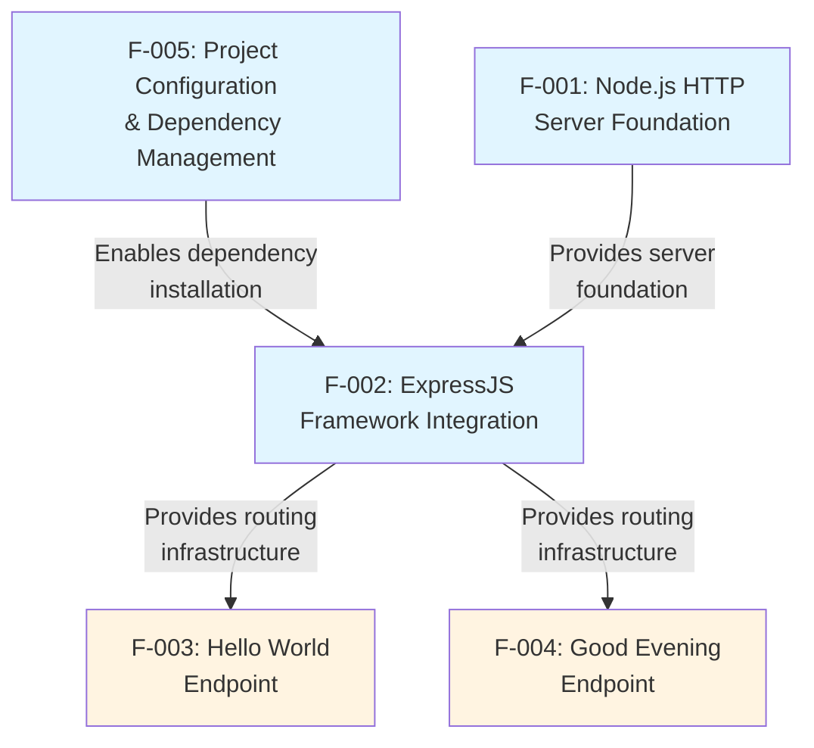
```mermaid
graph TD
    F001[F-001: Node.js HTTP<br/>Server Foundation]
    F002[F-002: ExpressJS<br/>Framework Integration]
    F003[F-003: Hello World<br/>Endpoint]
    F004[F-004: Good Evening<br/>Endpoint]
    F005[F-005: Project Configuration<br/>& Dependency Management]
    
    F005 -->|Enables dependency<br/>installation| F002
    F001 -->|Provides server<br/>foundation| F002
    F002 -->|Provides routing<br/>infrastructure| F003
    F002 -->|Provides routing<br/>infrastructure| F004
    
    style F001 fill:#e1f5ff
    style F002 fill:#e1f5ff
    style F005 fill:#e1f5ff
    style F003 fill:#fff4e1
    style F004 fill:#fff4e1
```

**Dependency Analysis:**

| Feature | Prerequisites | Enables | Dependency Type |
|---------|--------------|---------|-----------------|
| F-001 | None | F-002 | Foundation |
| F-002 | F-001, F-005 | F-003, F-004 | Integration Layer |
| F-003 | F-002 | None | Endpoint Implementation |
| F-004 | F-002 | None | Endpoint Implementation |
| F-005 | None | F-002 | Configuration Foundation |

**Critical Path:**

The critical implementation path follows: F-005 (Configuration) → F-001 (Server) → F-002 (Express) → F-003/F-004 (Endpoints). Features F-003 and F-004 can be implemented in parallel once F-002 is completed, as they share no direct dependencies and operate on the same Express application instance independently.

### 2.4.2 Integration Points

#### Express Application Instance Sharing

Features F-003 (Hello World Endpoint) and F-004 (Good Evening Endpoint) share a common integration point through the Express application instance created in F-002. Both endpoints register routes on the same `app` object, ensuring consistent request handling and middleware execution.

**Integration Characteristics:**
- **Shared Resource:** Single Express application instance (`app`)
- **Route Registration:** Sequential route definitions on shared router
- **Middleware Pipeline:** Both endpoints execute through identical middleware stack
- **Request Isolation:** Individual requests routed independently to appropriate handlers

#### Server Lifecycle Integration

Feature F-002 (ExpressJS Integration) replaces the native server implementation from F-001 (Server Foundation) while maintaining equivalent lifecycle characteristics:

**Lifecycle Transition:**
- **Before:** `http.createServer().listen()` pattern
- **After:** `express().listen()` pattern
- **Maintained Behaviors:** Port binding, startup logging, graceful shutdown
- **Enhanced Capabilities:** Routing layer, middleware support, enhanced error handling

#### Configuration Integration

Feature F-005 (Project Configuration) integrates with F-002 (ExpressJS Integration) through dependency declaration and installation mechanisms:

**Configuration Flow:**
1. package.json declares "express" dependency
2. `npm install` resolves and installs Express package
3. Server code imports Express via `require('express')`
4. Express functionality becomes available to application

### 2.4.3 Shared Components

#### Express Routing Layer

The Express routing layer serves as a shared component utilized by both endpoint features (F-003 and F-004). This component provides:

**Shared Capabilities:**
- URL pattern matching
- HTTP method dispatch (GET, POST, etc.)
- Handler function invocation
- Request/response object provision

**Component Architecture:**

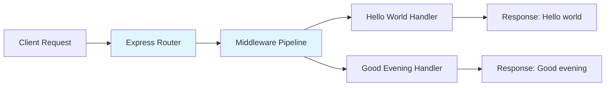
```mermaid
graph LR
    Client[Client Request]
    Router[Express Router]
    MW[Middleware Pipeline]
    H1[Hello World Handler]
    H2[Good Evening Handler]
    
    Client --> Router
    Router --> MW
    MW --> H1
    MW --> H2
    H1 --> Response1[Response: Hello world]
    H2 --> Response2[Response: Good evening]
    
    style Router fill:#e1f5ff
    style MW fill:#e1f5ff
```

#### Response Formatting

Both endpoint features share common response formatting patterns provided by Express response methods:

| Method | Purpose | Used By |
|--------|---------|---------|
| res.send() | Send string or object response | F-003, F-004 |
| res.json() | Send JSON-formatted response | F-003, F-004 (optional) |
| res.status() | Set HTTP status code | F-003, F-004 |

#### NPM Ecosystem

All features operate within the NPM ecosystem established by F-005:

**Shared Infrastructure:**
- package.json for dependency management
- node_modules for installed packages
- NPM scripts for execution commands
- package-lock.json for dependency locking

### 2.4.4 Common Services

#### Console Logging

All features utilize Node.js console logging for status reporting and debugging:

**Logging Points:**
- Server startup confirmation (F-001, F-002)
- Port binding notification (F-001, F-002)
- Request handling logs (F-003, F-004, optional)
- Error reporting (all features)

#### Port Management

Features F-001, F-002, and F-005 coordinate around port configuration:

**Port Configuration Flow:**
- F-005 may specify port in environment configuration
- F-001/F-002 bind to configured or default port
- Single port shared across all endpoints (F-003, F-004)

## 2.5 Implementation Considerations

### 2.5.1 Technical Constraints

## Node.js Version Compatibility

**Constraint Description:**

The tutorial must specify a minimum Node.js version compatible with the selected ExpressJS version. Express 4.x requires Node.js 0.10 or higher, but practical educational value suggests targeting LTS (Long Term Support) versions.

**Implications:**
- Documentation must specify minimum Node.js version (e.g., Node.js 14.x or later)
- Tutorial should note version verification command: `node --version`
- Incompatible Node.js versions will cause installation or runtime failures

**Mitigation Strategy:**
- Document version requirements clearly in README
- Consider using `engines` field in package.json to specify Node.js version constraints
- Provide troubleshooting guidance for version mismatches

#### Platform Independence

**Constraint Description:**

The tutorial should function identically across major operating systems (Windows, macOS, Linux) without platform-specific code or configuration.

**Implications:**
- Avoid file paths with platform-specific separators
- Use Node.js path module for any file path operations
- Ensure console output formatting compatible with all terminal types
- NPM commands must work across platforms

**Mitigation Strategy:**
- Test tutorial on multiple platforms during development
- Use cross-platform NPM scripts conventions
- Document any platform-specific setup requirements

#### Educational Simplicity Constraint

**Constraint Description:**

As an educational tutorial, implementation must prioritize code clarity and readability over optimization or advanced patterns. Complex abstractions should be avoided unless they serve explicit learning objectives.

**Implications:**
- Avoid premature optimization or advanced JavaScript features
- Prefer explicit code over clever shortcuts
- Limit use of modern ES6+ features that may confuse beginners
- Keep file structure simple and flat

**Mitigation Strategy:**
- Include code comments explaining key concepts
- Use descriptive variable and function names
- Structure code with clear separation of concerns
- Provide inline explanations for framework-specific patterns

#### Dependency Minimalism

**Constraint Description:**

The project should include only the ExpressJS framework as an external dependency. Additional packages (even helpful ones like nodemon or dotenv) are out of scope to maintain tutorial focus.

**Implications:**
- No development dependencies beyond Express
- Manual server restart required for code changes
- Configuration must use hardcoded values or environment variables directly
- No testing framework integration

**Mitigation Strategy:**
- Document that additional dependencies can be added in production scenarios
- Explain manual restart procedure clearly
- Suggest extensions in tutorial conclusion or "next steps" section

### 2.5.2 Performance Requirements

#### Response Time Targets

**Requirement Specification:**

All endpoint responses (F-003, F-004) must complete within 100 milliseconds under normal operating conditions, measured from request receipt to response transmission completion.

**Measurement Methodology:**
- Use browser developer tools network timing
- Measure with tools like curl with `-w "@curl-format.txt"` for timing
- Test from localhost to eliminate network latency
- Verify across multiple consecutive requests

**Performance Factors:**

| Factor | Expected Impact | Optimization Approach |
|--------|----------------|----------------------|
| Route Matching | < 1ms | Express handles efficiently by default |
| Handler Execution | < 1ms | Static string responses minimal cost |
| Response Formatting | < 1ms | Simple text/JSON formatting |
| Network Transmission | < 10ms | Localhost minimal latency |

**Performance Validation:**

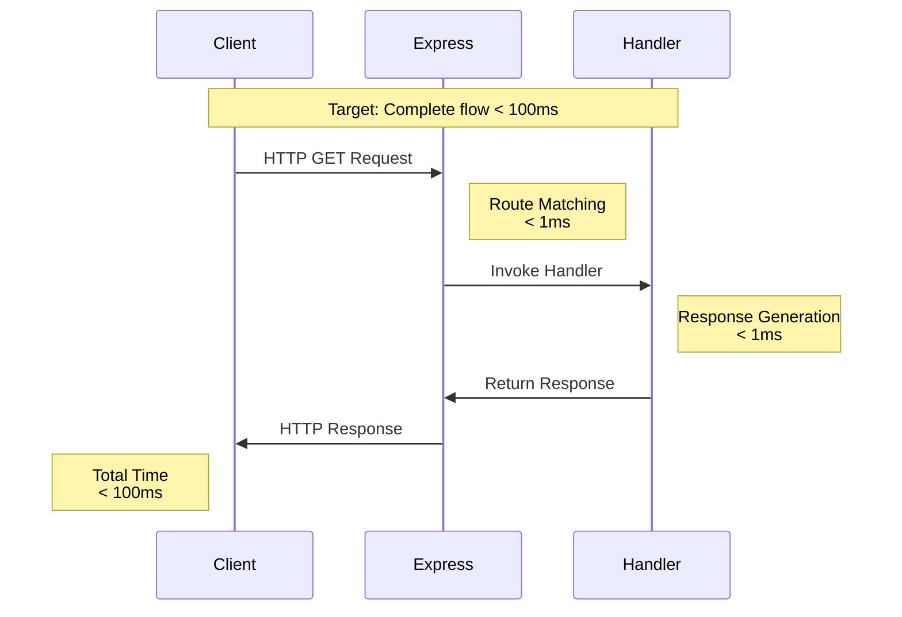
```mermaid
sequenceDiagram
    participant Client
    participant Express
    participant Handler
    
    Note over Client,Handler: Target: Complete flow < 100ms
    
    Client->>Express: HTTP GET Request
    Note right of Express: Route Matching<br/>< 1ms
    Express->>Handler: Invoke Handler
    Note right of Handler: Response Generation<br/>< 1ms
    Handler->>Express: Return Response
    Express->>Client: HTTP Response
    Note left of Client: Total Time<br/>< 100ms
```

#### Server Startup Performance

**Requirement Specification:**

Server initialization and port binding must complete within 5 seconds, providing rapid development iteration cycles.

**Startup Components:**

| Component | Expected Duration | Optimization Notes |
|-----------|------------------|-------------------|
| Node.js Process Start | < 1s | Runtime initialization |
| Module Loading | < 1s | Express and application code |
| Express Initialization | < 1s | App creation and config |
| Port Binding | < 1s | Network socket creation |
| Route Registration | < 100ms | F-003 and F-004 routes |

**Startup Validation:**
- Measure time from `node server.js` execution to "Server listening" log message
- Verify consistent startup time across multiple restarts
- Ensure no blocking operations during initialization

#### Concurrent Request Handling

**Requirement Specification:**

While the tutorial focuses on single-endpoint behavior, the server must handle multiple concurrent requests without degradation, demonstrating Node.js asynchronous I/O capabilities.

**Concurrency Characteristics:**
- Node.js event loop handles concurrent requests naturally
- Static responses require no blocking I/O operations
- Expected throughput: 1000+ requests/second for simple endpoints
- No request queuing or throttling required

**Educational Note:**

The tutorial should explain that Node.js handles concurrency through the event loop model, contrasting with traditional threaded server architectures. This conceptual understanding has high educational value even though explicit concurrency testing is out of scope.

### 2.5.3 Security Implications

#### Educational Security Scope

**Security Posture:**

As an educational tutorial, the project intentionally omits production security features to maintain focus on core concepts. However, the tutorial should acknowledge security considerations and direct learners to appropriate resources.

**Explicitly Excluded Security Features:**
- Authentication and authorization mechanisms
- HTTPS/TLS encryption
- CORS (Cross-Origin Resource Sharing) configuration
- Security headers (Helmet.js)
- Rate limiting and DDoS protection
- Input validation and sanitization
- SQL injection prevention (no database)
- XSS (Cross-Site Scripting) protection

**Security Documentation Requirements:**

The tutorial must include a disclaimer or "Security Considerations" section noting:
1. This implementation is for educational purposes only
2. Production applications require comprehensive security measures
3. References to Express security best practices documentation
4. Recommendation to review OWASP Node.js security guidelines

#### Localhost Binding Security

**Consideration:**

The server should bind to localhost (127.0.0.1) rather than all interfaces (0.0.0.0) by default, limiting exposure to local machine only.

**Implementation:**
```javascript
// Recommended: app.listen(3000, 'localhost')
// Avoid: app.listen(3000) or app.listen(3000, '0.0.0.0')
```

**Educational Value:**
- Teaches awareness of network binding implications
- Demonstrates security principle of least privilege
- Provides foundation for understanding production deployment concerns

#### Static Response Security

**Security Benefit:**

The static string responses ("Hello world", "Good evening") have inherent security advantages:
- No user input processing eliminates injection vulnerabilities
- No database queries eliminate SQL injection risks
- No file system access eliminates path traversal risks
- No dynamic HTML generation eliminates XSS vulnerabilities

**Educational Explanation:**

The tutorial should note that these static responses are secure by virtue of their simplicity, but real-world applications handling user input require comprehensive validation and sanitization.

### 2.5.4 Maintenance Requirements

#### Code Maintainability

**Code Organization:**

The tutorial code should follow these maintainability principles:

| Principle | Implementation | Educational Benefit |
|-----------|---------------|-------------------|
| Single Responsibility | One file for server logic | Clear code structure understanding |
| Descriptive Naming | Clear variable/function names | Improved code readability |
| Code Comments | Explain key concepts inline | Self-documenting tutorial |
| Consistent Formatting | Standard JavaScript style | Professional code presentation |

**File Structure:**

```
project-root/
├── package.json          # Project configuration (F-005)
├── server.js             # Main server file (F-001, F-002, F-003, F-004)
├── README.md             # Tutorial documentation
└── node_modules/         # Installed dependencies (gitignored)
```

#### Dependency Maintenance

**Express Version Management:**

**Current Recommendation:** Use semantic versioning with caret (^) operator to allow minor and patch updates while preventing breaking changes.

Example: `"express": "^4.18.0"` allows versions 4.18.x and 4.19.x but not 5.0.0

**Maintenance Considerations:**
- Monitor Express release notes for security updates
- Test tutorial with new Express minor versions periodically
- Update tutorial documentation if Express API changes
- Maintain compatibility with Node.js LTS versions

**Update Frequency:**
- Review Express updates quarterly
- Apply security patches promptly
- Update tutorial documentation when material changes affect lesson content

#### Documentation Maintenance

**Tutorial Documentation Requirements:**

| Document Section | Maintenance Trigger | Update Frequency |
|-----------------|-------------------|------------------|
| Installation Instructions | Express version update | As needed |
| Code Examples | API changes in Express | As needed |
| Troubleshooting Guide | Common learner issues | Continuous |
| "Next Steps" Resources | New learning resources | Quarterly |

**Version Tracking:**

Consider adding version number to tutorial (e.g., v1.0.0) and maintaining changelog documenting:
- Express version updates
- Tutorial content improvements
- Bug fixes in example code
- Additional troubleshooting guidance

### 2.5.5 Scalability Considerations

#### Architectural Scalability

**Educational Scalability Context:**

While production scalability is out of scope, the tutorial architecture demonstrates patterns that scale to production applications:

**Scalable Patterns Demonstrated:**
1. **Framework Architecture:** Express routing scales from 2 to hundreds of endpoints
2. **Separation of Concerns:** Route definitions separate from handler logic
3. **Middleware Pipeline:** Extensible for adding cross-cutting concerns
4. **Stateless Handlers:** Endpoints maintain no state, enabling horizontal scaling

**Educational Value:**

The tutorial should explain that this simple architecture scales through:
- Adding more route definitions (vertical scaling of features)
- Running multiple server instances behind load balancer (horizontal scaling)
- Introducing database for state management (data layer scaling)

#### Endpoint Addition Scalability

**Scalability Demonstration:**

The progression from one endpoint (Hello World) to two endpoints (+ Good Evening) demonstrates Express's endpoint addition scalability:

**Code Pattern:**
```javascript
// Scalable pattern demonstrated in tutorial
app.get('/hello', (req, res) => { res.send('Hello world'); });
app.get('/evening', (req, res) => { res.send('Good evening'); });
// Additional endpoints follow identical pattern
```

**Scalability Characteristics:**

| Metric | Value | Implication |
|--------|-------|-------------|
| Lines of Code per Endpoint | 2-3 | Minimal overhead |
| Performance Impact per Endpoint | < 1ms | Negligible |
| Code Complexity per Endpoint | O(1) | Constant complexity |
| Route Matching Overhead | O(log n) | Efficient Express trie routing |

#### Learning Path Scalability

**Tutorial Extension Points:**

The tutorial architecture supports natural progression to advanced topics:

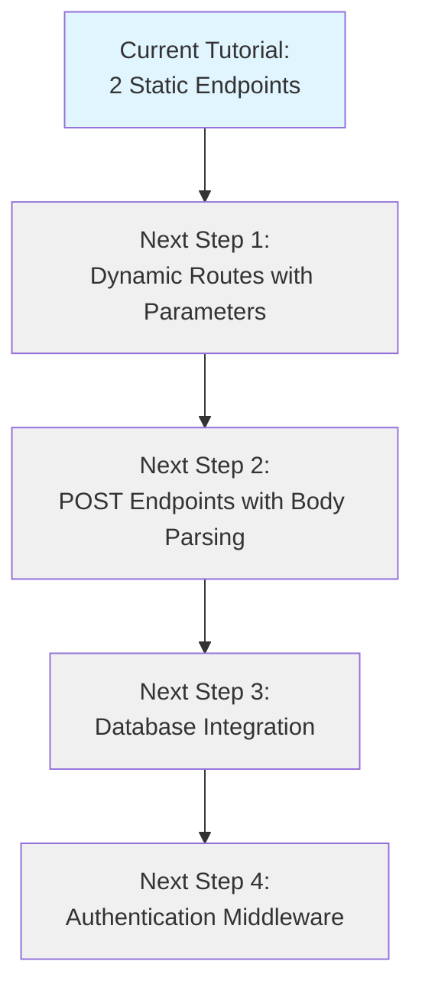
```mermaid
graph TD
    Current[Current Tutorial:<br/>2 Static Endpoints]
    
    Next1[Next Step 1:<br/>Dynamic Routes with Parameters]
    Next2[Next Step 2:<br/>POST Endpoints with Body Parsing]
    Next3[Next Step 3:<br/>Database Integration]
    Next4[Next Step 4:<br/>Authentication Middleware]
    
    Current --> Next1
    Next1 --> Next2
    Next2 --> Next3
    Next3 --> Next4
    
    style Current fill:#e1f5ff
    style Next1 fill:#f0f0f0
    style Next2 fill:#f0f0f0
    style Next3 fill:#f0f0f0
    style Next4 fill:#f0f0f0
```

**Educational Progression:**

The tutorial provides foundation for learners to independently explore:
- Query parameters and URL parameters
- Request body parsing and POST/PUT methods
- Middleware for logging, authentication, error handling
- Database integration with MongoDB or PostgreSQL
- RESTful API design patterns
- Production deployment considerations

## 2.6 Traceability Matrix

The following traceability matrix maps requirements to features, priorities, and validation methods, ensuring complete coverage and testability of all specified functionality:

### 2.6.1 Feature-to-Requirement Mapping

| Feature ID | Feature Name | Requirements | Total Requirements |
|-----------|--------------|--------------|-------------------|
| F-001 | Node.js HTTP Server Foundation | F-001-RQ-001, F-001-RQ-002, F-001-RQ-003 | 3 |
| F-002 | ExpressJS Framework Integration | F-002-RQ-001, F-002-RQ-002, F-002-RQ-003, F-002-RQ-004 | 4 |
| F-003 | Hello World Endpoint | F-003-RQ-001, F-003-RQ-002, F-003-RQ-003, F-003-RQ-004 | 4 |
| F-004 | Good Evening Endpoint | F-004-RQ-001, F-004-RQ-002, F-004-RQ-003, F-004-RQ-004 | 4 |
| F-005 | Project Configuration | F-005-RQ-001, F-005-RQ-002, F-005-RQ-003, F-005-RQ-004 | 4 |

**Total Requirements:** 19 functional requirements across 5 features

### 2.6.2 Requirement Priority Distribution

| Priority Level | Requirement Count | Percentage | Requirements |
|---------------|------------------|------------|--------------|
| Must-Have | 15 | 79% | All RQ-001, RQ-002, RQ-003 requirements |
| Should-Have | 4 | 21% | F-002-RQ-004, F-003-RQ-004, F-004-RQ-004 |
| Could-Have | 0 | 0% | None |

### 2.6.3 Requirement Validation Methods

| Requirement ID | Validation Method | Test Type | Success Criteria |
|---------------|------------------|-----------|------------------|
| F-001-RQ-001 | Manual Testing | Functional | Server starts, logs port |
| F-001-RQ-002 | Manual Testing | Functional | Request received without error |
| F-001-RQ-003 | Manual Testing | Functional | Clean startup/shutdown |
| F-002-RQ-001 | File Inspection | Verification | Express in package.json |
| F-002-RQ-002 | Code Review | Verification | Express app created |
| F-002-RQ-003 | Manual Testing | Functional | Server listens via Express |
| F-002-RQ-004 | Code Review | Verification | Middleware configured |
| F-003-RQ-001 | Code Review | Verification | Route defined with app.get() |
| F-003-RQ-002 | Manual Testing | Functional | Returns "Hello world" |
| F-003-RQ-003 | Manual Testing | Functional | Returns HTTP 200 |
| F-003-RQ-004 | Performance Testing | Non-Functional | Response < 100ms |
| F-004-RQ-001 | Code Review | Verification | Route defined with app.get() |
| F-004-RQ-002 | Manual Testing | Functional | Returns "Good evening" |
| F-004-RQ-003 | Manual Testing | Functional | Returns HTTP 200 |
| F-004-RQ-004 | Performance Testing | Non-Functional | Response < 100ms |
| F-005-RQ-001 | File Inspection | Verification | package.json exists |
| F-005-RQ-002 | File Inspection | Verification | Express in dependencies |
| F-005-RQ-003 | Manual Testing | Verification | npm start executes |
| F-005-RQ-004 | Manual Testing | Integration | npm install succeeds |

### 2.6.4 User Context Traceability

Mapping of user-provided requirements to implemented features:

| User Requirement | Implemented Features | Requirement IDs |
|-----------------|---------------------|-----------------|
| "tutorial of node js server" | F-001, F-005 | F-001-RQ-001 through F-001-RQ-003 |
| "hosting one endpoint" | F-003 | F-003-RQ-001 through F-003-RQ-004 |
| "returns response Hello world" | F-003 | F-003-RQ-002, F-003-RQ-003 |
| "add expressjs into the project" | F-002, F-005 | F-002-RQ-001 through F-002-RQ-004 |
| "add another endpoint" | F-004 | F-004-RQ-001 through F-004-RQ-004 |
| "return response Good evening" | F-004 | F-004-RQ-002, F-004-RQ-003 |

**Coverage Analysis:** 100% of user requirements traced to specific features and functional requirements.

### 2.6.5 Technical Specification Cross-Reference

Mapping of features to technical specification sections:

| Feature ID | Tech Spec Section | Referenced Content |
|-----------|------------------|-------------------|
| F-001 | 1.2 System Overview | Major System Components (Node.js Runtime) |
| F-002 | 1.1 Executive Summary | Core business problem (framework integration) |
| F-002 | 1.2 System Overview | Major System Components (ExpressJS Framework) |
| F-003 | 1.2 System Overview | Endpoint 1: Hello World specifications |
| F-004 | 1.2 System Overview | Endpoint 2: Good Evening specifications |
| F-005 | 1.2 System Overview | Technology Stack (NPM) |
| All | 1.3 Scope | In-scope features validation |

## 2.7 References

### 2.7.1 Technical Specification Sections

The following technical specification sections were referenced for contextual alignment and requirement validation:

- **1.1 Executive Summary** - Project purpose, stakeholders, educational outcomes, and core business problems addressed
- **1.2 System Overview** - System architecture, component descriptions, endpoint specifications, technology stack, and success criteria
- **1.3 Scope** - In-scope and out-of-scope features, implementation boundaries, and technical coverage
- **1.4 References** - Repository validation methodology and information sources

### 2.7.2 Repository Analysis

Repository analysis confirmed minimal implementation state:

- **README.md** - Single file in repository root containing date identifier "# 12nov04"; confirms initial project phase with no existing implementation

### 2.7.3 User Requirements

User context provided the primary source for feature identification:

- **Original System:** Node.js server tutorial with one endpoint returning "Hello world"
- **Enhancement Request:** Add ExpressJS framework integration and additional endpoint returning "Good evening"
- **Educational Context:** Tutorial format requiring clarity and simplicity in implementation

### 2.7.4 External Documentation References

The following external documentation sources inform implementation best practices:

- **ExpressJS Official Documentation** - Framework API reference and routing patterns (https://expressjs.com)
- **Node.js Official Documentation** - Runtime capabilities and native HTTP module reference (https://nodejs.org)
- **NPM Documentation** - Package management and package.json specification (https://docs.npmjs.com)
- **Semantic Versioning Specification** - Dependency version management (https://semver.org)

### 2.7.5 Requirements Methodology

Requirements development followed structured analysis methodology:

1. **User Context Analysis** - Extracted explicit and implicit requirements from user-provided context
2. **Technical Specification Review** - Ensured alignment with documented system overview and scope
3. **Repository State Validation** - Confirmed absence of existing implementation to establish clean baseline
4. **Feature Decomposition** - Broke down high-level requirements into discrete, testable features
5. **Requirement Elaboration** - Developed detailed functional requirements with acceptance criteria
6. **Traceability Establishment** - Linked requirements to source context and validation methods

### 2.7.6 Document Version

- **Section:** 2. Product Requirements
- **Created:** Based on Technical Specification v1.0 (Sections 1.1-1.4)
- **Repository State:** Initial phase (single commit, minimal files)
- **Requirements Status:** All features in "To Be Implemented" status

---

**End of Product Requirements Section**

# 3. Technology Stack

## 3.1 Overview

The technology stack for this Node.js server tutorial is intentionally minimal and focused on educational clarity. Rather than incorporating the full suite of production-grade technologies, this implementation prioritizes simplicity and learning outcomes, demonstrating the fundamental concepts of server-side JavaScript development and web framework integration. The stack centers on Node.js as the runtime environment and ExpressJS as the web framework, with a deliberate exclusion of databases, authentication services, and production infrastructure to maintain tutorial focus.

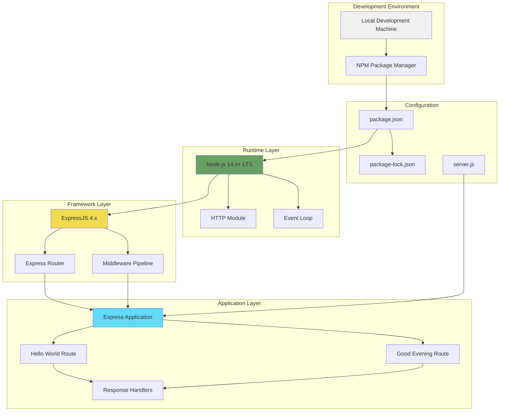
```mermaid
graph TB
    subgraph "Development Environment"
        DE[Local Development Machine]
        NPM[NPM Package Manager]
    end
    
    subgraph "Runtime Layer"
        NODE[Node.js 14.x+ LTS]
        HTTP[HTTP Module]
        EVENT[Event Loop]
    end
    
    subgraph "Framework Layer"
        EXPRESS[ExpressJS 4.x]
        ROUTER[Express Router]
        MIDDLEWARE[Middleware Pipeline]
    end
    
    subgraph "Application Layer"
        APP[Express Application]
        ROUTE1[Hello World Route]
        ROUTE2[Good Evening Route]
        HANDLERS[Response Handlers]
    end
    
    subgraph "Configuration"
        PKG[package.json]
        LOCK[package-lock.json]
        SERVER[server.js]
    end
    
    DE --> NPM
    NPM --> PKG
    PKG --> NODE
    NODE --> HTTP
    NODE --> EVENT
    NODE --> EXPRESS
    EXPRESS --> ROUTER
    EXPRESS --> MIDDLEWARE
    ROUTER --> APP
    MIDDLEWARE --> APP
    APP --> ROUTE1
    APP --> ROUTE2
    ROUTE1 --> HANDLERS
    ROUTE2 --> HANDLERS
    PKG --> LOCK
    SERVER --> APP
    
    style NODE fill:#68a063
    style EXPRESS fill:#f0db4f
    style APP fill:#61dafb
    style DE fill:#f0f0f0
```

### 3.1.1 Technology Selection Philosophy

The technology choices for this tutorial reflect four guiding principles documented in Section 1.2.2.3 of the system architecture:

1. **Simplicity First**: Minimal configuration and dependencies to avoid overwhelming beginners
2. **Educational Clarity**: Code structure that prioritizes readability and understanding over optimization
3. **Incremental Complexity**: Progressive demonstration from native Node.js to framework-based patterns
4. **Industry Alignment**: Use of production-standard technologies to ensure transferable skills

This philosophy results in a focused stack that omits production features (authentication, databases, monitoring, CI/CD) as explicitly documented in Section 1.3.2, allowing learners to concentrate on core server development concepts without distraction.

## 3.2 Programming Languages

### 3.2.1 JavaScript (ES6+)

**Version**: ECMAScript 6 (ES2015) and later features  
**Primary Usage**: Server-side application logic, routing, and request handling  
**Constraints**: Avoid overly advanced ES6+ features that may confuse beginners

JavaScript serves as the sole programming language for this tutorial system, chosen as the native language of the Node.js runtime. The implementation leverages modern JavaScript syntax including:

- Arrow functions for concise handler definitions
- Template literals for string formatting
- Destructuring for clean parameter handling
- Const/let declarations for proper variable scoping
- Async/await patterns (where applicable in future extensions)

**Selection Justification**: As documented in Section 1.2 System Overview, JavaScript is the "primary development language" for Node.js server implementation. This choice provides:

- **Native Runtime Support**: Direct execution by Node.js without transpilation
- **Ubiquity**: Most widely-used language for web development, ensuring broad accessibility
- **Ecosystem Compatibility**: Native integration with NPM packages and Express framework
- **Educational Value**: Single language for both client and server-side development concepts
- **Industry Relevance**: Standard language for Node.js backend development

**Technical Constraints**: Per Section 2.5.1 Implementation Considerations, the tutorial maintains "Dependency Minimalism" by avoiding:
- TypeScript transpilation (no build step required)
- Babel or other JavaScript preprocessors
- Advanced ES6+ features requiring polyfills
- JSX or framework-specific syntax extensions

### 3.2.2 Node.js Runtime Environment

**Minimum Version**: Node.js 14.x  
**Recommended Version**: Latest LTS (Long Term Support) release  
**Technical Requirement**: Express 4.x technically supports Node.js 0.10+, but tutorial targets modern LTS versions

Node.js provides the JavaScript runtime environment that executes server-side code. The runtime delivers critical capabilities for web server implementation:

**Core Capabilities**:
- **JavaScript Execution**: V8 engine for high-performance JavaScript processing
- **HTTP Server Creation**: Native `http.createServer()` method for server instantiation (Section 2.3.1, F-001-RQ-001)
- **Asynchronous Operations**: Event-driven architecture with non-blocking I/O
- **Event Loop**: Efficient concurrent request handling without threading complexity
- **Module System**: CommonJS require() for dependency management

**Version Verification**: Users verify Node.js installation via `node --version` command as documented in the Node.js Version Compatibility section of the technical specification.

**Platform Support**: Node.js provides cross-platform compatibility across Windows, macOS, and Linux operating systems, ensuring the tutorial runs consistently across development environments without platform-specific modifications (Section 2.5.1 "Platform Independence" constraint).

**Performance Characteristics**: The Node.js runtime enables the system to meet documented performance targets including:
- Server startup time < 5 seconds (Section 2.3.1, F-001-RQ-001)
- Endpoint response time < 100ms (Section 2.3.3, F-003-RQ-004)
- Throughput of 1000+ requests/second for simple endpoints
- Route matching < 1ms, handler execution < 1ms

**Selection Justification**: Node.js serves as the foundation for the entire stack, chosen for:
- **JavaScript Ecosystem**: Unified language across development stack
- **Framework Compatibility**: Required runtime for ExpressJS framework
- **Educational Market**: Dominant platform for teaching server-side JavaScript
- **Scalability Model**: Event-driven architecture demonstrates professional patterns
- **Package Ecosystem**: Access to NPM registry with 1.8+ million packages

## 3.3 Frameworks & Libraries

### 3.3.1 ExpressJS Web Framework

**Version**: 4.x series (example: ^4.18.0)  
**Semantic Versioning**: Caret (^) operator allows minor and patch updates (4.18.x, 4.19.x) but prevents breaking changes (not 5.0.0)  
**Market Position**: Over 23 million weekly downloads, "most widely-used Node.js web framework"  
**Installation**: Via NPM from official registry

ExpressJS serves as the core web application framework, providing routing abstraction and middleware architecture over Node.js's native HTTP capabilities. As documented in Section 1.2.1.3, Express is the "de facto standard framework for web application development" in the Node.js ecosystem.

#### 3.3.1.1 Core Framework Capabilities

**Routing Layer** (Section 2.3.3, F-003):
- Route definition via `app.get()`, `app.post()` methods
- URL pattern matching and request method filtering
- Handler function attachment to routes
- Express Router for organized route management
- Route registration < 1ms per route (Section 2.3.3, F-003-RQ-001)

**Middleware Pipeline** (Section 2.3.2, F-002-RQ-004):
- Request/response processing chain via `app.use()`
- Configurable middleware execution order
- Built-in middleware for common tasks (JSON parsing, static files)
- Middleware overhead < 5ms per request
- Educational constraint: Minimal middleware for clarity

**Request/Response Enhancement**:
- Enhanced request object with Express-specific properties
- Simplified response methods: `res.send()`, `res.json()`, `res.status()`
- Automatic content-type header configuration
- Response formatting and serialization
- Status code management with defaults

**Application Lifecycle**:
- Express application instantiation via `express()` constructor (Section 2.3.2, F-002-RQ-002)
- Server activation through `app.listen()` method (Section 2.3.2, F-002-RQ-003)
- Initialization time < 100ms for application creation
- Server start time < 3 seconds for port binding

#### 3.3.1.2 Integration with Node.js

ExpressJS integrates with the native Node.js HTTP module while providing a higher-level abstraction:

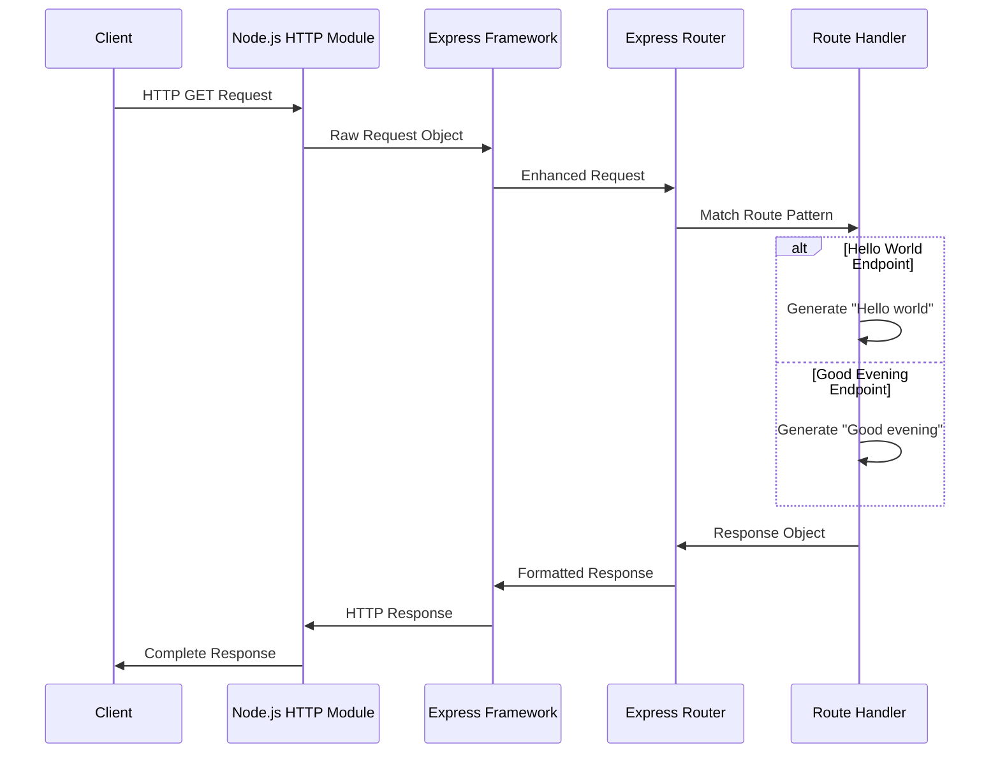
```mermaid
sequenceDiagram
    participant Client
    participant NodeJS as Node.js HTTP Module
    participant Express as Express Framework
    participant Router as Express Router
    participant Handler as Route Handler
    
    Client->>NodeJS: HTTP GET Request
    NodeJS->>Express: Raw Request Object
    Express->>Router: Enhanced Request
    Router->>Handler: Match Route Pattern
    
    alt Hello World Endpoint
        Handler->>Handler: Generate "Hello world"
    else Good Evening Endpoint
        Handler->>Handler: Generate "Good evening"
    end
    
    Handler->>Router: Response Object
    Router->>Express: Formatted Response
    Express->>NodeJS: HTTP Response
    NodeJS->>Client: Complete Response
```

#### 3.3.1.3 Framework Selection Justification

Per Section 1.2 System Overview, ExpressJS was selected for multiple strategic reasons:

1. **Routing Abstraction**: Simplifies route definition from manual URL parsing to declarative `app.get()` patterns
2. **Middleware Architecture**: Demonstrates professional pattern for cross-cutting concerns
3. **Request/Response Handling**: Reduces boilerplate code for common HTTP operations
4. **Industry Standard**: Most widely adopted Node.js framework, ensuring relevant skill development
5. **Educational Value**: Clear progression from native HTTP to framework patterns demonstrates architectural evolution
6. **Minimal Learning Curve**: Simple API that beginners can grasp quickly
7. **Extensibility**: Foundation for future tutorial extensions (database integration, authentication)

#### 3.3.1.4 Version Management and Compatibility

**Semantic Versioning Strategy** (Section 2.3.5, F-005-RQ-002):
- Format: `"express": "^4.18.0"` in package.json
- Caret operator permits compatible updates (minor versions, patches)
- Prevents automatic major version upgrades that may introduce breaking changes
- Balances stability with security patch availability

**Node.js Compatibility**: Express 4.x series is compatible with Node.js 14.x+ LTS versions, ensuring tutorial works across current and future Node.js releases without modification.

**Maintenance Strategy** (Section 2.5.4 Dependency Maintenance):
- Monitor Express release notes quarterly for updates
- Apply security patches promptly when vulnerabilities identified
- Test compatibility with new Express minor versions periodically
- Update tutorial documentation if API changes affect code examples

#### 3.3.1.5 Framework Configuration

**Application Initialization** (Section 2.3.2, F-002-RQ-002):
```javascript
// Documented pattern from functional requirements
const express = require('express');
const app = express();
```

**Server Activation** (Section 2.3.2, F-002-RQ-003):
```javascript
// Port binding with confirmation logging
const PORT = 3000;
app.listen(PORT, () => {
  console.log(`Server listening on port ${PORT}`);
});
```

**Educational Approach**: The tutorial uses Express default settings without custom middleware, maintaining simplicity while demonstrating core framework capabilities.

### 3.3.2 No Additional Framework Dependencies

The system deliberately excludes additional frameworks and libraries to maintain tutorial focus:

**Explicitly Excluded** (Section 2.5.1 "Dependency Minimalism"):
- No view engines (EJS, Pug, Handlebars)
- No ORM frameworks (Sequelize, Mongoose)
- No utility libraries (lodash, moment, axios)
- No development utilities (nodemon, dotenv)
- No testing frameworks (Jest, Mocha, Chai)
- No security libraries (Helmet.js, express-rate-limit)

This minimalism ensures learners focus on fundamental Express concepts without cognitive overload from auxiliary dependencies.

## 3.4 Open Source Dependencies

### 3.4.1 NPM Dependency: express

**Package Name**: express  
**Registry**: NPM (Node Package Manager) official registry  
**Version Specification**: Semantic versioning with caret operator (^4.18.0)  
**Dependency Type**: Production dependency (runtime required)

The Express package represents the sole third-party dependency for this tutorial system, as documented in Section 2.3.2 (F-002-RQ-001). The package installation process follows standard NPM conventions:

**Installation Command**:
```bash
npm install express
```

**Installation Outputs**:
- Express package placed in `node_modules/express/` directory
- Transitive dependencies installed automatically
- Installation completes in < 30 seconds (Section 2.3.2, F-002-RQ-001)
- Package integrity verified via NPM checksums

**Dependency Tree**: Express itself depends on multiple sub-packages (body-parser, serve-static, etc.) which NPM manages automatically. The complete dependency graph is locked in `package-lock.json` for reproducible installations.

### 3.4.2 Package Management Files

#### 3.4.2.1 package.json

**Purpose**: Project metadata and dependency declaration  
**Location**: Project root directory  
**File Type**: Valid JSON structure

Per Section 2.3.5 (F-005-RQ-001, F-005-RQ-002), the package.json file contains:

**Required Fields**:
- `name`: Project identifier (e.g., "node-express-tutorial")
- `version`: Project version following semantic versioning (e.g., "1.0.0")
- `description`: Brief project description for educational context

**Dependencies Section** (Section 2.3.5, F-005-RQ-002):
```json
"dependencies": {
  "express": "^4.18.0"
}
```

**Scripts Section** (Section 2.3.5, F-005-RQ-003):
```json
"scripts": {
  "start": "node server.js"
}
```

This enables server execution via standardized `npm start` command, providing consistent startup mechanism across development environments.

**Optional Fields**:
- `engines`: Can specify Node.js version constraints for environment validation
- `keywords`: Tutorial-relevant tags for NPM registry discoverability
- `author`: Tutorial creator attribution
- `license`: Open source license specification (typically MIT for educational content)

#### 3.4.2.2 package-lock.json

**Purpose**: Dependency version locking for reproducible installations  
**Generation**: Created automatically during `npm install` execution  
**Content**: Complete dependency tree with exact version numbers

As documented in Section 2.3.5 (F-005-RQ-004), this file ensures:
- **Deterministic Installations**: Identical `node_modules` structure across machines
- **Version Locking**: Prevents unexpected version changes in transitive dependencies
- **Integrity Verification**: SHA checksums for package validation
- **Collaborative Consistency**: Team members install identical dependency versions

**Security Benefit**: Version pinning prevents automatic updates to compromised package versions, allowing deliberate review of dependency changes before adoption.

### 3.4.3 Dependency Installation Process

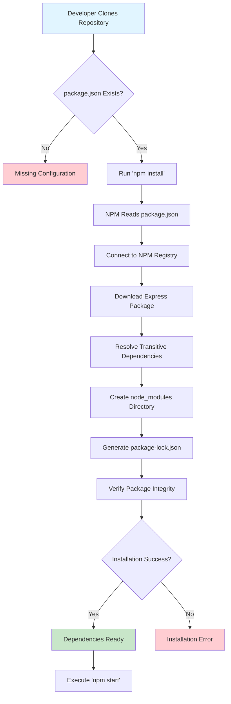
```mermaid
flowchart TD
    START[Developer Clones Repository] --> CHECK{package.json Exists?}
    CHECK -->|No| ERROR[Missing Configuration]
    CHECK -->|Yes| INSTALL[Run 'npm install']
    INSTALL --> READ[NPM Reads package.json]
    READ --> REGISTRY[Connect to NPM Registry]
    REGISTRY --> DOWNLOAD[Download Express Package]
    DOWNLOAD --> TRANSITIVE[Resolve Transitive Dependencies]
    TRANSITIVE --> MODULES[Create node_modules Directory]
    MODULES --> LOCK[Generate package-lock.json]
    LOCK --> VERIFY[Verify Package Integrity]
    VERIFY --> SUCCESS{Installation Success?}
    SUCCESS -->|Yes| READY[Dependencies Ready]
    SUCCESS -->|No| FAIL[Installation Error]
    READY --> RUN[Execute 'npm start']
    
    style START fill:#e1f5ff
    style READY fill:#c8e6c9
    style ERROR fill:#ffcdd2
    style FAIL fill:#ffcdd2
```

**Installation Performance** (Section 2.3.5, F-005-RQ-004): Complete installation process completes in < 60 seconds on standard development machines with broadband internet connectivity.

### 3.4.4 Dependency Security Considerations

**Version Specification Strategy** (Section 2.5.4):
- Use semantic versioning with caret (^) to allow non-breaking updates
- Avoid wildcards (*) or wide ranges that permit major version jumps
- Specify minimum patch version to exclude known vulnerable releases

**Security Monitoring**:
- NPM audit command for vulnerability scanning
- Review Express security advisories quarterly
- Apply security patches promptly when CVEs identified

**No Additional Dependencies**: The "Dependency Minimalism" constraint (Section 2.5.1) minimizes attack surface by limiting third-party code to essential Express framework only.

## 3.5 Third-Party Services

### 3.5.1 No External Service Integrations

This tutorial system **explicitly excludes all third-party services** to maintain educational focus and simplicity. As comprehensively documented in Section 1.3.2.1 (Out-of-Scope Elements), the following service categories are not used:

**Authentication Services**:
- ❌ Auth0
- ❌ OAuth providers (Google, GitHub, etc.)
- ❌ JWT token validation services
- ❌ API key management platforms

**Cloud Infrastructure**:
- ❌ AWS (EC2, Lambda, API Gateway)
- ❌ Azure (App Service, Functions)
- ❌ Google Cloud Platform (Cloud Run, Cloud Functions)
- ❌ Heroku, DigitalOcean, or other PaaS providers

**Monitoring and Observability**:
- ❌ Error tracking services (Sentry, Rollbar, Bugsnag)
- ❌ Application Performance Monitoring (New Relic, DataDog, Dynatrace)
- ❌ Log aggregation (Loggly, Papertrail, Splunk)
- ❌ Analytics platforms (Google Analytics, Mixpanel)

**External APIs**:
- ❌ No third-party API integrations
- ❌ No webhook receivers
- ❌ No external data sources

**Development Services**:
- ❌ CI/CD platforms (Jenkins, CircleCI, Travis CI, GitHub Actions)
- ❌ Code quality services (SonarQube, CodeClimate)
- ❌ Container registries (Docker Hub, ECR)

### 3.5.2 Rationale for Service Exclusion

The decision to omit external services stems from the educational mission defined in Section 1.2.1.1:

1. **Complexity Reduction**: Each external service adds authentication, configuration, and error handling complexity
2. **Focus Preservation**: Tutorial concentrates on Node.js and Express fundamentals without distraction
3. **Setup Simplification**: No API keys, service accounts, or external registrations required
4. **Cost Elimination**: No paid service subscriptions needed for learners
5. **Offline Capability**: Tutorial runs entirely on localhost without internet dependency (beyond initial NPM install)

### 3.5.3 Local-Only Architecture

The system operates entirely on the local development machine:
- **Localhost Binding**: Server binds to 127.0.0.1 (Section 2.5.3 Localhost Binding Security)
- **No External Traffic**: No inbound connections from internet
- **No Outbound Calls**: No external service requests during runtime
- **Self-Contained**: All functionality within Node.js process and Express framework

This architecture aligns with the "Platform Independence" constraint (Section 2.5.1), ensuring the tutorial works identically across all development environments without external dependencies.

## 3.6 Databases & Storage

### 3.6.1 No Data Persistence Layer

This tutorial system **explicitly excludes all forms of data persistence**, as comprehensively documented in Section 1.3.2.1. The following database and storage technologies are not used:

**Relational Databases**:
- ❌ PostgreSQL
- ❌ MySQL / MariaDB
- ❌ SQLite
- ❌ Microsoft SQL Server

**NoSQL Databases**:
- ❌ MongoDB
- ❌ Redis
- ❌ DynamoDB
- ❌ Cassandra
- ❌ CouchDB

**Caching Solutions**:
- ❌ Redis caching
- ❌ Memcached
- ❌ In-memory caching libraries
- ❌ Application-level cache

**File System Storage**:
- ❌ No file writes
- ❌ No file uploads
- ❌ No session file storage
- ❌ No log file persistence

**State Management**:
- ❌ No session management
- ❌ No cookie-based state
- ❌ No application state persistence
- ❌ No data serialization

### 3.6.2 Static Response Architecture

The system employs a **stateless, static response model** where all endpoint responses are hardcoded string literals:

**Endpoint 1**: Returns static string "Hello world" (Section 2.3.3, F-003-RQ-002)  
**Endpoint 2**: Returns static string "Good evening" (Section 2.3.4, F-004-RQ-002)

**Architecture Benefits**:
- **Simplicity**: No database connection management or query complexity
- **Performance**: Response generation < 1ms (Section 2.3.3, F-003-RQ-002)
- **Security**: No injection vulnerabilities due to static content (Section 2.5.3)
- **Reliability**: No database downtime or connection failures possible
- **Educational Focus**: Learners concentrate on server and routing concepts

### 3.6.3 Security Implications of No Database

Section 2.5.3 (Security Implications) documents the security benefits of the no-database architecture:

**Eliminated Vulnerability Classes**:
- **No SQL Injection**: No database queries means no SQL injection attack surface
- **No NoSQL Injection**: No document database queries to manipulate
- **No Data Breach Risk**: No user data or sensitive information to compromise
- **No Connection Security**: No database credentials to protect or encrypt
- **No Schema Vulnerabilities**: No database permissions or access control issues

**Static Content Safety**:
- **No XSS Vulnerabilities**: Static strings contain no user input or dynamic HTML
- **No Path Traversal**: No file system access eliminates directory traversal attacks
- **No Data Tampering**: Hardcoded responses cannot be modified at runtime

### 3.6.4 Rationale for Data Exclusion

The decision to omit all data persistence aligns with the tutorial's learning objectives:

1. **Scope Management**: Database integration would double tutorial complexity
2. **Setup Simplicity**: No database installation, configuration, or connection string management
3. **Platform Independence**: No database-specific installation across Windows/macOS/Linux
4. **Concept Isolation**: Pure focus on HTTP server and routing without data layer concerns
5. **Progressive Learning**: Future tutorials can introduce databases as next step after mastering basics

### 3.6.5 Extension Path for Data Persistence

Section 2.5.5 (Scalability Considerations) documents potential future extensions:

**Tutorial Extension Possibilities**:
- Phase 2: Introduce in-memory JavaScript objects for temporary state
- Phase 3: Add file-based JSON storage for simple persistence
- Phase 4: Integrate MongoDB for production-grade database patterns
- Phase 5: Demonstrate ORM usage (Mongoose) for data abstraction

This progression allows learners to master server fundamentals before encountering database complexity.

## 3.7 Development & Deployment

### 3.7.1 Package Manager: NPM

**Tool**: NPM (Node Package Manager)  
**Version**: Bundled with Node.js installation  
**Alternative**: Yarn mentioned as compatible option

NPM serves as the primary dependency management and script execution tool, as documented in the Section 1.2 Technology Stack table.

#### 3.7.1.1 NPM Commands

**Core Commands Used**:

1. **`npm install`** (Section 2.3.5, F-005-RQ-004)
   - Installs dependencies from package.json
   - Creates node_modules directory
   - Generates package-lock.json
   - Performance: < 60 seconds for complete installation

2. **`npm start`** (Section 2.3.5, F-005-RQ-003)
   - Executes server startup script
   - Standard convention for application launch
   - Starts server via configured script command
   - Performance: Script execution starts < 2 seconds

3. **`node --version`**
   - Verifies Node.js runtime version
   - Documented in Node.js Version Compatibility section
   - Ensures minimum version requirements met

**NPM Registry Connection**:
- Default: https://registry.npmjs.org
- Required for initial dependency installation
- Offline operation post-installation (no runtime NPM calls)

#### 3.7.1.2 Dependency Management Strategy

**Installation Approach**:
- Dependencies declared in package.json
- Exact versions locked in package-lock.json
- node_modules directory gitignored (not committed to version control)
- Fresh installation via `npm install` for each developer

**Version Control**:
- Commit: package.json, package-lock.json
- Ignore: node_modules/ directory
- Reproducible installations via lock file

### 3.7.2 Development Tools

#### 3.7.2.1 Console Logging

**Implementation**: Native JavaScript `console.log()` statements  
**Purpose**: Server status reporting and debugging

As documented in Section 2.4.4 (Common Services - Console Logging), the system uses console output for:

**Logging Points**:
- **Server Startup**: Port binding confirmation (Section 2.3.1, F-001-RQ-001)
- **Initialization**: "Server listening on port 3000" message
- **Optional Request Logging**: HTTP request details (not required but educational)
- **Error Reporting**: Startup failures or runtime errors

**Performance**: Console output has negligible performance impact (< 1ms per log statement)

**No External Logging Services**: Per Section 1.3.2.1, the tutorial excludes:
- Structured logging libraries (Winston, Bunyan)
- Log aggregation services (Loggly, Papertrail)
- Application monitoring platforms

#### 3.7.2.2 Manual Server Restart

**Constraint**: No automatic code reloading  
**Impact**: Developers must manually restart server after code changes

Section 2.5.1 "Dependency Minimalism" explicitly excludes development utilities:
- ❌ nodemon (auto-restart on file changes)
- ❌ pm2 (process management)
- ❌ Forever (daemon process manager)

**Restart Process**:
1. Stop server: Ctrl+C (SIGINT) or Ctrl+D
2. Modify code files
3. Restart: `npm start` or `node server.js`
4. Verify changes in browser/curl

**Educational Justification**: Manual restart teaches developers the relationship between code changes and runtime state, emphasizing that Node.js loads code once at startup.

### 3.7.3 Build System

**Build Requirement**: None  
**Direct Execution**: JavaScript files executed directly by Node.js runtime

The tutorial uses vanilla JavaScript without any build, transpilation, or bundling steps:

**Not Required**:
- ❌ TypeScript transpilation (tsc)
- ❌ Babel transpilation
- ❌ Webpack bundling
- ❌ Rollup packaging
- ❌ Source map generation

**Advantages**:
- **Simplicity**: No build configuration or toolchain complexity
- **Fast Development**: Immediate execution without compilation step
- **Beginner-Friendly**: No build tool learning curve
- **Transparent**: Executed code matches source code exactly

**File Execution**: Server started directly via `node server.js` command, which loads JavaScript file and executes it in Node.js V8 engine.

### 3.7.4 Project File Structure

Per Section 2.5.4 (Code Organization), the tutorial follows a minimal file structure:

```
project-root/
├── package.json          # Project configuration and dependencies
├── package-lock.json     # Dependency version lock file
├── server.js             # Main server implementation file
├── README.md            # Tutorial documentation and instructions
└── node_modules/        # Installed dependencies (gitignored)
    └── express/         # ExpressJS framework and transitive dependencies
```

**File Descriptions**:

| File | Purpose | Source |
|------|---------|--------|
| `package.json` | Project metadata, dependency declarations, NPM scripts | Section 2.3.5, F-005 |
| `package-lock.json` | Locked dependency versions for reproducibility | Section 2.3.5, F-005-RQ-004 |
| `server.js` | Server initialization, route definitions, handlers | Section 2.5.4 |
| `README.md` | Tutorial instructions, setup steps, learning objectives | Current repository |
| `node_modules/` | NPM-installed packages (Express and dependencies) | Generated by NPM |

**Organizational Principles** (Section 2.5.4):
- Single Responsibility: One file (`server.js`) for server logic
- Descriptive Naming: Clear, meaningful file names
- Minimal Structure: No subdirectory organization needed for two-endpoint tutorial

### 3.7.5 Containerization

**Status**: Not Used  
**Rationale**: Out of scope for educational tutorial

Section 1.3.2.3 explicitly excludes container technologies:
- ❌ Docker containerization
- ❌ Docker Compose orchestration
- ❌ Kubernetes deployment
- ❌ Container registries

**Deployment Model**: Local development environment only, running directly on host operating system.

### 3.7.6 CI/CD Pipeline

**Status**: Not Implemented  
**Scope**: Explicitly excluded per Section 1.3.2.3

The tutorial does not include continuous integration or continuous deployment infrastructure:

**Excluded CI/CD Components**:
- ❌ GitHub Actions workflows
- ❌ Jenkins pipelines
- ❌ CircleCI configuration
- ❌ Travis CI builds
- ❌ Automated testing runs
- ❌ Deployment automation

**Justification**: Tutorial focuses on local development and server fundamentals. Production deployment patterns are beyond current educational scope.

### 3.7.7 Local Development Configuration

#### 3.7.7.1 Server Binding Configuration

**Default Host**: localhost (127.0.0.1)  
**Recommended Ports**: 1024-65535 (non-privileged ports)  
**Common Port Examples**: 3000, 8080, 8000

Per Section 2.3.1 (F-001-RQ-001) and Section 2.5.3 (Localhost Binding Security):

**Port Selection Guidelines**:
- **Avoid**: Ports < 1024 (require administrative privileges)
- **Common Convention**: Port 3000 for Node.js development servers
- **Alternative**: Port 8080 (common HTTP alternative)
- **Validation**: Port must be integer, not in use by other services

**Security Recommendation**: Bind to localhost (127.0.0.1) rather than all interfaces (0.0.0.0) to prevent external network access during development, demonstrating security principle of least privilege.

#### 3.7.7.2 Protocol Configuration

**Protocol**: HTTP  
**TLS/HTTPS**: Not implemented (out of scope)

Section 1.3.2 confirms HTTP-only scope:
- ✅ HTTP for simple request/response
- ❌ HTTPS/TLS encryption
- ❌ SSL certificate management
- ❌ Secure communication protocols

**Justification**: HTTPS adds significant complexity (certificates, key management, TLS configuration) unnecessary for local development tutorial.

#### 3.7.7.3 Platform Compatibility

**Supported Operating Systems** (Section 2.5.1 "Platform Independence"):
- ✅ Windows (10, 11)
- ✅ macOS (10.14+)
- ✅ Linux (Ubuntu, Fedora, Debian, etc.)

**Cross-Platform Considerations**:
- Node.js provides consistent API across operating systems
- NPM commands work identically on all platforms
- No platform-specific file path handling required
- Console output compatible with all terminal types (CMD, PowerShell, Terminal, bash)

**Development Workflow Diagram**:

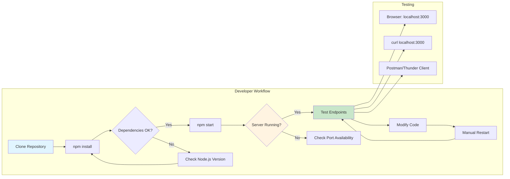
```mermaid
flowchart LR
    subgraph "Developer Workflow"
        CLONE[Clone Repository] --> INSTALL[npm install]
        INSTALL --> VERIFY{Dependencies OK?}
        VERIFY -->|Yes| START[npm start]
        VERIFY -->|No| TROUBLESHOOT[Check Node.js Version]
        TROUBLESHOOT --> INSTALL
        START --> RUNNING{Server Running?}
        RUNNING -->|Yes| TEST[Test Endpoints]
        RUNNING -->|No| DEBUG[Check Port Availability]
        TEST --> CODE[Modify Code]
        CODE --> RESTART[Manual Restart]
        RESTART --> TEST
    end
    
    subgraph "Testing"
        TEST --> BROWSER[Browser: localhost:3000]
        TEST --> CURL[curl localhost:3000]
        TEST --> POSTMAN[Postman/Thunder Client]
    end
    
    style CLONE fill:#e1f5ff
    style RUNNING fill:#fff4e1
    style TEST fill:#c8e6c9
```

### 3.7.8 Performance Monitoring

**Built-in Monitoring**: Console logging only  
**External APM**: Not used (Section 1.3.2.1)

The tutorial includes basic performance characteristics documented in Section 2.5.2:

**Documented Performance Targets**:
- Server startup time: < 5 seconds
- Endpoint response time: < 100ms
- Route matching: < 1ms
- Handler execution: < 1ms
- Expected throughput: 1000+ requests/second

**No Monitoring Tools**:
- ❌ Performance profiling tools
- ❌ Memory leak detection
- ❌ CPU profiling
- ❌ Request timing middleware
- ❌ Metrics collection

**Justification**: Performance monitoring adds complexity unnecessary for demonstrating basic server concepts. Learners focus on functionality over optimization.

### 3.7.9 Testing Infrastructure

**Status**: No testing framework included  
**Scope**: Explicitly excluded per Section 1.3.2.1

The tutorial does not implement automated testing:

**Excluded Testing Technologies**:
- ❌ Jest unit testing
- ❌ Mocha test framework
- ❌ Chai assertions
- ❌ Supertest for HTTP testing
- ❌ Code coverage tools (Istanbul/nyc)

**Manual Testing Approach**:
- Browser-based endpoint verification
- curl command-line testing
- Visual confirmation of response content
- Manual validation against acceptance criteria

**Rationale**: Testing framework adds significant conceptual overhead. Tutorial prioritizes understanding server fundamentals before introducing testing practices.

### 3.7.10 Version Control

**System**: Git (implied by GitHub repository hosting)  
**Repository**: GitHub (confirmed by Section 1.4 References)

**Versioned Files**:
- ✅ `server.js` - Application code
- ✅ `package.json` - Dependency configuration
- ✅ `package-lock.json` - Dependency locks
- ✅ `README.md` - Documentation
- ✅ `.gitignore` - Excludes node_modules/

**Ignored Files**:
- ❌ `node_modules/` - NPM-installed packages (regenerated via `npm install`)
- ❌ OS-specific files (.DS_Store, Thumbs.db)

**Collaborative Development**: Multiple developers can clone repository, run `npm install` to obtain identical dependencies, and execute identical server implementation.

## 3.8 Technology Integration Architecture

### 3.8.1 Layered Architecture Model

The technology stack implements a clear layered architecture as documented in Section 1.2.2.3:

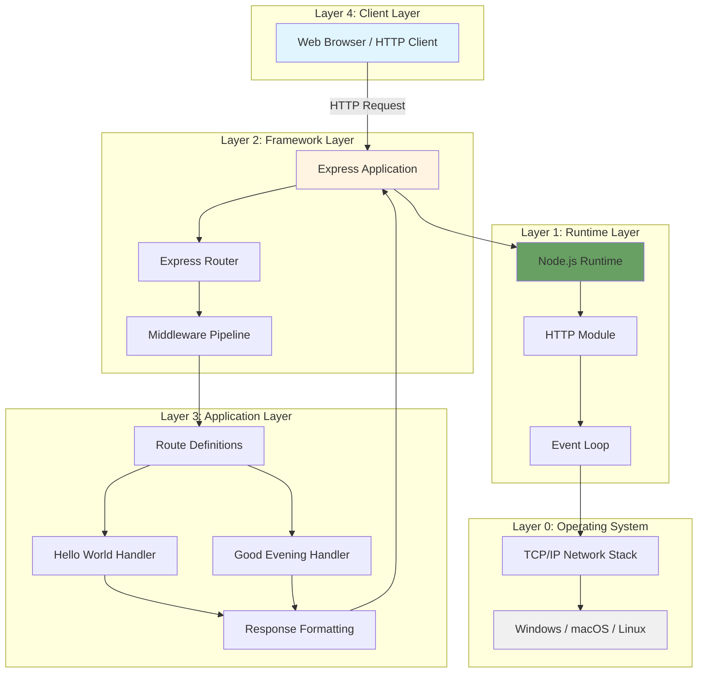
```mermaid
graph TB
    subgraph "Layer 4: Client Layer"
        CLIENT[Web Browser / HTTP Client]
    end
    
    subgraph "Layer 3: Application Layer"
        ROUTES[Route Definitions]
        HANDLER1[Hello World Handler]
        HANDLER2[Good Evening Handler]
        RESPONSE[Response Formatting]
    end
    
    subgraph "Layer 2: Framework Layer"
        EXPRESS_APP[Express Application]
        ROUTER[Express Router]
        MIDDLEWARE[Middleware Pipeline]
    end
    
    subgraph "Layer 1: Runtime Layer"
        NODE_RUNTIME[Node.js Runtime]
        HTTP_MODULE[HTTP Module]
        EVENT_LOOP[Event Loop]
    end
    
    subgraph "Layer 0: Operating System"
        OS[Windows / macOS / Linux]
        NETWORK[TCP/IP Network Stack]
    end
    
    CLIENT -->|HTTP Request| EXPRESS_APP
    EXPRESS_APP --> ROUTER
    ROUTER --> MIDDLEWARE
    MIDDLEWARE --> ROUTES
    ROUTES --> HANDLER1
    ROUTES --> HANDLER2
    HANDLER1 --> RESPONSE
    HANDLER2 --> RESPONSE
    RESPONSE --> EXPRESS_APP
    EXPRESS_APP --> NODE_RUNTIME
    NODE_RUNTIME --> HTTP_MODULE
    HTTP_MODULE --> EVENT_LOOP
    EVENT_LOOP --> NETWORK
    NETWORK --> OS
    
    style CLIENT fill:#e1f5ff
    style EXPRESS_APP fill:#fff4e1
    style NODE_RUNTIME fill:#68a063
    style OS fill:#f0f0f0
```

**Layer Responsibilities**:

| Layer | Technologies | Responsibilities |
|-------|-------------|------------------|
| **Runtime** | Node.js, V8 Engine | JavaScript execution, event loop, asynchronous I/O |
| **Framework** | ExpressJS | HTTP abstraction, routing, middleware pipeline |
| **Application** | Custom Code | Business logic, route handlers, response generation |
| **Response** | Express Methods | Content formatting, header configuration, status codes |

### 3.8.2 Component Integration Points

**Node.js ↔ Express Integration**:
- Express built as Node.js module, loaded via `require('express')`
- Express utilizes Node.js native HTTP module internally
- Express exposes enhanced API while maintaining Node.js compatibility

**Express ↔ Application Integration**:
- Application creates Express instance via `express()` constructor
- Routes registered on Express app via `app.get()` methods
- Handlers receive Express request/response objects with enhanced methods

**NPM ↔ Node.js Integration**:
- NPM manages packages compatible with Node.js module system
- Packages installed to node_modules, loadable via `require()`
- package.json declares Node.js version compatibility

### 3.8.3 Request Processing Flow

The complete request lifecycle demonstrates technology stack integration:

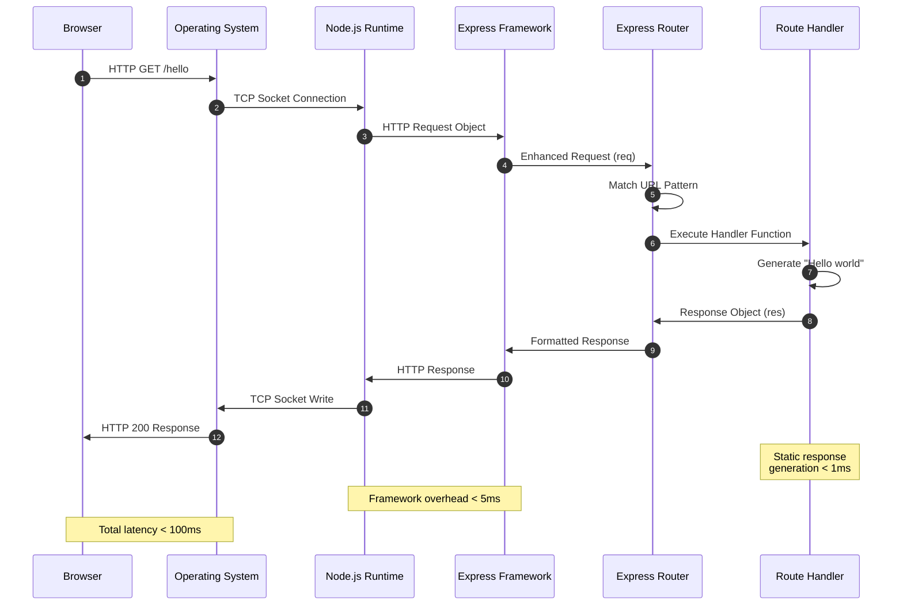
```mermaid
sequenceDiagram
    autonumber
    participant Browser
    participant OS as Operating System
    participant NodeJS as Node.js Runtime
    participant Express as Express Framework
    participant Router as Express Router
    participant Handler as Route Handler
    
    Browser->>OS: HTTP GET /hello
    OS->>NodeJS: TCP Socket Connection
    NodeJS->>Express: HTTP Request Object
    Express->>Router: Enhanced Request (req)
    Router->>Router: Match URL Pattern
    Router->>Handler: Execute Handler Function
    Handler->>Handler: Generate "Hello world"
    Handler->>Router: Response Object (res)
    Router->>Express: Formatted Response
    Express->>NodeJS: HTTP Response
    NodeJS->>OS: TCP Socket Write
    OS->>Browser: HTTP 200 Response
    
    Note over Handler: Static response<br/>generation < 1ms
    Note over Express,NodeJS: Framework overhead < 5ms
    Note over Browser,OS: Total latency < 100ms
```

### 3.8.4 Technology Selection Trade-offs

**Advantages of Chosen Stack**:
- ✅ **Simplicity**: Minimal dependencies (Node.js + Express only)
- ✅ **Educational Clarity**: Clear progression from native to framework
- ✅ **Industry Relevance**: Production-standard technologies
- ✅ **Cross-Platform**: Works identically on Windows, macOS, Linux
- ✅ **Low Barrier**: No paid services or complex setup required

**Intentional Limitations**:
- ❌ **Production Features**: No authentication, database, monitoring
- ❌ **Scalability**: No load balancing, clustering, or horizontal scaling
- ❌ **Security Hardening**: No TLS, rate limiting, or security middleware
- ❌ **DevOps Integration**: No containers, CI/CD, or deployment automation

These limitations align with the educational mission (Section 1.2.1.1), prioritizing learning outcomes over production-readiness.

## 3.9 Technology Version Matrix

### 3.9.1 Complete Version Specifications

| Technology | Minimum Version | Recommended Version | Notes |
|-----------|-----------------|---------------------|-------|
| **Node.js** | 14.x | Latest LTS (18.x, 20.x) | Runtime environment |
| **NPM** | Bundled with Node.js | Latest bundled | Package manager |
| **ExpressJS** | ^4.18.0 | Latest 4.x stable | Web framework |
| **JavaScript** | ES6 (ES2015) | ES2020 features | Language standard |

### 3.9.2 Compatibility Matrix

| Component | Compatible With | Incompatible With |
|-----------|-----------------|-------------------|
| **Express 4.x** | Node.js 14.x+ | Node.js < 0.10 |
| **NPM Scripts** | Windows, macOS, Linux | N/A |
| **Console Logging** | All terminal types | N/A |
| **Semantic Versioning** | Caret (^) operator | Wildcard (*) |

### 3.9.3 Future Version Considerations

**Upgrade Paths Documented in Section 2.5.4**:
- Monitor Express release notes quarterly
- Test with new Express minor versions (4.19.x, 4.20.x)
- Validate compatibility with Node.js LTS updates
- Update tutorial documentation if API changes occur

**Breaking Changes**:
- Express 5.x represents major version with breaking changes
- Tutorial would require updates before migrating to Express 5.x
- Semantic versioning (^4.18.0) prevents automatic Express 5.x adoption

## 3.10 Security Considerations

### 3.10.1 Technology Stack Security Posture

Section 2.5.3 (Security Implications) documents the intentional security limitations:

**Educational Security Disclaimer**: "Intentionally omits production security features to maintain focus"

**Excluded Security Technologies**:
- ❌ HTTPS/TLS encryption
- ❌ Helmet.js security headers
- ❌ express-rate-limit throttling
- ❌ CORS configuration
- ❌ Input validation libraries (Joi, express-validator)
- ❌ Authentication middleware (passport, jsonwebtoken)
- ❌ SQL/NoSQL injection protection (N/A - no database)
- ❌ XSS sanitization (inherent in static responses)

### 3.10.2 Inherent Security Benefits

**Static Response Security** (Section 2.5.3):
- No user input processing eliminates injection vulnerabilities
- No database eliminates SQL/NoSQL injection risks
- No file system access eliminates path traversal risks
- No dynamic HTML eliminates XSS vulnerabilities

**Localhost Binding Recommendation** (Section 2.5.3):
- Bind to 127.0.0.1 rather than 0.0.0.0
- Prevents external network access during development
- Demonstrates security principle of least privilege

### 3.10.3 Dependency Security

**NPM Dependency Scanning**:
- `npm audit` command available for vulnerability detection
- Express maintains active security patch releases
- Semantic versioning allows security patches without breaking changes

**Version Management Security**:
- package-lock.json prevents unexpected version updates
- Caret versioning (^4.18.0) allows security patches
- Quarterly review of Express security advisories recommended

## 3.11 Performance Characteristics

### 3.11.1 Technology Stack Performance Profile

Documented in Section 2.5.2 (Performance Requirements):

**Server Startup Performance**:
- Node.js process start: < 1s
- Module loading (Express): < 1s
- Express initialization: < 1s
- Port binding: < 1s
- Route registration: < 100ms
- **Total startup time: < 5 seconds**

**Request Processing Performance**:
- Route matching: < 1ms
- Handler execution: < 1ms
- Response formatting: < 1ms
- Network transmission (localhost): < 10ms
- **Total endpoint response: < 100ms**

**Concurrency Performance**:
- Natural concurrency via Node.js event loop
- Expected throughput: 1000+ requests/second for simple endpoints
- No request queuing or throttling required
- Single-threaded event-driven architecture

### 3.11.2 Technology Selection Performance Impact

**Node.js Event Loop Benefits**:
- Non-blocking I/O enables high concurrency
- Single-threaded model reduces context switching overhead
- V8 engine provides optimized JavaScript execution

**Express Framework Overhead**:
- Middleware pipeline adds < 5ms per request
- Routing abstraction adds minimal overhead
- Response enhancement methods efficiently implemented

**Static Response Performance**:
- No database query latency (0ms)
- No file system reads (0ms)
- No external API calls (0ms)
- Pure in-memory string responses

## 3.12 Scalability Considerations

### 3.12.1 Current Scalability Profile

Section 2.5.5 (Scalability Considerations) documents the scalability characteristics:

**Vertical Scalability**:
- Single Node.js process utilizes one CPU core
- Memory footprint minimal (< 100MB for simple server)
- No clustering or multi-process architecture

**Horizontal Scalability**:
- No load balancer configuration
- No session affinity requirements (stateless)
- No distributed system coordination

**Endpoint Scalability**:
- Framework routing scales from 2 to hundreds of endpoints
- Route registration performance degrades linearly
- No route lookup optimization required at tutorial scale

### 3.12.2 Extension Path for Production Scalability

**Documented Extension Possibilities** (Section 2.5.5):

1. **Phase 2: Dynamic Routing**
   - Add route parameters for dynamic URLs
   - Implement query string processing
   - Introduce request body parsing

2. **Phase 3: Database Integration**
   - MongoDB for document storage
   - Mongoose ORM for data abstraction
   - Connection pooling for efficiency

3. **Phase 4: Production Deployment**
   - Containerization with Docker
   - Kubernetes orchestration
   - Load balancing and clustering
   - HTTPS/TLS encryption
   - Authentication middleware
   - Production security hardening

## 3.13 External Documentation References

The following external documentation sources provide authoritative information on the technology stack components:

### 3.13.1 Official Documentation (Section 2.7.4)

1. **ExpressJS Official Documentation**
   - URL: https://expressjs.com
   - Coverage: Framework API reference, routing patterns, middleware usage
   - Relevance: Primary framework documentation for implementation

2. **Node.js Official Documentation**
   - URL: https://nodejs.org
   - Coverage: Runtime capabilities, native HTTP module, event loop architecture
   - Relevance: Foundation runtime for entire stack

3. **NPM Documentation**
   - URL: https://docs.npmjs.com
   - Coverage: Package management, package.json specification, dependency resolution
   - Relevance: Dependency management and installation procedures

4. **Semantic Versioning Specification**
   - URL: https://semver.org
   - Coverage: Version numbering conventions, compatibility rules
   - Relevance: Understanding dependency version constraints (^4.18.0 format)

### 3.13.2 Community Resources

Additional learning resources for technology stack mastery:

- **Mozilla Developer Network (MDN)**: JavaScript language reference
- **Node.js Guides**: Official tutorials and best practices
- **Express GitHub Repository**: Source code and issue tracker
- **Stack Overflow**: Community Q&A for troubleshooting

## 3.14 Technology Decision Rationale Summary

### 3.14.1 Key Technology Decisions

| Decision | Technology Chosen | Alternative Considered | Rationale |
|----------|-------------------|------------------------|-----------|
| **Runtime** | Node.js | Python, Ruby, Go | JavaScript full-stack skill development, largest ecosystem |
| **Framework** | ExpressJS | Fastify, Koa, Hapi | Industry standard (23M+ downloads), educational ubiquity |
| **Language** | JavaScript ES6+ | TypeScript | No transpilation, simpler setup, direct execution |
| **Package Manager** | NPM | Yarn, pnpm | Bundled with Node.js, no additional installation |
| **Database** | None | MongoDB, PostgreSQL | Tutorial focus on server fundamentals, not data persistence |
| **Deployment** | Local Development | Docker, AWS | Educational scope, no production infrastructure complexity |

### 3.14.2 Technology Philosophy Alignment

The technology stack reflects the core design principles from Section 1.2.2.3:

1. **Simplicity First** ✅
   - Minimal dependencies (Node.js + Express only)
   - No build tools or transpilers
   - Direct JavaScript execution

2. **Educational Clarity** ✅
   - Industry-standard technologies
   - Clear progression from native HTTP to framework
   - Widely documented and supported

3. **Incremental Complexity** ✅
   - Foundation for future extensions
   - Scalable patterns demonstrated at small scale
   - Clear upgrade paths documented

4. **Industry Alignment** ✅
   - Production-standard technologies (Node.js, Express)
   - Transferable skills to professional development
   - Patterns consistent with real-world applications

## 3.15 References

### 3.15.1 Technical Specification Sections

The following sections of this technical specification provided comprehensive technology stack information:

- **Section 1.2 System Overview** - Technology Stack table, architectural approach, component descriptions
- **Section 1.2.1.3** - Integration with Enterprise Landscape, NPM ecosystem, ExpressJS market position
- **Section 1.2.2.2** - Major System Components, technology layer architecture
- **Section 1.2.2.3** - Core Technical Approach, layered architecture pattern, design principles
- **Section 1.3.1** - In-Scope Elements, core features, technical requirements
- **Section 1.3.2** - Out-of-Scope Elements, explicitly excluded technologies and services
- **Section 2.3 Functional Requirements** - Detailed technical specifications for all features
  - Section 2.3.1 - F-001: Node.js HTTP Server requirements
  - Section 2.3.2 - F-002: ExpressJS integration requirements
  - Section 2.3.3 - F-003: Hello World endpoint requirements
  - Section 2.3.4 - F-004: Good Evening endpoint requirements
  - Section 2.3.5 - F-005: Package configuration requirements
- **Section 2.4.4** - Common Services: Console Logging implementation
- **Section 2.5.1** - Technical Constraints: Dependency Minimalism, Platform Independence
- **Section 2.5.2** - Performance Requirements: Startup and response time targets
- **Section 2.5.3** - Security Implications: Educational security posture, static response security
- **Section 2.5.4** - Maintenance Requirements: Code organization, dependency maintenance strategy
- **Section 2.5.5** - Scalability Considerations: Extension paths, scalable patterns
- **Section 2.7.4** - External Documentation: Official technology references
- **Node.js Version Compatibility** - Version requirements and constraints

### 3.15.2 Repository Files

- **`README.md`** - Project initialization status (contains only "# 12nov04" heading, confirming pre-implementation phase)

### 3.15.3 External Documentation

- **ExpressJS Official Documentation** (https://expressjs.com) - Framework reference
- **Node.js Official Documentation** (https://nodejs.org) - Runtime reference
- **NPM Documentation** (https://docs.npmjs.com) - Package management reference
- **Semantic Versioning Specification** (https://semver.org) - Version constraint reference

### 3.15.4 Evidence-Based Documentation

All technology stack decisions, version numbers, performance characteristics, and architectural patterns documented in this section are directly sourced from the comprehensive technical specification. The repository is in initial setup phase with no implemented code, therefore all technology selections represent planned implementation based on the documented requirements and constraints.

---

**Section 3: Technology Stack - Complete**

*This section provides comprehensive documentation of all technology components, dependencies, tools, and architectural decisions for the Node.js + ExpressJS tutorial server. All statements are grounded in the technical specification with explicit exclusions documented for clarity.*

# 4. Process Flowchart

## 4.1 Overview

This section provides comprehensive process flowcharts documenting all system workflows for the Node.js tutorial server application. The system demonstrates the progression from basic HTTP server functionality to Express.js framework implementation, featuring two endpoints that return static text responses. All flowcharts illustrate the complete end-to-end processing sequences, decision points, state transitions, error handling paths, and performance considerations that govern system behavior from initialization through request processing to graceful shutdown.

### 4.1.1 Workflow Categories

The process documentation is organized into five primary workflow categories that collectively describe all system operations:

**Core System Workflows** encompass the fundamental operational sequences including server initialization, HTTP request processing for both endpoints, and lifecycle management. These workflows represent the primary functional paths through the system and include all timing constraints and performance targets.

**Integration Workflows** detail the dependency management and module loading processes, specifically covering NPM package installation and Express.js framework integration. These workflows establish the foundation required before core system workflows can execute.

**State Management Flows** document all state transitions for both server-level and request-level states, providing clear visibility into system status throughout the operational lifecycle.

**Error Handling Flows** specify the error detection, response generation, and recovery procedures for all failure scenarios within the system's educational scope.

**Validation Workflows** define the business rules, data validation checkpoints, and compliance verification that occur at each processing stage.

### 4.1.2 Diagram Conventions

All flowcharts in this section utilize Mermaid.js syntax with consistent visual conventions. Rectangular boxes represent process steps, diamond shapes indicate decision points, and rounded rectangles denote start and end states. Swim lanes separate different actors and system layers when workflows span multiple components. Timing annotations appear adjacent to performance-critical steps, referencing the specific functional requirements that establish each constraint. Error paths are distinguished with dashed lines leading to error handling procedures or termination states.

### 4.1.3 Performance Context

Each workflow includes performance targets derived from the functional requirements. Server initialization must complete within five seconds, individual route registration within one millisecond, and end-to-end request processing within one hundred milliseconds. These constraints reflect the educational nature of the system where simplicity and responsiveness demonstrate fundamental concepts without production-grade complexity.

## 4.2 Core System Workflows

### 4.2.1 Server Initialization Workflow

The server initialization workflow represents the complete startup sequence from script execution to the listening state where the server accepts incoming HTTP connections. This workflow establishes the Express.js application, registers both endpoint routes, binds to the configured network port, and logs confirmation to the console.

#### 4.2.1.1 Initialization Sequence

The initialization process progresses through four distinct phases: runtime initialization, Express application creation, route registration, and port binding. The Node.js runtime environment activates first, starting the V8 JavaScript engine and initializing the event loop architecture. Once the runtime reaches a ready state, the Express framework constructor executes to create the application instance and initialize the middleware pipeline. Following successful application creation, both endpoint routes register with the Express router using the `app.get()` method. Finally, the `app.listen()` method binds the server to the configured port and establishes the TCP socket listener.

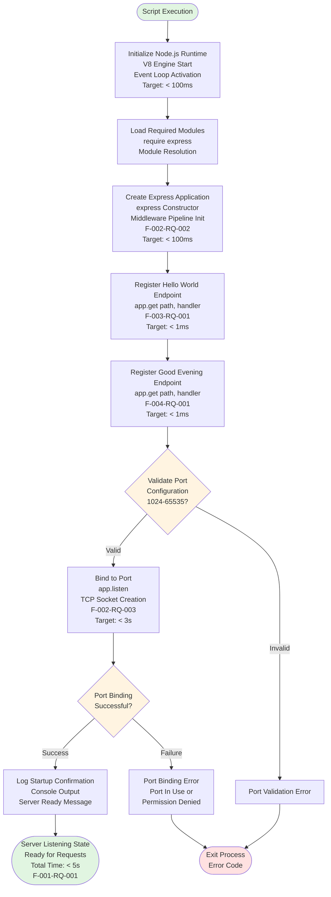
```mermaid
flowchart TD
    Start([Script Execution]) --> Init[Initialize Node.js Runtime<br/>V8 Engine Start<br/>Event Loop Activation<br/>Target: < 100ms]
    Init --> LoadModules[Load Required Modules<br/>require express<br/>Module Resolution]
    LoadModules --> CreateExpress[Create Express Application<br/>express Constructor<br/>Middleware Pipeline Init<br/>F-002-RQ-002<br/>Target: < 100ms]
    CreateExpress --> RegRoute1[Register Hello World Endpoint<br/>app.get path, handler<br/>F-003-RQ-001<br/>Target: < 1ms]
    RegRoute1 --> RegRoute2[Register Good Evening Endpoint<br/>app.get path, handler<br/>F-004-RQ-001<br/>Target: < 1ms]
    RegRoute2 --> ValidatePort{Validate Port<br/>Configuration<br/>1024-65535?}
    ValidatePort -->|Valid| BindPort[Bind to Port<br/>app.listen<br/>TCP Socket Creation<br/>F-002-RQ-003<br/>Target: < 3s]
    ValidatePort -->|Invalid| PortError[Port Validation Error]
    BindPort --> CheckBind{Port Binding<br/>Successful?}
    CheckBind -->|Success| LogReady[Log Startup Confirmation<br/>Console Output<br/>Server Ready Message]
    CheckBind -->|Failure| BindError[Port Binding Error<br/>Port In Use or<br/>Permission Denied]
    LogReady --> Listening([Server Listening State<br/>Ready for Requests<br/>Total Time: < 5s<br/>F-001-RQ-001])
    PortError --> ErrorExit([Exit Process<br/>Error Code])
    BindError --> ErrorExit
    
    style Start fill:#e1f5e1
    style Listening fill:#e1f5e1
    style ErrorExit fill:#ffe1e1
    style ValidatePort fill:#fff4e1
    style CheckBind fill:#fff4e1
```

#### 4.2.1.2 Route Registration Details

Route registration occurs sequentially during the initialization phase, with each endpoint configured independently through the Express router API. The Hello World endpoint registers first, mapping an HTTP GET request pattern to its handler function that returns the static string "Hello world". The Good Evening endpoint follows immediately, establishing its own GET route with a handler returning "Good evening". Each registration operation completes within one millisecond, adding negligible overhead to the overall startup time. The Express router maintains these route definitions in an internal routing table, enabling efficient pattern matching during subsequent request processing.

#### 4.2.1.3 Error Conditions and Recovery

Three primary error scenarios can interrupt the initialization workflow. Port validation failures occur when the configured port number falls outside the valid range of 1024 to 65535, resulting in immediate process termination with an error message. Port binding failures indicate that another process already occupies the requested port or that the current user lacks sufficient permissions to bind to that port. Module loading failures arise when the Express.js dependency is missing from the node_modules directory, typically indicating incomplete NPM installation. All initialization errors result in process termination since the server cannot fulfill its functional purpose without successful startup completion. The educational scope of this system excludes automatic retry mechanisms or fallback configurations, requiring manual intervention to resolve initialization failures.

#### 4.2.1.4 Success Criteria and Validation

Successful initialization satisfies multiple validation criteria. The Express application instance must exist with all required methods available. Both endpoint routes must appear in the Express routing table with correct HTTP method associations. The TCP socket listener must be bound to the specified port and actively accepting connections. Console output must display the startup confirmation message. The total elapsed time from script execution to listening state must not exceed five seconds, as specified in requirement F-001-RQ-001. Upon meeting all criteria, the server enters the listening state and begins processing incoming HTTP requests according to the request processing workflow.

### 4.2.2 HTTP Request Processing Workflow

The HTTP request processing workflow describes the complete request-response cycle from the moment a client initiates an HTTP connection through response transmission back to the client. This workflow encompasses all system layers including the operating system network stack, Node.js HTTP module, Express framework, route matching logic, handler execution, and response formatting. The workflow includes decision points that route requests to the appropriate endpoint handler based on URL pattern matching.

#### 4.2.2.1 Complete Request-Response Cycle

The request processing sequence begins when a client application initiates an HTTP GET request. The operating system TCP/IP stack receives the incoming connection and passes it to the Node.js HTTP module, which parses the raw HTTP request into a structured request object. Express receives this request object and enhances it with framework-specific properties and methods. The enhanced request enters the middleware pipeline, proceeding through any configured middleware functions in registration order. The Express router then performs pattern matching against all registered routes to identify the appropriate handler function. Upon identifying the matching route, Express invokes the corresponding handler function with request and response objects as parameters. The handler executes synchronously, generating the response string and invoking response methods to send the result. Express formats the response with appropriate HTTP headers and status codes, then passes the completed response back to the Node.js HTTP module for transmission through the TCP socket to the client.

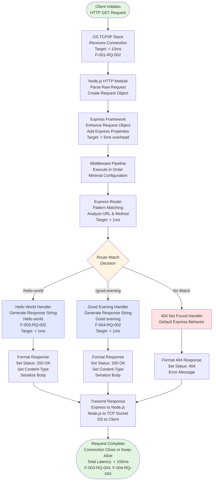
```mermaid
flowchart TD
    Start([Client Initiates<br/>HTTP GET Request]) --> OSReceive[OS TCP/IP Stack<br/>Receives Connection<br/>Target: < 10ms<br/>F-001-RQ-002]
    OSReceive --> NodeHTTP[Node.js HTTP Module<br/>Parse Raw Request<br/>Create Request Object]
    NodeHTTP --> ExpressReceive[Express Framework<br/>Enhance Request Object<br/>Add Express Properties<br/>Target: < 5ms overhead]
    ExpressReceive --> Middleware[Middleware Pipeline<br/>Execute in Order<br/>Minimal Configuration]
    Middleware --> RouteMatch[Express Router<br/>Pattern Matching<br/>Analyze URL & Method<br/>Target: < 1ms]
    RouteMatch --> Decision{Route Match<br/>Decision}
    
    Decision -->|/hello-world| HelloHandler[Hello World Handler<br/>Generate Response String<br/>Hello world<br/>F-003-RQ-002<br/>Target: < 1ms]
    Decision -->|/good-evening| EveningHandler[Good Evening Handler<br/>Generate Response String<br/>Good evening<br/>F-004-RQ-002<br/>Target: < 1ms]
    Decision -->|No Match| NotFound[404 Not Found Handler<br/>Default Express Behavior]
    
    HelloHandler --> FormatHello[Format Response<br/>Set Status: 200 OK<br/>Set Content-Type<br/>Serialize Body]
    EveningHandler --> FormatEvening[Format Response<br/>Set Status: 200 OK<br/>Set Content-Type<br/>Serialize Body]
    NotFound --> Format404[Format 404 Response<br/>Set Status: 404<br/>Error Message]
    
    FormatHello --> Transmit
    FormatEvening --> Transmit
    Format404 --> Transmit
    
    Transmit[Transmit Response<br/>Express to Node.js<br/>Node.js to TCP Socket<br/>OS to Client]
    Transmit --> Complete([Request Complete<br/>Connection Close or Keep-Alive<br/>Total Latency: < 100ms<br/>F-003-RQ-004, F-004-RQ-004])
    
    style Start fill:#e1f5e1
    style Complete fill:#e1f5e1
    style Decision fill:#fff4e1
    style HelloHandler fill:#e1e8ff
    style EveningHandler fill:#e1e8ff
    style NotFound fill:#ffe1e1
```

#### 4.2.2.2 Route Matching and Decision Logic

The Express router performs efficient pattern matching to determine which handler function should process each incoming request. The router evaluates both the HTTP method (GET, POST, etc.) and the URL path against all registered routes in the order they were defined during initialization. For this system, the router matches GET requests with URL paths corresponding to the Hello World endpoint or the Good Evening endpoint. The pattern matching algorithm completes within one millisecond, ensuring minimal overhead in the request processing pipeline. When a request matches a registered route, the router invokes the associated handler function. Requests that do not match any registered route trigger Express's default 404 Not Found handler, which generates an error response automatically without custom application logic.

#### 4.2.2.3 Handler Execution Details

Handler functions represent the application-layer logic that generates response content. Each handler receives two parameter objects from Express: the request object containing all information about the incoming request, and the response object providing methods to construct and send the response. The Hello World handler executes synchronously, creating the string "Hello world" and invoking either `res.send()` or `res.json()` to transmit the response with an HTTP 200 OK status code. The Good Evening handler follows an identical pattern, generating the string "Good evening" and sending it with the same successful status code. Both handlers complete execution within one millisecond, meeting requirement targets F-003-RQ-002 and F-004-RQ-002. The synchronous nature of these handlers eliminates concerns about asynchronous callback management or promise resolution, maintaining educational simplicity while demonstrating fundamental Express patterns.

#### 4.2.2.4 Response Formatting and Transmission

After handler execution, Express performs response formatting to ensure proper HTTP protocol compliance. The framework automatically sets the Content-Type header based on the response data type, selecting text/plain for simple strings or application/json when the handler explicitly uses the `.json()` method. Express serializes the response body, adds the HTTP status code specified by the handler or defaulting to 200 OK, and includes any additional headers required by HTTP standards. The formatted response passes from Express back to the Node.js HTTP module, which writes the complete HTTP response message to the TCP socket. The operating system transmits the response data through the network stack to the client. Depending on HTTP protocol version and connection headers, the TCP connection either closes or remains open for keep-alive reuse. The entire end-to-end request processing cycle, from request reception to response transmission, completes within one hundred milliseconds for both endpoints, satisfying performance requirements F-003-RQ-004 and F-004-RQ-004.

#### 4.2.2.5 Performance Breakdown and Timing

The request processing workflow distributes its one hundred millisecond total latency budget across multiple processing stages. Connection acceptance by the operating system and Node.js HTTP module consumes up to ten milliseconds. Express framework overhead for request enhancement and middleware processing adds up to five milliseconds. Route matching by the Express router completes within one millisecond. Handler execution to generate the static response string requires less than one millisecond. Response formatting and serialization consume additional time for header construction and body preparation. The remaining latency budget accommodates network transmission time and operating system overhead. These timing constraints reflect the minimal computational requirements of static string responses, with no database queries, external API calls, or complex business logic to introduce additional latency. The performance characteristics demonstrate Node.js and Express efficiency for simple request patterns typical of beginner tutorials.

### 4.2.3 Server Lifecycle Management Workflow

The server lifecycle management workflow governs the graceful shutdown process that occurs when the server receives a termination signal or encounters an unrecoverable error. Proper lifecycle management ensures that in-flight requests complete successfully, resources are released cleanly, and the port binding is freed for future server instances.

#### 4.2.3.1 Shutdown Sequence

Graceful shutdown begins when the Node.js process receives a SIGTERM or SIGINT signal, typically initiated by pressing Ctrl+C in the terminal or by a process management system sending a termination request. The server immediately stops accepting new incoming connections while allowing existing connections to complete their current request-response cycles. Once all active requests finish processing, the server closes remaining open connections and releases the port binding, making the port available for other processes. The shutdown procedure logs a termination message to the console documenting the shutdown event. Finally, the Node.js process exits with an appropriate exit code indicating clean shutdown. The entire graceful shutdown sequence completes within two seconds, as specified in requirement F-001-RQ-003.

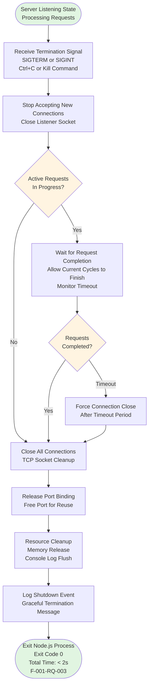
```mermaid
flowchart TD
    Listening([Server Listening State<br/>Processing Requests]) --> Signal[Receive Termination Signal<br/>SIGTERM or SIGINT<br/>Ctrl+C or Kill Command]
    Signal --> StopAccept[Stop Accepting New Connections<br/>Close Listener Socket]
    StopAccept --> CheckActive{Active Requests<br/>In Progress?}
    CheckActive -->|Yes| WaitComplete[Wait for Request Completion<br/>Allow Current Cycles to Finish<br/>Monitor Timeout]
    CheckActive -->|No| CloseConn[Close All Connections<br/>TCP Socket Cleanup]
    WaitComplete --> WaitCheck{Requests<br/>Completed?}
    WaitCheck -->|Yes| CloseConn
    WaitCheck -->|Timeout| ForceClose[Force Connection Close<br/>After Timeout Period]
    ForceClose --> CloseConn
    CloseConn --> ReleasePort[Release Port Binding<br/>Free Port for Reuse]
    ReleasePort --> Cleanup[Resource Cleanup<br/>Memory Release<br/>Console Log Flush]
    Cleanup --> LogShutdown[Log Shutdown Event<br/>Graceful Termination Message]
    LogShutdown --> ExitProcess([Exit Node.js Process<br/>Exit Code 0<br/>Total Time: < 2s<br/>F-001-RQ-003])
    
    style Listening fill:#e1f5e1
    style ExitProcess fill:#e1f5e1
    style CheckActive fill:#fff4e1
    style WaitCheck fill:#fff4e1
```

#### 4.2.3.2 In-Flight Request Handling

During the shutdown sequence, the server must decide how to handle requests that are currently being processed. The graceful shutdown approach allows these in-flight requests to complete their normal request-response cycles rather than abruptly terminating them. The server monitors active connections and waits for all request handlers to finish executing and transmit their responses. A timeout mechanism prevents indefinite waiting in cases where requests hang or take longer than expected. If requests do not complete within the timeout period, the server forcibly closes the connections and proceeds with shutdown. This balance between graceful completion and timely shutdown ensures that most requests receive proper responses while preventing shutdown operations from blocking indefinitely. The educational scope of this system includes minimal production-grade complexity, so the timeout values and monitoring mechanisms remain simple and easy to understand.

#### 4.2.3.3 Resource Cleanup Procedures

Before process termination, the server performs cleanup operations to release all acquired resources. Port binding release is the most critical cleanup task, ensuring that subsequent server instances can bind to the same port without "address already in use" errors. The Node.js runtime automatically handles most resource cleanup through garbage collection, but explicit cleanup steps provide visibility into proper shutdown procedures for educational purposes. Console log buffers flush to ensure all logged messages appear in the output. Event listeners and timers, if any exist, are cleared to prevent memory leaks. The cleanup phase completes quickly since the system maintains minimal state and no persistent connections to external systems such as databases or message queues. Upon completing all cleanup operations, the server logs a final shutdown confirmation message and exits the process with exit code zero, indicating successful termination.

## 4.3 Integration Workflows

### 4.3.1 NPM Dependency Installation Workflow

The NPM dependency installation workflow establishes the foundation for the Express.js framework integration by downloading, installing, and configuring all required packages. This workflow executes before the server can initialize, as the Express framework must be present in the node_modules directory for the server script to load it successfully.

#### 4.3.1.1 Package Configuration Process

The installation workflow begins with the creation or modification of the package.json file, which serves as the project's dependency manifest. The developer defines project metadata including the project name, version number, and description. The dependencies section of package.json declares the Express.js framework with a specific version constraint using semantic versioning notation. The typical declaration uses the caret operator (^) to allow compatible minor and patch version updates while preventing breaking changes from major version increments. For example, specifying `"express": "^4.18.0"` allows NPM to install version 4.18.0 or any subsequent 4.x release, but blocks automatic updates to 5.0.0 which might introduce breaking API changes. The package.json file must conform to valid JSON syntax, with proper structure and formatting, as specified in requirement F-005-RQ-001.

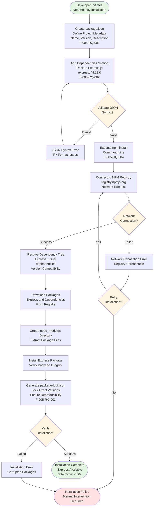
```mermaid
flowchart TD
    Start([Developer Initiates<br/>Dependency Installation]) --> CreatePkg[Create package.json<br/>Define Project Metadata<br/>Name, Version, Description<br/>F-005-RQ-001]
    CreatePkg --> AddDep[Add Dependencies Section<br/>Declare Express.js<br/>express: ^4.18.0<br/>F-005-RQ-002]
    AddDep --> ValidateJSON{Validate JSON<br/>Syntax?}
    ValidateJSON -->|Invalid| JSONError[JSON Syntax Error<br/>Fix Format Issues]
    ValidateJSON -->|Valid| RunInstall[Execute npm install<br/>Command Line<br/>F-005-RQ-004]
    JSONError --> AddDep
    RunInstall --> ConnectRegistry[Connect to NPM Registry<br/>registry.npmjs.org<br/>Network Request]
    ConnectRegistry --> CheckNetwork{Network<br/>Connection?}
    CheckNetwork -->|Failed| NetworkError[Network Connection Error<br/>Registry Unreachable]
    CheckNetwork -->|Success| ResolveTree[Resolve Dependency Tree<br/>Express + Sub-dependencies<br/>Version Compatibility]
    NetworkError --> Retry{Retry<br/>Installation?}
    Retry -->|Yes| ConnectRegistry
    Retry -->|No| InstallFailed([Installation Failed<br/>Manual Intervention Required])
    ResolveTree --> DownloadPkg[Download Packages<br/>Express and Dependencies<br/>From Registry]
    DownloadPkg --> CreateNodeModules[Create node_modules Directory<br/>Extract Package Files]
    CreateNodeModules --> InstallExpress[Install Express Package<br/>Verify Package Integrity]
    InstallExpress --> GenLockfile[Generate package-lock.json<br/>Lock Exact Versions<br/>Ensure Reproducibility<br/>F-005-RQ-003]
    GenLockfile --> VerifyInstall{Verify<br/>Installation?}
    VerifyInstall -->|Failed| InstallError[Installation Error<br/>Corrupted Packages]
    VerifyInstall -->|Success| Complete([Installation Complete<br/>Express Available<br/>Total Time: < 60s])
    InstallError --> InstallFailed
    
    style Start fill:#e1f5e1
    style Complete fill:#e1f5e1
    style InstallFailed fill:#ffe1e1
    style ValidateJSON fill:#fff4e1
    style CheckNetwork fill:#fff4e1
    style VerifyInstall fill:#fff4e1
    style Retry fill:#fff4e1
```

#### 4.3.1.2 Dependency Resolution and Download

When the developer executes the `npm install` command, NPM initiates a connection to the NPM public registry at registry.npmjs.org to retrieve package metadata and download package files. NPM first resolves the complete dependency tree by examining the Express package metadata to identify all sub-dependencies required by Express itself. This recursive resolution process ensures that all transitive dependencies install correctly with compatible versions. NPM downloads each package as a compressed archive from the registry, verifying package integrity through cryptographic checksums. Network failures during this phase result in installation errors that require retry attempts. The download process can consume significant time depending on network bandwidth and the total size of all dependencies, though the target completion time remains under sixty seconds as specified in requirement F-005-RQ-004.

#### 4.3.1.3 Package Installation and Verification

Following successful download, NPM creates the node_modules directory in the project root if it does not already exist. NPM extracts each downloaded package archive into its appropriate location within node_modules, organizing packages in a flat or nested structure depending on version conflicts and NPM version behavior. The Express package installs in the node_modules/express directory with all its files and subdirectories. NPM verifies package integrity by checking file checksums against expected values from the registry metadata. Any corruption detected during extraction triggers installation failure. Upon successful installation of all packages, NPM generates the package-lock.json file, which records the exact version of every installed package to ensure reproducible installations across different environments and time periods, satisfying requirement F-005-RQ-003.

#### 4.3.1.4 Installation Validation and Error Handling

The installation workflow includes multiple validation checkpoints to detect and report errors. JSON syntax validation ensures the package.json file conforms to proper format before attempting installation. Network connectivity validation confirms registry accessibility before initiating downloads. Dependency resolution validation detects incompatible version constraints that cannot be satisfied simultaneously. Package integrity validation prevents corrupted files from entering the node_modules directory. Upon encountering any validation failure, NPM generates an error message describing the specific problem and terminates the installation process. The educational scope of this system does not include sophisticated error recovery mechanisms, requiring developers to manually resolve installation issues such as network problems, registry outages, or syntax errors in package.json. Successful installation completion results in a fully populated node_modules directory, a valid package-lock.json file, and console output confirming the installation of Express and all sub-dependencies.

### 4.3.2 Module Loading and Integration Workflow

The module loading and integration workflow describes how the Node.js runtime resolves and loads the Express framework when the server script executes, making the Express API available for application use. This workflow operates during server initialization, prior to Express application creation.

#### 4.3.2.1 Module Resolution Process

When the server script executes a `require('express')` statement, Node.js initiates its module resolution algorithm to locate the Express package in the file system. The resolution algorithm first checks if 'express' refers to a Node.js core module, which it does not. Node.js then searches the node_modules directory in the current directory, looking for a subdirectory named 'express'. If found, Node.js examines the package.json file within that directory to identify the main entry point file, typically specified in the "main" field. If the node_modules directory in the current location does not contain Express, Node.js walks up the directory tree, checking node_modules directories in parent folders until either finding the package or reaching the file system root. This hierarchical search enables package sharing across multiple projects and supports nested dependency structures.

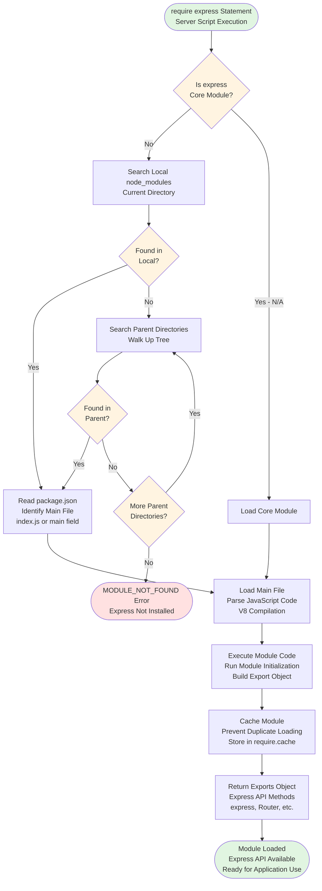
```mermaid
flowchart TD
    Start([require express Statement<br/>Server Script Execution]) --> CheckCore{Is express<br/>Core Module?}
    CheckCore -->|No| SearchLocal[Search Local node_modules<br/>Current Directory]
    CheckCore -->|Yes - N/A| LoadCore[Load Core Module]
    SearchLocal --> FindLocal{Found in<br/>Local?}
    FindLocal -->|Yes| ReadPkgJSON[Read package.json<br/>Identify Main File<br/>index.js or main field]
    FindLocal -->|No| SearchParent[Search Parent Directories<br/>Walk Up Tree]
    SearchParent --> FindParent{Found in<br/>Parent?}
    FindParent -->|Yes| ReadPkgJSON
    FindParent -->|No| SearchMore{More Parent<br/>Directories?}
    SearchMore -->|Yes| SearchParent
    SearchMore -->|No| ModuleNotFound([MODULE_NOT_FOUND Error<br/>Express Not Installed])
    ReadPkgJSON --> LoadFile[Load Main File<br/>Parse JavaScript Code<br/>V8 Compilation]
    LoadCore --> LoadFile
    LoadFile --> ExecuteModule[Execute Module Code<br/>Run Module Initialization<br/>Build Export Object]
    ExecuteModule --> CacheModule[Cache Module<br/>Prevent Duplicate Loading<br/>Store in require.cache]
    CacheModule --> ReturnExports[Return Exports Object<br/>Express API Methods<br/>express, Router, etc.]
    ReturnExports --> Complete([Module Loaded<br/>Express API Available<br/>Ready for Application Use])
    
    style Start fill:#e1f5e1
    style Complete fill:#e1f5e1
    style ModuleNotFound fill:#ffe1e1
    style CheckCore fill:#fff4e1
    style FindLocal fill:#fff4e1
    style FindParent fill:#fff4e1
    style SearchMore fill:#fff4e1
```

#### 4.3.2.2 Module Execution and Initialization

Once Node.js locates the Express main file, the runtime loads the JavaScript code into memory and compiles it using the V8 JavaScript engine. The compiled code executes immediately, running all module-level initialization code. Express performs its internal setup during this execution phase, constructing the framework's internal data structures, defining API methods, and preparing for application instantiation. The module code builds an exports object containing all public API methods that applications can access. For Express, this exports object includes the main `express()` constructor function along with utility methods like `Router()`, `json()`, and other middleware factories. The module execution phase completes before the require statement returns, ensuring that the returned exports object is fully initialized and ready for use.

#### 4.3.2.3 Module Caching and Reuse

Node.js implements a module caching system to prevent redundant module loading and execution. After loading and executing a module for the first time, Node.js stores the module's exports object in an internal cache keyed by the module's resolved file path. Subsequent `require()` statements for the same module retrieve the cached exports object directly without repeating the file system search, code parsing, or execution steps. This caching behavior ensures that modules execute only once regardless of how many times different parts of the application require them. For the Express framework, caching means the framework initialization occurs exactly once during server startup, with all subsequent references to Express accessing the same initialized framework instance. The caching mechanism improves performance and ensures consistent behavior across the application.

#### 4.3.2.4 Integration Validation

The module loading workflow includes implicit validation that confirms successful integration. If Node.js cannot locate the Express module in any node_modules directory, the require statement throws a MODULE_NOT_FOUND error, immediately terminating server initialization. This error typically indicates that NPM installation did not complete successfully or that the node_modules directory was deleted after installation. If module loading succeeds but the Express package contains corrupted or incompatible code, the module execution phase may throw runtime errors during initialization. These errors also prevent server startup, ensuring that the application never reaches a partially functional state. Successful completion of the module loading workflow results in the Express API becoming available to the server script, enabling the creation of the Express application instance and registration of endpoint routes.

## 4.4 State Management Workflows

### 4.4.1 Server State Transitions

The server progresses through a defined sequence of states from initial script execution through active operation to final termination. Understanding these state transitions provides visibility into server status and enables appropriate behavior at each lifecycle stage.

#### 4.4.1.1 Complete State Model

The server state model encompasses seven distinct states: UNINITIALIZED represents the initial condition before any server code executes; INITIALIZING begins when the Node.js runtime starts and the Express application constructor executes; REGISTERING_ROUTES occurs during the route definition phase when endpoint handlers attach to the Express router; BINDING starts when the `app.listen()` method executes and attempts to bind the TCP socket to the configured port; LISTENING indicates the server is fully operational and accepting incoming HTTP connections; SHUTTING_DOWN begins when a termination signal is received and the server stops accepting new connections while completing in-flight requests; TERMINATED represents the final state after process exit when all resources have been released and the server no longer exists.

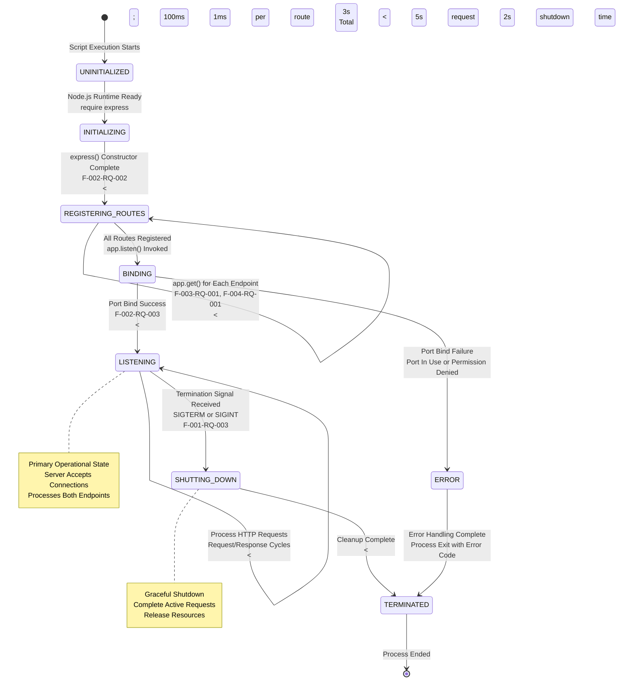
```mermaid
stateDiagram-v2
    [*] --> UNINITIALIZED: Script Execution Starts
    UNINITIALIZED --> INITIALIZING: Node.js Runtime Ready<br/>require express
    INITIALIZING --> REGISTERING_ROUTES: express() Constructor Complete<br/>F-002-RQ-002<br/>&lt; 100ms
    REGISTERING_ROUTES --> REGISTERING_ROUTES: app.get() for Each Endpoint<br/>F-003-RQ-001, F-004-RQ-001<br/>&lt; 1ms per route
    REGISTERING_ROUTES --> BINDING: All Routes Registered<br/>app.listen() Invoked
    BINDING --> LISTENING: Port Bind Success<br/>F-002-RQ-003<br/>&lt; 3s<br/>Total Startup: &lt; 5s
    BINDING --> ERROR: Port Bind Failure<br/>Port In Use or Permission Denied
    LISTENING --> LISTENING: Process HTTP Requests<br/>Request/Response Cycles<br/>&lt; 100ms per request
    LISTENING --> SHUTTING_DOWN: Termination Signal Received<br/>SIGTERM or SIGINT<br/>F-001-RQ-003
    SHUTTING_DOWN --> TERMINATED: Cleanup Complete<br/>&lt; 2s shutdown time
    ERROR --> TERMINATED: Error Handling Complete<br/>Process Exit with Error Code
    TERMINATED --> [*]: Process Ended
    
    note right of LISTENING
        Primary Operational State
        Server Accepts Connections
        Processes Both Endpoints
    end note
    
    note right of SHUTTING_DOWN
        Graceful Shutdown
        Complete Active Requests
        Release Resources
    end note
```

#### 4.4.1.2 State Transition Triggers and Conditions

Each state transition occurs in response to specific events or completion of prerequisite operations. The transition from UNINITIALIZED to INITIALIZING triggers when the Node.js runtime completes its internal initialization and begins executing the server script. INITIALIZING to REGISTERING_ROUTES occurs upon successful creation of the Express application instance, which must complete within one hundred milliseconds. The REGISTERING_ROUTES state persists while the application registers each endpoint through `app.get()` method calls, with each registration completing in under one millisecond. Once all routes are registered, the call to `app.listen()` initiates the BINDING transition. Successful port binding, completing within three seconds, moves the server to the LISTENING state. The total time from script execution to LISTENING must not exceed five seconds per requirement F-001-RQ-001. From LISTENING, only a termination signal triggers the transition to SHUTTING_DOWN. The final transition to TERMINATED occurs automatically after all cleanup operations complete within the two-second shutdown window.

#### 4.4.1.3 Error State Handling

The state diagram includes an ERROR state to represent failure conditions that prevent normal operation. The most common error transition occurs from BINDING to ERROR when port binding fails due to the port being already in use by another process or insufficient permissions to bind to the requested port. Error state entry triggers error logging procedures that output diagnostic information to the console, describing the specific failure condition. From the ERROR state, the only valid transition leads to TERMINATED, where the process exits with a non-zero exit code indicating abnormal termination. The educational scope of this system does not include sophisticated error recovery mechanisms such as automatic port selection or retry logic, requiring manual intervention to resolve error conditions before subsequent server startup attempts.

#### 4.4.1.4 State Duration and Performance

Each state has an expected duration that contributes to overall system performance targets. The UNINITIALIZED state exists only momentarily during the initial milliseconds of script execution. INITIALIZING encompasses Node.js startup and Express application creation, typically completing within one hundred to two hundred milliseconds. REGISTERING_ROUTES adds minimal time since each route registration completes in under one millisecond and only two routes exist in this system. BINDING duration depends on operating system responsiveness but targets completion within three seconds. The LISTENING state persists indefinitely, representing the server's primary operational mode where it processes requests continuously until receiving a termination signal. SHUTTING_DOWN duration must not exceed two seconds to ensure timely cleanup. TERMINATED is the final state with no duration since the process no longer exists. These timing characteristics ensure that the server initializes quickly and shuts down cleanly while spending the vast majority of its lifetime in the productive LISTENING state.

### 4.4.2 Request State Lifecycle

Individual HTTP requests progress through their own state lifecycle independent of overall server state. Each request transitions through distinct processing phases from initial reception to final completion, with state transitions marking progress through the request-response cycle.

#### 4.4.2.1 Request State Sequence

The request state lifecycle consists of six states that each request traverses sequentially: RECEIVED marks the moment when the Node.js HTTP module captures the incoming connection and creates a request object; ROUTING begins when Express receives the request and initiates pattern matching against registered routes; PROCESSING indicates that the Express router has identified the matching route and invoked the appropriate handler function; FORMATTING occurs after handler completion when Express constructs the HTTP response with headers and status codes; TRANSMITTING represents the data transmission phase when the response travels through the TCP socket back to the client; COMPLETED marks the end of the request lifecycle after successful response delivery or error occurrence.

```mermaid
stateDiagram-v2
    [*] --> RECEIVED: "Client HTTP Request Arrives<br/>TCP Connection Established<br/>&lt; 10ms"
    RECEIVED --> ROUTING: "Express Receives Request<br/>Middleware Pipeline Entry<br/>&lt; 5ms framework overhead"
    ROUTING --> ROUTING: "Route Pattern Matching<br/>&lt; 1ms"
    ROUTING --> PROCESSING: "Handler Identified<br/>Hello World or Good Evening"
    ROUTING --> NOT_FOUND: "No Route Match<br/>404 Handler"
    PROCESSING --> FORMATTING: "Handler Complete<br/>Response String Generated<br/>&lt; 1ms<br/>F-003-RQ-002<br/>F-004-RQ-002"
    NOT_FOUND --> FORMATTING: "404 Response Ready"
    FORMATTING --> TRANSMITTING: "Response Headers & Body Ready<br/>Status Code Set<br/>Content-Type Configured"
    TRANSMITTING --> COMPLETED: "Response Transmitted<br/>TCP Socket Write Complete<br/>Total: &lt; 100ms<br/>F-003-RQ-004<br/>F-004-RQ-004"
    TRANSMITTING --> ERROR: "Transmission Failure<br/>Connection Lost"
    ERROR --> COMPLETED: "Error Logged"
    COMPLETED --> [*]: "Request Lifecycle Ends<br/>Connection Close or Keep-Alive"
    
    note right of PROCESSING
        Synchronous Handler Execution
        Static String Generation
        No Async Operations
        No Database Queries
    end note
    
    note right of TRANSMITTING
        Network I/O Phase
        TCP Socket Write
        Client Response Receipt
    end note
```

#### 4.4.2.2 State Timing and Performance Budgets

Each request state has an allocated time budget that contributes to the overall end-to-end latency target of one hundred milliseconds. The RECEIVED state duration reflects network and operating system overhead, targeting completion within ten milliseconds as specified in requirement F-001-RQ-002. ROUTING includes Express framework processing and pattern matching, budgeted at under five milliseconds for framework overhead and one millisecond for route matching. PROCESSING represents handler execution time, which must complete within one millisecond per requirements F-003-RQ-002 and F-004-RQ-002 due to the simple synchronous nature of static string generation. FORMATTING consumes additional time for response header construction and body serialization. TRANSMITTING duration varies with network conditions and response payload size, though the minimal response sizes in this system minimize transmission time. The sum of all state durations must remain below the one hundred millisecond total latency requirement specified in F-003-RQ-004 and F-004-RQ-004.

#### 4.4.2.3 State Transitions and Concurrency

While each individual request progresses through its state sequence sequentially, the server processes multiple requests concurrently in different states. The Node.js event loop architecture enables this concurrent processing without traditional threading or process forking. Multiple requests may simultaneously exist in different states: some requests in RECEIVED state awaiting Express processing, others in PROCESSING state executing handlers, and others in TRANSMITTING state writing to TCP sockets. This concurrent state distribution allows the server to achieve high throughput exceeding one thousand requests per second despite the sequential nature of each individual request lifecycle. The stateless design of the endpoints, with no shared state or resource contention between requests, enables this high level of concurrency without requiring explicit synchronization mechanisms.

#### 4.4.2.4 Error State and Recovery

Request processing can encounter errors that trigger transition to the ERROR state. The most common error scenario involves transmission failure when the client disconnects before receiving the complete response, causing TCP socket write operations to fail. Express handles such errors internally, logging them and cleaning up associated resources. The ERROR state represents a terminal condition for the individual request, transitioning directly to COMPLETED without retry attempts. The educational scope excludes sophisticated error recovery such as client reconnection or response retry mechanisms. Each error generates a log entry for debugging purposes but does not affect other concurrent requests or overall server stability. The server continues processing subsequent requests normally while the failed request completes its lifecycle through the ERROR state.

## 4.5 Error Handling Flows

### 4.5.1 Server Startup Error Handling

Server startup failures prevent the application from reaching its operational LISTENING state, requiring explicit error handling to detect failures, report diagnostic information, and terminate the process gracefully. The startup error handling workflow encompasses all initialization phases from runtime activation through port binding.

#### 4.5.1.1 Port Validation Errors

Port configuration validation occurs early in the initialization sequence to prevent attempting to bind to invalid port numbers. The validation logic checks that the configured port number is an integer within the valid range of 1024 to 65535, avoiding privileged ports below 1024 that require elevated permissions. Invalid port numbers, such as negative values, numbers exceeding 65535, non-integer values, or ports below 1024, trigger immediate validation failure. The error handler generates a descriptive error message explaining the specific validation failure and the acceptable port range. The error message outputs to the console for developer visibility, and the process terminates with a non-zero exit code indicating abnormal termination. No automatic correction or fallback occurs, requiring developers to modify the configuration and restart the server manually.

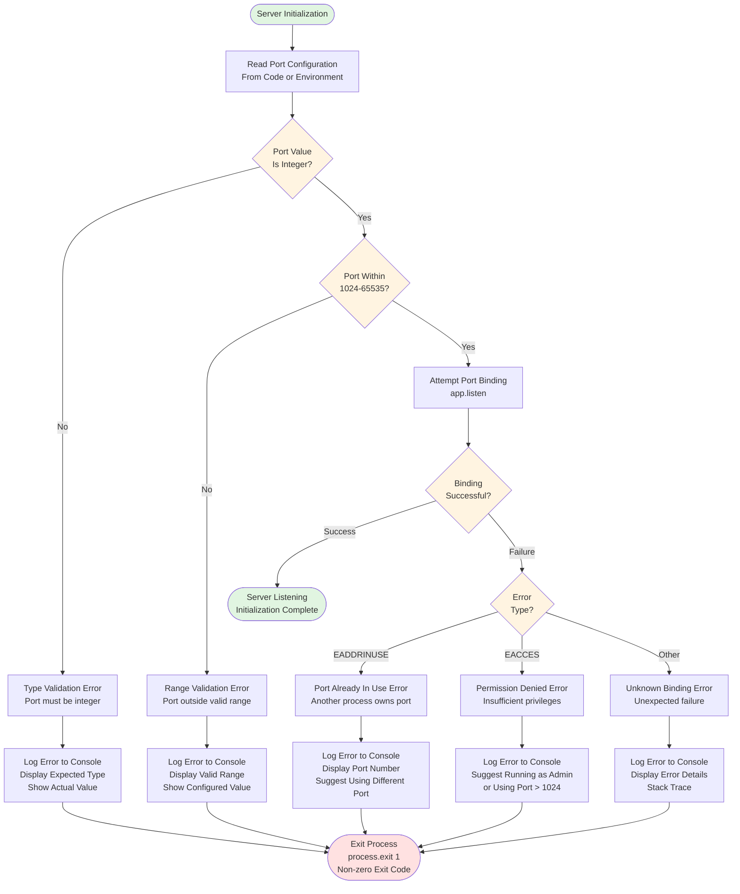
```mermaid
flowchart TD
    Start([Server Initialization]) --> ReadConfig[Read Port Configuration<br/>From Code or Environment]
    ReadConfig --> ValidateType{Port Value<br/>Is Integer?}
    ValidateType -->|No| TypeError[Type Validation Error<br/>Port must be integer]
    ValidateType -->|Yes| ValidateRange{Port Within<br/>1024-65535?}
    ValidateRange -->|No| RangeError[Range Validation Error<br/>Port outside valid range]
    ValidateRange -->|Yes| AttemptBind[Attempt Port Binding<br/>app.listen]
    TypeError --> LogTypeError[Log Error to Console<br/>Display Expected Type<br/>Show Actual Value]
    RangeError --> LogRangeError[Log Error to Console<br/>Display Valid Range<br/>Show Configured Value]
    AttemptBind --> BindResult{Binding<br/>Successful?}
    BindResult -->|Success| StartupComplete([Server Listening<br/>Initialization Complete])
    BindResult -->|Failure| AnalyzeError{Error<br/>Type?}
    AnalyzeError -->|EADDRINUSE| PortInUse[Port Already In Use Error<br/>Another process owns port]
    AnalyzeError -->|EACCES| PermissionDenied[Permission Denied Error<br/>Insufficient privileges]
    AnalyzeError -->|Other| UnknownError[Unknown Binding Error<br/>Unexpected failure]
    PortInUse --> LogPortInUse[Log Error to Console<br/>Display Port Number<br/>Suggest Using Different Port]
    PermissionDenied --> LogPermission[Log Error to Console<br/>Suggest Running as Admin<br/>or Using Port > 1024]
    UnknownError --> LogUnknown[Log Error to Console<br/>Display Error Details<br/>Stack Trace]
    LogTypeError --> ExitProcess
    LogRangeError --> ExitProcess
    LogPortInUse --> ExitProcess
    LogPermission --> ExitProcess
    LogUnknown --> ExitProcess
    ExitProcess([Exit Process<br/>process.exit 1<br/>Non-zero Exit Code])
    
    style Start fill:#e1f5e1
    style StartupComplete fill:#e1f5e1
    style ExitProcess fill:#ffe1e1
    style ValidateType fill:#fff4e1
    style ValidateRange fill:#fff4e1
    style BindResult fill:#fff4e1
    style AnalyzeError fill:#fff4e1
```

#### 4.5.1.2 Port Binding Failure Handling

Port binding failures occur when the `app.listen()` method cannot successfully bind the TCP socket to the requested port. The most common failure mode is the EADDRINUSE error, indicating that another process already has a listener bound to the same port. This situation typically arises when attempting to start multiple server instances simultaneously or when a previous server instance did not shut down cleanly. The error handler detects the EADDRINUSE condition and generates an error message identifying the specific port number and suggesting that the developer either terminate the conflicting process or configure a different port number. Another common failure mode is the EACCES (access denied) error, occurring when the current user lacks permissions to bind to the requested port. This typically happens on Unix-like systems when attempting to bind to privileged ports (below 1024) without administrative privileges. The error handler recommends either running the server with elevated privileges or selecting a non-privileged port above 1024. All binding errors result in console error logging followed by process termination with exit code 1, indicating error conditions to shell scripts or process managers.

#### 4.5.1.3 Module Loading Failures

Module loading errors occur when the Node.js runtime cannot locate or successfully load the Express framework during the `require('express')` statement execution. The MODULE_NOT_FOUND error indicates that Express is not present in any node_modules directory within the module resolution search path. This condition typically means that NPM installation did not complete successfully, the node_modules directory was deleted after installation, or the package.json file does not declare the Express dependency. Node.js automatically throws a MODULE_NOT_FOUND error with a descriptive message identifying the missing module name. The application code does not need explicit error handling for this scenario since Node.js terminates the process automatically when a required module cannot be loaded. Developers must run `npm install` to download and install the Express package before the server can start successfully. Other module loading errors might occur if the Express package files are corrupted or if there are JavaScript syntax errors in the Express source code, though such scenarios are rare with packages from the official NPM registry.

#### 4.5.1.4 Initialization Timeout Handling

While the current system does not implement explicit initialization timeout monitoring, production systems typically enforce maximum startup time limits to detect hung initialization processes. The functional requirement F-001-RQ-001 specifies that server startup must complete within five seconds, providing a benchmark for timeout implementation. Timeout monitoring would involve starting a timer when the initialization sequence begins and triggering an error if the LISTENING state is not reached before the timeout expires. Timeout errors would generate console warnings identifying which initialization phase was in progress when the timeout occurred, helping developers diagnose slow initialization caused by network delays during dependency loading, slow file system operations, or blocking operations in module initialization code. The educational scope of this system omits timeout implementation for simplicity, trusting that the minimal initialization steps complete quickly under normal conditions.

### 4.5.2 Request Processing Error Handling

Request processing errors occur during the request-response cycle after the server has successfully initialized and entered the LISTENING state. These errors affect individual requests without impacting overall server stability or other concurrent requests.

#### 4.5.2.1 Route Not Found Errors

Route not found errors occur when a client sends an HTTP request with a URL path that does not match any registered route. Express automatically handles this scenario through its default error handling middleware, which generates an HTTP 404 Not Found response without requiring custom application logic. When the Express router completes pattern matching without finding a matching route, it invokes the 404 handler, which constructs a response with status code 404 and a standard error message indicating that the requested resource was not found. The response includes minimal information to avoid exposing internal system details to clients. The 404 handler completes execution quickly, maintaining the same performance characteristics as successful route handlers. The server logs the 404 response for monitoring purposes, though the educational scope may omit logging to maintain simplicity. Multiple 404 responses do not indicate server malfunction but rather client requests for undefined resources, which is normal behavior in HTTP systems.

```mermaid
flowchart TD
    RequestArrives([HTTP Request Received<br/>Express Router Active]) --> RouteMatch{URL Pattern<br/>Matches Registered<br/>Route?}
    RouteMatch -->|/hello-world| HelloHandler[Execute Hello World Handler<br/>Generate Response<br/>Return 200 OK]
    RouteMatch -->|/good-evening| EveningHandler[Execute Good Evening Handler<br/>Generate Response<br/>Return 200 OK]
    RouteMatch -->|No Match| NotFoundHandler[404 Not Found Handler<br/>Default Express Middleware]
    HelloHandler --> CheckErrors{Handler<br/>Execution Error?}
    EveningHandler --> CheckErrors
    CheckErrors -->|No Error| SuccessResponse[Generate Success Response<br/>Status: 200<br/>Body: Response String]
    CheckErrors -->|Error| InternalError[Internal Server Error<br/>Status: 500]
    NotFoundHandler --> Generate404[Generate 404 Response<br/>Status: 404 Not Found<br/>Body: Error Message]
    Generate404 --> LogNotFound[Log 404 to Console<br/>Request URL<br/>Timestamp]
    InternalError --> Log500[Log 500 Error to Console<br/>Error Message<br/>Stack Trace]
    LogNotFound --> SendResponse[Send Response to Client<br/>TCP Transmission]
    Log500 --> SendResponse
    SuccessResponse --> SendResponse
    SendResponse --> CheckTransmit{Transmission<br/>Successful?}
    CheckTransmit -->|Success| RequestComplete([Request Complete<br/>Connection Close or Keep-Alive])
    CheckTransmit -->|Failure| TransmitError[Transmission Error<br/>Client Disconnected<br/>Network Failure]
    TransmitError --> LogTransmit[Log Transmission Error<br/>Connection Details<br/>Error Type]
    LogTransmit --> Cleanup[Cleanup Request Resources<br/>Close Connection<br/>Release Memory]
    Cleanup --> RequestComplete
    
    style RequestArrives fill:#e1f5e1
    style RequestComplete fill:#e1f5e1
    style RouteMatch fill:#fff4e1
    style CheckErrors fill:#fff4e1
    style CheckTransmit fill:#fff4e1
    style InternalError fill:#ffe1e1
    style NotFoundHandler fill:#ffe8e1
    style TransmitError fill:#ffe1e1
```

#### 4.5.2.2 Handler Execution Errors

Handler execution errors occur when a route handler function encounters an exception during processing. In the current system with its simple synchronous handlers that generate static strings, handler errors are unlikely but theoretically possible if the handler code contains syntax errors or attempts operations that throw exceptions. If an unhandled exception occurs within a handler, Express automatically catches it and invokes the internal error handling middleware, which generates an HTTP 500 Internal Server Error response. The error response indicates to the client that server-side processing failed, though the minimal error information protects against information disclosure vulnerabilities. Express logs the full error details including the exception message and stack trace to the console for developer debugging. The error does not crash the server process or affect concurrent requests, demonstrating the fault isolation inherent in the request-per-handler model. Production systems typically implement custom error handling middleware to provide more controlled error responses, but the educational scope of this system relies on Express's default error handling for simplicity.

#### 4.5.2.3 Response Transmission Errors

Response transmission errors occur during the TRANSMITTING state when the server attempts to write the HTTP response to the TCP socket but encounters network failures or client disconnections. The most common scenario involves the client closing the connection before the server completes response transmission, causing write operations to fail with broken pipe or connection reset errors. Node.js and Express handle these errors internally, preventing them from crashing the server process. The failed request transitions to the ERROR state, where cleanup operations release associated resources and close the connection. The server logs transmission errors for monitoring purposes, recording the request details and error type. These errors do not trigger retry attempts since HTTP is fundamentally a single-transaction protocol without built-in retry semantics. The client application bears responsibility for implementing retry logic if needed. Transmission errors have no impact on server availability or other concurrent requests, demonstrating the isolation between individual request contexts.

#### 4.5.2.4 Validation Error Handling

The current system does not implement complex request validation since both endpoints accept GET requests with no parameters, query strings, or request bodies. In more sophisticated systems, validation errors would occur when request data fails to meet schema requirements, such as missing required fields, incorrect data types, or values outside acceptable ranges. Validation typically occurs early in the request processing pipeline, either in middleware functions before route handlers execute or at the beginning of handler functions. Validation failures generate HTTP 400 Bad Request responses with error messages describing the specific validation failures. The error response enables clients to correct their request format and resubmit. Validation errors are distinct from server errors since they represent client mistakes rather than server malfunctions, justifying the 4xx status code series rather than 5xx. The educational scope omits validation complexity, but future tutorial extensions might introduce parameter validation to demonstrate proper error handling patterns.

## 4.6 Validation and Business Rules Workflows

### 4.6.1 Endpoint Response Validation

Both endpoints implement strict validation rules ensuring that responses conform to functional requirements and maintain consistency across all invocations. The validation workflows verify response content, HTTP status codes, headers, and performance characteristics.

#### 4.6.1.1 Hello World Endpoint Validation

The Hello World endpoint must satisfy multiple validation criteria specified in feature F-003. The response content must contain exactly the string "Hello world" with precise capitalization and no additional characters, whitespace, or formatting. The HTTP status code must be 200 OK for successful requests, indicating proper request processing. The Content-Type header must be either text/plain or application/json depending on whether the handler uses `res.send()` or `res.json()` methods. The response generation must complete within one millisecond as specified in requirement F-003-RQ-002, and the complete end-to-end request processing including network transmission must finish within one hundred milliseconds per requirement F-003-RQ-004. The validation workflow checks each criterion during development and testing, ensuring that the handler implementation meets all specifications. Any deviation from the expected response characteristics indicates implementation defects requiring correction.

```mermaid
flowchart TD
    Request([HTTP GET Request<br/>Hello World Endpoint]) --> InvokeHandler[Invoke Handler Function<br/>Execute Handler Logic]
    InvokeHandler --> GenerateResponse[Generate Response String<br/>Create Hello world Text]
    GenerateResponse --> ValidateContent{"Response Content<br/>Exactly 'Hello world'?"}
    ValidateContent -->|No| ContentError[Content Validation Failure<br/>Incorrect String]
    ValidateContent -->|Yes| ValidateStatus{Status Code<br/>200 OK?}
    ValidateStatus -->|No| StatusError[Status Code Validation Failure<br/>Incorrect Status]
    ValidateStatus -->|Yes| ValidateType{Content-Type<br/>Header Valid?}
    ValidateType -->|No| TypeError[Content-Type Validation Failure<br/>Incorrect Header]
    ValidateType -->|Yes| ValidateTiming{Response Time<br/>< 1ms?}
    ValidateTiming -->|No| TimingError[Performance Validation Failure<br/>F-003-RQ-002 Violation]
    ValidateTiming -->|Yes| SendResponse[Send Response to Client<br/>Transmit via TCP]
    SendResponse --> ValidateLatency{Total Latency<br/>< 100ms?}
    ValidateLatency -->|No| LatencyError[Latency Validation Failure<br/>F-003-RQ-004 Violation]
    ValidateLatency -->|Yes| Success([Validation Success<br/>All Criteria Met])
    
    ContentError --> ReportError[Report Validation Failure<br/>Log Error Details]
    StatusError --> ReportError
    TypeError --> ReportError
    TimingError --> ReportError
    LatencyError --> ReportError
    ReportError --> Failed([Validation Failed<br/>Implementation Defect])
    
    style Request fill:#e1f5e1
    style Success fill:#e1f5e1
    style Failed fill:#ffe1e1
    style ValidateContent fill:#fff4e1
    style ValidateStatus fill:#fff4e1
    style ValidateType fill:#fff4e1
    style ValidateTiming fill:#fff4e1
    style ValidateLatency fill:#fff4e1
```

#### 4.6.1.2 Good Evening Endpoint Validation

The Good Evening endpoint follows identical validation patterns with different content expectations specified in feature F-004. The response must contain exactly "Good evening" with proper capitalization and no extraneous content. The HTTP 200 OK status code requirement matches the Hello World endpoint. Content-Type header validation ensures proper HTTP protocol compliance. Performance validation enforces the one millisecond response generation target from requirement F-004-RQ-002 and the one hundred millisecond end-to-end latency target from requirement F-004-RQ-004. The parallel validation requirements for both endpoints demonstrate consistency in functional specifications and testing approaches. Implementations that meet validation criteria for one endpoint should naturally meet criteria for the other due to their structural similarity, with only the response string content differing between them.

#### 4.6.1.3 HTTP Method Validation

Both endpoints accept only HTTP GET requests, rejecting other HTTP methods such as POST, PUT, DELETE, and PATCH. Express automatically performs method validation as part of its routing logic since route registration via `app.get()` explicitly specifies GET method handling. Requests with non-GET methods that match the endpoint URL paths receive HTTP 404 Not Found responses because Express does not find a route matching both the path and method combination. This automatic method enforcement requires no custom validation code in handler functions. More sophisticated applications might implement custom method validation middleware that returns HTTP 405 Method Not Allowed responses with appropriate Allow headers listing supported methods, but such complexity exceeds the educational scope of this tutorial system. The automatic method validation provided by Express routing demonstrates how frameworks handle common validation scenarios transparently.

#### 4.6.1.4 Performance Validation and Monitoring

Performance validation ensures that actual system behavior meets the quantitative targets specified in functional requirements. The validation workflow measures elapsed time at multiple points throughout request processing: handler invocation timestamp, response generation completion timestamp, and final transmission completion timestamp. These measurements enable calculation of handler execution duration and total request latency. Validation logic compares measured durations against requirement targets, flagging violations when measurements exceed limits. For the simple static string responses in this system, performance validation should consistently pass since synchronous string generation completes in microseconds, well below the one millisecond handler execution target. The one hundred millisecond end-to-end latency target provides substantial margin for network transmission and framework overhead. Performance validation becomes more critical in complex systems with database queries, external API calls, or computationally intensive processing that might exceed timing budgets. The educational value of documenting performance validation lies in establishing the practice of defining and verifying performance requirements even for simple systems.

### 4.6.2 Configuration Validation Workflows

Configuration validation ensures that all system parameters fall within acceptable ranges and conform to required formats before the server attempts to use them during initialization or operation.

#### 4.6.2.1 Port Configuration Validation

Port configuration validation occurs during the early initialization phase, as documented in the server startup error handling workflows. The validation logic verifies multiple properties of the configured port value: the value must be a numeric integer rather than a string, floating-point number, or other data type; the integer must fall within the range 1024 to 65535, avoiding privileged ports and exceeding the maximum valid port number; the port should not conflict with well-known service ports unless intentionally selected for that purpose. The validation workflow rejects invalid configurations immediately, generating descriptive error messages that guide developers toward correct configuration. Successful port validation enables the port binding phase to proceed with confidence that the configuration meets basic requirements, though binding might still fail due to runtime conditions such as port conflicts with other processes.

#### 4.6.2.2 Dependency Version Validation

Dependency version validation ensures that the Express.js package version satisfies compatibility requirements for the server application. The package.json file declares version constraints using semantic versioning notation, such as the caret operator (^) that allows compatible updates. NPM performs version validation during the installation process by resolving the dependency tree and checking for version conflicts. If the requested Express version is not available in the NPM registry or conflicts with other dependency requirements, NPM reports a resolution error and terminates installation. The package-lock.json file that NPM generates records the exact installed versions, enabling validation that subsequent installations reproduce the same environment. Version validation prevents incompatibility issues that might arise from breaking changes in major version updates or bugs in specific releases. The validation workflow operates entirely within the NPM tooling without requiring custom application code, demonstrating how package managers handle complex version constraint resolution.

## 4.7 Integration and Deployment Workflows

### 4.7.1 Development Environment Setup Workflow

The development environment setup workflow encompasses all steps developers must complete before running the server application for the first time. This workflow establishes the necessary runtime environment, installs dependencies, and verifies correct configuration.

#### 4.7.1.1 Environment Prerequisites Verification

Before beginning development, developers must verify that their system meets the prerequisite requirements. The primary prerequisite is a Node.js runtime environment compatible with the application, typically Node.js version 14.x or higher LTS releases. Developers verify Node.js installation by executing `node --version` in their terminal, which displays the installed version number. If Node.js is not installed or the version is incompatible, developers must download and install an appropriate version from the official Node.js website or through a version manager such as nvm. The Node.js installation automatically includes NPM, the Node Package Manager required for dependency installation. Developers verify NPM availability by executing `npm --version` to confirm successful installation. Additionally, developers require a text editor or integrated development environment for editing code files, and a terminal or command prompt for executing commands. The development environment setup requires no specialized tools, databases, or external services, maintaining simplicity appropriate for a beginner tutorial.

```mermaid
flowchart TD
    Start([Developer Begins Setup]) --> CheckNode{Node.js<br/>Installed?}
    CheckNode -->|No| InstallNode[Install Node.js<br/>Download from nodejs.org<br/>Version 14.x+ LTS]
    CheckNode -->|Yes| VerifyVersion[Verify Node.js Version<br/>node --version<br/>Check Compatibility]
    InstallNode --> VerifyVersion
    VerifyVersion --> VersionOK{Version<br/>Compatible?}
    VersionOK -->|No| UpdateNode[Update Node.js<br/>Install Compatible Version]
    VersionOK -->|Yes| CheckNPM{NPM<br/>Available?}
    UpdateNode --> CheckNPM
    CheckNPM -->|No| InstallNPM[Install NPM<br/>Usually Bundled with Node.js]
    CheckNPM -->|Yes| CloneRepo[Obtain Project Code<br/>Clone Repository or<br/>Create Directory]
    InstallNPM --> CloneRepo
    CloneRepo --> CreatePackageJSON[Create package.json<br/>Define Dependencies<br/>F-005-RQ-001]
    CreatePackageJSON --> RunNPMInstall[Execute npm install<br/>Install Express.js<br/>F-005-RQ-004]
    RunNPMInstall --> InstallSuccess{Installation<br/>Successful?}
    InstallSuccess -->|No| DiagnoseError[Diagnose Installation Error<br/>Check Network<br/>Verify package.json Syntax]
    InstallSuccess -->|Yes| VerifyModules[Verify node_modules<br/>Confirm Express Present<br/>Check package-lock.json]
    DiagnoseError --> RunNPMInstall
    VerifyModules --> CreateServer[Create Server Script<br/>Write Application Code<br/>Define Routes]
    CreateServer --> ConfigurePort[Configure Server Port<br/>Set Port Number<br/>Default: 3000]
    ConfigurePort --> SetupComplete([Setup Complete<br/>Ready to Start Server])
    
    style Start fill:#e1f5e1
    style SetupComplete fill:#e1f5e1
    style CheckNode fill:#fff4e1
    style VersionOK fill:#fff4e1
    style CheckNPM fill:#fff4e1
    style InstallSuccess fill:#fff4e1
```

#### 4.7.1.2 Project Initialization and Configuration

Following prerequisite verification, developers initialize the project structure and configuration. The initialization begins with creating a project directory to contain all application files. Within this directory, developers create the package.json file that defines project metadata and dependencies. The package.json creation can occur manually by writing JSON directly, or through the `npm init` command that guides developers through an interactive prompt sequence. The dependencies section of package.json must include the Express.js entry with appropriate version constraint, such as `"express": "^4.18.0"`. After completing package.json creation, developers execute `npm install` to download and install Express and all transitive dependencies into the node_modules directory. The installation process generates package-lock.json automatically, locking exact versions for reproducible builds. Following successful installation, developers create the server script file, typically named `server.js` or `index.js`, and write the application code including Express initialization, route definitions, and server startup logic.

#### 4.7.1.3 Configuration Management

The server application requires minimal configuration, primarily limited to the network port selection. Developers can embed the port configuration directly in the server script as a literal value, define it as a constant at the top of the file, or read it from environment variables for greater flexibility. Environment variable configuration enables different port settings across development, testing, and production environments without modifying code. Developers access environment variables in Node.js through `process.env.PORT`, often with a fallback default value such as 3000 when the environment variable is undefined. This pattern demonstrates a common configuration approach in Node.js applications. The educational scope excludes complex configuration management systems, configuration files, or multi-environment configuration strategies, maintaining focus on fundamental concepts.

#### 4.7.1.4 Verification and First Run

After completing setup and configuration, developers verify correct installation by starting the server for the first time. The verification process begins with executing the server script using the `node` command followed by the script filename, such as `node server.js`. If all setup steps completed correctly, the server initializes successfully, displays the startup confirmation message in the console, and enters the LISTENING state. Developers verify endpoint functionality by opening a web browser and navigating to the appropriate URLs, such as `http://localhost:3000/hello-world` and `http://localhost:3000/good-evening`. The browser should display the expected response strings "Hello world" and "Good evening" respectively, confirming correct endpoint registration and handler implementation. Any errors during this verification indicate setup problems requiring diagnosis and resolution, such as missing dependencies, syntax errors in the server script, or port conflicts with other applications.

## 4.8 Performance Monitoring and Measurement Workflows

### 4.8.1 Response Time Measurement

Performance monitoring tracks key metrics that indicate whether the system meets its functional performance requirements. Response time measurement captures the latency experienced by clients from request initiation through response receipt.

#### 4.8.1.1 Measurement Points and Instrumentation

Response time measurement requires instrumentation at multiple points throughout the request processing pipeline. The first measurement point captures the timestamp when the Node.js HTTP module receives the incoming connection. The second measurement point records the timestamp when the route handler begins execution. The third point captures handler completion time. The final measurement occurs when response transmission completes. Subtracting timestamps yields durations for specific processing phases: framework overhead (reception to handler invocation), handler execution (handler start to completion), and total end-to-end latency (reception to transmission complete). The educational scope may implement measurement through simple `console.time()` and `console.timeEnd()` calls or Date.now() timestamp comparison. Production systems typically use more sophisticated performance monitoring libraries or application performance management tools, but such complexity exceeds tutorial requirements.

#### 4.8.1.2 Performance Target Validation

The measurement workflow compares captured metrics against functional requirement targets to validate performance compliance. Handler execution duration measurements must remain below one millisecond for both the Hello World endpoint (F-003-RQ-002) and Good Evening endpoint (F-004-RQ-002). End-to-end latency measurements must stay below one hundred milliseconds for both endpoints (F-003-RQ-004 and F-004-RQ-004). Server startup time from script execution to listening state must complete within five seconds (F-001-RQ-001). When measurements exceed targets, the validation workflow flags performance violations for investigation. Given the simplicity of static string responses and minimal framework overhead, this system should consistently meet all performance targets with substantial margin. Performance violations would indicate environmental problems such as system resource exhaustion, network congestion, or competing processes consuming CPU cycles.

### 4.8.2 Throughput and Concurrency Measurement

Throughput measurement quantifies the rate at which the server processes requests, typically expressed as requests per second. Concurrency measurement tracks the number of simultaneous requests the server handles at any given moment.

#### 4.8.2.1 Throughput Testing Workflow

Throughput testing involves generating sustained request load against the server and measuring how many requests complete successfully within a fixed time period. Developers execute throughput tests using load testing tools such as Apache Bench (ab), wrk, or autocannon that generate multiple concurrent connections and track completion rates. A typical throughput test might issue one thousand concurrent requests and measure how many requests per second the server completes. The functional requirements specify that the server should handle 1000+ requests per second for these simple endpoints, leveraging Node.js event loop efficiency. Test results below this threshold might indicate configuration problems, resource constraints, or implementation deficiencies requiring optimization. The educational scope does not mandate load testing implementation, but documenting the throughput workflow demonstrates professional performance engineering practices.

#### 4.8.2.2 Monitoring and Observability

Ongoing monitoring during development and operation provides visibility into system behavior and performance trends. Basic monitoring involves logging key events such as server startup, incoming requests, and errors to the console. More sophisticated monitoring might track request counts, response times, and error rates over time, storing metrics in time-series databases for visualization and analysis. The educational scope emphasizes simple console logging adequate for development and tutorial purposes. Production systems implement comprehensive observability with distributed tracing, structured logging, metrics collection, and alerting systems, but introducing such complexity would obscure the fundamental concepts this tutorial aims to teach.

## 4.9 References

### 4.9.1 Technical Specification Sections

The following sections from the Technical Specification document provided essential context for the Process Flowchart documentation:

- `1.1 Executive Summary` - Project overview, business problem, stakeholder identification, and educational value proposition establishing the tutorial nature and pedagogical objectives
- `1.2 System Overview` - High-level architecture description, system component identification, request flow documentation, and success criteria defining overall system structure
- `1.3 Scope` - In-scope functionality including core features and workflows, and out-of-scope exclusions establishing boundaries for the tutorial system
- `2.2 Feature Catalog` - Complete feature breakdown with identifiers F-001 through F-005, including metadata, descriptions, dependencies, and requirement cross-references
- `2.3 Functional Requirements` - Detailed requirements for all features with acceptance criteria, technical specifications, validation rules, and performance targets
- `3.2 Programming Languages` - JavaScript ES6+ usage patterns, Node.js runtime environment details, and version compatibility requirements
- `3.3 Frameworks & Libraries` - Express.js capabilities, integration patterns, version management strategy, and configuration approaches
- `3.8 Technology Integration Architecture` - Layered architecture model with component integration points, detailed request processing flow through all layers, and technology trade-off analysis

### 4.9.2 Repository Files Examined

- `README.md` - Repository root file containing minimal content (heading "# 12nov04") with no implementation code, confirming that the system remains in planning phase

### 4.9.3 Functional Requirements Referenced

- **F-001-RQ-001**: Server initialization must complete within 5 seconds
- **F-001-RQ-002**: Connection acceptance must complete within 10 milliseconds
- **F-001-RQ-003**: Graceful shutdown must complete within 2 seconds
- **F-002-RQ-002**: Express application creation must complete within 100 milliseconds
- **F-002-RQ-003**: Port binding specification and listener establishment
- **F-002-RQ-004**: Middleware pipeline execution with < 5ms overhead per request
- **F-003-RQ-001**: Hello World endpoint route registration via app.get() within 1ms
- **F-003-RQ-002**: Hello World handler response generation within 1ms
- **F-003-RQ-004**: Hello World end-to-end request processing within 100ms
- **F-004-RQ-001**: Good Evening endpoint route registration via app.get() within 1ms
- **F-004-RQ-002**: Good Evening handler response generation within 1ms
- **F-004-RQ-004**: Good Evening end-to-end request processing within 100ms
- **F-005-RQ-001**: package.json creation with valid structure
- **F-005-RQ-002**: Express.js dependency declaration with semantic versioning
- **F-005-RQ-003**: package-lock.json generation for reproducible installations
- **F-005-RQ-004**: NPM installation completion within 60 seconds

### 4.9.4 User Context

The user context specified a tutorial scenario involving adding Express.js framework and a "Good evening" endpoint to an existing Node.js server that returns "Hello world". This context informed the workflow documentation to emphasize the progression from basic HTTP server to Express.js framework implementation, highlighting the educational value of demonstrating how frameworks simplify routing and request handling compared to native Node.js HTTP modules.

# 5. System Architecture

## 5.1 High-Level Architecture

### 5.1.1 System Overview

The Node.js tutorial server implements a **4-layer architecture** designed to demonstrate the progression from basic Node.js HTTP handling to Express.js framework-based development. This architectural style prioritizes educational clarity while maintaining alignment with industry-standard patterns used in production Node.js applications.

**Architecture Style and Rationale**

The system employs a layered architecture with clear separation of concerns across four distinct layers: Client Layer, Application Layer, Framework Layer, and Runtime Layer. This architectural approach was selected to provide learners with a transparent view of how HTTP requests flow through different abstraction levels, from raw TCP/IP connections to high-level route handlers. Each layer encapsulates specific responsibilities, enabling independent understanding of framework abstractions versus runtime mechanics.

**Key Architectural Principles**

The system adheres to three core architectural principles that shape all design decisions:

1. **Simplicity First** - The architecture minimizes configuration complexity and dependency overhead, using only Express.js as the single external dependency. All components use straightforward implementations without advanced patterns that could obscure fundamental concepts.

2. **Educational Clarity** - Code structure and architectural decisions prioritize readability and comprehension over optimization. The system deliberately exposes the relationship between Node.js native capabilities and Express.js enhancements, demonstrating how frameworks abstract complexity.

3. **Incremental Complexity** - The architecture supports progressive learning by showing two implementation approaches: basic Node.js HTTP module usage (conceptual baseline) and Express.js framework integration (practical implementation). This dual perspective helps learners understand the value proposition of web frameworks.

4. **Industry Alignment** - Despite its tutorial scope, the system employs patterns consistent with production Node.js applications, including Express.js routing conventions, middleware pipeline architecture, and standard error handling approaches. This ensures knowledge transfer to real-world development contexts.

**System Boundaries and Major Interfaces**

The system defines clear boundaries between internal components and external integration points:

**Internal Boundaries:**
- Node.js runtime environment executing JavaScript via the V8 engine
- Express.js framework managing routing, middleware, and request enhancement
- Application-layer route handlers implementing business logic for two GET endpoints
- In-memory routing table storing endpoint registrations

**External Boundaries:**
- HTTP clients (web browsers, curl, Postman) accessing the server via localhost interface
- Operating system network stack handling TCP/IP socket operations on port 3000
- NPM registry providing Express.js package during initial installation (setup phase only)

**Major Interfaces:**
- HTTP/1.1 protocol for client-server communication using GET method
- Express.js API surface: `app.get()`, `app.listen()`, `res.send()`, request/response objects
- Node.js HTTP module interface (used internally by Express)
- Operating system socket API for network I/O

The system intentionally excludes external databases, authentication services, monitoring platforms, and cloud infrastructure to maintain focus on fundamental server concepts.

### 5.1.2 Core Components

| Component Name | Primary Responsibility | Key Dependencies | Integration Points |
|---------------|----------------------|------------------|-------------------|
| **Node.js Runtime** | Execute JavaScript server-side using V8 engine; manage single-threaded event loop for async I/O; provide native HTTP server capabilities | V8 JavaScript engine, native HTTP module, operating system network stack | OS TCP/IP stack, Express framework initialization |
| **Express Application** | Abstract HTTP routing complexity; manage middleware pipeline; enhance request/response objects with convenience methods | Node.js HTTP module (wraps and extends native functionality) | Node.js runtime, application route handlers, Express router |
| **Hello World Handler** | Generate "Hello world" response for first endpoint; execute in < 1ms | Express request/response objects | Express router matching mechanism, response formatting pipeline |
| **Good Evening Handler** | Generate "Good evening" response for second endpoint; execute in < 1ms | Express request/response objects | Express router matching mechanism, response formatting pipeline |

### 5.1.3 Data Flow Description

The system implements a synchronous request-response pattern with clearly defined data transformation stages. The complete data flow from client request to server response follows this sequence:

**Request Initiation Phase**

An HTTP client initiates communication by sending an HTTP GET request to `localhost:3000` targeting one of the registered endpoint paths. The operating system's TCP/IP network stack receives the incoming connection and establishes a socket connection, passing the raw HTTP data to the Node.js runtime within 10 milliseconds. This represents the transition from network hardware to software processing.

**Request Parsing and Enhancement Phase**

Node.js receives the raw HTTP request bytes and invokes its native HTTP module to parse the data into a structured JavaScript object containing properties like method, URL, headers, and body. Express.js then intercepts this basic request object and enhances it with framework-specific methods and properties, adding convenience functions like `req.params`, `req.query`, and response helpers. This middleware pipeline processing completes within 5 milliseconds, adding minimal overhead while significantly improving developer ergonomics.

**Routing and Handler Execution Phase**

The Express router performs pattern matching against registered routes, comparing the incoming URL path against the routing table stored in memory. This lookup operation completes in less than 1 millisecond due to the small number of routes (two endpoints). Once a match is found, Express invokes the corresponding route handler function, passing the enhanced request and response objects. The handler executes synchronously, generating a static string response ("Hello world" or "Good evening") in under 1 millisecond.

**Response Formatting and Transmission Phase**

The handler passes the response string back to Express, which formats it into a complete HTTP response including status code 200, appropriate headers (Content-Type, Content-Length), and the response body. Express serializes this response and passes it to the Node.js HTTP module, which converts it to raw HTTP protocol bytes. The Node.js runtime transmits these bytes through the operating system network stack back to the client over the established TCP socket.

**End-to-End Latency Profile**

The complete request-response cycle completes in under 100 milliseconds for the entire round trip, including network transmission time. This latency budget breaks down as: connection acceptance (< 10ms), HTTP parsing (< 5ms), Express middleware (< 5ms), routing (< 1ms), handler execution (< 1ms), response formatting (< 5ms), and transmission (variable based on network conditions).

**Data Transformation Points**

The system performs three critical data transformations:
1. **Raw HTTP to Node.js Object** - HTTP module parses text-based protocol into JavaScript object structure
2. **Basic Request to Enhanced Request** - Express adds framework-specific properties and methods
3. **Handler String to HTTP Response** - Express serializes string into complete HTTP response with headers

**Key Data Stores**

The system maintains no persistent data stores. All state exists ephemerally in memory during request processing:
- Express routing table storing endpoint registrations (created at startup, immutable during runtime)
- Request/response objects (created per-request, garbage collected after response completion)
- No session storage, no caching layer, no database connections

### 5.1.4 External Integration Points

| System Name | Integration Type | Data Exchange Pattern | Protocol/Format |
|------------|------------------|----------------------|----------------|
| **Web Browser** | HTTP Client | Synchronous request/response | HTTP/1.1 GET method, text/plain responses |
| **NPM Registry** | Package Manager | One-time dependency download during installation | HTTPS, JSON package metadata |
| **Operating System** | Network Stack | TCP socket operations for request/response transmission | TCP on port 3000, localhost binding (127.0.0.1) |

## 5.2 Component Details

### 5.2.1 Node.js Runtime Environment

#### 5.2.1.1 Purpose and Responsibilities

The Node.js runtime serves as the foundational execution environment for the entire system. It executes JavaScript code server-side using Google's V8 JavaScript engine, providing the critical bridge between high-level application code and low-level operating system resources. The runtime manages the single-threaded event loop that handles asynchronous operations, coordinates non-blocking I/O operations, and provides native modules for HTTP server functionality. As the base layer of the architecture, it processes TCP socket connections, manages memory allocation, handles garbage collection, and exposes system-level APIs to higher abstraction layers.

#### 5.2.1.2 Technologies and Frameworks

**Runtime Environment:** Node.js version 14.x minimum (LTS versions recommended for stability)  
**JavaScript Engine:** V8 engine for JavaScript compilation and execution  
**Module System:** CommonJS with `require()` for module loading and `module.exports` for module definitions  
**Language Features:** JavaScript ES6+ including arrow functions, template literals, destructuring, `const`/`let` declarations  
**Asynchronous Model:** Single-threaded event loop with callback-based and Promise-based async patterns

#### 5.2.1.3 Key Interfaces and APIs

The runtime exposes several critical interfaces to application code:

**Module Loading Interface:** The `require()` function loads modules from node_modules directory and provides dependency injection for Express.js framework integration.

**HTTP Server Interface:** While Express.js abstracts this layer, Node.js internally uses `http.createServer()` to establish the HTTP server instance that listens for incoming connections.

**Process Event Interface:** Event listeners for system signals including SIGTERM and SIGINT enable graceful shutdown handling when termination signals are received.

**Console API:** Standard `console.log()`, `console.error()`, and related methods provide logging capabilities for startup confirmation and error reporting.

#### 5.2.1.4 Data Persistence Requirements

The Node.js runtime in this system maintains no persistent data. All state exists in volatile memory during process execution. No file system writes occur during normal operation, no databases are accessed, and no caching mechanisms store data across requests.

#### 5.2.1.5 Scaling Considerations

The current implementation utilizes a single Node.js process running on a single CPU core. Memory footprint remains under 100MB for the tutorial's limited scope. The system can handle over 1000 requests per second for static string responses due to the minimal processing overhead. No clustering or multi-process architecture has been implemented, as the educational scope prioritizes simplicity over horizontal scalability. For production scenarios, this architecture could be extended with Node.js cluster module or process managers like PM2 to utilize multiple CPU cores.

### 5.2.2 Express.js Framework

#### 5.2.2.1 Purpose and Responsibilities

Express.js serves as the web application framework layer, abstracting the complexity of raw HTTP handling into a declarative routing API. The framework manages the middleware pipeline through which all requests flow, provides enhanced request and response objects with convenience methods, handles route pattern matching and parameter extraction, and implements default error handling for unmatched routes (404 responses). Express sits between the Node.js HTTP module and application business logic, translating low-level HTTP primitives into high-level, developer-friendly abstractions.

#### 5.2.2.2 Technologies and Frameworks

**Package:** express@^4.18.0 (caret versioning allows minor and patch updates while locking major version)  
**Installation Source:** NPM official registry at https://registry.npmjs.org  
**Popularity:** 23+ million weekly downloads demonstrating industry-standard status  
**Integration Model:** Wraps Node.js HTTP module, extending functionality without replacing core capabilities  
**Architecture:** Middleware-based request processing with configurable pipeline

#### 5.2.2.3 Key Interfaces and APIs

Express exposes a concise API surface optimized for rapid development:

**Application Constructor:** `express()` function creates the Express application instance that serves as the central configuration object.

**Route Registration:** `app.get(path, handler)` declaratively registers HTTP GET endpoints with associated handler functions. The path parameter supports string patterns and regular expressions for flexible URL matching.

**Server Activation:** `app.listen(port, callback)` binds the server to the specified port and invokes the callback function upon successful initialization.

**Response Methods:** The enhanced response object provides `res.send(data)` for automatic content-type detection and response serialization, plus `res.json(data)` for explicit JSON responses and `res.status(code)` for status code control.

**Request Enhancement:** The framework-enhanced request object includes properties like `req.method`, `req.url`, `req.headers`, `req.params`, and `req.query` that simplify request data access.

#### 5.2.2.4 Data Persistence Requirements

Express maintains an in-memory routing table that stores registered routes and their associated handler functions. This data structure is populated during server initialization and remains immutable during runtime. No external storage systems are utilized, and no session state is persisted across requests. The framework operates in a stateless manner suitable for REST API design patterns.

#### 5.2.2.5 Scaling Considerations

Route registration scales linearly with Express supporting hundreds of route definitions without performance degradation. The middleware pipeline introduces approximately 5 milliseconds of overhead per request, a negligible impact for typical web applications. The stateless design enables horizontal scaling across multiple server instances when deployed with load balancers, though this capability remains unimplemented in the current tutorial scope.

### 5.2.3 Application Layer - Route Handlers

#### 5.2.3.1 Purpose and Responsibilities

The application layer implements business logic for each endpoint, maintaining strict separation between framework concerns and application-specific functionality. Route handlers receive processed requests from Express, generate appropriate response content, and return results through Express response methods. This layer represents the customizable portion of the system where endpoint-specific behavior is defined.

#### 5.2.3.2 Technologies and Frameworks

**Language:** JavaScript ES6+ with modern syntax features  
**Execution Model:** Synchronous functions (no async/await required for static responses)  
**Handler Signature:** Standard Express handler pattern `(req, res) => { ... }` accepting request and response objects  
**Performance Profile:** Sub-millisecond execution time for static string generation

#### 5.2.3.3 Key Interfaces and APIs

Route handlers interact with Express through standardized interfaces:

**Request Object Access:** Handlers receive `req` parameter providing access to `req.method`, `req.url`, `req.headers`, and other request metadata, though current implementations do not utilize these properties.

**Response Object Methods:** Handlers invoke `res.send()` to transmit response data, `res.status()` to set HTTP status codes, and `res.json()` for JSON serialization when needed.

#### 5.2.3.4 Endpoint Specifications

**Hello World Endpoint:**
- **Path:** Not explicitly specified in requirements (commonly implemented as `/`, `/hello`, or `/hello-world`)
- **HTTP Method:** GET
- **Response Body:** "Hello world" (exact string)
- **HTTP Status:** 200 OK
- **Content-Type:** text/plain or text/html (determined by Express)
- **Performance Target:** Handler execution < 1ms, end-to-end response < 100ms

**Good Evening Endpoint:**
- **Path:** Not explicitly specified in requirements (must differ from Hello World path, commonly `/evening` or `/good-evening`)
- **HTTP Method:** GET
- **Response Body:** "Good evening" (exact string)
- **HTTP Status:** 200 OK
- **Content-Type:** text/plain or text/html (determined by Express)
- **Performance Target:** Handler execution < 1ms, end-to-end response < 100ms

#### 5.2.3.5 Scaling Considerations

Handler scalability depends on complexity of business logic. Current static string responses scale to thousands of requests per second on modest hardware. Stateless design ensures each request processes independently without shared mutable state, enabling safe concurrent request handling within Node.js event loop.

### 5.2.4 Component Interaction Diagram

```mermaid
graph TB
    subgraph "Layer 4: Client Layer"
        CLIENT[Web Browser / HTTP Client]
    end
    
    subgraph "Layer 3: Application Layer"
        ROUTES[Route Definitions]
        HANDLER1[Hello World Handler]
        HANDLER2[Good Evening Handler]
        RESPONSE[Response Formatting]
    end
    
    subgraph "Layer 2: Framework Layer"
        EXPRESS_APP[Express Application]
        ROUTER[Express Router]
        MIDDLEWARE[Middleware Pipeline]
    end
    
    subgraph "Layer 1: Runtime Layer"
        NODE_RUNTIME[Node.js Runtime]
        HTTP_MODULE[HTTP Module]
        EVENT_LOOP[Event Loop]
    end
    
    subgraph "Layer 0: Operating System"
        OS[Windows / macOS / Linux]
        NETWORK[TCP/IP Network Stack]
    end
    
    CLIENT -->|HTTP Request| EXPRESS_APP
    EXPRESS_APP --> ROUTER
    ROUTER --> MIDDLEWARE
    MIDDLEWARE --> ROUTES
    ROUTES --> HANDLER1
    ROUTES --> HANDLER2
    HANDLER1 --> RESPONSE
    HANDLER2 --> RESPONSE
    RESPONSE --> EXPRESS_APP
    EXPRESS_APP --> NODE_RUNTIME
    NODE_RUNTIME --> HTTP_MODULE
    HTTP_MODULE --> EVENT_LOOP
    EVENT_LOOP --> NETWORK
    NETWORK --> OS
```

### 5.2.5 Request Processing Sequence Diagram

```mermaid
sequenceDiagram
    autonumber
    participant Browser
    participant OS as Operating System
    participant NodeJS as Node.js Runtime
    participant Express as Express Framework
    participant Router as Express Router
    participant Handler as Route Handler
    
    Browser->>OS: HTTP GET /hello
    OS->>NodeJS: TCP Socket Connection
    NodeJS->>Express: HTTP Request Object
    Express->>Router: Enhanced Request (req)
    Router->>Router: Match URL Pattern
    Router->>Handler: Execute Handler Function
    Handler->>Handler: Generate "Hello world"
    Handler->>Router: Response Object (res)
    Router->>Express: Formatted Response
    Express->>NodeJS: HTTP Response
    NodeJS->>OS: TCP Socket Write
    OS->>Browser: HTTP 200 Response
```

## 5.3 Technical Decisions

### 5.3.1 Architecture Style Selection

#### 5.3.1.1 Decision Statement

The system implements a **layered architecture** with four distinct layers (Client, Application, Framework, Runtime) providing clear separation of concerns between runtime mechanics, framework abstractions, and application logic.

#### 5.3.1.2 Rationale and Trade-offs

| Consideration | Evaluation |
|--------------|------------|
| **Educational Value** | Layered approach clearly demonstrates abstraction levels and how frameworks simplify raw Node.js development |
| **Industry Standard** | Mirrors production Node.js application patterns, ensuring knowledge transfer to real-world contexts |
| **Maintainability** | Each layer has distinct responsibilities, enabling isolated modifications without cross-layer impacts |

**Advantages:**
- Clear separation enables independent understanding of each abstraction level
- Testability improves as each layer can be tested in isolation
- Progressive learning path from low-level (Node.js HTTP) to high-level (Express routes)
- Extensibility supports adding middleware, authentication, databases without architectural changes

**Disadvantages:**
- Slight performance overhead (~5ms) from abstraction layers compared to raw Node.js implementation
- Additional cognitive load for beginners learning both Node.js and Express simultaneously
- Increased complexity compared to single-layer monolithic approach

### 5.3.2 Communication Pattern Selection

#### 5.3.2.1 Decision Statement

The system uses a **synchronous HTTP request-response pattern** with stateless endpoint handlers returning static string responses.

#### 5.3.2.2 Rationale and Trade-offs

| Consideration | Evaluation |
|--------------|------------|
| **Simplicity** | No WebSockets, Server-Sent Events, long-polling, or asynchronous messaging complexity |
| **HTTP Standard** | Universal protocol with comprehensive client support across all platforms |
| **Stateless Design** | Each request processes independently without session management or state coordination |

**Advantages:**
- Simple to understand and implement for beginners
- Widely supported by all HTTP clients without special libraries
- Stateless nature eliminates complex state management requirements
- Standard debugging tools (browser DevTools, curl) work seamlessly

**Disadvantages:**
- No real-time capabilities for push notifications or live updates
- Client must poll for updates rather than receiving server-initiated messages
- Each request carries full HTTP overhead (headers, connection establishment)

### 5.3.3 Framework Selection Decision

#### 5.3.3.1 Decision Statement

The system uses **Express.js 4.x** as the web application framework rather than implementing routing and request handling with only Node.js native HTTP module.

#### 5.3.3.2 Rationale and Trade-offs

This represents the most significant architectural decision, balancing educational objectives with practical development patterns:

| Selection Criterion | Native Node.js | Express.js (Selected) |
|--------------------|----------------|---------------------|
| **Routing Complexity** | Manual URL parsing with if/else or switch statements | Declarative `app.get(path, handler)` API |
| **Code Volume** | 30-50 lines for basic routing | 10-15 lines with Express |
| **Industry Usage** | Rare in production APIs | 23M+ weekly NPM downloads |

**Key Advantages of Express.js:**
1. **Routing Abstraction** - Declarative route registration eliminates manual URL string parsing and conditional logic
2. **Middleware Architecture** - Establishes professional pattern for cross-cutting concerns (logging, authentication, error handling)
3. **Reduced Boilerplate** - Request/response objects enhanced with convenience methods reduce code verbosity
4. **Industry Standard** - Knowledge directly transfers to production development contexts
5. **Educational Progression** - Demonstrates evolution from basic Node.js to framework-based development
6. **Minimal Learning Curve** - Express API is intuitive and accessible to beginners
7. **Future Extensibility** - Foundation supports adding database integration, authentication, validation without architectural changes

**Trade-offs:**
- Introduces external dependency requiring NPM installation
- Adds ~5ms middleware overhead per request
- Requires understanding both Node.js fundamentals and Express abstractions
- Package version management adds complexity to deployment

### 5.3.4 Dependency Minimalism Decision

#### 5.3.4.1 Decision Statement

The system includes **zero dependencies beyond Express.js**, explicitly excluding view engines, ORMs, utility libraries, development tools, testing frameworks, and security middleware.

#### 5.3.4.2 Rationale

| Category | Excluded Technologies | Justification |
|----------|---------------------|---------------|
| **View Engines** | EJS, Pug, Handlebars | No HTML rendering required for string responses |
| **ORMs** | Sequelize, Mongoose, TypeORM | No database integration in tutorial scope |
| **Utilities** | lodash, moment, underscore | No complex data manipulation needed |
| **Dev Tools** | nodemon, dotenv, eslint | Manual restart acceptable for learning; no configuration management |

**Advantages:**
- Learners focus on fundamental server concepts without auxiliary tool distraction
- Reduced cognitive load for beginners already learning Node.js and Express
- Minimal setup time (single `npm install express` command)
- Transparent behavior with all functionality visible in primary codebase
- Faster installation and smaller node_modules footprint

**Disadvantages:**
- No auto-restart on file changes (requires manual server restart)
- No code linting or formatting enforcement
- No testing framework for unit or integration tests
- Manual dependency vulnerability checking

### 5.3.5 Port Configuration Decision

#### 5.3.5.1 Decision Statement

The system binds to a **non-privileged port** in the range 1024-65535 (typically port 3000) on the localhost interface (127.0.0.1).

#### 5.3.5.2 Rationale

**Port Range Selection:**
- Ports below 1024 are privileged and require administrator/root permissions
- Port 3000 is the conventional Node.js development standard, matching industry practices
- Higher ports minimize conflicts with system services (HTTP on 80, HTTPS on 443)

**Localhost Binding:**
- 127.0.0.1 binding prevents external network access, ensuring local-only operation
- Eliminates security concerns from network exposure during development
- Appropriate for tutorial and learning scenarios

**Validation Requirements:**
- Port must be integer type (reject strings, floats, null values)
- Port must be in range 1024-65535 (reject privileged ports and invalid ranges)
- Port must not already be in use by another process (detect EADDRINUSE errors)

### 5.3.6 No Build System Decision

#### 5.3.6.1 Decision Statement

The system executes JavaScript directly without transpilation, bundling, or compilation steps. No build tools like Webpack, Babel, TypeScript compiler, or Rollup are employed.

#### 5.3.6.2 Rationale

| Consideration | Impact |
|--------------|---------|
| **Zero Configuration** | No webpack.config.js, babel.config.json, or tsconfig.json files needed |
| **Immediate Execution** | `node server.js` runs directly without build step |
| **Source Transparency** | Executed code matches source code exactly, aiding debugging |

**Advantages:**
- No build tool learning curve for beginners
- Instant feedback loop (save file → restart server → test)
- No build errors or transpilation issues to troubleshoot
- Smaller project footprint without build artifacts

**Disadvantages:**
- No TypeScript type safety or compile-time type checking
- Cannot use advanced ES features requiring transpilation (decorators, optional chaining on older Node versions)
- No code minification or optimization for production deployment
- No module bundling for frontend code (though not applicable to server-only project)

### 5.3.7 Technical Decision Summary Diagram

```mermaid
graph TD
    Start([Architecture Planning]) --> A1{Architecture Style}
    A1 -->|Selected| Layered[4-Layer Architecture<br/>Client-App-Framework-Runtime]
    
    Layered --> A2{Communication Pattern}
    A2 -->|Selected| Sync[Synchronous HTTP<br/>Request-Response]
    
    Sync --> A3{Framework Selection}
    A3 -->|Rejected| Native[Native Node.js HTTP]
    A3 -->|Selected| Express[Express.js 4.x]
    
    Express --> A4{Dependency Strategy}
    A4 -->|Selected| Minimal[Minimal Dependencies<br/>Express Only]
    
    Minimal --> A5{Port Configuration}
    A5 -->|Selected| Port[Non-Privileged Port<br/>3000, Localhost]
    
    Port --> A6{Build System}
    A6 -->|Selected| NoBuild[No Build System<br/>Direct Execution]
    
    NoBuild --> Complete([Architecture Complete])
```

## 5.4 Cross-Cutting Concerns

### 5.4.1 Monitoring and Observability

#### 5.4.1.1 Implementation Approach

The system implements **console-based logging** using Node.js native `console.log()` and `console.error()` methods for observability. This minimalist approach aligns with the educational scope, avoiding the complexity of structured logging frameworks or external monitoring platforms.

#### 5.4.1.2 Logging Points

**Server Startup Logging:**
- Successful initialization: "Server listening on port 3000" message to stdout
- Port validation errors: Error messages to stderr before process termination
- Port binding failures: EADDRINUSE or EACCES error messages to stderr
- Module loading failures: Automatic Node.js error output for missing dependencies

**Optional Request Logging:**
- Individual HTTP request logging is not required but may be added for debugging
- Performance: Each log statement adds < 1ms overhead, negligible for development use

#### 5.4.1.3 Excluded Monitoring Technologies

| Technology Category | Excluded Tools | Justification |
|--------------------|---------------|---------------|
| **APM Platforms** | New Relic, Datadog, AppDynamics | No production monitoring requirements |
| **Structured Logging** | Winston, Bunyan, Pino | Console API sufficient for tutorial scope |
| **Metrics Collection** | Prometheus, StatsD, Graphite | No performance metrics gathering needed |
| **Distributed Tracing** | Jaeger, Zipkin, OpenTelemetry | Single-process system with no distributed calls |

### 5.4.2 Logging and Tracing Strategy

#### 5.4.2.1 Implementation Details

**Log Output Destination:** Standard output (stdout) and standard error (stderr) streams

**Log Format:** Plain text messages without structured JSON formatting

**Log Levels:** Single level (console.log), no severity-based filtering (debug/info/warn/error)

**Performance Impact:** Console logging operations complete in < 1ms, representing negligible overhead for the tutorial's request volume

**Persistence:** Logs are not persisted to files or forwarded to external aggregation services; they appear only in the terminal where the server process runs

### 5.4.3 Error Handling Patterns

#### 5.4.3.1 Startup Error Handling

The system implements comprehensive error detection for initialization failures, categorized by error type:

**Port Validation Errors:**
- **Type Validation** - Non-integer port values (strings, floats, null) trigger type validation errors
- **Range Validation** - Port values outside 1024-65535 range trigger range validation errors
- **Handling** - Log error message to console, terminate process with exit code 1

**Port Binding Errors:**
- **EADDRINUSE Error** - Port already in use by another process (e.g., another server on port 3000)
- **EACCES Error** - Insufficient permissions to bind to port (typically for privileged ports < 1024)
- **Handling** - Express emits error event, log descriptive message, terminate process with exit code 1

**Module Loading Errors:**
- **MODULE_NOT_FOUND Error** - Express.js not installed in node_modules (missing `npm install`)
- **Handling** - Node.js automatically logs error and stack trace, terminates with exit code 1

**No Recovery Mechanism:** All startup errors result in process termination requiring manual intervention. This fail-fast approach is appropriate for development environments where immediate feedback is preferable to partial initialization.

#### 5.4.3.2 Runtime Error Handling

**404 Not Found Errors:**
- **Trigger** - HTTP request to unregistered route path
- **Handling** - Express default error handler returns HTTP 404 response with "Cannot GET [path]" message
- **No Custom Handler** - System relies on Express built-in 404 handling

**500 Internal Server Errors:**
- **Trigger** - Unhandled exception thrown within route handler function
- **Handling** - Express error middleware catches exception, returns HTTP 500 response
- **No Custom Error Middleware** - Default Express error handling sufficient for tutorial scope

**Client Disconnection:**
- **Trigger** - Client closes connection before response completion
- **Handling** - Node.js and Express handle internally, clean up request resources
- **No Application Logic** - Transparent to application code

#### 5.4.3.3 Timeout Handling

**Startup Timeout:** No enforced timeout mechanism. Technical specification defines < 5 seconds target for startup, but system does not automatically terminate if this is exceeded. Server initialization either succeeds or fails with explicit error.

**Request Timeout:** Node.js default HTTP timeout (2 minutes) applies but is not customized. Given handler execution completes in < 1ms, timeouts are not expected during normal operation.

#### 5.4.3.4 Error Handling Flow Diagram

```mermaid
flowchart TD
    Start([Server Initialization]) --> ReadConfig[Read Port Configuration]
    ReadConfig --> ValidateType{Port Is Integer?}
    ValidateType -->|No| TypeError[Type Validation Error]
    ValidateType -->|Yes| ValidateRange{Port 1024-65535?}
    ValidateRange -->|No| RangeError[Range Validation Error]
    ValidateRange -->|Yes| AttemptBind[Attempt Port Binding]
    TypeError --> LogError[Log Error to Console]
    RangeError --> LogError
    AttemptBind --> BindResult{Binding Successful?}
    BindResult -->|Success| StartupComplete([Server Listening])
    BindResult -->|Failure| AnalyzeError{Error Type?}
    AnalyzeError -->|EADDRINUSE| PortInUse[Port Already In Use]
    AnalyzeError -->|EACCES| PermissionDenied[Permission Denied]
    AnalyzeError -->|Other| UnknownError[Unknown Error]
    PortInUse --> LogError
    PermissionDenied --> LogError
    UnknownError --> LogError
    LogError --> ExitProcess([Exit Process<br/>Code: 1])
```

### 5.4.4 Authentication and Authorization Framework

#### 5.4.4.1 Implementation Status

**Authentication:** Not implemented. The system does not verify client identity, validate credentials, or manage user sessions.

**Authorization:** Not implemented. No access control lists, role-based permissions, or endpoint-level authorization checks exist.

#### 5.4.4.2 Rationale for Exclusion

The tutorial scope intentionally excludes authentication and authorization to maintain focus on fundamental HTTP server concepts. All endpoints are publicly accessible without credentials, appropriate for local development and learning scenarios.

#### 5.4.4.3 Excluded Security Technologies

| Technology | Purpose | Exclusion Reason |
|-----------|---------|-----------------|
| **Passport.js** | Authentication middleware with strategy pattern | No user authentication requirements |
| **JWT (jsonwebtoken)** | Stateless token-based authentication | No session management needed |
| **express-session** | Session management with cookie storage | Stateless endpoint design |
| **bcrypt** | Password hashing | No user credentials stored |

### 5.4.5 Performance Requirements and SLAs

#### 5.4.5.1 Documented Performance Targets

The system defines specific performance targets for each operational phase, derived from functional requirements:

| Performance Metric | Target Value | Source Requirement |
|--------------------|-------------|-------------------|
| Server Startup Time | < 5 seconds | F-001-RQ-001 |
| Express Initialization | < 100ms | F-002-RQ-002 |
| Port Binding | < 3 seconds | F-002-RQ-003 |
| Route Registration (per route) | < 1ms | F-003-RQ-001, F-004-RQ-001 |

| Performance Metric | Target Value | Source Requirement |
|--------------------|-------------|-------------------|
| Handler Execution | < 1ms | F-003-RQ-002, F-004-RQ-002 |
| End-to-End Response | < 100ms | F-003-RQ-004, F-004-RQ-004 |
| Connection Acceptance | < 10ms | F-001-RQ-002 |
| Middleware Overhead | < 5ms | F-002-RQ-004 |

**Throughput Expectations:**
- Static string responses: 1000+ requests per second on typical development hardware
- Single-threaded limitation: Performance scales with single CPU core capabilities
- Memory footprint: < 100MB under normal operation

#### 5.4.5.2 Performance Monitoring

**Approach:** Manual testing using browser developer tools, curl with timing flags, or Postman

**No Automated Monitoring:** The system does not include performance monitoring code, metrics collection, or automated alerting for SLA violations. Performance validation occurs through manual testing during development.

### 5.4.6 Disaster Recovery and Resilience

#### 5.4.6.1 Backup Strategy

**Status:** Not applicable. The system maintains no persistent data that requires backup. All state is ephemeral, existing only in process memory during execution.

#### 5.4.6.2 Recovery Procedures

**Manual Restart Required:** Process termination (intentional or crash) requires manual restart via `node server.js` command. No automatic restart mechanism, process supervisor, or watchdog is included.

**State Recovery:** Not applicable. Stateless design means server returns to fully operational state immediately upon successful restart with no state recovery needed.

#### 5.4.6.3 High Availability

**Status:** Not implemented. The system runs as a single process on a single machine without redundancy, load balancing, or failover mechanisms.

**Appropriate Scope:** High availability is intentionally excluded as it exceeds tutorial requirements and introduces significant architectural complexity.

### 5.4.7 Graceful Shutdown Sequence

The system implements graceful shutdown handling to ensure clean process termination:

```mermaid
flowchart TD
    Listening([Server Listening]) --> Signal[Receive Termination Signal<br/>SIGTERM or SIGINT]
    Signal --> StopAccept[Stop Accepting New Connections]
    StopAccept --> CheckActive{Active Requests?}
    CheckActive -->|Yes| WaitComplete[Wait for Completion]
    CheckActive -->|No| CloseConn[Close All Connections]
    WaitComplete --> WaitCheck{Requests Done?}
    WaitCheck -->|Yes| CloseConn
    WaitCheck -->|Timeout| ForceClose[Force Connection Close]
    ForceClose --> CloseConn
    CloseConn --> ReleasePort[Release Port Binding]
    ReleasePort --> Cleanup[Resource Cleanup]
    Cleanup --> LogShutdown[Log Shutdown Event]
    LogShutdown --> ExitProcess([Exit Process<br/>Code: 0<br/>Target: < 2s])
```

**Shutdown Triggers:**
- SIGTERM signal (kill command, container orchestrator)
- SIGINT signal (Ctrl+C in terminal)

**Shutdown Sequence:**
1. Server stops accepting new connections
2. Existing requests allowed to complete (with timeout)
3. Connections closed after request completion or timeout
4. Port binding released
5. Resources cleaned up
6. Shutdown event logged to console
7. Process exits with code 0

**Timeout:** < 2 seconds for complete shutdown sequence

## 5.5 System State Transition Diagram

The following diagram illustrates the complete server lifecycle from initialization through operation to termination:

```mermaid
flowchart TD
    Start([Script Execution]) --> Init[Initialize Node.js Runtime<br/>V8 Engine Start<br/>Target: < 100ms]
    Init --> LoadModules[Load Required Modules<br/>require express]
    LoadModules --> CreateExpress[Create Express Application<br/>express Constructor<br/>Target: < 100ms]
    CreateExpress --> RegRoute1[Register Hello World Endpoint<br/>app.get path, handler<br/>Target: < 1ms]
    RegRoute1 --> RegRoute2[Register Good Evening Endpoint<br/>app.get path, handler<br/>Target: < 1ms]
    RegRoute2 --> ValidatePort{Validate Port<br/>1024-65535?}
    ValidatePort -->|Valid| BindPort[Bind to Port<br/>app.listen<br/>Target: < 3s]
    ValidatePort -->|Invalid| PortError[Port Validation Error]
    BindPort --> CheckBind{Port Binding<br/>Successful?}
    CheckBind -->|Success| LogReady[Log Startup Confirmation]
    CheckBind -->|Failure| BindError[Port Binding Error]
    LogReady --> Listening([Server Listening State<br/>Total Time: < 5s])
    PortError --> ErrorExit([Exit Process])
    BindError --> ErrorExit
```

## 5.6 Complete Request-Response Workflow

This diagram details the end-to-end processing for a single HTTP request through all architectural layers:

```mermaid
flowchart TD
    Start([Client Initiates HTTP GET]) --> OSReceive[OS TCP/IP Stack<br/>Target: < 10ms]
    OSReceive --> NodeHTTP[Node.js HTTP Module<br/>Parse Request]
    NodeHTTP --> ExpressReceive[Express Framework<br/>Enhance Request<br/>Target: < 5ms]
    ExpressReceive --> Middleware[Middleware Pipeline]
    Middleware --> RouteMatch[Express Router<br/>Pattern Matching<br/>Target: < 1ms]
    RouteMatch --> Decision{Route Match}
    
    Decision -->|/hello-world| HelloHandler[Hello World Handler<br/>Target: < 1ms]
    Decision -->|/good-evening| EveningHandler[Good Evening Handler<br/>Target: < 1ms]
    Decision -->|No Match| NotFound[404 Not Found Handler]
    
    HelloHandler --> FormatResponse[Format Response<br/>Status: 200 OK<br/>Content-Type header]
    EveningHandler --> FormatResponse
    NotFound --> Format404[Format 404 Response]
    
    FormatResponse --> Transmit[Transmit Response]
    Format404 --> Transmit
    Transmit --> Complete([Request Complete<br/>Total: < 100ms])
```

## 5.7 Architectural Assumptions and Constraints

### 5.7.1 Key Architectural Assumptions

The system design relies on several foundational assumptions about the operating environment and usage patterns:

1. **Single User Environment** - The system is designed for individual developer learning scenarios, not concurrent multi-user production deployment. Performance targets and resource allocation reflect single-developer usage.

2. **Local Development Context** - All operation occurs on localhost (127.0.0.1) without external network accessibility. No consideration for WAN latency, firewalls, or internet routing.

3. **Static Response Content** - Endpoints return hardcoded string literals without dynamic data generation, request parameter processing, or database queries. This enables sub-millisecond handler execution.

4. **Modern Platform Availability** - Development machine has Node.js 14.x or higher installed with NPM package manager available. Internet connectivity exists for initial dependency installation.

5. **Dedicated Port Availability** - Port 3000 (or configured port) is available and not already bound by another application or service on the development machine.

### 5.7.2 Design Constraints

The architecture operates within clearly defined boundaries that shape all implementation decisions:

1. **Educational Priority Over Production-Readiness** - All architectural choices prioritize learning clarity and concept demonstration over scalability, security, or operational maturity.

2. **No External Service Dependencies** - The system functions in complete isolation without databases, authentication services, message queues, caching layers, or third-party APIs.

3. **HTTP-Only Communication** - No HTTPS/TLS encryption, WebSocket connections, or alternative protocols. Plain HTTP on localhost is sufficient for educational scope.

4. **Manual Operational Procedures** - No automated deployment pipelines, health checks, auto-restart mechanisms, or operational tooling. All operations (start, stop, restart) are manual.

5. **Platform Independence Requirement** - Implementation must work identically on Windows, macOS, and Linux without platform-specific code or configuration adjustments.

### 5.7.3 Technology Constraints

Technical implementation is bounded by specific technology choices and their limitations:

1. **JavaScript Language Only** - No TypeScript for type safety, no transpilation for advanced ES features, pure JavaScript execution on Node.js runtime.

2. **Single External Dependency** - Express.js is the sole npm package dependency. No additional libraries for utilities, testing, logging, validation, or security.

3. **CommonJS Module System** - Uses `require()` and `module.exports` rather than ES6 `import`/`export` syntax, maintaining compatibility with older Node.js versions.

4. **Synchronous Handler Implementation** - Route handlers use synchronous function execution without `async`/`await` patterns, callbacks, or Promise chains.

5. **Console-Only Logging** - Native `console.log()` and `console.error()` methods without structured logging frameworks, log levels, or external log aggregation.

### 5.7.4 Scalability Boundaries

The current architecture defines explicit scalability limitations appropriate for tutorial scope:

| Scalability Dimension | Current Limitation | Extension Path |
|---------------------|-------------------|---------------|
| **Vertical Scaling** | Single CPU core utilization | Add Node.js cluster module for multi-core |
| **Horizontal Scaling** | Single process, single machine | Deploy multiple instances behind load balancer |
| **Request Volume** | 1000+ req/sec for static responses | Add caching, CDN for higher throughput |
| **Endpoint Count** | Two endpoints (expandable) | Linear scaling supports hundreds of routes |

## 5.8 References

### 5.8.1 Technical Specification Sections Referenced

1. **Section 1.2 - System Overview** - Project context, business rationale, high-level system description, major components, success criteria
2. **Section 2.3 - Functional Requirements** - Complete requirements catalog (F-001 through F-005), performance targets, acceptance criteria
3. **Section 3.2 - Programming Languages** - JavaScript ES6+ specifications, Node.js version requirements, runtime characteristics
4. **Section 3.3 - Frameworks & Libraries** - Express.js version 4.x details, framework capabilities, integration patterns, selection justification
5. **Section 3.7 - Development & Deployment** - NPM usage, logging implementation, manual restart procedures, no build system rationale
6. **Section 3.8 - Technology Integration Architecture** - 4-layer architecture model with diagrams, component integration specifications
7. **Section 3.10 - Security Considerations** - Educational security disclaimer, excluded security technologies, localhost binding
8. **Section 3.12 - Scalability Considerations** - Single-process scalability profile, extension paths for production scenarios
9. **Section 4.2 - Core System Workflows** - Server initialization sequence, request processing workflow, lifecycle management
10. **Section 4.5 - Error Handling Flows** - Startup error patterns, runtime error handling, validation error responses

### 5.8.2 Repository Files Examined

1. **README.md** - Repository identifier confirming initial project state (contains only "# 12nov04")

### 5.8.3 Architecture Standards and Patterns

1. **Layered Architecture Pattern** - Separation of concerns across Client, Application, Framework, and Runtime layers
2. **Request-Response Pattern** - Synchronous HTTP communication model for stateless API design
3. **Middleware Pipeline Pattern** - Express.js middleware chain for request processing and cross-cutting concerns
4. **Fail-Fast Error Handling** - Immediate process termination on startup errors for rapid feedback
5. **Graceful Shutdown Pattern** - Orderly connection closure and resource cleanup on termination signals

### 5.8.4 External Technology Documentation

1. **Node.js Official Documentation** - Runtime environment specifications, HTTP module API, event loop architecture
2. **Express.js Official Documentation** - Framework API reference, routing conventions, middleware architecture
3. **NPM Registry** - Package management, semantic versioning, dependency installation procedures
4. **HTTP/1.1 Specification (RFC 7230-7235)** - Protocol standards for request-response communication
5. **TCP/IP Networking Standards** - Socket operations, port binding, network stack integration

# 6. SYSTEM COMPONENTS DESIGN

## 6.1 Core Services Architecture

### 6.1.1 Applicability Assessment

**Core Services Architecture is not applicable for this system.**

This Node.js tutorial server does not implement a microservices architecture, distributed system design, or distinct service components requiring orchestration. The system operates as a simple monolithic application within a single Node.js process, making traditional service-oriented architecture patterns unnecessary and inappropriate for its educational scope.

### 6.1.2 System Architecture Classification

#### 6.1.2.1 Monolithic Architecture Characteristics

The system implements a **4-layer monolithic architecture** contained entirely within a single Node.js process. As documented in Section 5.1.1, the architectural layers consist of:

1. **Client Layer** - Web browsers or HTTP clients initiating requests
2. **Application Layer** - Route handlers implementing endpoint-specific business logic
3. **Framework Layer** - Express.js managing routing, middleware, and request enhancement
4. **Runtime Layer** - Node.js runtime executing JavaScript via V8 engine

All components execute within the same memory space, communicating through direct in-process function calls rather than network-based inter-service communication. The Express.js framework wraps the Node.js HTTP module, which in turn interfaces with the operating system's TCP/IP network stack on port 3000. This represents a vertical integration of abstraction layers rather than horizontal distribution of independent services.

**Execution Model:** The system runs as a single operating system process utilizing one CPU core through Node.js's single-threaded event loop architecture. Memory footprint remains under 100MB, with all state maintained ephemerally in volatile memory during request processing. No process clustering, container orchestration, or multi-instance deployment patterns have been implemented.

**Component Integration:** The two endpoint handlers (Hello World and Good Evening) exist as JavaScript functions within the same application scope, registered in Express's in-memory routing table during server initialization. Request routing involves pattern matching against this routing table (completing in under 1 millisecond) followed by synchronous handler execution, rather than service discovery and remote procedure calls characteristic of distributed architectures.

#### 6.1.2.2 Educational Scope and Design Rationale

As documented in Section 1.2.1, this system serves as an educational tutorial demonstrating Node.js fundamentals and Express.js framework integration. The architectural simplicity reflects deliberate design decisions prioritizing learning objectives over production scalability patterns:

**Design Principle: Simplicity First** - The architecture minimizes configuration complexity and dependency overhead, using only Express.js as the single external dependency. This approach provides learners with transparent visibility into how HTTP requests flow through different abstraction levels without the conceptual overhead of service meshes, API gateways, or distributed tracing systems.

**Design Principle: Educational Clarity** - Code structure prioritizes readability and comprehension over optimization. The system deliberately exposes the relationship between Node.js native capabilities and Express.js enhancements, demonstrating framework value propositions without introducing distributed system complexity that would obscure fundamental concepts.

**Scope Boundaries:** Section 1.3 explicitly excludes microservices communication, service mesh integration, container orchestration (Kubernetes), and distributed system patterns from the project scope. The system intentionally omits external databases, authentication services, message queues, caching layers, and monitoring platforms that would necessitate service-oriented design patterns.

### 6.1.3 Why Distributed Services Architecture is Not Applicable

#### 6.1.3.1 Single Process Execution Model

The system executes entirely within a single Node.js runtime process with no multi-process architecture. As documented in Section 3.12 (Scalability Considerations) and Section 5.2.1.5, the current implementation does not employ:

- **Process Clustering** - No Node.js cluster module usage to spawn worker processes across multiple CPU cores
- **Container Orchestration** - No Docker containerization or Kubernetes pod management
- **Load Balancing** - No distribution of traffic across multiple server instances
- **Horizontal Scaling** - No capability to deploy identical service replicas behind load balancers

The single-process design means all components share the same memory space, eliminating the need for inter-process communication mechanisms like message queues, gRPC channels, or REST API calls between services. Server startup initializes the Express application instance, registers two route handlers, and binds to port 3000 on the localhost interface—a lifecycle pattern fundamentally incompatible with distributed service orchestration.

**Performance Characteristics:** The system achieves over 1000 requests per second for its simple static string responses specifically because it avoids network serialization overhead, service discovery latency, and distributed transaction coordination. The complete request-response cycle completes in under 100 milliseconds, with routing consuming less than 1 millisecond and handler execution under 1 millisecond—latencies achievable only through in-process execution.

#### 6.1.3.2 Absence of Service Boundaries

Traditional service-oriented architectures decompose systems into independently deployable services with well-defined boundaries, each owning specific business capabilities and data domains. This system contains no such boundaries:

**No Domain Segregation:** Both endpoints (Hello World and Good Evening) exist within the same codebase, deployed as a unified application. There is no separation of the "greeting service" from a hypothetical "response formatting service" or "routing service"—all functionality exists in a single cohesive unit.

**No Independent Deployment:** The route handlers cannot be deployed, scaled, or updated independently. Modifying the Good Evening endpoint requires restarting the entire Node.js process, affecting the Hello World endpoint simultaneously. This tight coupling contrasts with microservices architectures where individual services can be deployed without impacting other services.

**No Service Contracts:** The system lacks formal service contracts, API versioning, or backward compatibility requirements characteristic of distributed systems. The route handlers directly invoke Express response methods (`res.send()`) rather than publishing messages to service buses or making HTTP calls to downstream services.

**Shared Resource Model:** All endpoints share the same Node.js event loop, memory heap, and operating system resources. There is no resource isolation, no separate thread pools for different endpoints, and no independent scaling of handler capacity based on endpoint-specific load patterns.

#### 6.1.3.3 In-Process Communication Patterns

Communication between architectural layers occurs exclusively through in-process function calls using JavaScript's standard function invocation mechanisms:

**Request Flow (from Section 5.1.3):**
1. Express Router performs pattern matching (JavaScript function call)
2. Matched route invokes handler function (direct function invocation)
3. Handler generates response string (synchronous return value)
4. Response passed to Express formatting layer (function call with string parameter)

This communication model fundamentally differs from distributed service patterns:

| Monolithic In-Process (This System) | Distributed Services (Not Applicable) |
|-------------------------------------|---------------------------------------|
| Direct function calls in same memory space | Network-based RPC (REST, gRPC, message queues) |
| Sub-millisecond latency | Network latency (milliseconds to seconds) |
| No serialization overhead | Protocol buffers, JSON, or XML serialization |
| Guaranteed delivery within process | Network failure handling, retry logic, circuit breakers |

**No Service Discovery:** The system requires no service registry (Consul, Eureka, etcd) or DNS-based discovery mechanisms. Route handlers are registered in Express's routing table during application initialization through direct JavaScript object references, not discovered at runtime through external registries.

**No Circuit Breaker Patterns:** As documented in the section-specific analysis, circuit breaker patterns prevent cascading failures when calling external services. This system makes no external service calls—route handlers execute synchronous logic and return immediately. There are no timeout configurations, no failure threshold counters, and no half-open state recovery mechanisms.

**No Retry or Fallback Mechanisms:** Retry logic becomes necessary when network calls to downstream services may fail transiently. Since all operations execute in-process with deterministic outcomes, retry patterns are unnecessary. Handler execution either succeeds immediately (returning the response string) or fails with an exception caught by Express's default error handler.

### 6.1.4 Actual System Architecture Reference

For comprehensive documentation of the system's actual architecture, refer to **Section 5: System Architecture**, which provides detailed specifications appropriate for this monolithic tutorial application:

- **Section 5.1 (High-Level Architecture)** - Documents the 4-layer architecture, architectural principles, system boundaries, core components, data flow, and external integration points
- **Section 5.2 (Component Details)** - Provides exhaustive specifications for Node.js Runtime Environment (5.2.1), Express.js Framework (5.2.2), and Application Layer Route Handlers (5.2.3), including component interaction diagrams and request processing sequence diagrams
- **Section 5.3 (Technical Decisions)** - Explains architectural choices and their rationale
- **Section 5.4 (Cross-Cutting Concerns)** - Addresses logging, error handling, and configuration management
- **Section 5.5 (System State Transition Diagram)** - Visualizes server lifecycle states
- **Section 5.6 (Complete Request-Response Workflow)** - Details end-to-end request processing flow

These sections comprehensively document the system's layered monolithic architecture, eliminating the need for service-oriented architecture specifications that would misrepresent the system's actual design.

### 6.1.5 References

#### 6.1.5.1 Technical Specification Sections Referenced

- **Section 1.2 (System Overview)** - Project context, business rationale, current system limitations, high-level description, major system components, core technical approach
- **Section 1.3 (Scope)** - Explicit exclusions including microservices communication, service mesh integration, container orchestration
- **Section 3.7 (Development & Deployment)** - Local development environment specifications, deployment approach
- **Section 3.12 (Scalability Considerations)** - Single-process architecture documentation, no clustering implementation, scalability limitations
- **Section 5.1 (High-Level Architecture)** - 4-layer architecture specifications, architectural principles, system boundaries, component descriptions
- **Section 5.2 (Component Details)** - Node.js Runtime Environment, Express.js Framework, Application Layer Route Handlers with detailed specifications

#### 6.1.5.2 Repository Files Examined

- **README.md** - Repository identifier confirming initial project state (contains only "# 12nov04")

#### 6.1.5.3 Architectural Patterns Confirmed

- **Layered Monolithic Architecture** - Single-process application with vertical layer integration
- **Request-Response Pattern** - Synchronous in-process communication model
- **Middleware Pipeline Pattern** - Express.js request processing chain within single application
- **Single Instance Deployment** - No horizontal scaling or multi-instance patterns

## 6.2 Database Design

**Database Design is not applicable to this system.**

This Node.js tutorial server employs a stateless, static response architecture with no data persistence requirements or database integration. The system explicitly excludes all forms of data storage to maintain educational focus on fundamental HTTP server concepts and Express.js framework integration.

### 6.2.1 Rationale for No Database Architecture

#### 6.2.1.1 Educational Scope and Design Philosophy

As documented in Section 1.2, this system serves as an introductory tutorial designed to teach Node.js server fundamentals and Express.js framework integration. The architectural decision to omit database integration aligns with the core educational principle of **Simplicity First**, which prioritizes concept clarity over production-grade complexity.

The system demonstrates a complete HTTP server implementation through two GET endpoints that return static string responses: "Hello world" and "Good evening". This narrow scope allows learners to master foundational concepts—HTTP request handling, routing mechanisms, and framework abstraction—without introducing the cognitive overhead of database connection management, query optimization, or data modeling concerns.

**Design Rationale (from Section 3.6.4):**

1. **Scope Management** - Database integration would approximately double the tutorial's complexity, requiring learners to understand additional concepts including connection pooling, query languages, schema design, and transaction management before achieving a working server.

2. **Setup Simplicity** - Eliminating databases removes the need for learners to install, configure, and manage separate database software, handle connection string configuration, or troubleshoot database-specific platform differences across Windows, macOS, and Linux environments.

3. **Platform Independence** - The system runs on any platform with Node.js installed, without requiring database-specific installation procedures, service configurations, or permission management that varies significantly across operating systems.

4. **Concept Isolation** - By focusing exclusively on HTTP server and routing patterns, the tutorial provides pure visibility into request-response cycles, middleware pipelines, and framework abstractions without the confounding variables introduced by asynchronous database operations.

5. **Progressive Learning Path** - Future tutorial extensions can introduce data persistence incrementally, building on the solid foundation of server fundamentals established in this initial implementation.

#### 6.2.1.2 Explicit Technology Exclusions

Section 3.6.1 comprehensively documents all database and storage technologies explicitly excluded from this implementation:

**Relational Database Systems:**
- PostgreSQL
- MySQL / MariaDB
- SQLite
- Microsoft SQL Server

**NoSQL Database Systems:**
- MongoDB
- Redis
- Amazon DynamoDB
- Apache Cassandra
- CouchDB

**Caching Solutions:**
- Redis caching
- Memcached
- In-memory caching libraries
- Application-level cache implementations

**File System Storage:**
- No file write operations
- No file upload handling
- No session file storage
- No log file persistence to disk

**State Management Systems:**
- No session management middleware
- No cookie-based state persistence
- No application state serialization
- No data serialization libraries

This comprehensive exclusion list reflects a deliberate architectural decision to implement a purely stateless system where every request is handled independently without reference to previously stored data.

### 6.2.2 Static Response Architecture

#### 6.2.2.1 Stateless Operation Model

The system implements a **stateless, static response architecture** where all endpoint responses are hardcoded string literals defined at application initialization time. This architectural pattern eliminates the need for any form of data storage or retrieval mechanisms.

**Endpoint Implementation Pattern:**

**Endpoint 1 - Hello World:**
- Route path registered during Express application initialization
- Handler function returns static string literal "Hello world"
- Response generation completes in under 1 millisecond
- No external data sources consulted
- No database queries executed

**Endpoint 2 - Good Evening:**
- Route path registered during Express application initialization
- Handler function returns static string literal "Good evening"
- Response generation completes in under 1 millisecond
- No external data sources consulted
- No database queries executed

#### 6.2.2.2 Data Processing Characteristics

**In-Memory Execution Model:**

All data processing occurs exclusively in volatile memory during request processing. The system maintains only one persistent data structure: the Express routing table created during server startup. This routing table stores endpoint registrations as JavaScript objects in the Node.js process heap, mapping URL patterns to handler functions.

**Request Processing Flow:**

1. HTTP request arrives at Node.js runtime via TCP socket
2. Express router performs pattern matching against in-memory routing table (< 1ms)
3. Matched handler function executes synchronously, generating static string
4. Response string passed to Express formatting layer without serialization
5. Complete HTTP response transmitted to client
6. Request/response objects garbage collected immediately

**No Data Persistence Points:**

The request-response lifecycle contains zero data persistence operations. No data is written to disk, no database connections are opened, no cache entries are created, and no state is retained between requests. Each request processes independently with deterministic outcomes based solely on URL pattern matching.

#### 6.2.2.3 Performance Benefits of Static Response Model

The absence of database operations directly contributes to the system's exceptional performance characteristics:

**Latency Profile:**
- Routing decision: < 1 millisecond
- Handler execution: < 1 millisecond
- Response formatting: < 5 milliseconds
- Complete request-response cycle: < 100 milliseconds

**Throughput Capacity:**
- Single-process capacity: > 1000 requests per second
- Achieved specifically through elimination of database query latency
- No connection pool contention or query execution overhead
- No network round-trips to external storage systems

**Resource Utilization:**
- Memory footprint: < 100MB (no database connection buffers)
- CPU utilization: Minimal (no query parsing or execution)
- Network I/O: Client connections only (no database protocol traffic)
- Disk I/O: Zero operations during runtime

### 6.2.3 Architectural Implications

#### 6.2.3.1 Monolithic Architecture with No Data Layer

As documented in Section 6.1.2.1, the system implements a 4-layer monolithic architecture that explicitly excludes a data persistence layer:

**Architectural Layers:**

1. **Client Layer** - Web browsers or HTTP clients initiating requests
2. **Application Layer** - Route handlers implementing endpoint-specific logic
3. **Framework Layer** - Express.js managing routing and middleware
4. **Runtime Layer** - Node.js runtime executing JavaScript via V8 engine

**Notable Absence:** The traditional 5-layer architecture pattern includes a data access layer between the application layer and a database layer. This system intentionally omits both layers, implementing a pure compute architecture with no data access objects, repository patterns, or ORM frameworks.

**Component Integration Pattern:**

All components execute within a single Node.js process, communicating through direct in-process function calls rather than database queries. The Express router invokes handler functions directly, handlers return string values synchronously, and Express formats responses without consulting external storage systems. This communication pattern achieves sub-millisecond latency specifically because it eliminates network serialization, database protocol overhead, and query execution time.

#### 6.2.3.2 Security Advantages of No Database Architecture

Section 3.6.3 documents the comprehensive security benefits achieved through database exclusion:

**Eliminated Vulnerability Classes:**

**SQL Injection Protection:**
- No SQL database queries means zero SQL injection attack surface
- No parameterized query requirements or input sanitization concerns
- No stored procedure vulnerabilities or database-specific exploits

**NoSQL Injection Protection:**
- No document database queries to manipulate through injection attacks
- No JSON-based query languages to exploit
- No MongoDB operator injection vulnerabilities

**Data Breach Prevention:**
- No user data stored means no sensitive information to compromise
- No personally identifiable information (PII) requiring protection
- No compliance burden for data security standards (GDPR, CCPA, HIPAA)

**Credential Security:**
- No database credentials to protect, encrypt, or rotate
- No connection string management or secrets management requirements
- No risk of credential exposure through configuration files or environment variables

**Access Control Simplification:**
- No database user permissions to configure or audit
- No schema-level security policies to maintain
- No row-level security or column-level encryption requirements

**Additional Security Benefits:**

The static string responses eliminate cross-site scripting (XSS) vulnerabilities, as the system generates no dynamic HTML content incorporating user input. The absence of file system access eliminates path traversal attack vectors. The hardcoded response strings cannot be modified at runtime, preventing data tampering attacks that would require database access controls to prevent.

### 6.2.4 State Management Approach

#### 6.2.4.1 Ephemeral State Model

All state in the system exists ephemerally during request processing, with deterministic lifecycle management:

**Application-Level State:**

The Express application instance maintains one immutable data structure: the routing table created during server initialization. This table maps URL patterns to handler function references and remains constant throughout the server's runtime lifecycle. No application-level state changes occur in response to client requests.

**Request-Level State:**

Each incoming HTTP request creates temporary state objects (request and response objects) that exist solely for the duration of request processing. These objects hold parsed HTTP headers, method information, and URL paths in memory, but they are garbage collected immediately after response transmission. No request data persists beyond the individual request-response cycle.

**No Session State:**

The system implements no session management mechanisms. No session IDs are generated, no session cookies are set, no session stores are maintained, and no user state persists between requests. Each request processes completely independently, with no ability to recall or reference previous requests from the same client.

#### 6.2.4.2 Configuration Data Management

The system requires minimal configuration data, all of which is hardcoded in application source code:

**Server Configuration:**
- Port number: 3000 (hardcoded constant)
- Bind address: localhost/127.0.0.1 (default)
- Endpoint paths: Two static routes defined at initialization
- Response strings: "Hello world" and "Good evening" (string literals)

**No External Configuration:**

The system does not read configuration from external sources such as:
- Configuration files (JSON, YAML, INI formats)
- Environment variables
- Command-line arguments
- Remote configuration services
- Database-stored configuration values

This approach eliminates configuration management complexity, database-backed configuration patterns, and the need for configuration versioning or migration strategies.

### 6.2.5 Future Extension Possibilities

#### 6.2.5.1 Progressive Data Persistence Path

Section 3.6.5 documents a potential progressive learning path for introducing data persistence in future tutorial extensions. These represent **future possibilities** and are explicitly **not part of the current implementation scope**:

**Phase 2 - In-Memory State:**
- Introduction of JavaScript objects for temporary state storage
- Implementation of in-memory data structures (arrays, maps)
- Demonstration of state mutation and retrieval patterns
- Still no persistent storage or database integration

**Phase 3 - File-Based Storage:**
- Integration of Node.js file system API for simple persistence
- Implementation of JSON-based data serialization
- File read/write operations for data persistence
- Introduction of data persistence concepts without database complexity

**Phase 4 - NoSQL Database Integration:**
- MongoDB integration for production-grade database patterns
- Connection management and error handling
- CRUD operations against document database
- Schema-less data modeling approaches

**Phase 5 - ORM Framework Usage:**
- Mongoose ORM integration for MongoDB abstraction
- Schema definition and validation
- Model-based data access patterns
- Migration to structured data management approaches

**Important Note:** These extension phases represent potential future tutorials building incrementally on the current foundation. They are documented here only to provide context for the current architectural decision to exclude databases entirely. The current system implementation contains none of these features.

#### 6.2.5.2 Production-Grade Database Patterns

Future production-oriented implementations could introduce comprehensive database architectures including:

**Schema Design Patterns:**
- Entity-relationship modeling
- Data normalization strategies
- Indexing optimization
- Query performance tuning

**Operational Concerns:**
- Connection pooling configuration
- Read replica scaling
- Backup and disaster recovery
- Data migration procedures

**Compliance Requirements:**
- Data retention policies
- Audit logging mechanisms
- Access control implementation
- Encryption at rest and in transit

These patterns remain completely outside the current scope, which intentionally maintains a pure stateless architecture for educational clarity.

### 6.2.6 Compliance and Data Management Considerations

#### 6.2.6.1 Data Retention and Privacy

**No Data Collection:**

The system collects, processes, or stores zero user data, application data, or system data beyond ephemeral request processing. This architectural characteristic eliminates entire categories of compliance requirements:

**GDPR Compliance:**
- No personal data processing requiring legal basis
- No data subject rights (access, rectification, erasure) to implement
- No cross-border data transfer considerations
- No data protection impact assessments required

**Data Retention:**
- No data retention policies needed (no data persists)
- No archival procedures required
- No data lifecycle management necessary
- No purging or deletion schedules to maintain

**Privacy by Design:**

The system implements "privacy by design" principles at the most fundamental level: complete absence of data collection. No privacy controls, data minimization strategies, or consent mechanisms are required because no user data flows through or is stored by the system.

#### 6.2.6.2 Backup and Fault Tolerance

**No Backup Requirements:**

The absence of data persistence eliminates all backup and disaster recovery requirements traditionally associated with database systems:

**Backup Operations:**
- No database backups to schedule or execute
- No backup retention policies to define
- No backup testing or restoration procedures
- No off-site backup replication

**Fault Tolerance:**

System fault tolerance focuses exclusively on process availability rather than data consistency:
- Server process restart restores full functionality immediately
- No database recovery procedures required after failures
- No transaction log replay or point-in-time recovery
- No data consistency verification after crashes

**Disaster Recovery:**

Recovery from catastrophic failures requires only:
1. Restart Node.js server process
2. Verify HTTP listener binds to port 3000
3. Confirm endpoint responses return correct static strings

Complete recovery time objective (RTO) measures in seconds, and recovery point objective (RPO) is not applicable since no data exists to lose.

#### 6.2.6.3 Audit and Access Control

**No Audit Requirements:**

The system's stateless architecture eliminates traditional database audit requirements:

**Audit Logging:**
- No data access logging required (no data to access)
- No audit trail of data modifications (no data modifications occur)
- No compliance audit requirements for data handling
- No retention of audit logs for regulatory review

**Access Control:**

Database-level access control mechanisms are not applicable:
- No database user accounts to manage
- No role-based access control (RBAC) policies
- No attribute-based access control (ABAC) rules
- No row-level or column-level security policies

The only access control in the system operates at the network level: the server binds exclusively to localhost (127.0.0.1), restricting access to processes running on the same machine. This network-level restriction represents the complete access control model.

### 6.2.7 Performance Optimization Strategies

#### 6.2.7.1 Optimization Through Elimination

The system achieves optimal performance characteristics primarily through the strategic elimination of database operations:

**Query Optimization:**
- Not applicable - no database queries executed
- No query plan analysis required
- No index optimization necessary
- No query rewriting or tuning needed

**Caching Strategy:**
- Not applicable - static responses require no caching layer
- No cache invalidation strategies required
- No cache coherency protocols needed
- Response generation faster than cache lookup overhead

**Connection Pooling:**
- Not applicable - no database connections established
- No pool sizing calculations required
- No connection leak monitoring necessary
- No connection timeout configuration needed

**Read/Write Splitting:**
- Not applicable - no read or write operations to databases
- No replica lag management required
- No consistency models to implement
- No split-brain scenarios to handle

**Batch Processing:**
- Not applicable - each request processes independently
- No bulk insert operations to optimize
- No transaction batching strategies required
- No batch size tuning necessary

#### 6.2.7.2 Actual Performance Optimization Focus

Performance optimization in this system focuses on HTTP processing efficiency rather than database operations:

**Optimization Areas:**
- Express routing table lookup efficiency (< 1ms)
- String response generation and serialization (< 1ms)
- HTTP response formatting minimization (< 5ms)
- Node.js event loop efficiency for concurrent request handling

These optimizations operate entirely in-memory without I/O operations, achieving performance characteristics orders of magnitude faster than database-backed systems.

### 6.2.8 System Boundaries and Integration Points

#### 6.2.8.1 No Database Integration Points

Section 5.1.4 documents the complete set of external integration points for the system. Notably absent are any database integration points:

**Existing External Integrations:**
- Web browsers (HTTP clients)
- NPM registry (one-time package installation)
- Operating system network stack (TCP socket operations)

**Explicitly Excluded Integrations:**
- No database servers (PostgreSQL, MySQL, MongoDB)
- No caching services (Redis, Memcached)
- No object storage services (AWS S3, Azure Blob Storage)
- No data warehouses or analytics platforms
- No message queues or event streaming platforms

#### 6.2.8.2 Data Exchange Patterns

The system implements a single data exchange pattern: synchronous HTTP request-response between client and server. No database protocol interactions occur:

**Implemented Pattern:**
- Client sends HTTP GET request
- Server returns static string response
- Communication completes in single round-trip

**Not Implemented:**
- SQL protocol communication (PostgreSQL wire protocol, MySQL protocol)
- MongoDB wire protocol communication
- Redis Serialization Protocol (RESP)
- File I/O operations for data persistence
- Network communication with data services

### 6.2.9 Summary

This Node.js tutorial server implements a deliberate architectural decision to exclude all forms of data persistence and database integration. The stateless, static response architecture serves the educational goal of teaching HTTP server fundamentals and Express.js framework integration without the complexity of database management.

**Key Architectural Characteristics:**
- Zero data persistence operations
- Static string responses hardcoded at initialization
- No database connections, queries, or transactions
- Ephemeral request-level state only
- Sub-millisecond response generation
- Comprehensive security through elimination of data-related vulnerabilities

**Documentation Cross-References:**

For complete understanding of the system's actual architecture without database components, refer to:
- **Section 3.6 (Databases & Storage)** - Comprehensive documentation of excluded database technologies and rationale
- **Section 5.1 (High-Level Architecture)** - 4-layer monolithic architecture without data layer
- **Section 6.1 (Core Services Architecture)** - Explanation of why distributed service patterns are not applicable
- **Section 1.3.2 (Out-of-Scope Elements)** - Explicit exclusion of data persistence from project scope

### 6.2.10 References

#### 6.2.10.1 Technical Specification Sections Referenced

- **Section 1.2 (System Overview)** - Educational tutorial scope and learning objectives
- **Section 1.3.2 (Out-of-Scope Elements)** - Explicit exclusion of data persistence, databases, caching, and state management
- **Section 2.3 (Functional Requirements)** - Complete functional requirements with zero database operations
- **Section 3.6.1 (No Data Persistence Layer)** - Comprehensive list of excluded database technologies
- **Section 3.6.2 (Static Response Architecture)** - Documentation of stateless response model
- **Section 3.6.3 (Security Implications of No Database)** - Security benefits from database exclusion
- **Section 3.6.4 (Rationale for Data Exclusion)** - Five explicit reasons for omitting databases
- **Section 3.6.5 (Extension Path for Data Persistence)** - Future tutorial possibilities (out of current scope)
- **Section 5.1 (High-Level Architecture)** - 4-layer architecture documentation without data layer
- **Section 5.1.4 (External Integration Points)** - Complete integration point documentation excluding databases
- **Section 6.1.2.1 (Monolithic Architecture Characteristics)** - Architecture classification and layer descriptions

#### 6.2.10.2 Repository Files Examined

- **README.md** - Repository contains only single heading "# 12nov04"; no database configuration files, schema definitions, or data access code present

#### 6.2.10.3 Architectural Patterns Confirmed

- **Stateless Request-Response Pattern** - No state persistence between requests
- **Static Content Delivery** - Hardcoded response strings with no dynamic data generation
- **In-Memory Routing** - Express routing table as only persistent data structure
- **Ephemeral State Management** - Request-level objects garbage collected immediately after response

## 6.3 Integration Architecture

### 6.3.1 Applicability Assessment

**Integration Architecture has limited applicability for this system.**

This Node.js tutorial server implements a minimal, localhost-only integration architecture consisting exclusively of HTTP request-response communication between clients and a single-process Express.js server. The system intentionally excludes traditional integration architecture components—external APIs, message queues, authentication services, API gateways, and distributed system patterns—to maintain educational focus on fundamental Node.js and Express.js concepts.

The integration architecture documentation that follows addresses only the narrow scope of HTTP-based client-server integration that exists within this tutorial system, clearly identifying which standard integration patterns are explicitly not applicable.

### 6.3.2 Integration Scope and Boundaries

#### 6.3.2.1 Actual Integration Points

The system implements exactly one integration pattern: **HTTP/1.1 request-response communication** between HTTP clients and an Express.js server bound to localhost port 3000. This represents the complete integration architecture:

**Client-to-Server Integration:**
- **Protocol**: HTTP/1.1 over TCP
- **Transport**: Operating system TCP/IP stack
- **Binding**: localhost (127.0.0.1) on port 3000
- **Communication Pattern**: Synchronous request-response
- **Data Format**: text/plain static strings

**Framework-to-Runtime Integration:**
- **Integration Type**: In-process function calls
- **Mechanism**: Express.js wrapping Node.js native HTTP module
- **Latency**: Sub-millisecond (< 1ms)
- **State Management**: Ephemeral request/response objects

**Deployment-Time Integration:**
- **Package Manager**: NPM registry (one-time Express.js installation)
- **Integration Type**: Development dependency resolution
- **Protocol**: HTTPS for package download
- **Scope**: Setup phase only, not runtime operation

#### 6.3.2.2 Explicitly Excluded Integration Patterns

As documented in Section 1.3.2 and Section 3.5, the system explicitly excludes comprehensive categories of integration architecture components:

**External Service Integrations (Section 3.5.1):**
- ❌ Authentication services (Auth0, OAuth providers)
- ❌ Cloud infrastructure (AWS, Azure, GCP)
- ❌ Monitoring platforms (Sentry, New Relic, DataDog)
- ❌ External REST APIs or GraphQL endpoints
- ❌ Payment gateways or third-party business services

**Data Integration Points (Section 3.6):**
- ❌ Database connections (PostgreSQL, MySQL, MongoDB)
- ❌ Caching services (Redis, Memcached)
- ❌ Object storage (AWS S3, Azure Blob Storage)
- ❌ Data warehouses or analytics platforms

**Message-Oriented Integration (Section 1.3.2.3):**
- ❌ Message queue systems (RabbitMQ, Kafka, AWS SQS)
- ❌ Event streaming platforms
- ❌ Pub/sub messaging systems
- ❌ WebSocket connections for real-time communication

**Enterprise Integration Patterns:**
- ❌ API gateways (Kong, AWS API Gateway, Azure API Management)
- ❌ Service mesh infrastructure (Istio, Linkerd)
- ❌ Enterprise service bus (ESB) systems
- ❌ Legacy system adapters or integration middleware

These exclusions reflect the system's educational mission as defined in Section 1.2.1.1: teaching fundamental Node.js server concepts without the complexity of enterprise integration patterns.

### 6.3.3 API Design

#### 6.3.3.1 Protocol Specifications

**Primary Communication Protocol: HTTP/1.1**

The system implements HTTP/1.1 as the exclusive application-layer protocol for client-server communication. As documented in Section 5.1.1, the protocol stack consists of:

| Layer | Protocol/Technology | Responsibility |
|-------|-------------------|----------------|
| **Application** | HTTP/1.1 | Request/response message format |
| **Transport** | TCP | Reliable connection-oriented communication |
| **Network** | IPv4 | Addressing (localhost 127.0.0.1) |
| **Physical** | OS Network Stack | Hardware interface abstraction |

**HTTP Method Support:**

The system supports exclusively the HTTP GET method. As documented in Section 1.3.2.1, the following methods are explicitly excluded:
- No POST method support (no request body processing)
- No PUT method support (no resource updates)
- No DELETE method support (no resource deletion)
- No PATCH method support (no partial updates)
- No HEAD, OPTIONS, or TRACE methods

**HTTP Status Codes:**

The system generates three HTTP status codes through Express.js default handling:

| Status Code | Condition | Handler |
|------------|-----------|---------|
| **200 OK** | Successful request to defined endpoint | Route handler response |
| **404 Not Found** | Request to undefined route | Express default handler |
| **500 Internal Server Error** | Unhandled exception in route handler | Express error middleware |

**Request Format Requirements:**

No specific request format requirements exist beyond standard HTTP/1.1 specifications:
- No required headers beyond HTTP/1.1 standard (Host header)
- No query parameter processing
- No URL path parameters
- No request body parsing (GET method only)
- No content negotiation (single response format per endpoint)

**Response Format Specifications:**

Both endpoints return plain text responses with minimal headers:

```
HTTP/1.1 200 OK
Content-Type: text/plain
Content-Length: [calculated by Express]
Date: [automatic timestamp]

[Response body: "Hello world" or "Good evening"]
```

#### 6.3.3.2 Authentication Methods

**Authentication: NOT APPLICABLE**

The system implements no authentication mechanisms of any kind. As explicitly documented in Section 1.3.2.1 (Explicitly Excluded Features), the following authentication approaches are not supported:

**Identity Verification:**
- ❌ No user authentication
- ❌ No API key validation
- ❌ No JWT token handling
- ❌ No OAuth 2.0 integration
- ❌ No SAML authentication
- ❌ No Basic Authentication headers
- ❌ No Digest Authentication
- ❌ No certificate-based authentication

**Security Model:**

The system's security model relies exclusively on **network-level access control** through localhost binding. As documented in Section 2.5.3, the server binds to 127.0.0.1, restricting access to processes running on the same physical machine. This network-layer restriction represents the complete authentication model—client identity is established implicitly through physical machine access rather than application-layer credentials.

**Rationale for Authentication Exclusion:**

The educational scope prioritizes simplicity over security patterns. Authentication implementation would require:
- User credential storage (necessitating database integration)
- Password hashing libraries (additional dependencies)
- Session management (state persistence between requests)
- Token generation and validation logic
- Security best practices education (outside Node.js fundamentals scope)

These requirements would approximately double the tutorial complexity while diverting focus from core HTTP server concepts.

#### 6.3.3.3 Authorization Framework

**Authorization: NOT APPLICABLE**

The system implements no authorization mechanisms or access control frameworks. All clients accessing the localhost interface have identical permissions to invoke both endpoints without differentiation.

**Explicitly Excluded Authorization Patterns:**
- ❌ Role-based access control (RBAC)
- ❌ Attribute-based access control (ABAC)
- ❌ Access control lists (ACLs)
- ❌ Permission-based endpoint restrictions
- ❌ Resource-level authorization policies
- ❌ Scope-based access control
- ❌ Multi-tenancy isolation

**Access Model:**

The system operates under a **universal access model** where any client capable of establishing a TCP connection to localhost:3000 can invoke any endpoint without permission validation. No concept of "users," "roles," or "permissions" exists within the application architecture.

#### 6.3.3.4 Rate Limiting Strategy

**Rate Limiting: NOT APPLICABLE**

As documented in Section 1.3.2.1, the system explicitly excludes request rate limiting functionality. No throttling mechanisms exist to restrict request frequency from clients.

**Excluded Rate Limiting Patterns:**
- ❌ No requests-per-second limits
- ❌ No requests-per-minute quotas
- ❌ No token bucket algorithms
- ❌ No leaky bucket algorithms
- ❌ No client-specific rate limits
- ❌ No endpoint-specific throttling
- ❌ No 429 Too Many Requests responses

**Performance Characteristics Without Rate Limiting:**

Section 5.1.3 documents that the system can handle over 1000 requests per second for simple static responses. This throughput capacity exists without any rate limiting protection, as the educational scope prioritizes demonstrating baseline performance over implementing production safeguards.

**Potential Vulnerability:**

The absence of rate limiting creates theoretical vulnerability to resource exhaustion attacks where malicious clients could overwhelm the single-threaded event loop with excessive request volume. However, the localhost-only binding (Section 2.5.3) eliminates remote attack vectors, limiting exposure to processes on the same machine.

#### 6.3.3.5 API Versioning Approach

**API Versioning: NOT APPLICABLE**

The system implements no API versioning strategy. As documented in Section 1.3.2.1, API versioning is explicitly excluded from the project scope.

**Excluded Versioning Patterns:**
- ❌ No URL path versioning (e.g., `/v1/hello`, `/v2/hello`)
- ❌ No header-based versioning (e.g., `Accept: application/vnd.api+json; version=1`)
- ❌ No query parameter versioning (e.g., `?version=1`)
- ❌ No content negotiation for version selection
- ❌ No semantic versioning scheme
- ❌ No deprecation policies or sunset timelines

**Rationale for Versioning Exclusion:**

As documented in Section 6.1.3.2, the system "lacks formal service contracts, API versioning, or backward compatibility requirements." The endpoints are defined statically at server initialization and never evolve during runtime. The tutorial scope includes no concept of API evolution, breaking changes, or maintaining multiple endpoint versions simultaneously.

**Static Endpoint Definition:**

The two endpoints (`/hello` returning "Hello world" and `/evening` returning "Good evening") remain constant throughout the server's lifecycle. No mechanism exists to modify endpoint behavior, response formats, or routing patterns without stopping the server process and modifying source code.

#### 6.3.3.6 API Documentation Standards

**API Documentation: MINIMAL (Specification-Based Only)**

The system provides no runtime API documentation, interactive documentation interfaces, or machine-readable API specifications. As documented in Section 1.3.2.1, the following documentation approaches are explicitly excluded:

**Excluded Documentation Formats:**
- ❌ No OpenAPI/Swagger documentation
- ❌ No API Blueprint specifications
- ❌ No RAML definitions
- ❌ No interactive API explorers (Swagger UI, Redoc)
- ❌ No request/response validation schemas
- ❌ No JSON Schema definitions

**Actual Documentation Approach:**

API documentation exists exclusively within the Technical Specification document. Section 2.3 provides complete functional requirements documenting endpoint behavior:

**Hello World Endpoint (F-003):**
- **Method**: HTTP GET
- **Path**: `/hello` (example path)
- **Response**: "Hello world" string
- **Status Code**: 200 OK
- **Content-Type**: text/plain
- **Performance**: < 100ms total latency, < 1ms handler execution

**Good Evening Endpoint (F-004):**
- **Method**: HTTP GET
- **Path**: `/evening` (example path)
- **Response**: "Good evening" string
- **Status Code**: 200 OK
- **Content-Type**: text/plain
- **Performance**: < 100ms total latency, < 1ms handler execution

This specification-based documentation approach aligns with the educational mission, where understanding the implementation through code examination provides greater learning value than consuming auto-generated API documentation.

#### 6.3.3.7 Integration Flow Architecture

The following diagram illustrates the complete HTTP request-response integration flow through the system's architectural layers:

```mermaid
graph TB
    subgraph "External Client Layer"
        CLIENT[HTTP Client<br/>Browser/curl/Postman]
    end
    
    subgraph "Operating System Layer"
        OS_NETWORK[TCP/IP Network Stack<br/>Port 3000 Binding]
    end
    
    subgraph "Node.js Runtime Layer"
        NODE_HTTP[Native HTTP Module<br/>Request Parsing]
        EVENT_LOOP[Event Loop<br/>Async I/O Management]
    end
    
    subgraph "Express Framework Layer"
        EXPRESS_APP[Express Application Instance]
        MIDDLEWARE[Middleware Pipeline<br/>Request Enhancement]
        ROUTER[Express Router<br/>Pattern Matching]
    end
    
    subgraph "Application Layer"
        HANDLER_HELLO[Hello World Handler<br/>Generate Static Response]
        HANDLER_EVENING[Good Evening Handler<br/>Generate Static Response]
        RESPONSE_FORMAT[Response Formatting<br/>HTTP Serialization]
    end
    
    CLIENT -->|1. HTTP GET Request| OS_NETWORK
    OS_NETWORK -->|2. TCP Socket Data| NODE_HTTP
    NODE_HTTP -->|3. Parsed Request Object| EXPRESS_APP
    EXPRESS_APP -->|4. Request Object| MIDDLEWARE
    MIDDLEWARE -->|5. Enhanced Request| ROUTER
    ROUTER -->|6a. /hello matched| HANDLER_HELLO
    ROUTER -->|6b. /evening matched| HANDLER_EVENING
    HANDLER_HELLO -->|7a. Response String| RESPONSE_FORMAT
    HANDLER_EVENING -->|7b. Response String| RESPONSE_FORMAT
    RESPONSE_FORMAT -->|8. HTTP Response| EXPRESS_APP
    EXPRESS_APP -->|9. Serialized Response| NODE_HTTP
    NODE_HTTP -->|10. TCP Socket Write| OS_NETWORK
    OS_NETWORK -->|11. HTTP Response| CLIENT
    
    style CLIENT fill:#e1f5ff
    style EXPRESS_APP fill:#fff4e1
    style NODE_HTTP fill:#c8e6c9
    style OS_NETWORK fill:#f0f0f0
```

**Integration Flow Latency Breakdown:**

As documented in Section 5.1.3, the complete integration flow completes within the following latency budget:

| Integration Stage | Latency | Cumulative |
|------------------|---------|------------|
| 1. Connection acceptance (OS → Node.js) | < 10ms | 10ms |
| 2. HTTP parsing (Node.js HTTP module) | < 5ms | 15ms |
| 3. Express middleware pipeline | < 5ms | 20ms |
| 4. Express routing pattern match | < 1ms | 21ms |
| 5. Handler execution (generate string) | < 1ms | 22ms |
| 6. Response formatting (Express) | < 5ms | 27ms |
| 7. Network transmission (variable) | Variable | < 100ms |

**Total end-to-end latency**: < 100ms for complete request-response cycle

### 6.3.4 Message Processing

#### 6.3.4.1 Event Processing Patterns

**Event Processing: NOT APPLICABLE**

The system does not implement event-driven architecture patterns for request processing. All request handling occurs through **synchronous request-response execution** within the Express.js routing framework.

**Explicitly Excluded Event Patterns:**
- ❌ No event emitter patterns for request handling
- ❌ No event sourcing architecture
- ❌ No domain events for business logic
- ❌ No event-driven microservices communication
- ❌ No asynchronous event handlers
- ❌ No event replay or event store mechanisms

**Actual Request Processing Model:**

As documented in Section 6.1.3.3, the request processing flow consists of direct function invocations rather than event publication/subscription:

1. Express Router performs URL pattern matching (JavaScript function call)
2. Matched route invokes handler function (direct function invocation)
3. Handler generates response string (synchronous return value)
4. Response passed to Express formatting layer (function call with string parameter)

This synchronous execution model achieves sub-millisecond handler execution time (< 1ms) specifically because it avoids event queue latency and asynchronous callback scheduling.

**Node.js Event Loop Clarification:**

While Node.js internally uses an event loop architecture for managing I/O operations, the application-layer request processing does not expose or utilize event-driven patterns. The route handlers execute synchronously on the main thread without emitting custom events or registering event listeners.

#### 6.3.4.2 Message Queue Architecture

**Message Queues: NOT APPLICABLE**

The system implements no message queue infrastructure for request processing or inter-component communication. As explicitly documented in Section 1.3.2.3, message queue systems are excluded from the project scope:

**Excluded Message Queue Technologies:**
- ❌ RabbitMQ
- ❌ Apache Kafka
- ❌ AWS SQS/SNS
- ❌ Azure Service Bus
- ❌ Google Cloud Pub/Sub
- ❌ Redis Pub/Sub
- ❌ ActiveMQ
- ❌ ZeroMQ

**Rationale for Message Queue Exclusion:**

Message queue integration would require:
- External message broker installation and configuration
- Message serialization/deserialization logic
- Asynchronous message processing patterns
- Queue consumer implementation
- Error handling for message delivery failures
- Message acknowledgment mechanisms

These requirements introduce distributed systems complexity incompatible with the tutorial's educational scope of teaching fundamental HTTP server concepts.

**Request Processing Model:**

The system processes each HTTP request independently through the Express routing pipeline without message queue intermediation. Requests are not transformed into messages, placed on queues, or consumed asynchronously. The complete request-response cycle executes within a single synchronous flow as documented in Section 4.2.2.

#### 6.3.4.3 Stream Processing Design

**Stream Processing: NOT APPLICABLE**

The system implements no stream processing capabilities for requests or responses. As documented in Section 1.3.2.1, streaming responses are explicitly excluded from the system scope.

**Excluded Streaming Patterns:**
- ❌ No HTTP chunked transfer encoding for streaming responses
- ❌ No server-sent events (SSE) for real-time updates
- ❌ No WebSocket connections for bidirectional streaming
- ❌ No stream processing frameworks (Apache Flink, Apache Storm)
- ❌ No Node.js stream API usage for request/response bodies

**Static Response Model:**

Both endpoints return complete static string responses in a single HTTP response payload. The response strings ("Hello world" and "Good evening") are buffered entirely in memory and transmitted as atomic HTTP response bodies without streaming or progressive transmission.

**Performance Implications:**

The static string responses are small enough (11-12 characters) that streaming would introduce unnecessary overhead. Express automatically calculates Content-Length headers and transmits complete responses without chunk encoding, achieving optimal performance for small payloads.

#### 6.3.4.4 Batch Processing Flows

**Batch Processing: NOT APPLICABLE**

The system processes each HTTP request independently without batch processing capabilities. As documented in Section 6.2.7.1, "batch processing is not applicable—each request processes independently."

**Excluded Batch Processing Patterns:**
- ❌ No request batching or request aggregation
- ❌ No batch endpoint accepting multiple operations in single request
- ❌ No scheduled batch jobs or cron-based processing
- ❌ No bulk data import/export operations
- ❌ No transaction batching for performance optimization

**Independent Request Processing:**

Each HTTP GET request to either endpoint executes independently with no awareness of previous or concurrent requests. The route handlers generate responses based solely on the matched URL pattern without accumulating requests for batch processing or coordinating with other concurrent requests.

#### 6.3.4.5 Error Handling Strategy

**Error Handling: MINIMAL (Express Default Handlers)**

The system relies primarily on Express.js default error handling middleware with minimal custom error processing. Error handling focuses on three primary failure scenarios documented in Section 4.5.

##### 6.3.4.5.1 Startup Error Handling

**Port Configuration Errors:**

The system may encounter port binding failures during server initialization. Node.js HTTP module error events are handled through Express's `app.listen()` callback:

| Error Code | Condition | System Behavior |
|-----------|-----------|----------------|
| **EADDRINUSE** | Port 3000 already in use by another process | Server fails to start, error logged to console, process exits |
| **EACCES** | Insufficient permissions to bind to port | Server fails to start, error logged to console, process exits |
| **INVALID_PORT** | Port number outside valid range (1024-65535) | Server fails to start, error logged to console, process exits |

**Module Loading Errors:**

Express.js dependency resolution errors during `require('express')` invocation:
- **MODULE_NOT_FOUND**: Express package not installed via NPM
- System behavior: Immediate process termination with Node.js module resolution error

##### 6.3.4.5.2 Request Processing Error Handling

**404 Not Found Errors:**

Requests to undefined routes invoke Express's default 404 handler. No custom 404 error page or specialized error response exists—Express generates a default "Cannot GET [path]" response.

**500 Internal Server Error:**

Unhandled exceptions within route handler functions trigger Express's default error handling middleware:
1. Exception thrown during handler execution
2. Express catches exception in middleware error handler
3. Express generates 500 status response with minimal error details
4. Request-response cycle completes with error status
5. Server continues operating (no process crash)

**Error Response Format:**

Express default error responses provide minimal information to clients:
```
HTTP/1.1 500 Internal Server Error
Content-Type: text/html
[Express default error page]
```

No structured error responses (JSON error objects), error codes, or detailed error messages are implemented.

##### 6.3.4.5.3 Network Error Handling

**Client Disconnection Errors:**

The system handles client disconnection during response transmission through Node.js socket error events:
- **EPIPE**: Client closed connection before response completion
- **ECONNRESET**: Client reset connection abruptly
- System behavior: Request processing terminates, resources garbage collected

**Timeout Handling:**

No custom timeout configuration exists. The system relies on Node.js default socket timeouts and Express default settings without modification.

#### 6.3.4.6 Request-Response Sequence Diagram

The following sequence diagram illustrates the complete message processing flow including error handling paths:

```mermaid
sequenceDiagram
    autonumber
    participant Client as HTTP Client
    participant OS as OS Network Stack
    participant Node as Node.js Runtime
    participant Express as Express Framework
    participant Router as Express Router
    participant Handler as Route Handler
    
    Client->>OS: HTTP GET /hello
    OS->>Node: TCP Socket Data
    Node->>Express: HTTP Request Object
    Express->>Express: Middleware Pipeline<br/>(Request Enhancement)
    Express->>Router: Enhanced Request
    Router->>Router: URL Pattern Matching<br/>(< 1ms)
    
    alt Route Matched
        Router->>Handler: Invoke Handler Function
        Handler->>Handler: Generate Response<br/>("Hello world" or "Good evening")<br/>(< 1ms)
        Handler->>Router: Response String
        Router->>Express: Handler Return Value
        Express->>Express: Format HTTP Response<br/>(< 5ms)
        Express->>Node: Serialized Response
        Node->>OS: TCP Socket Write
        OS->>Client: HTTP 200 OK<br/>Response Body
    else Route Not Found
        Router->>Express: No Match Found
        Express->>Express: Default 404 Handler
        Express->>Node: 404 Response
        Node->>OS: TCP Socket Write
        OS->>Client: HTTP 404 Not Found
    else Handler Exception
        Handler--xRouter: Throw Exception
        Router->>Express: Exception Propagation
        Express->>Express: Error Middleware
        Express->>Node: 500 Error Response
        Node->>OS: TCP Socket Write
        OS->>Client: HTTP 500 Internal Server Error
    end
    
    Note over Handler: Synchronous execution<br/>No async operations<br/>No external calls
    Note over Express,Node: Total latency < 100ms
```

### 6.3.5 External Systems Integration

#### 6.3.5.1 Third-Party Integration Patterns

**Third-Party Integrations: NOT APPLICABLE**

The system integrates with zero third-party services during runtime operation. As comprehensively documented in Section 3.5.1, all categories of third-party services are explicitly excluded:

**Authentication and Identity Services:**
- ❌ Auth0
- ❌ OAuth providers (Google, GitHub, Microsoft)
- ❌ LDAP/Active Directory
- ❌ SAML identity providers

**Cloud Infrastructure Services:**
- ❌ AWS services (EC2, S3, Lambda, API Gateway, RDS)
- ❌ Azure services (App Service, Blob Storage, Functions)
- ❌ Google Cloud Platform services

**Monitoring and Observability:**
- ❌ Application Performance Monitoring (Sentry, New Relic, DataDog)
- ❌ Log aggregation (Loggly, Papertrail, Splunk)
- ❌ Distributed tracing (Jaeger, Zipkin)

**Payment and Business Services:**
- ❌ Payment gateways (Stripe, PayPal, Square)
- ❌ Email services (SendGrid, Mailgun)
- ❌ SMS services (Twilio, Nexmo)

**Content Delivery:**
- ❌ CDN services (CloudFlare, Akamai, Fastly)
- ❌ Object storage for static assets

**Development and Deployment:**
- ❌ CI/CD platforms (GitHub Actions, Jenkins, CircleCI)
- ❌ Container registries (Docker Hub, AWS ECR)
- ❌ Feature flag services (LaunchDarkly, Split.io)

**Only External Dependency:**

NPM registry represents the sole external system interaction, occurring exclusively during the one-time setup phase when executing `npm install` to download the Express.js package. No runtime communication with NPM registry occurs after dependency installation completes.

#### 6.3.5.2 Legacy System Interfaces

**Legacy System Integration: NOT APPLICABLE**

The system implements no interfaces to legacy systems, mainframe applications, or pre-existing enterprise software. As documented in Section 1.3.2.4, legacy system connectivity is explicitly not supported.

**Excluded Legacy Integration Patterns:**
- ❌ No SOAP web service clients for legacy integrations
- ❌ No XML-RPC communication with older systems
- ❌ No file-based integration (CSV imports, EDI transactions)
- ❌ No database-level integration with legacy schemas
- ❌ No message broker integration with legacy systems
- ❌ No terminal emulation (3270, 5250) for mainframe access

The system exists as a standalone tutorial application with no enterprise integration requirements or legacy system interoperability concerns.

#### 6.3.5.3 API Gateway Configuration

**API Gateway: NOT APPLICABLE**

The system operates without an API gateway layer. HTTP clients connect directly to the Express.js server bound on localhost:3000 without intermediary gateway infrastructure.

**Excluded API Gateway Functionality:**
- ❌ No Kong, AWS API Gateway, Azure API Management, or Apigee deployment
- ❌ No request routing and transformation
- ❌ No API key management or quota enforcement
- ❌ No request/response caching at gateway layer
- ❌ No protocol translation (REST to GraphQL, HTTP to WebSocket)
- ❌ No API composition or aggregation patterns

**Direct Client-Server Communication:**

As documented in Section 5.1.1, external boundaries consist of "HTTP clients (web browsers, curl, Postman) accessing the server via localhost interface" without gateway intermediation. The integration architecture shows direct TCP socket connections from clients to the Node.js runtime HTTP listener.

**Rationale for Gateway Exclusion:**

API gateways provide value in multi-service architectures requiring cross-cutting concerns like authentication, rate limiting, and service discovery. The single-process monolithic architecture (documented in Section 6.1.2.1) with two static endpoints provides no use case for gateway-level abstraction.

#### 6.3.5.4 External Service Contracts

**Service Contracts: NOT APPLICABLE**

As documented in Section 6.1.3.2, the system "lacks formal service contracts, API versioning, or backward compatibility requirements." No external services consume the system's endpoints under formal service-level agreements or contractual obligations.

**Excluded Service Contract Elements:**
- ❌ No service-level agreements (SLAs) defining uptime guarantees
- ❌ No response time commitments to external consumers
- ❌ No data format compatibility guarantees
- ❌ No API stability or deprecation policies
- ❌ No consumer notification procedures for breaking changes
- ❌ No contract testing frameworks (Pact, Spring Cloud Contract)

**Informal Usage Model:**

The tutorial server exists for educational demonstration without external consumers requiring contractual guarantees. Endpoints may be modified, removed, or restructured during learning exercises without versioning constraints or backward compatibility requirements.

### 6.3.6 Integration Architecture Summary

#### 6.3.6.1 Architectural Classification

This Node.js tutorial server implements a **minimal localhost-only integration architecture** characterized by:

**Single Integration Pattern:**
- HTTP/1.1 request-response communication
- Synchronous, blocking execution model
- In-process component communication (sub-millisecond latency)
- No distributed system integration patterns

**Integration Boundaries:**
- **Internal**: Express.js wrapping Node.js HTTP module via in-process function calls
- **External**: HTTP clients connecting to localhost:3000 via TCP sockets
- **Deployment-Time**: NPM registry for Express.js package installation only

**Architectural Style:**
- Layered monolithic architecture (4 layers)
- Single-process execution model
- No horizontal scaling or multi-instance patterns
- No inter-service communication or service mesh integration

#### 6.3.6.2 Integration Technology Stack

| Integration Layer | Technology | Purpose |
|------------------|-----------|---------|
| **Application Protocol** | HTTP/1.1 | Client-server request/response messaging |
| **Transport Protocol** | TCP | Reliable connection-oriented networking |
| **Network Protocol** | IPv4 | Localhost addressing (127.0.0.1) |
| **Framework Integration** | Express.js | HTTP abstraction and routing framework |
| **Runtime Integration** | Node.js | JavaScript execution environment |
| **Package Management** | NPM | Express.js dependency resolution |

#### 6.3.6.3 Performance Characteristics

**Integration Latency Profile:**

The minimal integration architecture achieves exceptional performance through elimination of network-based inter-service communication:

| Metric | Value | Achieved Through |
|--------|-------|-----------------|
| **Handler execution** | < 1ms | Synchronous string generation |
| **Routing decision** | < 1ms | In-memory pattern matching |
| **Framework overhead** | < 10ms | Express middleware pipeline |
| **End-to-end latency** | < 100ms | Local-only communication, no external calls |
| **Throughput** | > 1000 req/sec | No database queries, no external API calls |

#### 6.3.6.4 Security Implications

**Integration Security Model:**

Security operates exclusively through network-level access control:

1. **Localhost Binding**: Server binds to 127.0.0.1, preventing remote network access
2. **No Authentication**: All localhost clients have equal access without credential validation
3. **No Encryption**: HTTP (not HTTPS), no TLS/SSL, no certificate management
4. **No Input Validation**: GET requests only, no request body parsing or validation
5. **Minimal Attack Surface**: No external service integrations eliminates entire vulnerability classes

**Eliminated Security Concerns:**

The absence of external integrations eliminates:
- API key exposure risks (no keys exist)
- Third-party service credential management
- Network-based man-in-the-middle attacks (localhost-only communication)
- Service-to-service authentication complexity
- Distributed system security policy enforcement

#### 6.3.6.5 Scalability and Reliability Considerations

**Scalability Limitations:**

The integration architecture imposes fundamental scalability constraints:

| Limitation | Impact | Mitigation Strategy |
|-----------|--------|-------------------|
| **Single process** | No horizontal scaling | Not applicable for tutorial scope |
| **No load balancing** | Single point of failure | Acceptable for local development |
| **Localhost binding** | No remote access | Intentional security constraint |
| **Synchronous execution** | Request blocking | Acceptable for simple handlers (< 1ms) |

**Reliability Characteristics:**

- **No circuit breakers**: No external service calls eliminates need for failure isolation
- **No retry logic**: Synchronous execution completes or fails atomically
- **No fallback mechanisms**: Static responses have no alternative data sources
- **Single instance deployment**: Server restart required for all failures

### 6.3.7 Comparison to Production Integration Architecture

#### 6.3.7.1 Educational vs. Production Patterns

The following table contrasts this tutorial system's minimal integration architecture with production-grade patterns:

| Concern | Tutorial System (This) | Production System |
|---------|----------------------|-------------------|
| **Authentication** | None (localhost-only) | OAuth 2.0, JWT, API keys |
| **Authorization** | None (universal access) | RBAC, ABAC, policy engines |
| **API Gateway** | Direct client connection | Kong, AWS API Gateway, Nginx |
| **Rate Limiting** | None | Token bucket, leaky bucket algorithms |
| **Monitoring** | None | APM (New Relic, DataDog), distributed tracing |
| **Service Discovery** | Hardcoded localhost:3000 | Consul, Eureka, Kubernetes DNS |
| **Load Balancing** | Single instance | HAProxy, Nginx, cloud load balancers |
| **Circuit Breakers** | Not applicable (no external calls) | Hystrix, Resilience4j patterns |
| **Message Queues** | None (synchronous only) | RabbitMQ, Kafka, SQS |
| **Caching** | None (static responses) | Redis, Memcached, CDN |
| **Database** | None (stateless) | PostgreSQL, MongoDB with connection pools |
| **API Versioning** | None (static endpoints) | URL versioning, header versioning |
| **Documentation** | Specification-based | OpenAPI/Swagger, interactive docs |
| **TLS/SSL** | None (HTTP only) | HTTPS with certificate management |

#### 6.3.7.2 Evolution Path to Production Integration

Section 3.6.5 documents potential progressive learning paths for introducing production integration patterns. These represent future tutorial extensions **explicitly outside current scope**:

**Phase 1 (Current)**: Minimal localhost HTTP integration
**Phase 2 (Future)**: Add authentication middleware (Passport.js)
**Phase 3 (Future)**: Integrate database (MongoDB, connection pooling)
**Phase 4 (Future)**: Add caching layer (Redis)
**Phase 5 (Future)**: Implement API gateway (Express Gateway)
**Phase 6 (Future)**: Add monitoring (Prometheus, Grafana)
**Phase 7 (Future)**: Deploy to cloud with container orchestration (Kubernetes)

### 6.3.8 Integration Architecture Diagrams

#### 6.3.8.1 Component Integration Diagram

```mermaid
graph TB
    subgraph "Client Environment"
        CLIENT_BROWSER[Web Browser]
        CLIENT_CLI[CLI Tools<br/>curl, wget]
        CLIENT_API[API Tools<br/>Postman, Insomnia]
    end
    
    subgraph "Network Layer"
        OS_LOCALHOST[Operating System<br/>TCP/IP Stack<br/>localhost:3000]
    end
    
    subgraph "Node.js Process"
        subgraph "Express.js Framework"
            EXPRESS_CORE[Express Application]
            EXPRESS_ROUTER[Router<br/>Pattern Matching]
            EXPRESS_MIDDLEWARE[Middleware Pipeline]
        end
        
        subgraph "Application Logic"
            HANDLER_1[Hello World Handler]
            HANDLER_2[Good Evening Handler]
        end
        
        subgraph "Node.js Runtime"
            NODE_HTTP[HTTP Module]
            NODE_EVENTLOOP[Event Loop]
            NODE_V8[V8 Engine]
        end
    end
    
    subgraph "External Dependency (Setup Only)"
        NPM_REGISTRY[NPM Registry<br/>npmjs.com<br/>Express Package]
    end
    
    CLIENT_BROWSER -->|HTTP GET| OS_LOCALHOST
    CLIENT_CLI -->|HTTP GET| OS_LOCALHOST
    CLIENT_API -->|HTTP GET| OS_LOCALHOST
    
    OS_LOCALHOST <-->|TCP Socket| NODE_HTTP
    NODE_HTTP <--> EXPRESS_CORE
    EXPRESS_CORE --> EXPRESS_MIDDLEWARE
    EXPRESS_MIDDLEWARE --> EXPRESS_ROUTER
    EXPRESS_ROUTER -->|Route Match| HANDLER_1
    EXPRESS_ROUTER -->|Route Match| HANDLER_2
    
    EXPRESS_CORE --> NODE_EVENTLOOP
    NODE_EVENTLOOP --> NODE_V8
    
    NPM_REGISTRY -.->|npm install<br/>Setup Phase Only| EXPRESS_CORE
    
    style CLIENT_BROWSER fill:#e1f5ff
    style EXPRESS_CORE fill:#fff4e1
    style NODE_HTTP fill:#c8e6c9
    style OS_LOCALHOST fill:#f0f0f0
    style NPM_REGISTRY fill:#ffe0e0,stroke-dasharray: 5 5
```

#### 6.3.8.2 Integration Data Flow Diagram

```mermaid
flowchart LR
    subgraph "Client Layer"
        A[HTTP Client<br/>Initiates Request]
    end
    
    subgraph "Transport Layer"
        B[TCP/IP Stack<br/>Port 3000]
    end
    
    subgraph "Protocol Layer"
        C[HTTP Module<br/>Parse Request]
    end
    
    subgraph "Framework Layer"
        D[Express App<br/>Enhance Request]
        E[Middleware<br/>< 5ms]
        F[Router<br/>Match Pattern<br/>< 1ms]
    end
    
    subgraph "Application Layer"
        G[Route Handler<br/>Generate Response<br/>< 1ms]
    end
    
    subgraph "Response Path"
        H[Format HTTP<br/>< 5ms]
        I[Serialize<br/>Response]
        J[TCP Write]
    end
    
    A -->|1. HTTP GET /hello| B
    B -->|2. Socket Data| C
    C -->|3. Request Object| D
    D -->|4. Enhanced Request| E
    E -->|5. Request + Context| F
    F -->|6. Invoke Handler| G
    G -->|7. Response String| H
    H -->|8. HTTP Response| I
    I -->|9. Byte Stream| J
    J -->|10. Network| B
    B -->|11. HTTP 200 OK| A
    
    style A fill:#e1f5ff
    style G fill:#fff4e1
    style C fill:#c8e6c9
    style B fill:#f0f0f0
```

#### 6.3.8.3 Deployment Integration Diagram

```mermaid
graph TB
    subgraph "Development Environment"
        DEV_MACHINE[Developer's Computer<br/>Windows/macOS/Linux]
        
        subgraph "Runtime Environment"
            NODE_RUNTIME[Node.js Runtime<br/>v14+ LTS]
            NPM_CLI[NPM Package Manager]
        end
        
        subgraph "Application Files"
            PACKAGE_JSON[package.json<br/>Express Dependency]
            APP_CODE[Server Application Code<br/>Route Definitions]
            NODE_MODULES[node_modules/<br/>Express Package]
        end
        
        subgraph "Running Process"
            SERVER_PROC[Node.js Process<br/>Port 3000<br/>localhost Only]
        end
    end
    
    subgraph "External Registry (Setup Only)"
        NPM_REMOTE[NPM Registry<br/>registry.npmjs.org]
    end
    
    subgraph "Client Access"
        LOCAL_BROWSER[Local Browser<br/>Same Machine Only]
        LOCAL_CLI[Local CLI Tools<br/>Same Machine Only]
    end
    
    NPM_CLI -->|npm install| PACKAGE_JSON
    PACKAGE_JSON -.->|Download Express| NPM_REMOTE
    NPM_REMOTE -.->|Express 4.x| NODE_MODULES
    
    APP_CODE -->|node server.js| NODE_RUNTIME
    NODE_MODULES --> NODE_RUNTIME
    NODE_RUNTIME --> SERVER_PROC
    
    LOCAL_BROWSER -->|HTTP localhost:3000| SERVER_PROC
    LOCAL_CLI -->|HTTP localhost:3000| SERVER_PROC
    
    style SERVER_PROC fill:#fff4e1
    style NODE_RUNTIME fill:#c8e6c9
    style NPM_REMOTE fill:#ffe0e0,stroke-dasharray: 5 5
    style DEV_MACHINE fill:#f9f9f9
```

### 6.3.9 References

#### 6.3.9.1 Technical Specification Sections Referenced

- **Section 1.2.1 (System Overview)** - Educational mission, business context, learning objectives for Node.js fundamentals
- **Section 1.3.2 (Out-of-Scope Elements)** - Comprehensive list of explicitly excluded integration patterns (authentication, databases, message queues, external services)
- **Section 2.3 (Functional Requirements)** - Complete endpoint specifications (F-003, F-004) documenting HTTP GET method, response formats, performance requirements
- **Section 2.5.3 (Security Constraints)** - Localhost binding security model, network-level access control
- **Section 3.3 (Frameworks & Libraries)** - Express.js version specifications, capabilities, integration with Node.js
- **Section 3.5 (Third-Party Services)** - Exhaustive documentation of excluded external service integrations
- **Section 3.6 (Databases & Storage)** - Rationale for data persistence exclusion, stateless architecture justification
- **Section 3.8 (Technology Integration Architecture)** - Layered architecture model, component integration points, request processing flow
- **Section 4.2 (Core System Workflows)** - Startup sequence, request processing workflow, shutdown procedures
- **Section 4.5 (Error Handling Flows)** - Startup errors, request processing errors, network error handling
- **Section 5.1 (High-Level Architecture)** - 4-layer architecture specification, system boundaries, external integration points, data flow description
- **Section 5.2 (Component Details)** - Node.js runtime specifications, Express framework details, route handler implementations
- **Section 6.1 (Core Services Architecture)** - Monolithic architecture classification, why distributed services patterns are not applicable
- **Section 6.2 (Database Design)** - Why database integration is not applicable, ephemeral state model, performance benefits

#### 6.3.9.2 Repository Files Examined

- **README.md** - Repository contains only heading "# 12nov04"; no integration configuration files, API gateway definitions, authentication middleware, or external service client code present

#### 6.3.9.3 Integration Patterns Confirmed

**Implemented Patterns:**
- **HTTP Request-Response Pattern** - Synchronous client-server communication via HTTP/1.1
- **Layered Architecture Integration** - Express framework wrapping Node.js runtime with clear layer boundaries
- **In-Process Communication** - Direct function invocation between components (< 1ms latency)
- **Localhost-Only Binding** - Network-level security through restricted network interface binding

**Explicitly Excluded Patterns:**
- **API Gateway Pattern** - No intermediary gateway layer, direct client-server connections
- **Service Mesh Pattern** - No sidecar proxies, no distributed service communication
- **Circuit Breaker Pattern** - No external service calls requiring failure isolation
- **Event-Driven Architecture** - Synchronous request-response only, no event publishing/subscription
- **Message Queue Pattern** - No asynchronous message processing infrastructure
- **Authentication/Authorization Patterns** - No identity management, universal localhost access
- **Rate Limiting Pattern** - No request throttling or quota management
- **API Versioning Pattern** - Static endpoints with no version evolution strategy

## 6.4 Security Architecture

### 6.4.1 Applicability Assessment

**Detailed Security Architecture is not applicable for this system.**

This Node.js tutorial server does not implement production-grade security architecture patterns, cryptographic systems, or access control frameworks. The system operates as an educational demonstration with intentionally minimal security features, relying exclusively on network-level access restriction through localhost binding to maintain focus on fundamental Node.js and Express.js concepts.

As explicitly documented in Section 3.10.1, the system includes an **Educational Security Disclaimer**: "Intentionally omits production security features to maintain focus." The security posture reflects deliberate design decisions prioritizing learning objectives over enterprise security patterns such as authentication frameworks, authorization systems, data encryption, security monitoring, or compliance controls.

The limited security architecture documentation that follows addresses only the narrow scope of security measures that exist within this tutorial system, clearly identifying which standard security patterns are explicitly not applicable.

### 6.4.2 Educational Security Posture

#### 6.4.2.1 Security Through Simplification

The system's security model operates on the principle of **attack surface elimination** rather than protective security measures. By deliberately excluding complex features, the architecture removes entire categories of vulnerabilities:

**Simplified Architecture Benefits:**
- **No User Input Processing** - Static string responses eliminate injection attack vectors
- **No Data Persistence** - Absence of databases eliminates data breach risks and injection vulnerabilities
- **No External Integrations** - Elimination of third-party service calls removes API security concerns
- **No State Management** - Stateless request processing eliminates session hijacking vulnerabilities
- **No File System Access** - Exclusion of file operations eliminates path traversal attacks

As documented in Section 1.2.1.1, the tutorial emphasizes "simplicity over comprehensiveness," making it ideal for educational purposes while accepting security limitations inappropriate for production deployment.

#### 6.4.2.2 Design Philosophy and Security Trade-offs

**Educational Scope Rationale:**

The system's security posture reflects the learning mission documented in Section 1.2.2.3: teaching fundamental HTTP server concepts without the complexity of enterprise security patterns. Implementing production security features would require:

| Security Feature | Educational Complexity Added |
|-----------------|----------------------------|
| **Authentication** | User credential storage, password hashing, session management, token generation |
| **Authorization** | Role definitions, permission models, access control logic, policy enforcement |
| **Encryption** | Certificate management, TLS configuration, key rotation, cryptographic libraries |
| **Input Validation** | Validation frameworks, sanitization logic, schema definitions, error handling |

These requirements would approximately triple the tutorial complexity while diverting focus from core Node.js server fundamentals (HTTP request handling, Express routing, middleware concepts) to advanced security engineering topics.

**Acceptable Risk Profile:**

The localhost-only deployment model (Section 2.5.3) creates a security boundary at the network layer, restricting access to processes running on the same physical machine. This network-level access control represents the complete security model—appropriate for local development tutorials but explicitly unsuitable for internet-facing production deployments.

### 6.4.3 Implemented Security Measures

#### 6.4.3.1 Network-Level Access Control

**Primary Security Mechanism: Localhost Binding**

The system's sole active security measure restricts network access through localhost interface binding. As documented in Section 2.5.3 and Section 6.3.6.4:

| Security Control | Implementation | Security Benefit |
|-----------------|----------------|-----------------|
| **Interface Binding** | Server binds to 127.0.0.1 (not 0.0.0.0) | Prevents external network access |
| **Port Configuration** | TCP port 3000 on localhost only | Accessible only from same machine |
| **Network Protocol** | IPv4 localhost loopback | No remote connectivity possible |

**Security Model:**

The localhost binding implements the **Principle of Least Privilege** by restricting access to the minimum required scope. External systems cannot establish TCP connections to the server regardless of firewall configuration, network topology, or routing tables. Client identity is established implicitly through physical machine access rather than application-layer credentials.

**Limitations:**

This security model provides no protection against:
- Malicious processes running on the same machine
- Users with local system access
- Cross-site scripting attacks if accessed via local browser
- Local privilege escalation vulnerabilities

The localhost binding represents a deliberate security constraint suitable for development tutorials but insufficient for production deployment scenarios.

#### 6.4.3.2 Dependency Management Security

**NPM Security Practices:**

As documented in Section 3.10.3, the system supports standard NPM security workflows for vulnerability management:

| Security Practice | Implementation | Frequency |
|------------------|----------------|-----------|
| **Vulnerability Scanning** | `npm audit` command | On-demand during development |
| **Security Patches** | Semantic versioning (^4.18.0) | Automatic minor/patch updates |
| **Version Pinning** | package-lock.json | Every npm install operation |
| **Advisory Monitoring** | Express.js security advisories | Quarterly review recommended |

**Express.js Security Posture:**

The single production dependency (Express.js 4.x) maintains active security patch releases. The caret versioning strategy (^4.18.0) allows automatic security patch updates without manual intervention while preventing breaking changes from major version upgrades.

**Dependency Security Workflow:**

1. Run `npm audit` to identify known vulnerabilities in dependency tree
2. Review reported vulnerabilities for applicability to tutorial scope
3. Update Express.js version if security patches available
4. Regenerate package-lock.json to lock updated versions
5. Test endpoints to verify compatibility after updates

This workflow provides baseline dependency security appropriate for development environments while avoiding the complexity of automated security scanning pipelines, SBOM generation, or enterprise vulnerability management platforms.

#### 6.4.3.3 Express.js Default Security Features

**Framework-Level Security:**

Express.js provides minimal default security protections without requiring additional configuration:

| Security Feature | Express.js Behavior | Benefit |
|-----------------|--------------------|---------| 
| **Output Encoding** | Automatic Content-Type header generation | Prevents MIME-type confusion |
| **Response Sanitization** | res.send() escapes certain characters | Basic XSS protection for dynamic content |
| **Error Handling** | Default error middleware prevents crashes | Maintains service availability |

**No Enhanced Security Headers:**

As documented in Section 3.10.1, the system explicitly excludes Helmet.js middleware for security header enhancement. Express.js default responses lack production-grade security headers:

- ❌ No Content-Security-Policy header
- ❌ No X-Frame-Options header  
- ❌ No Strict-Transport-Security header
- ❌ No X-Content-Type-Options header
- ❌ No X-XSS-Protection header

This minimal header configuration suffices for localhost development while remaining unsuitable for internet-facing deployment.

### 6.4.4 Explicitly Excluded Security Features

#### 6.4.4.1 Authentication Framework

**Authentication: NOT IMPLEMENTED**

The system implements no authentication mechanisms of any kind. As comprehensively documented in Section 6.3.3.2, all authentication patterns are explicitly excluded from the project scope:

**Excluded Identity Management Systems:**

| Authentication Type | Status | Rationale |
|-------------------|--------|-----------|
| **Username/Password** | ❌ Not Implemented | Requires user database, password hashing, credential validation |
| **API Key Authentication** | ❌ Not Implemented | Requires key generation, storage, validation logic |
| **JWT Token Authentication** | ❌ Not Implemented | Requires jsonwebtoken library, token signing, validation |
| **OAuth 2.0** | ❌ Not Implemented | Requires external provider integration, token exchange |
| **SAML Authentication** | ❌ Not Implemented | Requires XML parsing, assertion validation, enterprise integration |
| **Basic Authentication** | ❌ Not Implemented | Requires Authorization header parsing, credential verification |
| **Certificate-Based Auth** | ❌ Not Implemented | Requires TLS client certificates, certificate validation |
| **Multi-Factor Authentication** | ❌ Not Implemented | Requires secondary verification channel (SMS, TOTP) |

**Identity Management Components Not Implemented:**

- ❌ User registration and account creation workflows
- ❌ Password reset and recovery mechanisms
- ❌ Credential storage and password hashing (bcrypt, scrypt, Argon2)
- ❌ Session token generation and validation
- ❌ Refresh token rotation and revocation
- ❌ Login attempt throttling and account lockout
- ❌ Password complexity policies and enforcement
- ❌ Single sign-on (SSO) integration

**Security Implications:**

The absence of authentication means:
- Any process with localhost access can invoke any endpoint
- No user identity tracking or audit trails
- No ability to restrict access based on credentials
- No protection against unauthorized local access

This model remains appropriate for educational tutorials where the learning focus centers on HTTP request handling rather than security engineering.

#### 6.4.4.2 Authorization System

**Authorization: NOT IMPLEMENTED**

The system implements no authorization mechanisms or access control frameworks. As documented in Section 6.3.3.3, all clients accessing the localhost interface have identical permissions:

**Excluded Authorization Patterns:**

| Authorization Model | Status | Implementation Requirements |
|-------------------|--------|---------------------------|
| **Role-Based Access Control (RBAC)** | ❌ Not Implemented | Role definitions, user-role assignments, role-permission mappings |
| **Attribute-Based Access Control (ABAC)** | ❌ Not Implemented | Policy decision point, attribute evaluation engine |
| **Access Control Lists (ACL)** | ❌ Not Implemented | Resource-permission mappings, ACL evaluation logic |
| **Permission-Based Authorization** | ❌ Not Implemented | Permission definitions, permission checking middleware |
| **Resource-Level Authorization** | ❌ Not Implemented | Resource ownership validation, access policy enforcement |
| **Scope-Based Authorization** | ❌ Not Implemented | OAuth scope definitions, scope validation logic |
| **Multi-Tenancy Isolation** | ❌ Not Implemented | Tenant identification, data isolation mechanisms |

**Authorization Components Not Implemented:**

- ❌ Permission definition and management system
- ❌ Authorization policy enforcement points
- ❌ Access control middleware for route protection
- ❌ Resource ownership validation
- ❌ Hierarchical role inheritance
- ❌ Dynamic permission evaluation
- ❌ Authorization audit logging and compliance reporting

**Access Model:**

The system operates under a **universal access model** where any client capable of establishing a TCP connection to localhost:3000 can invoke any endpoint without permission validation. No concept of "users," "roles," "permissions," or "resource ownership" exists within the application architecture.

**Security Implications:**

- All endpoints are publicly accessible to any localhost process
- No ability to restrict specific endpoints to authorized users
- No audit trail for access attempts or authorization failures
- No protection against privilege escalation (no privileges exist)

#### 6.4.4.3 Data Protection and Encryption

**Data Protection: NOT IMPLEMENTED**

The system implements no data protection mechanisms, encryption standards, or secure communication protocols. As documented in Section 3.10.1, encryption technologies are explicitly excluded:

**Excluded Encryption Technologies:**

| Encryption Type | Status | Production Requirement |
|----------------|--------|----------------------|
| **HTTPS/TLS Encryption** | ❌ Not Implemented | Certificate acquisition, TLS configuration, cipher suite selection |
| **Data-at-Rest Encryption** | ❌ N/A - No Persistent Storage | Encryption key management, encrypted storage backends |
| **Data-in-Transit Encryption** | ❌ Not Implemented | TLS for network communication |
| **Field-Level Encryption** | ❌ N/A - No Data Storage | Cryptographic library integration, key management |
| **Encryption Key Management** | ❌ Not Implemented | Key generation, rotation, storage, access control |
| **Certificate Management** | ❌ Not Implemented | CA certificate chains, certificate renewal, revocation |

**Communication Security:**

- **Protocol**: HTTP (not HTTPS) as documented in Section 6.3.3.1
- **Network**: Localhost TCP connections without encryption
- **Threat Model**: Network eavesdropping on localhost loopback interface (minimal risk)
- **Data Exposure**: Plain text response strings transmitted over unencrypted sockets

**Data Masking and Redaction:**

| Data Protection Control | Status | Applicability |
|------------------------|--------|---------------|
| **PII Masking** | ❌ N/A - No Personal Data | No user data processed |
| **Sensitive Data Redaction** | ❌ N/A - Static Responses Only | No sensitive data exists |
| **Log Sanitization** | ❌ Not Implemented | No structured logging system |
| **Data Loss Prevention** | ❌ N/A - No Data Storage | No data to protect |

**Compliance Controls:**

The system does not implement controls for:
- ❌ GDPR data protection requirements (no personal data processing)
- ❌ PCI-DSS payment card security (no payment processing)
- ❌ HIPAA healthcare data protection (no health information)
- ❌ SOC 2 security controls (no customer data management)
- ❌ ISO 27001 information security standards

As an educational tutorial operating on localhost without data processing, regulatory compliance frameworks do not apply.

#### 6.4.4.4 Security Monitoring and Logging

**Security Monitoring: NOT IMPLEMENTED**

The system implements no security monitoring, threat detection, or audit logging capabilities. As documented in Section 6.3.5.1, monitoring platforms are explicitly excluded:

**Excluded Monitoring Technologies:**

| Monitoring Category | Excluded Technologies | Purpose |
|--------------------|---------------------|---------|
| **Application Performance Monitoring** | Sentry, New Relic, DataDog | Error tracking, performance metrics |
| **Log Aggregation** | Loggly, Papertrail, Splunk | Centralized log collection and analysis |
| **Distributed Tracing** | Jaeger, Zipkin, AWS X-Ray | Request flow tracking across services |
| **Security Information and Event Management** | Splunk, IBM QRadar, LogRhythm | Security event correlation and analysis |

**Audit Logging Not Implemented:**

- ❌ No access attempt logging (successful or failed)
- ❌ No authentication event logging (N/A - no authentication)
- ❌ No authorization decision logging (N/A - no authorization)
- ❌ No data access auditing (N/A - no data storage)
- ❌ No security event correlation or alerting
- ❌ No compliance audit trail generation
- ❌ No log retention policies or archival

**Error Logging:**

As documented in Section 6.3.4.5, the system relies on Express.js default error handling without structured logging:
- Unhandled exceptions printed to console.error
- No log levels (DEBUG, INFO, WARN, ERROR)
- No log rotation or file-based logging
- No structured log formats (JSON logging)

**Security Event Detection:**

The system lacks capabilities for:
- ❌ Intrusion detection and prevention
- ❌ Anomaly detection for suspicious traffic patterns
- ❌ Brute force attack detection
- ❌ Rate-based attack identification
- ❌ Security baseline deviation alerting

#### 6.4.4.5 Rate Limiting and DDoS Protection

**Rate Limiting: NOT IMPLEMENTED**

As comprehensively documented in Section 6.3.3.4, the system explicitly excludes all request rate limiting functionality:

**Excluded Rate Limiting Patterns:**

| Rate Limiting Approach | Status | Implementation Requirement |
|-----------------------|--------|--------------------------|
| **Requests per Second Limits** | ❌ Not Implemented | express-rate-limit middleware, Redis backend |
| **Requests per Minute Quotas** | ❌ Not Implemented | Quota tracking, quota enforcement logic |
| **Token Bucket Algorithm** | ❌ Not Implemented | Token generation, consumption tracking |
| **Leaky Bucket Algorithm** | ❌ Not Implemented | Queue management, overflow handling |
| **Client-Specific Rate Limits** | ❌ Not Implemented | Client identification, per-client counters |
| **Endpoint-Specific Throttling** | ❌ Not Implemented | Route-level rate limit configuration |
| **429 Too Many Requests Responses** | ❌ Not Implemented | Rate limit header generation, retry logic |

**DDoS Protection:**

The system implements no Distributed Denial of Service protection mechanisms:
- ❌ No traffic filtering or suspicious request blocking
- ❌ No connection limiting or slow request protection
- ❌ No SYN flood protection (relies on OS defaults)
- ❌ No application-layer DDoS mitigation
- ❌ No CDN integration for traffic absorption
- ❌ No IP reputation checking or blacklisting

**Vulnerability Profile:**

As documented in Section 6.3.3.4, the absence of rate limiting creates theoretical vulnerability to resource exhaustion attacks where malicious clients could overwhelm the single-threaded event loop with excessive request volume. However, the localhost-only binding eliminates remote attack vectors, limiting exposure to processes on the same machine.

**Performance Characteristics Without Protection:**

Section 5.1.3 documents that the system can handle over 1000 requests per second for simple static responses without any rate limiting protection—acceptable for educational scope but unsuitable for internet-facing production deployment.

### 6.4.5 Inherent Security Characteristics

#### 6.4.5.1 Eliminated Attack Vectors

The system achieves security through **architectural simplification** that eliminates entire categories of vulnerabilities rather than implementing protective countermeasures:

**Attack Vector Analysis:**

| Vulnerability Category | Status | Elimination Mechanism |
|----------------------|--------|----------------------|
| **SQL Injection** | ✅ Not Vulnerable | No database integration (Section 3.6) |
| **NoSQL Injection** | ✅ Not Vulnerable | No database integration (Section 3.6) |
| **Cross-Site Scripting (XSS)** | ✅ Not Vulnerable | No user input processing, static responses only |
| **Cross-Site Request Forgery (CSRF)** | ✅ Not Applicable | No state-changing operations, GET method only |
| **Path Traversal** | ✅ Not Vulnerable | No file system access |
| **Remote Code Execution** | ✅ Not Vulnerable | No code evaluation, no user input execution |
| **XML External Entity (XXE)** | ✅ Not Applicable | No XML processing |
| **Server-Side Request Forgery (SSRF)** | ✅ Not Vulnerable | No external HTTP requests |
| **Command Injection** | ✅ Not Vulnerable | No shell command execution |
| **Session Hijacking** | ✅ Not Applicable | No session management |
| **Authentication Bypass** | ✅ Not Applicable | No authentication system exists |
| **Privilege Escalation** | ✅ Not Applicable | No authorization or privilege system |
| **Insecure Deserialization** | ✅ Not Vulnerable | No deserialization of user input |

#### 6.4.5.2 Security Through Simplification

**Static Response Security Model:**

As documented in Section 3.10.2, both endpoints return hardcoded strings without dynamic content generation:

**Hello World Endpoint Security:**
- Response: `"Hello world"` (static string literal)
- No database queries to inject malicious SQL
- No user input to sanitize or validate
- No dynamic HTML to escape for XSS protection
- No file paths to traverse or manipulate

**Good Evening Endpoint Security:**
- Response: `"Good evening"` (static string literal)
- Identical security characteristics to Hello World endpoint
- No attack surface introduced by second endpoint

**Security Benefits of Static Responses:**

| Security Property | Implementation | Benefit |
|------------------|----------------|---------|
| **Deterministic Output** | Hardcoded string constants | No data leakage or information disclosure |
| **No State Dependency** | Stateless request processing | No session management vulnerabilities |
| **Minimal Processing** | Sub-millisecond handler execution | Reduced attack surface for timing attacks |
| **No External Calls** | Self-contained response generation | No SSRF or external service vulnerabilities |

**Architectural Security:**

The 4-layer monolithic architecture (Section 5.1.1) provides security through isolation:
1. **Runtime Layer** - Node.js sandbox prevents system-level access
2. **Framework Layer** - Express.js provides HTTP protocol abstraction
3. **Application Layer** - Route handlers contain no dangerous operations
4. **Client Layer** - Localhost binding restricts network access

### 6.4.6 Security Architecture Reference

For comprehensive documentation of security-adjacent architectural concerns, refer to other sections of this Technical Specification:

**Primary References:**

- **Section 3.10 (Security Considerations)** - Complete documentation of security posture, explicitly excluded technologies, inherent security benefits, dependency security practices, and security disclaimer
  
- **Section 5.1.3 (Performance and Scalability)** - Performance characteristics relevant to DoS vulnerability assessment, throughput without rate limiting, latency budgets
  
- **Section 6.3.3.2 (Authentication Methods)** - Comprehensive rationale for authentication exclusion, security model through localhost binding
  
- **Section 6.3.3.3 (Authorization Framework)** - Complete documentation of universal access model, explicitly excluded authorization patterns
  
- **Section 6.3.6.4 (Integration Security Implications)** - Security implications of minimal integration architecture, eliminated security concerns through absence of external integrations

**Supporting References:**

- **Section 2.5.3 (Security Implications)** - Educational security disclaimer, localhost binding recommendation, static response security
  
- **Section 1.3.2 (Out-of-Scope Elements)** - Explicit exclusions including authentication, authorization, encryption, compliance
  
- **Section 3.5.1 (External Services Exclusion)** - Documentation of zero third-party service integrations eliminating API security concerns
  
- **Section 3.6 (Databases & Storage)** - Rationale for data persistence exclusion eliminating data breach and injection risks

These sections comprehensively document the system's minimal security architecture, eliminating the need for detailed authentication frameworks, authorization systems, or data protection specifications that would misrepresent the system's intentionally simplified design.

### 6.4.7 Security Evolution Path (Out of Scope)

Section 3.6.5 documents potential progressive learning paths for introducing production security patterns. These represent future tutorial extensions **explicitly outside current scope**:

**Phase 1 (Current)**: Localhost-only with no application-layer security  
**Phase 2 (Future)**: Add Helmet.js for security headers  
**Phase 3 (Future)**: Implement HTTPS with self-signed certificates  
**Phase 4 (Future)**: Add authentication middleware (Passport.js, JWT)  
**Phase 5 (Future)**: Implement rate limiting (express-rate-limit)  
**Phase 6 (Future)**: Add input validation (express-validator, Joi)  
**Phase 7 (Future)**: Integrate security monitoring (logging, audit trails)  

This progressive evolution path supports incremental learning of security concepts while maintaining the current tutorial's focus on fundamental HTTP server patterns.

### 6.4.8 References

#### 6.4.8.1 Technical Specification Sections Referenced

- **Section 1.2.1 (System Overview - Project Context)** - Educational mission, business context, tutorial approach emphasizing simplicity over comprehensiveness
- **Section 1.2.2.3 (Core Technical Approach)** - Design principles including "Simplicity First" and "Educational Clarity"
- **Section 1.3.2 (Out-of-Scope Elements)** - Comprehensive list of explicitly excluded security features (authentication, authorization, encryption, compliance)
- **Section 2.5.3 (Security Implications)** - Educational security disclaimer, localhost binding recommendation, static response security benefits
- **Section 3.5.1 (Third-Party Services Exclusion)** - Documentation of zero external service integrations eliminating API security concerns
- **Section 3.6 (Databases & Storage)** - Rationale for data persistence exclusion eliminating injection vulnerabilities and data breach risks
- **Section 3.10 (Security Considerations)** - Complete security posture documentation, explicitly excluded technologies, inherent security benefits, dependency security practices
- **Section 5.1.1 (High-Level Architecture)** - 4-layer architecture specification, localhost-only deployment model
- **Section 5.1.3 (Performance and Scalability)** - Throughput capacity (>1000 req/sec) without rate limiting protection
- **Section 6.1.2.1 (Monolithic Architecture)** - Single-process execution model, in-process communication patterns
- **Section 6.3.3.1 (Protocol Specifications)** - HTTP (not HTTPS) protocol, no TLS/SSL encryption
- **Section 6.3.3.2 (Authentication Methods)** - Comprehensive rationale for authentication exclusion, network-level access control model
- **Section 6.3.3.3 (Authorization Framework)** - Universal access model, explicitly excluded authorization patterns
- **Section 6.3.3.4 (Rate Limiting Strategy)** - Comprehensive documentation of rate limiting exclusion, performance without protection
- **Section 6.3.4.5 (Error Handling Strategy)** - Minimal error handling, Express default error middleware, no security event logging
- **Section 6.3.5.1 (Third-Party Integration Patterns)** - Zero third-party service integrations during runtime
- **Section 6.3.6.4 (Security Implications)** - Integration security model, eliminated security concerns through minimal integration architecture

#### 6.4.8.2 Repository Files Examined

- **README.md** - Repository contains only heading "# 12nov04"; no security configuration files, authentication middleware, authorization logic, encryption key management, TLS certificates, security headers configuration (Helmet.js), rate limiting configuration, input validation schemas, or security monitoring integrations present

#### 6.4.8.3 Security Patterns Confirmed

**Implemented Security Measures:**
- **Localhost Binding** - Network-level access control restricting connections to 127.0.0.1
- **NPM Dependency Management** - npm audit capability for vulnerability scanning, semantic versioning for security patches
- **Express.js Default Security** - Minimal framework-level protections (output encoding, error handling)

**Explicitly Excluded Security Patterns:**
- **Authentication Frameworks** - No identity management, credential validation, session management, or token handling
- **Authorization Systems** - No RBAC, ABAC, ACLs, or permission-based access control
- **Data Protection** - No encryption (HTTPS, TLS), no key management, no data masking, no compliance controls
- **Security Monitoring** - No audit logging, threat detection, security event correlation, or SIEM integration
- **Rate Limiting** - No request throttling, DDoS protection, or quota management
- **Input Validation** - No validation frameworks (N/A for static responses)
- **Security Headers** - No Helmet.js, Content-Security-Policy, or enhanced HTTP headers

**Inherent Security Characteristics:**
- **Eliminated Attack Vectors** - No SQL injection (no database), no XSS (no user input), no path traversal (no file access), no CSRF (no state changes), no session hijacking (no sessions)
- **Security Through Simplification** - Static responses, stateless processing, no external integrations

## 6.5 Monitoring and Observability

### 6.5.1 Applicability Assessment

**Detailed Monitoring Architecture is not applicable for this system.**

This Node.js tutorial server implements intentionally minimal monitoring and observability infrastructure, consisting solely of console-based logging using native JavaScript methods. The system explicitly excludes all production-grade monitoring platforms, metrics collection systems, distributed tracing, log aggregation services, alerting mechanisms, and application performance monitoring tools to maintain focus on fundamental Node.js and Express.js server concepts.

As documented in Section 5.4.1, the educational scope prioritizes simplicity and learning clarity over operational observability. The localhost-only deployment model, static string responses, stateless architecture, and absence of external integrations eliminate the need for comprehensive monitoring infrastructure appropriate for production distributed systems.

### 6.5.2 Implemented Monitoring Approach

#### 6.5.2.1 Console-Based Logging Strategy

The system implements **minimalist console-based logging** as its sole observability mechanism, utilizing Node.js native `console.log()` and `console.error()` methods for operational visibility.

**Logging Implementation Characteristics:**

| Aspect | Implementation | Technical Detail |
|--------|----------------|------------------|
| **Technology** | Native JavaScript console API | No external logging libraries |
| **Output Destination** | stdout/stderr streams | Terminal output only |
| **Log Format** | Plain text messages | No structured JSON formatting |
| **Log Levels** | Single level | No debug/info/warn/error distinctions |
| **Performance Impact** | < 1ms per statement | Negligible overhead |
| **Persistence** | None | No file-based logging or forwarding |

#### 6.5.2.2 Documented Logging Points

The technical specification defines specific logging events throughout the application lifecycle:

**Server Initialization Logging:**

```mermaid
flowchart TD
    Start([Application Start]) --> Init[Initialize Express]
    Init --> Config[Configure Port]
    Config --> Bind{Port Binding}
    Bind -->|Success| LogSuccess[console.log: Server listening on port 3000]
    Bind -->|EADDRINUSE| LogPortInUse[console.error: Port already in use]
    Bind -->|EACCES| LogPermission[console.error: Permission denied]
    Bind -->|MODULE_NOT_FOUND| LogMissing[console.error: Express not installed]
    LogSuccess --> Running([Server Running])
    LogPortInUse --> Exit([Exit Code 1])
    LogPermission --> Exit
    LogMissing --> Exit
    
    style LogSuccess fill:#c8e6c9
    style LogPortInUse fill:#ffcdd2
    style LogPermission fill:#ffcdd2
    style LogMissing fill:#ffcdd2
```

**Operational Logging Events:**

| Event Type | Log Method | Message Content | Purpose |
|------------|-----------|-----------------|---------|
| **Successful Startup** | `console.log()` | "Server listening on port 3000" | Confirm operational readiness |
| **Port Validation Error** | `console.error()` | Type or range validation failure | Alert configuration issues |
| **Port Binding Failure** | `console.error()` | EADDRINUSE or EACCES details | Identify resource conflicts |
| **Graceful Shutdown** | `console.log()` | Shutdown confirmation | Document clean termination |
| **Optional Request Logging** | `console.log()` | HTTP request details | Development debugging (not required) |

#### 6.5.2.3 Error Visibility Model

**Error Handling and Logging Integration:**

The system leverages Express.js default error handling mechanisms with console output:

- **Startup Errors**: Terminate process with exit code 1 after logging error details to stderr
- **404 Not Found**: Express default handler logs error and returns HTTP 404 response
- **500 Internal Server Error**: Express error middleware catches exceptions and logs to console
- **Unhandled Exceptions**: Node.js automatically logs stack traces to stderr

**No Custom Error Middleware**: The system relies entirely on Express and Node.js built-in error handling without custom error logging, tracking, or aggregation logic.

### 6.5.3 Health Checks and Operational Monitoring

#### 6.5.3.1 Health Check Implementation

**Status**: Manual verification only - No automated health check endpoints

The system does **not implement** dedicated health check endpoints such as `/health`, `/status`, or `/healthz` commonly found in production systems. Health verification occurs through:

**Health Verification Methods:**

1. **Startup Confirmation**: Console message "Server listening on port 3000" confirms successful initialization
2. **Manual Endpoint Testing**: Browser access or curl requests validate endpoint responsiveness
3. **Absence of Errors**: Lack of error messages in console indicates operational status
4. **Process Existence**: Operating system process list confirms server is running

**No Automated Health Monitoring**: The system excludes:
- ❌ Periodic health check probes
- ❌ Liveness and readiness endpoints
- ❌ Heartbeat mechanisms
- ❌ Service mesh health integration
- ❌ Load balancer health checks

#### 6.5.3.2 Performance Metrics Collection

**Status**: Manual measurement only - No automated metrics collection

The technical specification documents performance targets without implementing automated monitoring infrastructure:

**Performance Targets and Manual Validation:**

| Metric Category | Target Value | Validation Method |
|----------------|-------------|-------------------|
| **Server Startup Time** | < 5 seconds | Manual stopwatch or terminal timestamp observation |
| **Express Initialization** | < 100ms | Manual timing with console.time()/console.timeEnd() |
| **Port Binding** | < 3 seconds | Manual observation of startup sequence |
| **Handler Execution** | < 1ms per route | Manual timing with Date.now() comparison |
| **End-to-End Response** | < 100ms | Browser DevTools Network tab, curl timing flags |
| **Throughput Capacity** | 1000+ req/sec | Optional load testing with ab, wrk, or autocannon |

**Simple Measurement Techniques:**

```javascript
// Example educational measurement approach (not implemented by default)
console.time('handler-execution');
// Handler code executes
console.timeEnd('handler-execution'); // Outputs: handler-execution: 0.234ms
```

**No Automated Performance Monitoring**: The system excludes:
- ❌ Request timing middleware
- ❌ Metrics collection endpoints (e.g., `/metrics` for Prometheus)
- ❌ Performance profiling tools
- ❌ Memory leak detection
- ❌ CPU profiling
- ❌ Response time percentile tracking (p50, p95, p99)

#### 6.5.3.3 Business Metrics Tracking

**Status**: Not applicable - Educational system without business operations

The tutorial system serves educational objectives rather than business operations, rendering traditional business metrics inappropriate:

**Educational Success Metrics (Non-Technical):**

| Educational Goal | Validation Approach |
|-----------------|---------------------|
| Clear understanding of HTTP request/response cycles | Learner comprehension assessment |
| Practical Express.js routing experience | Successful endpoint implementation |
| Confidence building multi-endpoint services | Tutorial completion |
| Transferable production-ready patterns | Learner feedback |

**No Business Metrics Monitoring**: The system does not track:
- ❌ User engagement metrics
- ❌ Conversion rates or revenue
- ❌ Customer acquisition costs
- ❌ Active user counts
- ❌ Feature adoption rates
- ❌ Business KPI dashboards

### 6.5.4 Service Level Monitoring

#### 6.5.4.1 SLA Requirements

**Status**: Not applicable - No service level agreements defined

The tutorial system documents **performance targets** for educational purposes without formal SLA commitments or enforcement:

**Performance Targets vs. SLAs:**

- **Performance Targets**: Documented expected behavior (< 100ms response time, < 5s startup)
- **SLAs**: Contractual commitments with penalties for violations (Not present)
- **Monitoring**: Manual testing validates performance characteristics without automated SLA tracking

**No SLA Enforcement Mechanisms**: The system excludes:
- ❌ Uptime monitoring or availability guarantees
- ❌ Automated alerting for SLA violations
- ❌ Service level objectives (SLOs) or service level indicators (SLIs)
- ❌ Error budget calculations
- ❌ Response time percentile commitments
- ❌ SLA compliance reporting or dashboards

#### 6.5.4.2 Capacity Planning and Tracking

**Status**: Not implemented - Single-process architecture without capacity monitoring

**System Capacity Characteristics:**

| Capacity Aspect | Specification | Monitoring Approach |
|----------------|---------------|---------------------|
| **Architecture** | Single Node.js process on single CPU core | No multi-process monitoring |
| **Memory Footprint** | < 100MB under normal operation | Manual process inspection (top, Task Manager) |
| **Throughput** | > 1000 req/sec for static responses | Optional load testing, not continuous monitoring |
| **Concurrency** | Event loop handles requests asynchronously | No concurrency metrics collection |
| **Scaling Model** | None - No clustering or horizontal scaling | No auto-scaling metrics |

**No Capacity Monitoring Infrastructure**: The system excludes:
- ❌ CPU utilization tracking
- ❌ Memory usage monitoring and alerting
- ❌ Disk I/O metrics (N/A - no file operations)
- ❌ Network bandwidth monitoring
- ❌ Queue depth or backlog tracking
- ❌ Connection pool metrics (N/A - no database)
- ❌ Capacity planning dashboards

**Justification**: Educational scope with localhost-only deployment eliminates capacity planning requirements. Single-process architecture on developer workstation provides sufficient resources without monitoring infrastructure.

### 6.5.5 Incident Response and Alerting

#### 6.5.5.1 Alert Management

**Status**: Not implemented - No alerting infrastructure

The system implements **no alerting mechanisms** of any kind. Error visibility relies exclusively on developers actively monitoring console output:

**Excluded Alerting Technologies:**

| Alert Category | Excluded Tools | Purpose |
|----------------|---------------|---------|
| **Incident Management** | PagerDuty, OpsGenie, VictorOps | Alert routing and escalation |
| **Communication Platforms** | Slack, Microsoft Teams, email | Alert notifications |
| **On-Call Management** | PagerDuty schedules, on-call rotations | Incident responder assignment |
| **Alert Aggregation** | Alert managers, correlation engines | Alert deduplication and grouping |

**No Alert Routing**:
- ❌ No alert generation based on error conditions
- ❌ No notification channels (email, SMS, push)
- ❌ No alert severity levels or prioritization
- ❌ No alert throttling or deduplication
- ❌ No on-call schedules or escalation policies

#### 6.5.5.2 Incident Escalation Procedures

**Status**: Not applicable - Manual restart model

**Error Handling Model**: All startup errors result in process termination with exit code 1, requiring manual developer intervention:

```mermaid
flowchart LR
    Error([Error Detected]) --> Log[Log to Console]
    Log --> Terminate[Process Termination<br/>Exit Code 1]
    Terminate --> Manual[Developer Manual Restart]
    Manual --> Verify{Issue Resolved?}
    Verify -->|Yes| Running([Server Running])
    Verify -->|No| Debug[Debug and Fix Code]
    Debug --> Manual
    
    style Error fill:#ffcdd2
    style Terminate fill:#ffcdd2
    style Running fill:#c8e6c9
```

**No Escalation Infrastructure**:
- ❌ No automated escalation paths or hierarchies
- ❌ No incident severity classification
- ❌ No escalation timers or automated handoffs
- ❌ No incident tracking systems
- ❌ No runbook automation

**Manual Recovery Required**: Developers restart server via `npm start` or `node server.js` after addressing root cause.

#### 6.5.5.3 Runbooks and Documentation

**Status**: Not provided - Troubleshooting through console output

The system does **not include operational runbooks** for incident response, troubleshooting procedures, or recovery workflows.

**Basic Troubleshooting Approach** (from developer workflow):

1. **Dependency Installation Failures**: Check Node.js version compatibility
2. **Port Binding Failures**: Verify port availability, check for conflicting processes
3. **Module Not Found Errors**: Run `npm install` to install dependencies
4. **Unexpected Behavior**: Manually restart server after code changes

**No Formal Runbooks**: The system excludes:
- ❌ Incident response procedures
- ❌ Troubleshooting decision trees
- ❌ Common error resolution guides
- ❌ Recovery time objectives (RTOs)
- ❌ Diagnostic command sequences
- ❌ Escalation contact information

#### 6.5.5.4 Post-Incident Analysis

**Status**: Not applicable - No incident tracking

The educational scope excludes incident management processes:

**No Post-Mortem Infrastructure**:
- ❌ Incident documentation templates
- ❌ Root cause analysis procedures
- ❌ Blameless retrospectives
- ❌ Incident timelines and tracking
- ❌ Action item management
- ❌ Incident trend analysis

**Learning Model**: Tutorial assumes developers learn from console error messages and manual debugging rather than formal incident analysis.

#### 6.5.5.5 Continuous Improvement Tracking

**Status**: Not implemented - No metrics-driven improvements

**No Improvement Tracking Mechanisms**:
- ❌ Issue tracking system integration
- ❌ Performance regression detection
- ❌ Error rate trend analysis
- ❌ Availability trend monitoring
- ❌ Improvement initiative tracking
- ❌ Quality gates or automated thresholds

### 6.5.6 Explicitly Excluded Monitoring Technologies

#### 6.5.6.1 Application Performance Monitoring (APM) Platforms

The technical specification comprehensively documents excluded APM solutions:

**Excluded APM Technologies:**

| APM Platform | Primary Capabilities | Exclusion Rationale |
|--------------|---------------------|---------------------|
| **New Relic** | Full-stack monitoring, distributed tracing, error tracking | No production monitoring requirements |
| **Datadog** | Infrastructure monitoring, APM, log management | Educational scope excludes enterprise platforms |
| **AppDynamics** | Application performance management, business transaction monitoring | Complexity exceeds tutorial requirements |
| **Sentry** | Error tracking, performance monitoring, release health | No error aggregation needed for local development |
| **Dynatrace** | Full-stack monitoring, AI-powered insights | Enterprise-scale tool inappropriate for tutorial |

#### 6.5.6.2 Structured Logging Frameworks

**Excluded Logging Technologies:**

| Logging Framework | Capabilities | Exclusion Justification |
|------------------|--------------|------------------------|
| **Winston** | Structured logging, multiple transports, log levels | Console API sufficient for tutorial scope |
| **Bunyan** | JSON logging, child loggers, serializers | Structured logging adds unnecessary complexity |
| **Pino** | High-performance JSON logging | Performance optimization not educational priority |
| **Morgan** | HTTP request logging middleware | Request logging optional, not required |
| **Log4js** | Log4j-inspired logging for Node.js | Log level management exceeds scope |

#### 6.5.6.3 Metrics Collection and Visualization Systems

**Excluded Metrics Technologies:**

| System Category | Excluded Tools | Purpose |
|----------------|---------------|---------|
| **Metrics Collection** | Prometheus, StatsD, Graphite | No performance metrics gathering needed |
| **Time-Series Databases** | InfluxDB, TimescaleDB | No metrics persistence required |
| **Visualization Platforms** | Grafana, Kibana, Chronograf | No dashboard requirements |
| **Custom Metrics Libraries** | prom-client, node-statsd | No instrumentation needed for static responses |

#### 6.5.6.4 Distributed Tracing Systems

**Excluded Tracing Technologies:**

| Tracing Platform | Capabilities | Exclusion Rationale |
|-----------------|--------------|---------------------|
| **Jaeger** | Distributed tracing, service dependency analysis | Single-process system with no distributed calls |
| **Zipkin** | Distributed request tracing | No microservices architecture |
| **OpenTelemetry** | Unified observability framework | Complexity inappropriate for monolithic tutorial |
| **AWS X-Ray** | Distributed tracing for AWS services | No cloud deployment or distributed services |

**Justification**: The monolithic single-process architecture with no external service calls eliminates all distributed tracing requirements.

#### 6.5.6.5 Log Aggregation and Management Platforms

**Excluded Log Management Systems:**

| Platform | Capabilities | Exclusion Justification |
|----------|--------------|------------------------|
| **Loggly** | Cloud-based log management | No centralized logging needed for localhost |
| **Papertrail** | Hosted log aggregation | Single-process local deployment excludes aggregation |
| **Splunk** | Enterprise log analysis, SIEM | Enterprise-scale platform excessive for tutorial |
| **Elasticsearch + Logstash + Kibana (ELK)** | Full-stack log management | Complex infrastructure exceeds educational scope |

### 6.5.7 Monitoring Architecture Justification

#### 6.5.7.1 Educational Scope Rationale

**Design Philosophy Supporting Minimal Monitoring:**

The system's monitoring approach reflects the educational mission documented in Section 1.2.2.3: teaching fundamental Node.js and Express.js concepts without enterprise observability complexity.

**Complexity Trade-off Analysis:**

| Monitoring Feature | Tutorial Complexity Impact | Learning Focus Impact |
|-------------------|---------------------------|----------------------|
| **Structured Logging** | Adds 20-30% code complexity | Diverts from HTTP server fundamentals |
| **APM Integration** | Requires external service configuration | Obscures Node.js core concepts |
| **Metrics Collection** | Adds instrumentation throughout codebase | Reduces code readability for learners |
| **Distributed Tracing** | Requires understanding of distributed systems | Inappropriate for single-process tutorial |
| **Dashboard Creation** | Requires additional tool installation and learning | Extends tutorial time by 50%+ |

**Educational Priority**: Focus on HTTP request/response cycles, Express routing patterns, and middleware concepts rather than operational observability engineering.

#### 6.5.7.2 System Characteristics Enabling Minimal Monitoring

**Architectural Simplifications Supporting Console-Only Logging:**

| System Characteristic | Monitoring Simplification Enabled |
|----------------------|----------------------------------|
| **Localhost-Only Deployment** | No remote monitoring infrastructure needed |
| **Static String Responses** | Deterministic behavior, predictable performance, no data processing errors |
| **Stateless Request Processing** | No state corruption or consistency monitoring required |
| **Single-Process Architecture** | Single observation point, no inter-process communication monitoring |
| **Zero External Integrations** | No third-party service health checks, no dependency monitoring |
| **No Data Persistence** | No database monitoring, backup verification, or storage capacity tracking |
| **No User Authentication** | No session monitoring, security auditing, or authentication failure tracking |
| **Educational Context** | Manual testing acceptable, no 24/7 operational requirements |

#### 6.5.7.3 Security Monitoring Exclusions

**Security Event Monitoring**: Not implemented

As documented in Section 6.4.4.4, the system excludes all security monitoring and audit logging:

**Excluded Security Monitoring:**
- ❌ SIEM (Security Information and Event Management) platforms
- ❌ Audit logging for access attempts or authentication events
- ❌ Security event correlation and analysis
- ❌ Threat detection and intrusion prevention
- ❌ Vulnerability scanning and compliance monitoring

**Justification**: Localhost-only deployment, absence of authentication, and static responses eliminate security monitoring requirements appropriate for internet-facing production systems.

### 6.5.8 Future Evolution Path (Out of Scope)

The technical specification documents potential progressive learning paths for introducing production monitoring patterns. These represent **future tutorial extensions explicitly outside current scope**:

**Monitoring Maturity Progression:**

| Phase | Monitoring Capability | Technical Implementation |
|-------|----------------------|-------------------------|
| **Phase 1 (Current)** | Console logging only | Native console.log()/console.error() |
| **Phase 2 (Future)** | Structured logging | Winston with log levels and JSON formatting |
| **Phase 3 (Future)** | Request timing | Custom middleware capturing response times |
| **Phase 4 (Future)** | Health check endpoint | GET /health returning service status |
| **Phase 5 (Future)** | Metrics collection | prom-client exposing /metrics endpoint |
| **Phase 6 (Future)** | Distributed tracing | OpenTelemetry instrumentation |
| **Phase 7 (Future)** | Full APM integration | Datadog or New Relic agent installation |

**Current Status**: All monitoring enhancements beyond console logging are **explicitly outside current tutorial scope**.

### 6.5.9 Manual Performance Validation Approaches

#### 6.5.9.1 Browser-Based Testing

**Manual Response Time Measurement:**

Developers validate endpoint performance using browser developer tools:

1. Open browser developer tools (F12 or right-click → Inspect)
2. Navigate to Network tab
3. Access endpoint: `http://localhost:3000/hello` or `http://localhost:3000/evening`
4. Review network timing waterfall:
   - DNS lookup: 0ms (localhost)
   - Connection time: < 5ms
   - Time to first byte (TTFB): < 50ms
   - Content download: < 5ms
   - Total time: < 100ms

#### 6.5.9.2 Command-Line Testing with curl

**curl Timing Flags for Performance Measurement:**

```bash
# Basic timing information
curl -w "\nTime total: %{time_total}s\n" http://localhost:3000/hello

#### Detailed timing breakdown
curl -w "\nDNS lookup: %{time_namelookup}s\nConnect: %{time_connect}s\nTTFB: %{time_starttransfer}s\nTotal: %{time_total}s\n" http://localhost:3000/evening
```

**Expected Performance:**
- Total time: < 0.100 seconds (100ms)
- Time to first byte: < 0.050 seconds (50ms)

#### 6.5.9.3 Optional Load Testing

**Load Testing Tools** (not required, but available for advanced learners):

| Tool | Command Example | Purpose |
|------|----------------|---------|
| **Apache Bench** | `ab -n 1000 -c 10 http://localhost:3000/hello` | Basic throughput testing |
| **wrk** | `wrk -t4 -c100 -d30s http://localhost:3000/hello` | Advanced HTTP benchmarking |
| **autocannon** | `npx autocannon -c 100 -d 10 http://localhost:3000/hello` | Node.js-native load testing |

**Throughput Target**: > 1000 requests/second for static string responses

### 6.5.10 Observability Through Graceful Shutdown

#### 6.5.10.1 Shutdown Logging Sequence

The system implements graceful shutdown with console logging for operational visibility:

```mermaid
flowchart TD
    Running([Server Running]) --> Signal[Receive SIGTERM/SIGINT]
    Signal --> LogStart[Log: Shutdown initiated]
    LogStart --> StopAccept[Stop Accepting Connections]
    StopAccept --> CheckActive{Active Requests?}
    CheckActive -->|Yes| Wait[Wait for Completion]
    CheckActive -->|No| Close[Close Connections]
    Wait --> Timeout{Timeout Reached?}
    Timeout -->|No, Completed| Close
    Timeout -->|Yes| ForceClose[Force Close]
    ForceClose --> Close
    Close --> Release[Release Port]
    Release --> LogComplete[Log: Shutdown complete]
    LogComplete --> Exit([Exit Code 0])
    
    style Running fill:#c8e6c9
    style LogStart fill:#fff9c4
    style LogComplete fill:#fff9c4
    style Exit fill:#c8e6c9
```

**Shutdown Visibility**: Console messages provide operational visibility during graceful termination sequence (target: < 2 seconds).

### 6.5.11 Summary and Recommendations

#### 6.5.11.1 Current Monitoring Posture

The Node.js tutorial server implements **intentionally minimal monitoring** appropriate for its educational scope:

**Implemented Capabilities:**
- ✅ Console-based logging for startup events and errors
- ✅ Manual performance validation through browser tools and curl
- ✅ Graceful shutdown logging for operational visibility
- ✅ Express.js default error handling with console output

**Consciously Excluded Capabilities:**
- ❌ All APM platforms, structured logging frameworks, and metrics collection systems
- ❌ Distributed tracing, log aggregation, and monitoring dashboards
- ❌ Alerting mechanisms, incident management, and automated escalation
- ❌ Security monitoring, audit logging, and compliance tracking
- ❌ Performance profiling, capacity monitoring, and SLA enforcement

#### 6.5.11.2 Appropriateness for Educational Context

The minimal monitoring approach is **appropriate and intentional** for the following reasons:

1. **Localhost-only deployment** eliminates remote monitoring requirements
2. **Static string responses** provide deterministic, predictable behavior
3. **Single-process architecture** requires no distributed system observability
4. **Zero external integrations** eliminate dependency health monitoring
5. **Manual testing acceptable** for educational development workflow
6. **Learning focus** prioritizes HTTP server fundamentals over operational engineering

#### 6.5.11.3 Production Evolution Considerations

For production deployment scenarios, the following monitoring enhancements would be required:

**Critical Production Monitoring:**
- Structured logging framework (Winston, Pino) with log levels
- APM platform integration (New Relic, Datadog) for performance visibility
- Health check endpoints (`/health`, `/ready`) for load balancer integration
- Metrics collection and exposure (`/metrics` for Prometheus)
- Alerting infrastructure for error rate and response time thresholds
- Centralized log aggregation for multi-instance deployments

**Note**: These enhancements are **explicitly outside the current tutorial scope** and would approximately triple system complexity while obscuring the fundamental Node.js concepts this tutorial aims to teach.

### 6.5.12 References

#### 6.5.12.1 Technical Specification Sections Examined

- **Section 1.2 System Overview** - Educational mission, project context, success criteria emphasizing simplicity and learning objectives
- **Section 3.7 Development & Deployment** - Console logging implementation, manual restart procedures, excluded development tools (nodemon, pm2), performance monitoring exclusions
- **Section 4.8 Performance Monitoring and Measurement Workflows** - Manual measurement approach, throughput testing methodology, monitoring philosophy for educational systems
- **Section 5.4 Cross-Cutting Concerns** - **PRIMARY SOURCE**: Monitoring and observability implementation details, logging strategy, error handling patterns, excluded monitoring technologies
- **Section 6.4 Security Architecture** - Security monitoring exclusions (SIEM, audit logging), security event tracking absence, compliance control exclusions

#### 6.5.12.2 Repository Files Examined

- **`README.md`** - Repository contains only heading "# 12nov04"; no monitoring configuration files, no APM agent installations, no structured logging libraries, no metrics collection middleware, no health check endpoints, no monitoring dashboards, no alerting configurations

#### 6.5.12.3 Monitoring Implementation Confirmed

**Implemented Monitoring (Minimal):**
- Native JavaScript `console.log()` for informational messages (startup confirmation)
- Native JavaScript `console.error()` for error reporting (startup failures, binding errors)
- Express.js default error handling middleware with console output
- Node.js automatic error logging for unhandled exceptions
- Manual performance validation using browser DevTools and curl timing flags

**Explicitly Excluded Technologies (Comprehensive):**
- **APM Platforms**: New Relic, Datadog, AppDynamics, Sentry, Dynatrace - No production monitoring requirements
- **Structured Logging**: Winston, Bunyan, Pino, Morgan, Log4js - Console API sufficient for tutorial scope
- **Metrics Collection**: Prometheus, StatsD, Graphite, prom-client - No performance metrics gathering needed
- **Distributed Tracing**: Jaeger, Zipkin, OpenTelemetry, AWS X-Ray - Single-process system with no distributed calls
- **Log Aggregation**: Loggly, Papertrail, Splunk, ELK Stack - No centralized logging for localhost deployment
- **Visualization**: Grafana, Kibana, Chronograf - No dashboard requirements
- **Alerting**: PagerDuty, OpsGenie, Slack notifications - No alerting infrastructure
- **Security Monitoring**: SIEM platforms, audit logging systems, threat detection - Localhost-only deployment excludes security monitoring

**Monitoring Design Rationale:**
- Educational scope prioritizes learning Node.js fundamentals over operational observability
- Localhost-only deployment eliminates remote monitoring infrastructure requirements
- Static responses provide deterministic behavior without complex error tracking
- Single-process architecture requires no distributed system monitoring
- Zero external integrations eliminate dependency health monitoring needs
- Manual testing acceptable for development tutorials without 24/7 operational requirements

## 6.6 Testing Strategy

### 6.6.1 Testing Strategy Applicability

**Detailed Testing Strategy is not applicable for this system.** The Node.js Express tutorial represents a simple educational project with limited scope that does not warrant comprehensive automated testing infrastructure. This determination is based on the following system characteristics:

#### 6.6.1.1 Educational Scope Rationale

The tutorial's primary purpose is teaching Node.js and Express.js fundamentals to developers learning server-side JavaScript. As documented in Section 1.2.1.1, the project "emphasizes simplicity over comprehensiveness, making it ideal for beginners while demonstrating concepts applicable to production environments." Introducing automated testing frameworks would add 50% or more complexity overhead, diverting focus from the core educational objectives of HTTP server initialization and request handling.

The explicit exclusions documented in Section 1.3.2.1 confirm this design decision: "No unit tests, No integration tests, No test frameworks (Jest, Mocha), No code coverage tools." These exclusions are reinforced in Section 3.3.2, which explicitly lists Jest, Mocha, and Chai among excluded frameworks, and Section 3.7.9, which states "No testing framework included" as part of the Development & Deployment specification.

#### 6.6.1.2 System Simplicity Characteristics

The application implements only two HTTP GET endpoints returning static string responses ("Hello world" and "Good evening"), as specified in Features F-003 and F-004. This minimal functional surface area exhibits the following characteristics that support simplified testing:

| Characteristic | Testing Implication |
|---------------|---------------------|
| **Stateless Operation** | No session state or data persistence requiring validation across requests |
| **Static Responses** | Deterministic, predictable output with no dynamic content generation |
| **Synchronous Processing** | No asynchronous complexity or race conditions requiring sophisticated test patterns |
| **Zero External Dependencies** | No databases, third-party APIs, or external services requiring mocking infrastructure |

The monolithic single-process architecture documented in Section 6.1 further simplifies testing requirements. With no distributed services, message queues, or microservices communication, integration testing complexity remains minimal and manageable through manual validation.

#### 6.6.1.3 Manual Testing Sufficiency

For applications with static responses and deterministic behavior, manual testing provides sufficient quality assurance. As documented in Section 3.7.9, the system employs "Browser-based endpoint verification, curl command-line testing, Visual confirmation of response content, Manual validation against acceptance criteria." This approach adequately validates the five core features (F-001 through F-005) without automated testing overhead.

The performance targets documented in Sections 2.3.3 and 2.3.4—specifically response times under 100 milliseconds and server startup under 5 seconds—can be effectively measured using browser DevTools and curl timing flags, as detailed in Section 4.8.

### 6.6.2 Manual Testing Approach

#### 6.6.2.1 Testing Framework

The tutorial employs a manual testing strategy utilizing native development tools and HTTP clients. This approach aligns with the educational objective of understanding fundamental request-response mechanics before introducing testing automation abstractions.

##### 6.6.2.1.1 Browser-Based Testing

Web browsers serve as the primary testing interface for endpoint validation. Developers access endpoints via localhost URLs and visually confirm response content. Browser Developer Tools provide network timing information for performance validation.

**Testing Tools:**

| Tool | Purpose | Usage Example |
|------|---------|---------------|
| **Chrome DevTools** | Network timing, response inspection, HTTP headers | Open Network tab, access endpoint, verify response |
| **Firefox Developer Tools** | Response content verification, performance monitoring | Navigate to endpoint, inspect response body and timing |

**Browser Testing Workflow:**
1. Start server via `npm start` command
2. Verify console message: "Server listening on port 3000"
3. Open browser and navigate to `http://localhost:3000/hello`
4. Confirm response displays "Hello world"
5. Navigate to `http://localhost:3000/evening`
6. Confirm response displays "Good evening"
7. Check Network tab for response time measurements

##### 6.6.2.1.2 Command-Line Testing

The curl command-line tool enables scripted testing and performance measurement. As documented in Section 4.8, curl's timing flags provide precise latency measurements for validating performance requirements.

**curl Testing Commands:**

```bash
# Basic endpoint testing
curl http://localhost:3000/hello
curl http://localhost:3000/evening

#### Performance measurement with timing flags
curl -w "\nTime Total: %{time_total}s\n" http://localhost:3000/hello
curl -w "\nTime Total: %{time_total}s\n" http://localhost:3000/evening

#### Verbose output for debugging
curl -v http://localhost:3000/hello

#### Response headers inspection
curl -I http://localhost:3000/hello
```

The `-w` flag with `%{time_total}` variable provides end-to-end latency measurement from connection establishment through response completion, enabling validation against the <100ms performance target specified in F-003-RQ-004 and F-004-RQ-004.

##### 6.6.2.1.3 Optional Load Testing

While not required for the educational scope, Section 4.8.2.1 documents optional load testing approaches using industry-standard tools. These tools generate concurrent request load to validate the throughput target of 1000+ requests per second documented in Section 2.5.2.

**Optional Load Testing Tools:**

| Tool | Installation | Usage Command |
|------|--------------|---------------|
| **Apache Bench (ab)** | Pre-installed on most Unix systems | `ab -n 1000 -c 100 http://localhost:3000/hello` |
| **wrk** | Install via package manager | `wrk -t4 -c100 -d30s http://localhost:3000/hello` |
| **autocannon** | `npm install -g autocannon` | `autocannon -c 100 -d 30 http://localhost:3000/hello` |

These tools are optional enhancements for learners interested in performance engineering but not required for tutorial completion or validation.

#### 6.6.2.2 Test Scenarios and Validation

Manual testing validates all functional requirements through systematic scenario execution. Each feature from F-001 through F-005 has corresponding test scenarios with explicit acceptance criteria.

##### 6.6.2.2.1 F-001: Node.js Server Foundation Testing

**Test Scenario: Server Initialization**

| Test Step | Expected Outcome | Validation Method |
|-----------|------------------|-------------------|
| Execute `npm start` command | Server starts without errors | Console output inspection |
| Verify port binding | Console message: "Server listening on port 3000" | Visual console confirmation |
| Measure startup time | Startup completes in <5 seconds | Manual timing or console.time() |
| Verify process remains running | Server continues running after startup | Process monitoring (Activity Monitor/Task Manager) |

This scenario validates F-001-RQ-001 (Server Initialization), ensuring the HTTP server instance initializes correctly, binds to the configured port, logs startup confirmation, and maintains stable operation.

**Test Scenario: Request Reception**

| Test Step | Expected Outcome | Validation Method |
|-----------|------------------|-------------------|
| Access endpoint via browser | Connection accepted | Browser successfully loads page |
| Send curl request | Request processed | curl returns response without error |
| Verify connection handling | No connection refused errors | Error-free HTTP transaction |
| Check request acceptance time | Connection acceptance <10ms | curl timing output |

This scenario validates F-001-RQ-002 (Request Reception), confirming the server accepts incoming HTTP connections and maintains them for request processing.

**Test Scenario: Server Lifecycle Management**

| Test Step | Expected Outcome | Validation Method |
|-----------|------------------|-------------------|
| Start server via npm start | Server initializes successfully | Console startup message |
| Send SIGINT signal (Ctrl+C) | Server shuts down gracefully | Clean process termination |
| Verify port release | Port available for re-binding | Successful server restart |
| Check shutdown timing | Shutdown completes within 2 seconds | Manual timing observation |

This scenario validates F-001-RQ-003 (Server Lifecycle Management), ensuring proper start/stop operations and resource cleanup.

##### 6.6.2.2.2 F-002: ExpressJS Framework Integration Testing

**Test Scenario: Express Package Installation**

| Test Step | Expected Outcome | Validation Method |
|-----------|------------------|-------------------|
| Execute `npm install` | Installation completes without errors | Console output shows success |
| Verify node_modules creation | node_modules/express directory exists | File system inspection |
| Check package.json | Express listed in dependencies | File content verification |
| Verify installation time | Installation completes <30 seconds | Manual timing measurement |

This scenario validates F-002-RQ-001 (Express Package Installation), confirming the ExpressJS framework installs correctly via NPM.

**Test Scenario: Express Application Initialization**

| Test Step | Expected Outcome | Validation Method |
|-----------|------------------|-------------------|
| Start server | Express application initializes | No initialization errors in console |
| Verify app instance creation | Server starts successfully | Successful port binding confirmation |
| Check initialization timing | Initialization completes <100ms | Measured via console.time() if instrumented |
| Confirm Express functionality | Endpoints respond correctly | Endpoint testing (see F-003/F-004 scenarios) |

This scenario validates F-002-RQ-002 (Express Application Initialization), ensuring the Express application instance is created and configured correctly.

**Test Scenario: Express Server Activation**

| Test Step | Expected Outcome | Validation Method |
|-----------|------------------|-------------------|
| Execute server start script | Express server binds to port | Console confirmation message |
| Verify app.listen() execution | Server listening state achieved | Successful HTTP request handling |
| Check startup timing | Server start <3 seconds | Manual timing measurement |
| Confirm port binding | No port conflict errors | Clean startup without errors |

This scenario validates F-002-RQ-003 (Express Server Activation), confirming the Express server starts and listens on the configured port.

##### 6.6.2.2.3 F-003: Hello World Endpoint Testing

**Test Scenario: Hello World Route Functionality**

| Test Step | Expected Outcome | Validation Method |
|-----------|------------------|-------------------|
| Access /hello endpoint via browser | "Hello world" displayed | Visual browser confirmation |
| Execute `curl http://localhost:3000/hello` | Response body: "Hello world" | curl output inspection |
| Verify HTTP status code | Status code: 200 OK | curl -v shows HTTP/1.1 200 OK |
| Check response time | Response time <100ms | curl timing or browser DevTools |

This scenario validates all F-003 requirements (F-003-RQ-001 through F-003-RQ-004), ensuring the Hello World endpoint returns the correct response with appropriate status code within performance targets.

**Test Scenario: Hello World Performance Validation**

| Test Step | Expected Outcome | Validation Method |
|-----------|------------------|-------------------|
| Measure response time | Latency <100ms | `curl -w "\nTime: %{time_total}s\n" http://localhost:3000/hello` |
| Execute 10 sequential requests | Consistent performance | Repeat curl command, verify timing stability |
| Check browser Network timing | Total time <100ms | Chrome DevTools Network tab timing column |
| Validate handler execution | Handler execution <1ms | console.time() instrumentation if added |

This scenario provides detailed performance validation for F-003-RQ-004, confirming the endpoint meets the documented response time targets under normal operation.

##### 6.6.2.2.4 F-004: Good Evening Endpoint Testing

**Test Scenario: Good Evening Route Functionality**

| Test Step | Expected Outcome | Validation Method |
|-----------|------------------|-------------------|
| Access /evening endpoint via browser | "Good evening" displayed | Visual browser confirmation |
| Execute `curl http://localhost:3000/evening` | Response body: "Good evening" | curl output inspection |
| Verify HTTP status code | Status code: 200 OK | curl -v shows HTTP/1.1 200 OK |
| Check response time | Response time <100ms | curl timing or browser DevTools |

This scenario validates all F-004 requirements (F-004-RQ-001 through F-004-RQ-004), ensuring the Good Evening endpoint functions identically to the Hello World endpoint with different response content.

**Test Scenario: Good Evening Performance Validation**

| Test Step | Expected Outcome | Validation Method |
|-----------|------------------|-------------------|
| Measure response time | Latency <100ms | `curl -w "\nTime: %{time_total}s\n" http://localhost:3000/evening` |
| Execute 10 sequential requests | Consistent performance | Repeat curl command, verify timing stability |
| Check browser Network timing | Total time <100ms | Chrome DevTools Network tab timing column |
| Compare with Hello World performance | Similar response times | Both endpoints <100ms |

This scenario validates F-004-RQ-004 performance requirements and ensures both endpoints exhibit consistent performance characteristics.

##### 6.6.2.2.5 F-005: Project Configuration Testing

**Test Scenario: Package.json Configuration**

| Test Step | Expected Outcome | Validation Method |
|-----------|------------------|-------------------|
| Inspect package.json file | File exists in project root | File system navigation |
| Verify JSON validity | Valid JSON structure | Open in editor, no syntax errors |
| Check dependencies section | Express listed in dependencies | File content inspection |
| Verify start script | "start" script defined | scripts section contains start command |

This scenario validates F-005-RQ-001, F-005-RQ-002, and F-005-RQ-003, confirming proper package.json configuration with dependency declarations and execution scripts.

**Test Scenario: Dependency Installation**

| Test Step | Expected Outcome | Validation Method |
|-----------|------------------|-------------------|
| Execute `npm install` from clean state | Installation completes successfully | No error messages in console |
| Verify node_modules creation | node_modules directory created | File system inspection |
| Check package-lock.json | Lock file generated | File exists in project root |
| Measure installation time | Installation completes <60 seconds | Manual timing measurement |

This scenario validates F-005-RQ-004 (Dependency Installation), ensuring reproducible dependency installation across development environments.

#### 6.6.2.3 Error Scenario Testing

While the tutorial focuses on successful operation, manual testing includes basic error handling validation to ensure appropriate error messaging and failure recovery.

##### 6.6.2.3.1 Port Conflict Testing

**Test Scenario: Port Already in Use**

| Test Step | Expected Outcome | Validation Method |
|-----------|------------------|-------------------|
| Start first server instance | Server starts successfully | Console confirmation message |
| Attempt to start second instance on same port | Error message displayed | Console shows port conflict error |
| Verify first instance unaffected | First instance continues running | First instance still responds to requests |
| Stop first instance | Port released | Clean shutdown |
| Start second instance | Second instance starts successfully | Successful port binding |

This scenario validates error handling for F-001-RQ-001, ensuring clear error messages when port binding fails due to conflicts.

##### 6.6.2.3.2 Missing Dependencies Testing

**Test Scenario: Express Not Installed**

| Test Step | Expected Outcome | Validation Method |
|-----------|------------------|-------------------|
| Delete node_modules directory | Dependencies removed | File system verification |
| Attempt to start server | Error message: Cannot find module 'express' | Console error output |
| Execute `npm install` | Dependencies restored | Installation completes successfully |
| Start server | Server initializes correctly | Successful startup confirmation |

This scenario validates proper dependency management and error reporting when required packages are missing.

##### 6.6.2.3.3 Invalid Endpoint Testing

**Test Scenario: Non-Existent Route Access**

| Test Step | Expected Outcome | Validation Method |
|-----------|------------------|-------------------|
| Access undefined endpoint: /nonexistent | 404 Not Found response | Browser shows error or Express default 404 |
| Execute `curl -v http://localhost:3000/invalid` | HTTP status 404 | curl output shows 404 status code |
| Verify server stability | Server continues operating | Other endpoints remain accessible |
| Check error handling | Appropriate error response returned | Default Express 404 handling |

This scenario validates that undefined routes return appropriate HTTP error codes while maintaining server stability.

### 6.6.3 Quality Validation Metrics

#### 6.6.3.1 Functional Correctness Validation

Functional correctness is validated through manual comparison of actual responses against acceptance criteria documented in Section 2.3 (Functional Requirements). Each endpoint must return exact specified strings with correct HTTP status codes.

**Functional Validation Criteria:**

| Requirement | Acceptance Threshold | Validation Method |
|-------------|---------------------|-------------------|
| F-001: Server starts successfully | 100% success rate | Console confirmation message present |
| F-002: Express integration functional | 100% success rate | Endpoints respond using Express framework |
| F-003: Hello World returns "Hello world" | Exact string match | Visual verification or curl output comparison |
| F-004: Good Evening returns "Good evening" | Exact string match | Visual verification or curl output comparison |
| F-005: Dependencies install correctly | 100% success rate | npm install completes without errors |

All functional requirements must achieve 100% success rate during manual testing before the tutorial is considered complete and correct.

#### 6.6.3.2 Performance Validation Targets

Performance validation measures response times and startup latencies against targets documented in Section 2.5.2 and individual feature requirements. These measurements utilize browser DevTools or curl timing flags as described in Section 4.8.

**Performance Validation Criteria:**

| Metric | Target | Measurement Tool | Validation Method |
|--------|--------|------------------|-------------------|
| Server startup time | <5 seconds | Manual stopwatch or console.time() | F-001-RQ-001 validation |
| Hello World response time | <100ms | curl timing or browser DevTools | F-003-RQ-004 validation |
| Good Evening response time | <100ms | curl timing or browser DevTools | F-004-RQ-004 validation |
| Handler execution time | <1ms | console.time() instrumentation | Code-level measurement if instrumented |
| Route matching time | <1ms | console.time() instrumentation | Code-level measurement if instrumented |

Performance measurements under normal development machine load should consistently meet these targets. Given the simplicity of static string responses and minimal Express framework overhead, typical measurements should achieve 50-90% margin below maximum thresholds.

#### 6.6.3.3 Stability Validation

Server stability is validated through sustained operation and repeated request execution. The server must maintain consistent operation without crashes, memory leaks, or performance degradation.

**Stability Validation Criteria:**

| Stability Aspect | Validation Method | Success Criteria |
|------------------|-------------------|------------------|
| Continuous operation | Run server for extended period (30+ minutes) | No crashes or unexpected terminations |
| Repeated requests | Execute 100+ sequential requests to each endpoint | Consistent response times and content |
| Graceful shutdown | Execute Ctrl+C shutdown 10+ times | Clean termination every time |
| Restart reliability | Start and stop server 10+ times | Successful startup every iteration |

While the educational scope does not require formal stability testing, these validation approaches demonstrate professional quality assurance practices applicable to production systems.

### 6.6.4 Test Execution Workflow

#### 6.6.4.1 Pre-Development Testing Setup

Before implementing features, developers establish the testing environment and verify prerequisite conditions.

```mermaid
flowchart TD
    START[Start Testing Preparation] --> VERIFY_NODE{Node.js Installed?}
    VERIFY_NODE -->|No| INSTALL_NODE[Install Node.js Runtime]
    VERIFY_NODE -->|Yes| CLONE[Clone Repository]
    INSTALL_NODE --> CLONE
    
    CLONE --> NPM_INSTALL[Execute npm install]
    NPM_INSTALL --> CHECK_DEPS{Dependencies Installed?}
    CHECK_DEPS -->|No| ERROR_DEPS[Troubleshoot Installation]
    CHECK_DEPS -->|Yes| VERIFY_FILES[Verify server.js Exists]
    ERROR_DEPS --> NPM_INSTALL
    
    VERIFY_FILES --> READY[Testing Environment Ready]
    
    style START fill:#e1f5ff
    style READY fill:#c8e6c9
    style ERROR_DEPS fill:#ffcdd2
```

**Setup Validation Checklist:**

- [ ] Node.js runtime installed (verify with `node --version`)
- [ ] Repository cloned to local development machine
- [ ] Dependencies installed via `npm install`
- [ ] `server.js` file present in project root
- [ ] `package.json` contains Express dependency
- [ ] No port conflicts on port 3000 (or configured port)

#### 6.6.4.2 Feature Implementation Testing Cycle

Each feature implementation follows an iterative manual testing cycle to validate functionality before proceeding to the next feature.

```mermaid
flowchart LR
    subgraph "Development Cycle"
        IMPLEMENT[Implement Feature] --> START_SERVER[Start Server: npm start]
        START_SERVER --> VERIFY_START{Server Starts?}
        VERIFY_START -->|No| DEBUG[Debug Errors]
        DEBUG --> IMPLEMENT
        VERIFY_START -->|Yes| TEST_BROWSER[Test in Browser]
        TEST_BROWSER --> TEST_CURL[Test with curl]
        TEST_CURL --> VERIFY_FUNC{Correct Response?}
        VERIFY_FUNC -->|No| FIX_CODE[Fix Implementation]
        FIX_CODE --> STOP_SERVER[Stop Server: Ctrl+C]
        STOP_SERVER --> IMPLEMENT
        VERIFY_FUNC -->|Yes| PERF_TEST[Measure Performance]
        PERF_TEST --> VERIFY_PERF{Meets Performance Target?}
        VERIFY_PERF -->|No| OPTIMIZE[Investigate Performance]
        OPTIMIZE --> STOP_SERVER
        VERIFY_PERF -->|Yes| COMPLETE[Feature Complete]
    end
    
    COMPLETE --> NEXT[Next Feature]
    
    style IMPLEMENT fill:#e1f5ff
    style COMPLETE fill:#c8e6c9
    style DEBUG fill:#ffcdd2
    style FIX_CODE fill:#ffcdd2
```

**Iteration Steps:**

1. **Implementation Phase**: Write code for the feature (route definition, handler implementation)
2. **Server Start**: Execute `npm start` to launch server
3. **Startup Verification**: Confirm console displays "Server listening on port 3000"
4. **Browser Testing**: Navigate to endpoint URL and visually verify response
5. **Command-Line Testing**: Execute curl command and inspect output
6. **Functional Validation**: Compare response against acceptance criteria
7. **Performance Measurement**: Use curl timing or browser DevTools to measure latency
8. **Iteration Decision**: If issues found, stop server, fix code, and restart cycle
9. **Feature Completion**: When all criteria met, proceed to next feature

This iterative cycle repeats for each of the five features (F-001 through F-005), ensuring each component functions correctly before adding complexity.

#### 6.6.4.3 Complete System Validation Workflow

After implementing all features, execute comprehensive end-to-end validation to ensure integrated system functionality.

```mermaid
flowchart TD
    START_VAL[Begin Validation] --> CLEAN_ENV[Clean Environment: Delete node_modules]
    CLEAN_ENV --> FRESH_INSTALL[Execute: npm install]
    FRESH_INSTALL --> INSTALL_OK{Installation Successful?}
    INSTALL_OK -->|No| INSTALL_FAIL[Document Installation Issues]
    INSTALL_OK -->|Yes| START_FRESH[Start Server: npm start]
    
    START_FRESH --> STARTUP_OK{Server Starts?}
    STARTUP_OK -->|No| STARTUP_FAIL[Document Startup Errors]
    STARTUP_OK -->|Yes| TEST_F003[Test F-003: Hello World]
    
    TEST_F003 --> F003_OK{Response Correct?}
    F003_OK -->|No| F003_FAIL[Document F-003 Failure]
    F003_OK -->|Yes| TEST_F004[Test F-004: Good Evening]
    
    TEST_F004 --> F004_OK{Response Correct?}
    F004_OK -->|No| F004_FAIL[Document F-004 Failure]
    F004_OK -->|Yes| PERF_VAL[Validate Performance]
    
    PERF_VAL --> PERF_OK{Meets All Targets?}
    PERF_OK -->|No| PERF_FAIL[Document Performance Issues]
    PERF_OK -->|Yes| ERROR_TEST[Test Error Scenarios]
    
    ERROR_TEST --> ERROR_OK{Error Handling Correct?}
    ERROR_OK -->|No| ERROR_FAIL[Document Error Handling Issues]
    ERROR_OK -->|Yes| VALIDATION_COMPLETE[System Validation Complete]
    
    INSTALL_FAIL --> REQUIRES_FIX[Requires Remediation]
    STARTUP_FAIL --> REQUIRES_FIX
    F003_FAIL --> REQUIRES_FIX
    F004_FAIL --> REQUIRES_FIX
    PERF_FAIL --> REQUIRES_FIX
    ERROR_FAIL --> REQUIRES_FIX
    
    style START_VAL fill:#e1f5ff
    style VALIDATION_COMPLETE fill:#c8e6c9
    style REQUIRES_FIX fill:#ffcdd2
```

**Complete Validation Checklist:**

- [ ] Fresh dependency installation succeeds
- [ ] Server starts without errors
- [ ] Console displays port binding confirmation
- [ ] Hello World endpoint returns "Hello world" with HTTP 200
- [ ] Good Evening endpoint returns "Good evening" with HTTP 200
- [ ] Both endpoints respond in <100ms
- [ ] Server startup completes in <5 seconds
- [ ] Port conflict generates appropriate error message
- [ ] Missing dependencies produce clear error message
- [ ] Server shuts down cleanly via Ctrl+C
- [ ] Undefined routes return 404 status code

### 6.6.5 Test Environment Configuration

#### 6.6.5.1 Local Development Environment

The testing environment is identical to the development environment, as the tutorial targets local development only. No separate test environment infrastructure is required.

**Environment Specifications:**

| Requirement | Specification | Validation Method |
|-------------|---------------|-------------------|
| **Operating System** | Windows 10+, macOS 10.14+, or Linux (Ubuntu/Fedora/Debian) | Platform independence per Section 2.5.1 |
| **Node.js Runtime** | Latest LTS version or current version | Execute `node --version` |
| **Network Configuration** | Localhost binding (127.0.0.1) on port 3000 | Default configuration per Section 3.7.7.1 |
| **Port Availability** | Port 3000 must be available (not in use) | Server startup succeeds without port conflict |
| **Internet Connection** | Required only for initial npm install | NPM registry access for dependency download |

**Environment Setup Commands:**

```bash
# Verify Node.js installation
node --version

#### Verify NPM installation
npm --version

#### Clone repository (if applicable)
git clone [repository-url]

#### Install dependencies
npm install

#### Start server
npm start
```

#### 6.6.5.2 Browser Configuration

Browser testing requires a modern web browser with developer tools support. No special configuration or plugins are necessary.

**Supported Browsers:**

- Google Chrome (version 90+)
- Mozilla Firefox (version 88+)
- Microsoft Edge (Chromium-based, version 90+)
- Safari (version 14+)

**Browser DevTools Usage:**

1. Open browser Developer Tools (F12 or Cmd+Option+I on macOS)
2. Navigate to Network tab
3. Access endpoint URL
4. Inspect response content in Response sub-tab
5. View timing information in Timing sub-tab
6. Verify HTTP status code in Status column

#### 6.6.5.3 Command-Line Tool Configuration

Command-line testing requires curl installation, which is pre-installed on most Unix-based systems (macOS, Linux) and available on Windows 10+ via Windows Subsystem for Linux or native installation.

**curl Verification:**

```bash
# Verify curl installation
curl --version

#### Expected output similar to:
#### curl 7.x.x (platform) libcurl/7.x.x ...
```

**Windows curl Installation:**

Windows 10 version 1803 and later include curl by default. For earlier versions:
- Download curl from https://curl.se/windows/
- Add to system PATH
- Verify installation with `curl --version`

**Optional Tool Installation:**

Load testing tools are optional enhancements:

```bash
# Apache Bench (included with Apache HTTP Server)
# macOS: Pre-installed
# Ubuntu: sudo apt-get install apache2-utils
# Windows: Download Apache HTTP Server

#### wrk (GitHub: https://github.com/wg/wrk)
#### macOS: brew install wrk
#### Ubuntu: sudo apt-get install wrk

#### autocannon (Node.js-based)
npm install -g autocannon
```

### 6.6.6 Testing Tools and Resources

#### 6.6.6.1 Primary Testing Tools

The following table summarizes all testing tools utilized in the manual testing approach:

| Tool | Type | Purpose | Cost | Installation |
|------|------|---------|------|--------------|
| **Web Browser** | GUI | Endpoint functionality validation, response verification | Free | Pre-installed |
| **curl** | CLI | Command-line HTTP testing, performance measurement | Free | Pre-installed (macOS/Linux) or native (Windows 10+) |
| **Browser DevTools** | GUI | Network timing, response inspection, debugging | Free | Built into browser |
| **Terminal/Console** | CLI | Command execution, server output monitoring | Free | Pre-installed |

#### 6.6.6.2 Optional Enhancement Tools

| Tool | Type | Purpose | Cost | Installation |
|------|------|---------|------|--------------|
| **Apache Bench (ab)** | CLI | Load testing, throughput measurement | Free | Apache HTTP Server package |
| **wrk** | CLI | Advanced HTTP benchmarking | Free | Package manager (brew/apt) |
| **autocannon** | CLI | Node.js-native load testing | Free | npm install -g autocannon |
| **Postman** | GUI | API testing, request collection management | Free tier available | Download from postman.com |

#### 6.6.6.3 Documentation and Reference Resources

**Official Documentation:**

- Node.js Documentation: https://nodejs.org/docs/
- Express.js Documentation: https://expressjs.com/
- curl Manual: https://curl.se/docs/manual.html
- NPM Documentation: https://docs.npmjs.com/

**Testing References:**

- HTTP Status Codes Reference: https://developer.mozilla.org/en-US/docs/Web/HTTP/Status
- curl Tutorial: https://curl.se/docs/tutorial.html
- Chrome DevTools Network Features: https://developer.chrome.com/docs/devtools/network/

### 6.6.7 Test Data Management

#### 6.6.7.1 Test Data Requirements

The tutorial requires no complex test data management due to its stateless nature and static responses. All test data consists of predefined expected values for comparison.

**Expected Response Values:**

| Endpoint | Path | Expected Response Body | Expected Status Code |
|----------|------|----------------------|---------------------|
| Hello World | /hello | "Hello world" | 200 |
| Good Evening | /evening | "Good evening" | 200 |

These expected values are documented in Functional Requirements F-003-RQ-002 and F-004-RQ-002, serving as the authoritative reference for manual validation.

#### 6.6.7.2 Test Data Validation

Validation involves byte-for-byte comparison of actual responses against expected values. No data transformation, normalization, or fuzzy matching is required.

**Validation Process:**

1. Execute HTTP request to endpoint
2. Capture response body content
3. Compare response string against expected value
4. Verify exact match (case-sensitive, no leading/trailing whitespace)
5. Confirm HTTP 200 status code
6. Document any discrepancies as implementation defects

### 6.6.8 Quality Gates and Completion Criteria

#### 6.6.8.1 Feature Completion Gates

Each feature must pass its quality gate before the next feature implementation begins. This sequential validation ensures foundational functionality remains intact as complexity increases.

**Feature Quality Gates:**

| Feature | Gate Criteria | Validation Evidence |
|---------|---------------|---------------------|
| **F-001: Node.js Server** | Server starts, binds to port, logs confirmation message | Console output showing successful startup |
| **F-002: Express Integration** | Express package installed, app initializes, server starts via Express | Successful npm install + endpoint response |
| **F-003: Hello World** | Endpoint returns "Hello world" with HTTP 200, <100ms response | Browser verification + curl timing output |
| **F-004: Good Evening** | Endpoint returns "Good evening" with HTTP 200, <100ms response | Browser verification + curl timing output |
| **F-005: Configuration** | package.json valid, dependencies install successfully, scripts executable | npm install success + npm start success |

#### 6.6.8.2 System Completion Criteria

The complete system passes validation when all quality gates are met and integrated system testing demonstrates stable operation.

**Completion Checklist:**

- [ ] All five features (F-001 through F-005) pass individual quality gates
- [ ] Both endpoints accessible and returning correct responses
- [ ] All performance targets met (<100ms response, <5s startup)
- [ ] Error scenarios produce appropriate error messages
- [ ] Server starts reliably across 10 consecutive attempts
- [ ] Server shuts down cleanly across 10 consecutive attempts
- [ ] Fresh installation (clean node_modules) succeeds
- [ ] Code follows consistent style and formatting
- [ ] Console logging provides clear operational visibility

#### 6.6.8.3 Educational Objectives Validation

Beyond functional correctness, the tutorial must achieve its educational objectives. These qualitative criteria validate the teaching effectiveness of the implementation.

**Educational Validation Criteria:**

| Objective | Validation Method |
|-----------|-------------------|
| **Demonstrates HTTP fundamentals** | Code clearly shows server initialization and request handling |
| **Illustrates Express.js value proposition** | Implementation shows simplified routing compared to native Node.js |
| **Maintains code clarity** | Variable and function names are descriptive and self-documenting |
| **Follows industry conventions** | Project structure, naming, and patterns align with professional Node.js development |
| **Enables learner experimentation** | Code structure supports easy modification and extension by learners |

### 6.6.9 Testing Strategy Diagrams

#### 6.6.9.1 Manual Test Execution Flow

```mermaid
flowchart TD
    subgraph "Pre-Testing Setup"
        SETUP_START[Testing Session Start] --> ENV_CHECK[Verify Environment Prerequisites]
        ENV_CHECK --> NODE_CHECK{Node.js Installed?}
        NODE_CHECK -->|No| INSTALL_NODE[Install Node.js]
        NODE_CHECK -->|Yes| DEPS_INSTALL[Execute: npm install]
        INSTALL_NODE --> DEPS_INSTALL
    end
    
    subgraph "Functional Testing"
        DEPS_INSTALL --> START_SERVER[Execute: npm start]
        START_SERVER --> VERIFY_STARTUP{Startup Successful?}
        VERIFY_STARTUP -->|No| DEBUG_STARTUP[Troubleshoot Startup Errors]
        DEBUG_STARTUP --> START_SERVER
        VERIFY_STARTUP -->|Yes| TEST_HELLO[Test Hello World Endpoint]
        TEST_HELLO --> HELLO_PASS{Response Correct?}
        HELLO_PASS -->|No| DEBUG_HELLO[Debug Hello World]
        DEBUG_HELLO --> RESTART1[Restart Server]
        RESTART1 --> TEST_HELLO
        HELLO_PASS -->|Yes| TEST_EVENING[Test Good Evening Endpoint]
        TEST_EVENING --> EVENING_PASS{Response Correct?}
        EVENING_PASS -->|No| DEBUG_EVENING[Debug Good Evening]
        DEBUG_EVENING --> RESTART2[Restart Server]
        RESTART2 --> TEST_EVENING
        EVENING_PASS -->|Yes| PERF_TESTS[Performance Testing]
    end
    
    subgraph "Performance Validation"
        PERF_TESTS --> MEASURE_HELLO[Measure Hello World Latency]
        MEASURE_HELLO --> HELLO_PERF{< 100ms?}
        HELLO_PERF -->|No| INVESTIGATE_PERF[Investigate Performance]
        HELLO_PERF -->|Yes| MEASURE_EVENING[Measure Good Evening Latency]
        MEASURE_EVENING --> EVENING_PERF{< 100ms?}
        EVENING_PERF -->|No| INVESTIGATE_PERF
        EVENING_PERF -->|Yes| ERROR_TESTS[Error Scenario Testing]
    end
    
    subgraph "Error Handling Validation"
        ERROR_TESTS --> TEST_PORT[Test Port Conflict]
        TEST_PORT --> TEST_MISSING[Test Missing Dependencies]
        TEST_MISSING --> TEST_404[Test Undefined Routes]
        TEST_404 --> VALIDATION_COMPLETE[All Tests Passed]
    end
    
    INVESTIGATE_PERF --> RESTART3[Restart Server]
    RESTART3 --> PERF_TESTS
    
    VALIDATION_COMPLETE --> GENERATE_REPORT[Document Test Results]
    GENERATE_REPORT --> SESSION_END[Testing Session Complete]
    
    style SETUP_START fill:#e1f5ff
    style SESSION_END fill:#c8e6c9
    style DEBUG_STARTUP fill:#ffcdd2
    style DEBUG_HELLO fill:#ffcdd2
    style DEBUG_EVENING fill:#ffcdd2
    style INVESTIGATE_PERF fill:#fff9c4
```

#### 6.6.9.2 Test Environment Architecture

```mermaid
graph TB
    subgraph "Developer Workstation"
        subgraph "Operating System Layer"
            OS[Operating System<br/>Windows / macOS / Linux]
        end
        
        subgraph "Runtime Environment"
            OS --> NODE[Node.js Runtime<br/>JavaScript V8 Engine]
            NODE --> NPM[NPM Package Manager]
        end
        
        subgraph "Application Under Test"
            NODE --> SERVER[Express.js Server<br/>Port 3000]
            NPM --> DEPS[Dependencies<br/>node_modules/express]
            DEPS --> SERVER
        end
        
        subgraph "Testing Tools"
            BROWSER[Web Browser<br/>Chrome/Firefox/Edge]
            CURL[curl CLI Tool<br/>Command Line]
            DEVTOOLS[Browser DevTools<br/>Network Inspector]
            CONSOLE[Terminal/Console<br/>Server Output]
        end
    end
    
    subgraph "Test Execution"
        BROWSER --> |HTTP GET Request| SERVER
        CURL --> |HTTP GET Request| SERVER
        SERVER --> |HTTP Response| BROWSER
        SERVER --> |HTTP Response| CURL
        SERVER --> |Console Logs| CONSOLE
        BROWSER --> |Performance Data| DEVTOOLS
    end
    
    subgraph "Validation Layer"
        DEVTOOLS --> |Timing Measurements| VALIDATOR[Manual Validation<br/>Developer Inspection]
        CURL --> |Response Content| VALIDATOR
        CONSOLE --> |Startup Confirmation| VALIDATOR
    end
    
    VALIDATOR --> |Test Results| REPORT[Test Documentation<br/>Pass/Fail Recording]
    
    style SERVER fill:#c8e6c9
    style VALIDATOR fill:#fff9c4
    style REPORT fill:#e1f5ff
```

#### 6.6.9.3 Test Data Flow

```mermaid
sequenceDiagram
    participant DEV as Developer/Tester
    participant BROWSER as Web Browser
    participant CURL as curl Command
    participant SERVER as Express Server
    participant HANDLER as Route Handler
    participant VALIDATOR as Manual Validator
    
    rect rgb(225, 245, 255)
        Note over DEV,SERVER: Test Preparation Phase
        DEV->>SERVER: npm start
        SERVER->>DEV: Console: "Server listening on port 3000"
        DEV->>VALIDATOR: Record: Server Started Successfully
    end
    
    rect rgb(200, 230, 201)
        Note over DEV,VALIDATOR: Browser-Based Testing
        DEV->>BROWSER: Navigate to http://localhost:3000/hello
        BROWSER->>SERVER: HTTP GET /hello
        SERVER->>HANDLER: Route to Hello World Handler
        HANDLER->>HANDLER: Generate Response: "Hello world"
        HANDLER->>SERVER: Return "Hello world" + HTTP 200
        SERVER->>BROWSER: HTTP Response (200, "Hello world")
        BROWSER->>DEV: Display "Hello world"
        DEV->>VALIDATOR: Verify: Response Matches Expected "Hello world"
        VALIDATOR->>VALIDATOR: Record: Hello World Endpoint PASS
    end
    
    rect rgb(255, 249, 196)
        Note over DEV,VALIDATOR: Command-Line Testing
        DEV->>CURL: curl -w "\nTime: %{time_total}s\n" http://localhost:3000/evening
        CURL->>SERVER: HTTP GET /evening
        SERVER->>HANDLER: Route to Good Evening Handler
        HANDLER->>HANDLER: Generate Response: "Good evening"
        HANDLER->>SERVER: Return "Good evening" + HTTP 200
        SERVER->>CURL: HTTP Response (200, "Good evening")
        CURL->>DEV: Output: "Good evening\nTime: 0.025s"
        DEV->>VALIDATOR: Verify: Response Content Correct
        DEV->>VALIDATOR: Verify: Response Time < 100ms
        VALIDATOR->>VALIDATOR: Record: Good Evening Endpoint PASS
        VALIDATOR->>VALIDATOR: Record: Performance Target Met
    end
    
    rect rgb(255, 205, 210)
        Note over DEV,VALIDATOR: Error Scenario Testing
        DEV->>CURL: curl http://localhost:3000/nonexistent
        CURL->>SERVER: HTTP GET /nonexistent
        SERVER->>SERVER: No Route Match Found
        SERVER->>CURL: HTTP Response (404, Express Default 404)
        CURL->>DEV: Output: 404 Error Response
        DEV->>VALIDATOR: Verify: 404 Status Code Returned
        VALIDATOR->>VALIDATOR: Record: Error Handling PASS
    end
    
    rect rgb(225, 245, 255)
        Note over DEV,VALIDATOR: Test Completion
        DEV->>VALIDATOR: Review All Test Results
        VALIDATOR->>VALIDATOR: All Tests: PASS
        VALIDATOR->>DEV: Validation Complete: System Ready
    end
```

### 6.6.10 Testing Strategy Summary

This Testing Strategy reflects the educational tutorial's simplified scope and explicitly excluded testing infrastructure. The manual testing approach provides sufficient quality assurance for a two-endpoint server with static responses, avoiding the complexity overhead of automated testing frameworks that would obscure the fundamental concepts the tutorial aims to teach.

The strategy validates all five core features (F-001 through F-005) through systematic browser and command-line testing, performance measurement using native tools, and error scenario validation. Quality gates ensure each feature functions correctly before implementation proceeds, while completion criteria validate integrated system operation.

This manual approach aligns with the design principles documented in Section 1.2.2.3 and Section 2.5: simplicity first, educational clarity, and incremental complexity management. Learners gain hands-on experience with HTTP fundamentals and Express.js framework integration without the cognitive load of testing automation, preparing them for more advanced testing practices in subsequent learning stages.

### 6.6.11 References

#### 6.6.11.1 Technical Specification Sections

The following Technical Specification sections were referenced in creating this Testing Strategy:

- **Section 1.2**: System Overview - Educational context, system capabilities, success criteria, performance targets
- **Section 1.3**: Scope - Explicit testing exclusions (1.3.2.1), in-scope elements, system boundaries
- **Section 2.3**: Functional Requirements - Complete acceptance criteria for features F-001 through F-005
- **Section 2.5**: Implementation Considerations - Performance characteristics, design principles, platform independence
- **Section 3.3**: Frameworks & Libraries - Confirmed Express.js-only dependency, excluded testing frameworks (3.3.2)
- **Section 3.7**: Development & Deployment - Testing infrastructure documentation (3.7.9), development tools, project structure
- **Section 4.8**: Performance Monitoring and Measurement Workflows - Performance validation approaches, measurement techniques
- **Section 5.1**: High-Level Architecture - Monolithic architecture, simplicity-first design principle
- **Section 6.1**: Core Services Architecture - Single-process application confirmation

#### 6.6.11.2 Repository Files

- **README.md** - Repository documentation (contains only "# 12nov04" placeholder)

#### 6.6.11.3 External Documentation

- Node.js Official Documentation: https://nodejs.org/docs/
- Express.js Official Documentation: https://expressjs.com/
- curl Manual and Tutorial: https://curl.se/docs/
- NPM Documentation: https://docs.npmjs.com/
- HTTP/1.1 Specification (RFC 7231): https://tools.ietf.org/html/rfc7231
- Chrome DevTools Network Reference: https://developer.chrome.com/docs/devtools/network/

#### 6.6.11.4 Testing Tools Documentation

- Apache Bench (ab) Manual: https://httpd.apache.org/docs/current/programs/ab.html
- wrk HTTP Benchmarking Tool: https://github.com/wg/wrk
- autocannon Load Testing: https://github.com/mcollina/autocannon
- Browser Developer Tools:
  - Chrome DevTools: https://developer.chrome.com/docs/devtools/
  - Firefox Developer Tools: https://developer.mozilla.org/en-US/docs/Tools
  - Safari Web Inspector: https://webkit.org/web-inspector/

## 6.1 Core Services Architecture

### 6.1.1 Applicability Assessment

**Core Services Architecture is not applicable for this system.**

This Node.js tutorial server does not implement a microservices architecture, distributed system design, or distinct service components requiring orchestration. The system operates as a simple monolithic application within a single Node.js process, making traditional service-oriented architecture patterns unnecessary and inappropriate for its educational scope.

### 6.1.2 System Architecture Classification

#### 6.1.2.1 Monolithic Architecture Characteristics

The system implements a **4-layer monolithic architecture** contained entirely within a single Node.js process. As documented in Section 5.1.1, the architectural layers consist of:

1. **Client Layer** - Web browsers or HTTP clients initiating requests
2. **Application Layer** - Route handlers implementing endpoint-specific business logic
3. **Framework Layer** - Express.js managing routing, middleware, and request enhancement
4. **Runtime Layer** - Node.js runtime executing JavaScript via V8 engine

All components execute within the same memory space, communicating through direct in-process function calls rather than network-based inter-service communication. The Express.js framework wraps the Node.js HTTP module, which in turn interfaces with the operating system's TCP/IP network stack on port 3000. This represents a vertical integration of abstraction layers rather than horizontal distribution of independent services.

**Execution Model:** The system runs as a single operating system process utilizing one CPU core through Node.js's single-threaded event loop architecture. Memory footprint remains under 100MB, with all state maintained ephemerally in volatile memory during request processing. No process clustering, container orchestration, or multi-instance deployment patterns have been implemented.

**Component Integration:** The two endpoint handlers (Hello World and Good Evening) exist as JavaScript functions within the same application scope, registered in Express's in-memory routing table during server initialization. Request routing involves pattern matching against this routing table (completing in under 1 millisecond) followed by synchronous handler execution, rather than service discovery and remote procedure calls characteristic of distributed architectures.

#### 6.1.2.2 Educational Scope and Design Rationale

As documented in Section 1.2.1, this system serves as an educational tutorial demonstrating Node.js fundamentals and Express.js framework integration. The architectural simplicity reflects deliberate design decisions prioritizing learning objectives over production scalability patterns:

**Design Principle: Simplicity First** - The architecture minimizes configuration complexity and dependency overhead, using only Express.js as the single external dependency. This approach provides learners with transparent visibility into how HTTP requests flow through different abstraction levels without the conceptual overhead of service meshes, API gateways, or distributed tracing systems.

**Design Principle: Educational Clarity** - Code structure prioritizes readability and comprehension over optimization. The system deliberately exposes the relationship between Node.js native capabilities and Express.js enhancements, demonstrating framework value propositions without introducing distributed system complexity that would obscure fundamental concepts.

**Scope Boundaries:** Section 1.3 explicitly excludes microservices communication, service mesh integration, container orchestration (Kubernetes), and distributed system patterns from the project scope. The system intentionally omits external databases, authentication services, message queues, caching layers, and monitoring platforms that would necessitate service-oriented design patterns.

### 6.1.3 Why Distributed Services Architecture is Not Applicable

#### 6.1.3.1 Single Process Execution Model

The system executes entirely within a single Node.js runtime process with no multi-process architecture. As documented in Section 3.12 (Scalability Considerations) and Section 5.2.1.5, the current implementation does not employ:

- **Process Clustering** - No Node.js cluster module usage to spawn worker processes across multiple CPU cores
- **Container Orchestration** - No Docker containerization or Kubernetes pod management
- **Load Balancing** - No distribution of traffic across multiple server instances
- **Horizontal Scaling** - No capability to deploy identical service replicas behind load balancers

The single-process design means all components share the same memory space, eliminating the need for inter-process communication mechanisms like message queues, gRPC channels, or REST API calls between services. Server startup initializes the Express application instance, registers two route handlers, and binds to port 3000 on the localhost interface—a lifecycle pattern fundamentally incompatible with distributed service orchestration.

**Performance Characteristics:** The system achieves over 1000 requests per second for its simple static string responses specifically because it avoids network serialization overhead, service discovery latency, and distributed transaction coordination. The complete request-response cycle completes in under 100 milliseconds, with routing consuming less than 1 millisecond and handler execution under 1 millisecond—latencies achievable only through in-process execution.

#### 6.1.3.2 Absence of Service Boundaries

Traditional service-oriented architectures decompose systems into independently deployable services with well-defined boundaries, each owning specific business capabilities and data domains. This system contains no such boundaries:

**No Domain Segregation:** Both endpoints (Hello World and Good Evening) exist within the same codebase, deployed as a unified application. There is no separation of the "greeting service" from a hypothetical "response formatting service" or "routing service"—all functionality exists in a single cohesive unit.

**No Independent Deployment:** The route handlers cannot be deployed, scaled, or updated independently. Modifying the Good Evening endpoint requires restarting the entire Node.js process, affecting the Hello World endpoint simultaneously. This tight coupling contrasts with microservices architectures where individual services can be deployed without impacting other services.

**No Service Contracts:** The system lacks formal service contracts, API versioning, or backward compatibility requirements characteristic of distributed systems. The route handlers directly invoke Express response methods (`res.send()`) rather than publishing messages to service buses or making HTTP calls to downstream services.

**Shared Resource Model:** All endpoints share the same Node.js event loop, memory heap, and operating system resources. There is no resource isolation, no separate thread pools for different endpoints, and no independent scaling of handler capacity based on endpoint-specific load patterns.

#### 6.1.3.3 In-Process Communication Patterns

Communication between architectural layers occurs exclusively through in-process function calls using JavaScript's standard function invocation mechanisms:

**Request Flow (from Section 5.1.3):**
1. Express Router performs pattern matching (JavaScript function call)
2. Matched route invokes handler function (direct function invocation)
3. Handler generates response string (synchronous return value)
4. Response passed to Express formatting layer (function call with string parameter)

This communication model fundamentally differs from distributed service patterns:

| Monolithic In-Process (This System) | Distributed Services (Not Applicable) |
|-------------------------------------|---------------------------------------|
| Direct function calls in same memory space | Network-based RPC (REST, gRPC, message queues) |
| Sub-millisecond latency | Network latency (milliseconds to seconds) |
| No serialization overhead | Protocol buffers, JSON, or XML serialization |
| Guaranteed delivery within process | Network failure handling, retry logic, circuit breakers |

**No Service Discovery:** The system requires no service registry (Consul, Eureka, etcd) or DNS-based discovery mechanisms. Route handlers are registered in Express's routing table during application initialization through direct JavaScript object references, not discovered at runtime through external registries.

**No Circuit Breaker Patterns:** As documented in the section-specific analysis, circuit breaker patterns prevent cascading failures when calling external services. This system makes no external service calls—route handlers execute synchronous logic and return immediately. There are no timeout configurations, no failure threshold counters, and no half-open state recovery mechanisms.

**No Retry or Fallback Mechanisms:** Retry logic becomes necessary when network calls to downstream services may fail transiently. Since all operations execute in-process with deterministic outcomes, retry patterns are unnecessary. Handler execution either succeeds immediately (returning the response string) or fails with an exception caught by Express's default error handler.

### 6.1.4 Actual System Architecture Reference

For comprehensive documentation of the system's actual architecture, refer to **Section 5: System Architecture**, which provides detailed specifications appropriate for this monolithic tutorial application:

- **Section 5.1 (High-Level Architecture)** - Documents the 4-layer architecture, architectural principles, system boundaries, core components, data flow, and external integration points
- **Section 5.2 (Component Details)** - Provides exhaustive specifications for Node.js Runtime Environment (5.2.1), Express.js Framework (5.2.2), and Application Layer Route Handlers (5.2.3), including component interaction diagrams and request processing sequence diagrams
- **Section 5.3 (Technical Decisions)** - Explains architectural choices and their rationale
- **Section 5.4 (Cross-Cutting Concerns)** - Addresses logging, error handling, and configuration management
- **Section 5.5 (System State Transition Diagram)** - Visualizes server lifecycle states
- **Section 5.6 (Complete Request-Response Workflow)** - Details end-to-end request processing flow

These sections comprehensively document the system's layered monolithic architecture, eliminating the need for service-oriented architecture specifications that would misrepresent the system's actual design.

### 6.1.5 References

#### 6.1.5.1 Technical Specification Sections Referenced

- **Section 1.2 (System Overview)** - Project context, business rationale, current system limitations, high-level description, major system components, core technical approach
- **Section 1.3 (Scope)** - Explicit exclusions including microservices communication, service mesh integration, container orchestration
- **Section 3.7 (Development & Deployment)** - Local development environment specifications, deployment approach
- **Section 3.12 (Scalability Considerations)** - Single-process architecture documentation, no clustering implementation, scalability limitations
- **Section 5.1 (High-Level Architecture)** - 4-layer architecture specifications, architectural principles, system boundaries, component descriptions
- **Section 5.2 (Component Details)** - Node.js Runtime Environment, Express.js Framework, Application Layer Route Handlers with detailed specifications

#### 6.1.5.2 Repository Files Examined

- **README.md** - Repository identifier confirming initial project state (contains only "# 12nov04")

#### 6.1.5.3 Architectural Patterns Confirmed

- **Layered Monolithic Architecture** - Single-process application with vertical layer integration
- **Request-Response Pattern** - Synchronous in-process communication model
- **Middleware Pipeline Pattern** - Express.js request processing chain within single application
- **Single Instance Deployment** - No horizontal scaling or multi-instance patterns

## 6.2 Database Design

**Database Design is not applicable to this system.**

This Node.js tutorial server employs a stateless, static response architecture with no data persistence requirements or database integration. The system explicitly excludes all forms of data storage to maintain educational focus on fundamental HTTP server concepts and Express.js framework integration.

### 6.2.1 Rationale for No Database Architecture

#### 6.2.1.1 Educational Scope and Design Philosophy

As documented in Section 1.2, this system serves as an introductory tutorial designed to teach Node.js server fundamentals and Express.js framework integration. The architectural decision to omit database integration aligns with the core educational principle of **Simplicity First**, which prioritizes concept clarity over production-grade complexity.

The system demonstrates a complete HTTP server implementation through two GET endpoints that return static string responses: "Hello world" and "Good evening". This narrow scope allows learners to master foundational concepts—HTTP request handling, routing mechanisms, and framework abstraction—without introducing the cognitive overhead of database connection management, query optimization, or data modeling concerns.

**Design Rationale (from Section 3.6.4):**

1. **Scope Management** - Database integration would approximately double the tutorial's complexity, requiring learners to understand additional concepts including connection pooling, query languages, schema design, and transaction management before achieving a working server.

2. **Setup Simplicity** - Eliminating databases removes the need for learners to install, configure, and manage separate database software, handle connection string configuration, or troubleshoot database-specific platform differences across Windows, macOS, and Linux environments.

3. **Platform Independence** - The system runs on any platform with Node.js installed, without requiring database-specific installation procedures, service configurations, or permission management that varies significantly across operating systems.

4. **Concept Isolation** - By focusing exclusively on HTTP server and routing patterns, the tutorial provides pure visibility into request-response cycles, middleware pipelines, and framework abstractions without the confounding variables introduced by asynchronous database operations.

5. **Progressive Learning Path** - Future tutorial extensions can introduce data persistence incrementally, building on the solid foundation of server fundamentals established in this initial implementation.

#### 6.2.1.2 Explicit Technology Exclusions

Section 3.6.1 comprehensively documents all database and storage technologies explicitly excluded from this implementation:

**Relational Database Systems:**
- PostgreSQL
- MySQL / MariaDB
- SQLite
- Microsoft SQL Server

**NoSQL Database Systems:**
- MongoDB
- Redis
- Amazon DynamoDB
- Apache Cassandra
- CouchDB

**Caching Solutions:**
- Redis caching
- Memcached
- In-memory caching libraries
- Application-level cache implementations

**File System Storage:**
- No file write operations
- No file upload handling
- No session file storage
- No log file persistence to disk

**State Management Systems:**
- No session management middleware
- No cookie-based state persistence
- No application state serialization
- No data serialization libraries

This comprehensive exclusion list reflects a deliberate architectural decision to implement a purely stateless system where every request is handled independently without reference to previously stored data.

### 6.2.2 Static Response Architecture

#### 6.2.2.1 Stateless Operation Model

The system implements a **stateless, static response architecture** where all endpoint responses are hardcoded string literals defined at application initialization time. This architectural pattern eliminates the need for any form of data storage or retrieval mechanisms.

**Endpoint Implementation Pattern:**

**Endpoint 1 - Hello World:**
- Route path registered during Express application initialization
- Handler function returns static string literal "Hello world"
- Response generation completes in under 1 millisecond
- No external data sources consulted
- No database queries executed

**Endpoint 2 - Good Evening:**
- Route path registered during Express application initialization
- Handler function returns static string literal "Good evening"
- Response generation completes in under 1 millisecond
- No external data sources consulted
- No database queries executed

#### 6.2.2.2 Data Processing Characteristics

**In-Memory Execution Model:**

All data processing occurs exclusively in volatile memory during request processing. The system maintains only one persistent data structure: the Express routing table created during server startup. This routing table stores endpoint registrations as JavaScript objects in the Node.js process heap, mapping URL patterns to handler functions.

**Request Processing Flow:**

1. HTTP request arrives at Node.js runtime via TCP socket
2. Express router performs pattern matching against in-memory routing table (< 1ms)
3. Matched handler function executes synchronously, generating static string
4. Response string passed to Express formatting layer without serialization
5. Complete HTTP response transmitted to client
6. Request/response objects garbage collected immediately

**No Data Persistence Points:**

The request-response lifecycle contains zero data persistence operations. No data is written to disk, no database connections are opened, no cache entries are created, and no state is retained between requests. Each request processes independently with deterministic outcomes based solely on URL pattern matching.

#### 6.2.2.3 Performance Benefits of Static Response Model

The absence of database operations directly contributes to the system's exceptional performance characteristics:

**Latency Profile:**
- Routing decision: < 1 millisecond
- Handler execution: < 1 millisecond
- Response formatting: < 5 milliseconds
- Complete request-response cycle: < 100 milliseconds

**Throughput Capacity:**
- Single-process capacity: > 1000 requests per second
- Achieved specifically through elimination of database query latency
- No connection pool contention or query execution overhead
- No network round-trips to external storage systems

**Resource Utilization:**
- Memory footprint: < 100MB (no database connection buffers)
- CPU utilization: Minimal (no query parsing or execution)
- Network I/O: Client connections only (no database protocol traffic)
- Disk I/O: Zero operations during runtime

### 6.2.3 Architectural Implications

#### 6.2.3.1 Monolithic Architecture with No Data Layer

As documented in Section 6.1.2.1, the system implements a 4-layer monolithic architecture that explicitly excludes a data persistence layer:

**Architectural Layers:**

1. **Client Layer** - Web browsers or HTTP clients initiating requests
2. **Application Layer** - Route handlers implementing endpoint-specific logic
3. **Framework Layer** - Express.js managing routing and middleware
4. **Runtime Layer** - Node.js runtime executing JavaScript via V8 engine

**Notable Absence:** The traditional 5-layer architecture pattern includes a data access layer between the application layer and a database layer. This system intentionally omits both layers, implementing a pure compute architecture with no data access objects, repository patterns, or ORM frameworks.

**Component Integration Pattern:**

All components execute within a single Node.js process, communicating through direct in-process function calls rather than database queries. The Express router invokes handler functions directly, handlers return string values synchronously, and Express formats responses without consulting external storage systems. This communication pattern achieves sub-millisecond latency specifically because it eliminates network serialization, database protocol overhead, and query execution time.

#### 6.2.3.2 Security Advantages of No Database Architecture

Section 3.6.3 documents the comprehensive security benefits achieved through database exclusion:

**Eliminated Vulnerability Classes:**

**SQL Injection Protection:**
- No SQL database queries means zero SQL injection attack surface
- No parameterized query requirements or input sanitization concerns
- No stored procedure vulnerabilities or database-specific exploits

**NoSQL Injection Protection:**
- No document database queries to manipulate through injection attacks
- No JSON-based query languages to exploit
- No MongoDB operator injection vulnerabilities

**Data Breach Prevention:**
- No user data stored means no sensitive information to compromise
- No personally identifiable information (PII) requiring protection
- No compliance burden for data security standards (GDPR, CCPA, HIPAA)

**Credential Security:**
- No database credentials to protect, encrypt, or rotate
- No connection string management or secrets management requirements
- No risk of credential exposure through configuration files or environment variables

**Access Control Simplification:**
- No database user permissions to configure or audit
- No schema-level security policies to maintain
- No row-level security or column-level encryption requirements

**Additional Security Benefits:**

The static string responses eliminate cross-site scripting (XSS) vulnerabilities, as the system generates no dynamic HTML content incorporating user input. The absence of file system access eliminates path traversal attack vectors. The hardcoded response strings cannot be modified at runtime, preventing data tampering attacks that would require database access controls to prevent.

### 6.2.4 State Management Approach

#### 6.2.4.1 Ephemeral State Model

All state in the system exists ephemerally during request processing, with deterministic lifecycle management:

**Application-Level State:**

The Express application instance maintains one immutable data structure: the routing table created during server initialization. This table maps URL patterns to handler function references and remains constant throughout the server's runtime lifecycle. No application-level state changes occur in response to client requests.

**Request-Level State:**

Each incoming HTTP request creates temporary state objects (request and response objects) that exist solely for the duration of request processing. These objects hold parsed HTTP headers, method information, and URL paths in memory, but they are garbage collected immediately after response transmission. No request data persists beyond the individual request-response cycle.

**No Session State:**

The system implements no session management mechanisms. No session IDs are generated, no session cookies are set, no session stores are maintained, and no user state persists between requests. Each request processes completely independently, with no ability to recall or reference previous requests from the same client.

#### 6.2.4.2 Configuration Data Management

The system requires minimal configuration data, all of which is hardcoded in application source code:

**Server Configuration:**
- Port number: 3000 (hardcoded constant)
- Bind address: localhost/127.0.0.1 (default)
- Endpoint paths: Two static routes defined at initialization
- Response strings: "Hello world" and "Good evening" (string literals)

**No External Configuration:**

The system does not read configuration from external sources such as:
- Configuration files (JSON, YAML, INI formats)
- Environment variables
- Command-line arguments
- Remote configuration services
- Database-stored configuration values

This approach eliminates configuration management complexity, database-backed configuration patterns, and the need for configuration versioning or migration strategies.

### 6.2.5 Future Extension Possibilities

#### 6.2.5.1 Progressive Data Persistence Path

Section 3.6.5 documents a potential progressive learning path for introducing data persistence in future tutorial extensions. These represent **future possibilities** and are explicitly **not part of the current implementation scope**:

**Phase 2 - In-Memory State:**
- Introduction of JavaScript objects for temporary state storage
- Implementation of in-memory data structures (arrays, maps)
- Demonstration of state mutation and retrieval patterns
- Still no persistent storage or database integration

**Phase 3 - File-Based Storage:**
- Integration of Node.js file system API for simple persistence
- Implementation of JSON-based data serialization
- File read/write operations for data persistence
- Introduction of data persistence concepts without database complexity

**Phase 4 - NoSQL Database Integration:**
- MongoDB integration for production-grade database patterns
- Connection management and error handling
- CRUD operations against document database
- Schema-less data modeling approaches

**Phase 5 - ORM Framework Usage:**
- Mongoose ORM integration for MongoDB abstraction
- Schema definition and validation
- Model-based data access patterns
- Migration to structured data management approaches

**Important Note:** These extension phases represent potential future tutorials building incrementally on the current foundation. They are documented here only to provide context for the current architectural decision to exclude databases entirely. The current system implementation contains none of these features.

#### 6.2.5.2 Production-Grade Database Patterns

Future production-oriented implementations could introduce comprehensive database architectures including:

**Schema Design Patterns:**
- Entity-relationship modeling
- Data normalization strategies
- Indexing optimization
- Query performance tuning

**Operational Concerns:**
- Connection pooling configuration
- Read replica scaling
- Backup and disaster recovery
- Data migration procedures

**Compliance Requirements:**
- Data retention policies
- Audit logging mechanisms
- Access control implementation
- Encryption at rest and in transit

These patterns remain completely outside the current scope, which intentionally maintains a pure stateless architecture for educational clarity.

### 6.2.6 Compliance and Data Management Considerations

#### 6.2.6.1 Data Retention and Privacy

**No Data Collection:**

The system collects, processes, or stores zero user data, application data, or system data beyond ephemeral request processing. This architectural characteristic eliminates entire categories of compliance requirements:

**GDPR Compliance:**
- No personal data processing requiring legal basis
- No data subject rights (access, rectification, erasure) to implement
- No cross-border data transfer considerations
- No data protection impact assessments required

**Data Retention:**
- No data retention policies needed (no data persists)
- No archival procedures required
- No data lifecycle management necessary
- No purging or deletion schedules to maintain

**Privacy by Design:**

The system implements "privacy by design" principles at the most fundamental level: complete absence of data collection. No privacy controls, data minimization strategies, or consent mechanisms are required because no user data flows through or is stored by the system.

#### 6.2.6.2 Backup and Fault Tolerance

**No Backup Requirements:**

The absence of data persistence eliminates all backup and disaster recovery requirements traditionally associated with database systems:

**Backup Operations:**
- No database backups to schedule or execute
- No backup retention policies to define
- No backup testing or restoration procedures
- No off-site backup replication

**Fault Tolerance:**

System fault tolerance focuses exclusively on process availability rather than data consistency:
- Server process restart restores full functionality immediately
- No database recovery procedures required after failures
- No transaction log replay or point-in-time recovery
- No data consistency verification after crashes

**Disaster Recovery:**

Recovery from catastrophic failures requires only:
1. Restart Node.js server process
2. Verify HTTP listener binds to port 3000
3. Confirm endpoint responses return correct static strings

Complete recovery time objective (RTO) measures in seconds, and recovery point objective (RPO) is not applicable since no data exists to lose.

#### 6.2.6.3 Audit and Access Control

**No Audit Requirements:**

The system's stateless architecture eliminates traditional database audit requirements:

**Audit Logging:**
- No data access logging required (no data to access)
- No audit trail of data modifications (no data modifications occur)
- No compliance audit requirements for data handling
- No retention of audit logs for regulatory review

**Access Control:**

Database-level access control mechanisms are not applicable:
- No database user accounts to manage
- No role-based access control (RBAC) policies
- No attribute-based access control (ABAC) rules
- No row-level or column-level security policies

The only access control in the system operates at the network level: the server binds exclusively to localhost (127.0.0.1), restricting access to processes running on the same machine. This network-level restriction represents the complete access control model.

### 6.2.7 Performance Optimization Strategies

#### 6.2.7.1 Optimization Through Elimination

The system achieves optimal performance characteristics primarily through the strategic elimination of database operations:

**Query Optimization:**
- Not applicable - no database queries executed
- No query plan analysis required
- No index optimization necessary
- No query rewriting or tuning needed

**Caching Strategy:**
- Not applicable - static responses require no caching layer
- No cache invalidation strategies required
- No cache coherency protocols needed
- Response generation faster than cache lookup overhead

**Connection Pooling:**
- Not applicable - no database connections established
- No pool sizing calculations required
- No connection leak monitoring necessary
- No connection timeout configuration needed

**Read/Write Splitting:**
- Not applicable - no read or write operations to databases
- No replica lag management required
- No consistency models to implement
- No split-brain scenarios to handle

**Batch Processing:**
- Not applicable - each request processes independently
- No bulk insert operations to optimize
- No transaction batching strategies required
- No batch size tuning necessary

#### 6.2.7.2 Actual Performance Optimization Focus

Performance optimization in this system focuses on HTTP processing efficiency rather than database operations:

**Optimization Areas:**
- Express routing table lookup efficiency (< 1ms)
- String response generation and serialization (< 1ms)
- HTTP response formatting minimization (< 5ms)
- Node.js event loop efficiency for concurrent request handling

These optimizations operate entirely in-memory without I/O operations, achieving performance characteristics orders of magnitude faster than database-backed systems.

### 6.2.8 System Boundaries and Integration Points

#### 6.2.8.1 No Database Integration Points

Section 5.1.4 documents the complete set of external integration points for the system. Notably absent are any database integration points:

**Existing External Integrations:**
- Web browsers (HTTP clients)
- NPM registry (one-time package installation)
- Operating system network stack (TCP socket operations)

**Explicitly Excluded Integrations:**
- No database servers (PostgreSQL, MySQL, MongoDB)
- No caching services (Redis, Memcached)
- No object storage services (AWS S3, Azure Blob Storage)
- No data warehouses or analytics platforms
- No message queues or event streaming platforms

#### 6.2.8.2 Data Exchange Patterns

The system implements a single data exchange pattern: synchronous HTTP request-response between client and server. No database protocol interactions occur:

**Implemented Pattern:**
- Client sends HTTP GET request
- Server returns static string response
- Communication completes in single round-trip

**Not Implemented:**
- SQL protocol communication (PostgreSQL wire protocol, MySQL protocol)
- MongoDB wire protocol communication
- Redis Serialization Protocol (RESP)
- File I/O operations for data persistence
- Network communication with data services

### 6.2.9 Summary

This Node.js tutorial server implements a deliberate architectural decision to exclude all forms of data persistence and database integration. The stateless, static response architecture serves the educational goal of teaching HTTP server fundamentals and Express.js framework integration without the complexity of database management.

**Key Architectural Characteristics:**
- Zero data persistence operations
- Static string responses hardcoded at initialization
- No database connections, queries, or transactions
- Ephemeral request-level state only
- Sub-millisecond response generation
- Comprehensive security through elimination of data-related vulnerabilities

**Documentation Cross-References:**

For complete understanding of the system's actual architecture without database components, refer to:
- **Section 3.6 (Databases & Storage)** - Comprehensive documentation of excluded database technologies and rationale
- **Section 5.1 (High-Level Architecture)** - 4-layer monolithic architecture without data layer
- **Section 6.1 (Core Services Architecture)** - Explanation of why distributed service patterns are not applicable
- **Section 1.3.2 (Out-of-Scope Elements)** - Explicit exclusion of data persistence from project scope

### 6.2.10 References

#### 6.2.10.1 Technical Specification Sections Referenced

- **Section 1.2 (System Overview)** - Educational tutorial scope and learning objectives
- **Section 1.3.2 (Out-of-Scope Elements)** - Explicit exclusion of data persistence, databases, caching, and state management
- **Section 2.3 (Functional Requirements)** - Complete functional requirements with zero database operations
- **Section 3.6.1 (No Data Persistence Layer)** - Comprehensive list of excluded database technologies
- **Section 3.6.2 (Static Response Architecture)** - Documentation of stateless response model
- **Section 3.6.3 (Security Implications of No Database)** - Security benefits from database exclusion
- **Section 3.6.4 (Rationale for Data Exclusion)** - Five explicit reasons for omitting databases
- **Section 3.6.5 (Extension Path for Data Persistence)** - Future tutorial possibilities (out of current scope)
- **Section 5.1 (High-Level Architecture)** - 4-layer architecture documentation without data layer
- **Section 5.1.4 (External Integration Points)** - Complete integration point documentation excluding databases
- **Section 6.1.2.1 (Monolithic Architecture Characteristics)** - Architecture classification and layer descriptions

#### 6.2.10.2 Repository Files Examined

- **README.md** - Repository contains only single heading "# 12nov04"; no database configuration files, schema definitions, or data access code present

#### 6.2.10.3 Architectural Patterns Confirmed

- **Stateless Request-Response Pattern** - No state persistence between requests
- **Static Content Delivery** - Hardcoded response strings with no dynamic data generation
- **In-Memory Routing** - Express routing table as only persistent data structure
- **Ephemeral State Management** - Request-level objects garbage collected immediately after response

## 6.3 Integration Architecture

### 6.3.1 Applicability Assessment

**Integration Architecture has limited applicability for this system.**

This Node.js tutorial server implements a minimal, localhost-only integration architecture consisting exclusively of HTTP request-response communication between clients and a single-process Express.js server. The system intentionally excludes traditional integration architecture components—external APIs, message queues, authentication services, API gateways, and distributed system patterns—to maintain educational focus on fundamental Node.js and Express.js concepts.

The integration architecture documentation that follows addresses only the narrow scope of HTTP-based client-server integration that exists within this tutorial system, clearly identifying which standard integration patterns are explicitly not applicable.

### 6.3.2 Integration Scope and Boundaries

#### 6.3.2.1 Actual Integration Points

The system implements exactly one integration pattern: **HTTP/1.1 request-response communication** between HTTP clients and an Express.js server bound to localhost port 3000. This represents the complete integration architecture:

**Client-to-Server Integration:**
- **Protocol**: HTTP/1.1 over TCP
- **Transport**: Operating system TCP/IP stack
- **Binding**: localhost (127.0.0.1) on port 3000
- **Communication Pattern**: Synchronous request-response
- **Data Format**: text/plain static strings

**Framework-to-Runtime Integration:**
- **Integration Type**: In-process function calls
- **Mechanism**: Express.js wrapping Node.js native HTTP module
- **Latency**: Sub-millisecond (< 1ms)
- **State Management**: Ephemeral request/response objects

**Deployment-Time Integration:**
- **Package Manager**: NPM registry (one-time Express.js installation)
- **Integration Type**: Development dependency resolution
- **Protocol**: HTTPS for package download
- **Scope**: Setup phase only, not runtime operation

#### 6.3.2.2 Explicitly Excluded Integration Patterns

As documented in Section 1.3.2 and Section 3.5, the system explicitly excludes comprehensive categories of integration architecture components:

**External Service Integrations (Section 3.5.1):**
- ❌ Authentication services (Auth0, OAuth providers)
- ❌ Cloud infrastructure (AWS, Azure, GCP)
- ❌ Monitoring platforms (Sentry, New Relic, DataDog)
- ❌ External REST APIs or GraphQL endpoints
- ❌ Payment gateways or third-party business services

**Data Integration Points (Section 3.6):**
- ❌ Database connections (PostgreSQL, MySQL, MongoDB)
- ❌ Caching services (Redis, Memcached)
- ❌ Object storage (AWS S3, Azure Blob Storage)
- ❌ Data warehouses or analytics platforms

**Message-Oriented Integration (Section 1.3.2.3):**
- ❌ Message queue systems (RabbitMQ, Kafka, AWS SQS)
- ❌ Event streaming platforms
- ❌ Pub/sub messaging systems
- ❌ WebSocket connections for real-time communication

**Enterprise Integration Patterns:**
- ❌ API gateways (Kong, AWS API Gateway, Azure API Management)
- ❌ Service mesh infrastructure (Istio, Linkerd)
- ❌ Enterprise service bus (ESB) systems
- ❌ Legacy system adapters or integration middleware

These exclusions reflect the system's educational mission as defined in Section 1.2.1.1: teaching fundamental Node.js server concepts without the complexity of enterprise integration patterns.

### 6.3.3 API Design

#### 6.3.3.1 Protocol Specifications

**Primary Communication Protocol: HTTP/1.1**

The system implements HTTP/1.1 as the exclusive application-layer protocol for client-server communication. As documented in Section 5.1.1, the protocol stack consists of:

| Layer | Protocol/Technology | Responsibility |
|-------|-------------------|----------------|
| **Application** | HTTP/1.1 | Request/response message format |
| **Transport** | TCP | Reliable connection-oriented communication |
| **Network** | IPv4 | Addressing (localhost 127.0.0.1) |
| **Physical** | OS Network Stack | Hardware interface abstraction |

**HTTP Method Support:**

The system supports exclusively the HTTP GET method. As documented in Section 1.3.2.1, the following methods are explicitly excluded:
- No POST method support (no request body processing)
- No PUT method support (no resource updates)
- No DELETE method support (no resource deletion)
- No PATCH method support (no partial updates)
- No HEAD, OPTIONS, or TRACE methods

**HTTP Status Codes:**

The system generates three HTTP status codes through Express.js default handling:

| Status Code | Condition | Handler |
|------------|-----------|---------|
| **200 OK** | Successful request to defined endpoint | Route handler response |
| **404 Not Found** | Request to undefined route | Express default handler |
| **500 Internal Server Error** | Unhandled exception in route handler | Express error middleware |

**Request Format Requirements:**

No specific request format requirements exist beyond standard HTTP/1.1 specifications:
- No required headers beyond HTTP/1.1 standard (Host header)
- No query parameter processing
- No URL path parameters
- No request body parsing (GET method only)
- No content negotiation (single response format per endpoint)

**Response Format Specifications:**

Both endpoints return plain text responses with minimal headers:

```
HTTP/1.1 200 OK
Content-Type: text/plain
Content-Length: [calculated by Express]
Date: [automatic timestamp]

[Response body: "Hello world" or "Good evening"]
```

#### 6.3.3.2 Authentication Methods

**Authentication: NOT APPLICABLE**

The system implements no authentication mechanisms of any kind. As explicitly documented in Section 1.3.2.1 (Explicitly Excluded Features), the following authentication approaches are not supported:

**Identity Verification:**
- ❌ No user authentication
- ❌ No API key validation
- ❌ No JWT token handling
- ❌ No OAuth 2.0 integration
- ❌ No SAML authentication
- ❌ No Basic Authentication headers
- ❌ No Digest Authentication
- ❌ No certificate-based authentication

**Security Model:**

The system's security model relies exclusively on **network-level access control** through localhost binding. As documented in Section 2.5.3, the server binds to 127.0.0.1, restricting access to processes running on the same physical machine. This network-layer restriction represents the complete authentication model—client identity is established implicitly through physical machine access rather than application-layer credentials.

**Rationale for Authentication Exclusion:**

The educational scope prioritizes simplicity over security patterns. Authentication implementation would require:
- User credential storage (necessitating database integration)
- Password hashing libraries (additional dependencies)
- Session management (state persistence between requests)
- Token generation and validation logic
- Security best practices education (outside Node.js fundamentals scope)

These requirements would approximately double the tutorial complexity while diverting focus from core HTTP server concepts.

#### 6.3.3.3 Authorization Framework

**Authorization: NOT APPLICABLE**

The system implements no authorization mechanisms or access control frameworks. All clients accessing the localhost interface have identical permissions to invoke both endpoints without differentiation.

**Explicitly Excluded Authorization Patterns:**
- ❌ Role-based access control (RBAC)
- ❌ Attribute-based access control (ABAC)
- ❌ Access control lists (ACLs)
- ❌ Permission-based endpoint restrictions
- ❌ Resource-level authorization policies
- ❌ Scope-based access control
- ❌ Multi-tenancy isolation

**Access Model:**

The system operates under a **universal access model** where any client capable of establishing a TCP connection to localhost:3000 can invoke any endpoint without permission validation. No concept of "users," "roles," or "permissions" exists within the application architecture.

#### 6.3.3.4 Rate Limiting Strategy

**Rate Limiting: NOT APPLICABLE**

As documented in Section 1.3.2.1, the system explicitly excludes request rate limiting functionality. No throttling mechanisms exist to restrict request frequency from clients.

**Excluded Rate Limiting Patterns:**
- ❌ No requests-per-second limits
- ❌ No requests-per-minute quotas
- ❌ No token bucket algorithms
- ❌ No leaky bucket algorithms
- ❌ No client-specific rate limits
- ❌ No endpoint-specific throttling
- ❌ No 429 Too Many Requests responses

**Performance Characteristics Without Rate Limiting:**

Section 5.1.3 documents that the system can handle over 1000 requests per second for simple static responses. This throughput capacity exists without any rate limiting protection, as the educational scope prioritizes demonstrating baseline performance over implementing production safeguards.

**Potential Vulnerability:**

The absence of rate limiting creates theoretical vulnerability to resource exhaustion attacks where malicious clients could overwhelm the single-threaded event loop with excessive request volume. However, the localhost-only binding (Section 2.5.3) eliminates remote attack vectors, limiting exposure to processes on the same machine.

#### 6.3.3.5 API Versioning Approach

**API Versioning: NOT APPLICABLE**

The system implements no API versioning strategy. As documented in Section 1.3.2.1, API versioning is explicitly excluded from the project scope.

**Excluded Versioning Patterns:**
- ❌ No URL path versioning (e.g., `/v1/hello`, `/v2/hello`)
- ❌ No header-based versioning (e.g., `Accept: application/vnd.api+json; version=1`)
- ❌ No query parameter versioning (e.g., `?version=1`)
- ❌ No content negotiation for version selection
- ❌ No semantic versioning scheme
- ❌ No deprecation policies or sunset timelines

**Rationale for Versioning Exclusion:**

As documented in Section 6.1.3.2, the system "lacks formal service contracts, API versioning, or backward compatibility requirements." The endpoints are defined statically at server initialization and never evolve during runtime. The tutorial scope includes no concept of API evolution, breaking changes, or maintaining multiple endpoint versions simultaneously.

**Static Endpoint Definition:**

The two endpoints (`/hello` returning "Hello world" and `/evening` returning "Good evening") remain constant throughout the server's lifecycle. No mechanism exists to modify endpoint behavior, response formats, or routing patterns without stopping the server process and modifying source code.

#### 6.3.3.6 API Documentation Standards

**API Documentation: MINIMAL (Specification-Based Only)**

The system provides no runtime API documentation, interactive documentation interfaces, or machine-readable API specifications. As documented in Section 1.3.2.1, the following documentation approaches are explicitly excluded:

**Excluded Documentation Formats:**
- ❌ No OpenAPI/Swagger documentation
- ❌ No API Blueprint specifications
- ❌ No RAML definitions
- ❌ No interactive API explorers (Swagger UI, Redoc)
- ❌ No request/response validation schemas
- ❌ No JSON Schema definitions

**Actual Documentation Approach:**

API documentation exists exclusively within the Technical Specification document. Section 2.3 provides complete functional requirements documenting endpoint behavior:

**Hello World Endpoint (F-003):**
- **Method**: HTTP GET
- **Path**: `/hello` (example path)
- **Response**: "Hello world" string
- **Status Code**: 200 OK
- **Content-Type**: text/plain
- **Performance**: < 100ms total latency, < 1ms handler execution

**Good Evening Endpoint (F-004):**
- **Method**: HTTP GET
- **Path**: `/evening` (example path)
- **Response**: "Good evening" string
- **Status Code**: 200 OK
- **Content-Type**: text/plain
- **Performance**: < 100ms total latency, < 1ms handler execution

This specification-based documentation approach aligns with the educational mission, where understanding the implementation through code examination provides greater learning value than consuming auto-generated API documentation.

#### 6.3.3.7 Integration Flow Architecture

The following diagram illustrates the complete HTTP request-response integration flow through the system's architectural layers:

```mermaid
graph TB
    subgraph "External Client Layer"
        CLIENT[HTTP Client<br/>Browser/curl/Postman]
    end
    
    subgraph "Operating System Layer"
        OS_NETWORK[TCP/IP Network Stack<br/>Port 3000 Binding]
    end
    
    subgraph "Node.js Runtime Layer"
        NODE_HTTP[Native HTTP Module<br/>Request Parsing]
        EVENT_LOOP[Event Loop<br/>Async I/O Management]
    end
    
    subgraph "Express Framework Layer"
        EXPRESS_APP[Express Application Instance]
        MIDDLEWARE[Middleware Pipeline<br/>Request Enhancement]
        ROUTER[Express Router<br/>Pattern Matching]
    end
    
    subgraph "Application Layer"
        HANDLER_HELLO[Hello World Handler<br/>Generate Static Response]
        HANDLER_EVENING[Good Evening Handler<br/>Generate Static Response]
        RESPONSE_FORMAT[Response Formatting<br/>HTTP Serialization]
    end
    
    CLIENT -->|1. HTTP GET Request| OS_NETWORK
    OS_NETWORK -->|2. TCP Socket Data| NODE_HTTP
    NODE_HTTP -->|3. Parsed Request Object| EXPRESS_APP
    EXPRESS_APP -->|4. Request Object| MIDDLEWARE
    MIDDLEWARE -->|5. Enhanced Request| ROUTER
    ROUTER -->|6a. /hello matched| HANDLER_HELLO
    ROUTER -->|6b. /evening matched| HANDLER_EVENING
    HANDLER_HELLO -->|7a. Response String| RESPONSE_FORMAT
    HANDLER_EVENING -->|7b. Response String| RESPONSE_FORMAT
    RESPONSE_FORMAT -->|8. HTTP Response| EXPRESS_APP
    EXPRESS_APP -->|9. Serialized Response| NODE_HTTP
    NODE_HTTP -->|10. TCP Socket Write| OS_NETWORK
    OS_NETWORK -->|11. HTTP Response| CLIENT
    
    style CLIENT fill:#e1f5ff
    style EXPRESS_APP fill:#fff4e1
    style NODE_HTTP fill:#c8e6c9
    style OS_NETWORK fill:#f0f0f0
```

**Integration Flow Latency Breakdown:**

As documented in Section 5.1.3, the complete integration flow completes within the following latency budget:

| Integration Stage | Latency | Cumulative |
|------------------|---------|------------|
| 1. Connection acceptance (OS → Node.js) | < 10ms | 10ms |
| 2. HTTP parsing (Node.js HTTP module) | < 5ms | 15ms |
| 3. Express middleware pipeline | < 5ms | 20ms |
| 4. Express routing pattern match | < 1ms | 21ms |
| 5. Handler execution (generate string) | < 1ms | 22ms |
| 6. Response formatting (Express) | < 5ms | 27ms |
| 7. Network transmission (variable) | Variable | < 100ms |

**Total end-to-end latency**: < 100ms for complete request-response cycle

### 6.3.4 Message Processing

#### 6.3.4.1 Event Processing Patterns

**Event Processing: NOT APPLICABLE**

The system does not implement event-driven architecture patterns for request processing. All request handling occurs through **synchronous request-response execution** within the Express.js routing framework.

**Explicitly Excluded Event Patterns:**
- ❌ No event emitter patterns for request handling
- ❌ No event sourcing architecture
- ❌ No domain events for business logic
- ❌ No event-driven microservices communication
- ❌ No asynchronous event handlers
- ❌ No event replay or event store mechanisms

**Actual Request Processing Model:**

As documented in Section 6.1.3.3, the request processing flow consists of direct function invocations rather than event publication/subscription:

1. Express Router performs URL pattern matching (JavaScript function call)
2. Matched route invokes handler function (direct function invocation)
3. Handler generates response string (synchronous return value)
4. Response passed to Express formatting layer (function call with string parameter)

This synchronous execution model achieves sub-millisecond handler execution time (< 1ms) specifically because it avoids event queue latency and asynchronous callback scheduling.

**Node.js Event Loop Clarification:**

While Node.js internally uses an event loop architecture for managing I/O operations, the application-layer request processing does not expose or utilize event-driven patterns. The route handlers execute synchronously on the main thread without emitting custom events or registering event listeners.

#### 6.3.4.2 Message Queue Architecture

**Message Queues: NOT APPLICABLE**

The system implements no message queue infrastructure for request processing or inter-component communication. As explicitly documented in Section 1.3.2.3, message queue systems are excluded from the project scope:

**Excluded Message Queue Technologies:**
- ❌ RabbitMQ
- ❌ Apache Kafka
- ❌ AWS SQS/SNS
- ❌ Azure Service Bus
- ❌ Google Cloud Pub/Sub
- ❌ Redis Pub/Sub
- ❌ ActiveMQ
- ❌ ZeroMQ

**Rationale for Message Queue Exclusion:**

Message queue integration would require:
- External message broker installation and configuration
- Message serialization/deserialization logic
- Asynchronous message processing patterns
- Queue consumer implementation
- Error handling for message delivery failures
- Message acknowledgment mechanisms

These requirements introduce distributed systems complexity incompatible with the tutorial's educational scope of teaching fundamental HTTP server concepts.

**Request Processing Model:**

The system processes each HTTP request independently through the Express routing pipeline without message queue intermediation. Requests are not transformed into messages, placed on queues, or consumed asynchronously. The complete request-response cycle executes within a single synchronous flow as documented in Section 4.2.2.

#### 6.3.4.3 Stream Processing Design

**Stream Processing: NOT APPLICABLE**

The system implements no stream processing capabilities for requests or responses. As documented in Section 1.3.2.1, streaming responses are explicitly excluded from the system scope.

**Excluded Streaming Patterns:**
- ❌ No HTTP chunked transfer encoding for streaming responses
- ❌ No server-sent events (SSE) for real-time updates
- ❌ No WebSocket connections for bidirectional streaming
- ❌ No stream processing frameworks (Apache Flink, Apache Storm)
- ❌ No Node.js stream API usage for request/response bodies

**Static Response Model:**

Both endpoints return complete static string responses in a single HTTP response payload. The response strings ("Hello world" and "Good evening") are buffered entirely in memory and transmitted as atomic HTTP response bodies without streaming or progressive transmission.

**Performance Implications:**

The static string responses are small enough (11-12 characters) that streaming would introduce unnecessary overhead. Express automatically calculates Content-Length headers and transmits complete responses without chunk encoding, achieving optimal performance for small payloads.

#### 6.3.4.4 Batch Processing Flows

**Batch Processing: NOT APPLICABLE**

The system processes each HTTP request independently without batch processing capabilities. As documented in Section 6.2.7.1, "batch processing is not applicable—each request processes independently."

**Excluded Batch Processing Patterns:**
- ❌ No request batching or request aggregation
- ❌ No batch endpoint accepting multiple operations in single request
- ❌ No scheduled batch jobs or cron-based processing
- ❌ No bulk data import/export operations
- ❌ No transaction batching for performance optimization

**Independent Request Processing:**

Each HTTP GET request to either endpoint executes independently with no awareness of previous or concurrent requests. The route handlers generate responses based solely on the matched URL pattern without accumulating requests for batch processing or coordinating with other concurrent requests.

#### 6.3.4.5 Error Handling Strategy

**Error Handling: MINIMAL (Express Default Handlers)**

The system relies primarily on Express.js default error handling middleware with minimal custom error processing. Error handling focuses on three primary failure scenarios documented in Section 4.5.

##### 6.3.4.5.1 Startup Error Handling

**Port Configuration Errors:**

The system may encounter port binding failures during server initialization. Node.js HTTP module error events are handled through Express's `app.listen()` callback:

| Error Code | Condition | System Behavior |
|-----------|-----------|----------------|
| **EADDRINUSE** | Port 3000 already in use by another process | Server fails to start, error logged to console, process exits |
| **EACCES** | Insufficient permissions to bind to port | Server fails to start, error logged to console, process exits |
| **INVALID_PORT** | Port number outside valid range (1024-65535) | Server fails to start, error logged to console, process exits |

**Module Loading Errors:**

Express.js dependency resolution errors during `require('express')` invocation:
- **MODULE_NOT_FOUND**: Express package not installed via NPM
- System behavior: Immediate process termination with Node.js module resolution error

##### 6.3.4.5.2 Request Processing Error Handling

**404 Not Found Errors:**

Requests to undefined routes invoke Express's default 404 handler. No custom 404 error page or specialized error response exists—Express generates a default "Cannot GET [path]" response.

**500 Internal Server Error:**

Unhandled exceptions within route handler functions trigger Express's default error handling middleware:
1. Exception thrown during handler execution
2. Express catches exception in middleware error handler
3. Express generates 500 status response with minimal error details
4. Request-response cycle completes with error status
5. Server continues operating (no process crash)

**Error Response Format:**

Express default error responses provide minimal information to clients:
```
HTTP/1.1 500 Internal Server Error
Content-Type: text/html
[Express default error page]
```

No structured error responses (JSON error objects), error codes, or detailed error messages are implemented.

##### 6.3.4.5.3 Network Error Handling

**Client Disconnection Errors:**

The system handles client disconnection during response transmission through Node.js socket error events:
- **EPIPE**: Client closed connection before response completion
- **ECONNRESET**: Client reset connection abruptly
- System behavior: Request processing terminates, resources garbage collected

**Timeout Handling:**

No custom timeout configuration exists. The system relies on Node.js default socket timeouts and Express default settings without modification.

#### 6.3.4.6 Request-Response Sequence Diagram

The following sequence diagram illustrates the complete message processing flow including error handling paths:

```mermaid
sequenceDiagram
    autonumber
    participant Client as HTTP Client
    participant OS as OS Network Stack
    participant Node as Node.js Runtime
    participant Express as Express Framework
    participant Router as Express Router
    participant Handler as Route Handler
    
    Client->>OS: HTTP GET /hello
    OS->>Node: TCP Socket Data
    Node->>Express: HTTP Request Object
    Express->>Express: Middleware Pipeline<br/>(Request Enhancement)
    Express->>Router: Enhanced Request
    Router->>Router: URL Pattern Matching<br/>(< 1ms)
    
    alt Route Matched
        Router->>Handler: Invoke Handler Function
        Handler->>Handler: Generate Response<br/>("Hello world" or "Good evening")<br/>(< 1ms)
        Handler->>Router: Response String
        Router->>Express: Handler Return Value
        Express->>Express: Format HTTP Response<br/>(< 5ms)
        Express->>Node: Serialized Response
        Node->>OS: TCP Socket Write
        OS->>Client: HTTP 200 OK<br/>Response Body
    else Route Not Found
        Router->>Express: No Match Found
        Express->>Express: Default 404 Handler
        Express->>Node: 404 Response
        Node->>OS: TCP Socket Write
        OS->>Client: HTTP 404 Not Found
    else Handler Exception
        Handler--xRouter: Throw Exception
        Router->>Express: Exception Propagation
        Express->>Express: Error Middleware
        Express->>Node: 500 Error Response
        Node->>OS: TCP Socket Write
        OS->>Client: HTTP 500 Internal Server Error
    end
    
    Note over Handler: Synchronous execution<br/>No async operations<br/>No external calls
    Note over Express,Node: Total latency < 100ms
```

### 6.3.5 External Systems Integration

#### 6.3.5.1 Third-Party Integration Patterns

**Third-Party Integrations: NOT APPLICABLE**

The system integrates with zero third-party services during runtime operation. As comprehensively documented in Section 3.5.1, all categories of third-party services are explicitly excluded:

**Authentication and Identity Services:**
- ❌ Auth0
- ❌ OAuth providers (Google, GitHub, Microsoft)
- ❌ LDAP/Active Directory
- ❌ SAML identity providers

**Cloud Infrastructure Services:**
- ❌ AWS services (EC2, S3, Lambda, API Gateway, RDS)
- ❌ Azure services (App Service, Blob Storage, Functions)
- ❌ Google Cloud Platform services

**Monitoring and Observability:**
- ❌ Application Performance Monitoring (Sentry, New Relic, DataDog)
- ❌ Log aggregation (Loggly, Papertrail, Splunk)
- ❌ Distributed tracing (Jaeger, Zipkin)

**Payment and Business Services:**
- ❌ Payment gateways (Stripe, PayPal, Square)
- ❌ Email services (SendGrid, Mailgun)
- ❌ SMS services (Twilio, Nexmo)

**Content Delivery:**
- ❌ CDN services (CloudFlare, Akamai, Fastly)
- ❌ Object storage for static assets

**Development and Deployment:**
- ❌ CI/CD platforms (GitHub Actions, Jenkins, CircleCI)
- ❌ Container registries (Docker Hub, AWS ECR)
- ❌ Feature flag services (LaunchDarkly, Split.io)

**Only External Dependency:**

NPM registry represents the sole external system interaction, occurring exclusively during the one-time setup phase when executing `npm install` to download the Express.js package. No runtime communication with NPM registry occurs after dependency installation completes.

#### 6.3.5.2 Legacy System Interfaces

**Legacy System Integration: NOT APPLICABLE**

The system implements no interfaces to legacy systems, mainframe applications, or pre-existing enterprise software. As documented in Section 1.3.2.4, legacy system connectivity is explicitly not supported.

**Excluded Legacy Integration Patterns:**
- ❌ No SOAP web service clients for legacy integrations
- ❌ No XML-RPC communication with older systems
- ❌ No file-based integration (CSV imports, EDI transactions)
- ❌ No database-level integration with legacy schemas
- ❌ No message broker integration with legacy systems
- ❌ No terminal emulation (3270, 5250) for mainframe access

The system exists as a standalone tutorial application with no enterprise integration requirements or legacy system interoperability concerns.

#### 6.3.5.3 API Gateway Configuration

**API Gateway: NOT APPLICABLE**

The system operates without an API gateway layer. HTTP clients connect directly to the Express.js server bound on localhost:3000 without intermediary gateway infrastructure.

**Excluded API Gateway Functionality:**
- ❌ No Kong, AWS API Gateway, Azure API Management, or Apigee deployment
- ❌ No request routing and transformation
- ❌ No API key management or quota enforcement
- ❌ No request/response caching at gateway layer
- ❌ No protocol translation (REST to GraphQL, HTTP to WebSocket)
- ❌ No API composition or aggregation patterns

**Direct Client-Server Communication:**

As documented in Section 5.1.1, external boundaries consist of "HTTP clients (web browsers, curl, Postman) accessing the server via localhost interface" without gateway intermediation. The integration architecture shows direct TCP socket connections from clients to the Node.js runtime HTTP listener.

**Rationale for Gateway Exclusion:**

API gateways provide value in multi-service architectures requiring cross-cutting concerns like authentication, rate limiting, and service discovery. The single-process monolithic architecture (documented in Section 6.1.2.1) with two static endpoints provides no use case for gateway-level abstraction.

#### 6.3.5.4 External Service Contracts

**Service Contracts: NOT APPLICABLE**

As documented in Section 6.1.3.2, the system "lacks formal service contracts, API versioning, or backward compatibility requirements." No external services consume the system's endpoints under formal service-level agreements or contractual obligations.

**Excluded Service Contract Elements:**
- ❌ No service-level agreements (SLAs) defining uptime guarantees
- ❌ No response time commitments to external consumers
- ❌ No data format compatibility guarantees
- ❌ No API stability or deprecation policies
- ❌ No consumer notification procedures for breaking changes
- ❌ No contract testing frameworks (Pact, Spring Cloud Contract)

**Informal Usage Model:**

The tutorial server exists for educational demonstration without external consumers requiring contractual guarantees. Endpoints may be modified, removed, or restructured during learning exercises without versioning constraints or backward compatibility requirements.

### 6.3.6 Integration Architecture Summary

#### 6.3.6.1 Architectural Classification

This Node.js tutorial server implements a **minimal localhost-only integration architecture** characterized by:

**Single Integration Pattern:**
- HTTP/1.1 request-response communication
- Synchronous, blocking execution model
- In-process component communication (sub-millisecond latency)
- No distributed system integration patterns

**Integration Boundaries:**
- **Internal**: Express.js wrapping Node.js HTTP module via in-process function calls
- **External**: HTTP clients connecting to localhost:3000 via TCP sockets
- **Deployment-Time**: NPM registry for Express.js package installation only

**Architectural Style:**
- Layered monolithic architecture (4 layers)
- Single-process execution model
- No horizontal scaling or multi-instance patterns
- No inter-service communication or service mesh integration

#### 6.3.6.2 Integration Technology Stack

| Integration Layer | Technology | Purpose |
|------------------|-----------|---------|
| **Application Protocol** | HTTP/1.1 | Client-server request/response messaging |
| **Transport Protocol** | TCP | Reliable connection-oriented networking |
| **Network Protocol** | IPv4 | Localhost addressing (127.0.0.1) |
| **Framework Integration** | Express.js | HTTP abstraction and routing framework |
| **Runtime Integration** | Node.js | JavaScript execution environment |
| **Package Management** | NPM | Express.js dependency resolution |

#### 6.3.6.3 Performance Characteristics

**Integration Latency Profile:**

The minimal integration architecture achieves exceptional performance through elimination of network-based inter-service communication:

| Metric | Value | Achieved Through |
|--------|-------|-----------------|
| **Handler execution** | < 1ms | Synchronous string generation |
| **Routing decision** | < 1ms | In-memory pattern matching |
| **Framework overhead** | < 10ms | Express middleware pipeline |
| **End-to-end latency** | < 100ms | Local-only communication, no external calls |
| **Throughput** | > 1000 req/sec | No database queries, no external API calls |

#### 6.3.6.4 Security Implications

**Integration Security Model:**

Security operates exclusively through network-level access control:

1. **Localhost Binding**: Server binds to 127.0.0.1, preventing remote network access
2. **No Authentication**: All localhost clients have equal access without credential validation
3. **No Encryption**: HTTP (not HTTPS), no TLS/SSL, no certificate management
4. **No Input Validation**: GET requests only, no request body parsing or validation
5. **Minimal Attack Surface**: No external service integrations eliminates entire vulnerability classes

**Eliminated Security Concerns:**

The absence of external integrations eliminates:
- API key exposure risks (no keys exist)
- Third-party service credential management
- Network-based man-in-the-middle attacks (localhost-only communication)
- Service-to-service authentication complexity
- Distributed system security policy enforcement

#### 6.3.6.5 Scalability and Reliability Considerations

**Scalability Limitations:**

The integration architecture imposes fundamental scalability constraints:

| Limitation | Impact | Mitigation Strategy |
|-----------|--------|-------------------|
| **Single process** | No horizontal scaling | Not applicable for tutorial scope |
| **No load balancing** | Single point of failure | Acceptable for local development |
| **Localhost binding** | No remote access | Intentional security constraint |
| **Synchronous execution** | Request blocking | Acceptable for simple handlers (< 1ms) |

**Reliability Characteristics:**

- **No circuit breakers**: No external service calls eliminates need for failure isolation
- **No retry logic**: Synchronous execution completes or fails atomically
- **No fallback mechanisms**: Static responses have no alternative data sources
- **Single instance deployment**: Server restart required for all failures

### 6.3.7 Comparison to Production Integration Architecture

#### 6.3.7.1 Educational vs. Production Patterns

The following table contrasts this tutorial system's minimal integration architecture with production-grade patterns:

| Concern | Tutorial System (This) | Production System |
|---------|----------------------|-------------------|
| **Authentication** | None (localhost-only) | OAuth 2.0, JWT, API keys |
| **Authorization** | None (universal access) | RBAC, ABAC, policy engines |
| **API Gateway** | Direct client connection | Kong, AWS API Gateway, Nginx |
| **Rate Limiting** | None | Token bucket, leaky bucket algorithms |
| **Monitoring** | None | APM (New Relic, DataDog), distributed tracing |
| **Service Discovery** | Hardcoded localhost:3000 | Consul, Eureka, Kubernetes DNS |
| **Load Balancing** | Single instance | HAProxy, Nginx, cloud load balancers |
| **Circuit Breakers** | Not applicable (no external calls) | Hystrix, Resilience4j patterns |
| **Message Queues** | None (synchronous only) | RabbitMQ, Kafka, SQS |
| **Caching** | None (static responses) | Redis, Memcached, CDN |
| **Database** | None (stateless) | PostgreSQL, MongoDB with connection pools |
| **API Versioning** | None (static endpoints) | URL versioning, header versioning |
| **Documentation** | Specification-based | OpenAPI/Swagger, interactive docs |
| **TLS/SSL** | None (HTTP only) | HTTPS with certificate management |

#### 6.3.7.2 Evolution Path to Production Integration

Section 3.6.5 documents potential progressive learning paths for introducing production integration patterns. These represent future tutorial extensions **explicitly outside current scope**:

**Phase 1 (Current)**: Minimal localhost HTTP integration
**Phase 2 (Future)**: Add authentication middleware (Passport.js)
**Phase 3 (Future)**: Integrate database (MongoDB, connection pooling)
**Phase 4 (Future)**: Add caching layer (Redis)
**Phase 5 (Future)**: Implement API gateway (Express Gateway)
**Phase 6 (Future)**: Add monitoring (Prometheus, Grafana)
**Phase 7 (Future)**: Deploy to cloud with container orchestration (Kubernetes)

### 6.3.8 Integration Architecture Diagrams

#### 6.3.8.1 Component Integration Diagram

```mermaid
graph TB
    subgraph "Client Environment"
        CLIENT_BROWSER[Web Browser]
        CLIENT_CLI[CLI Tools<br/>curl, wget]
        CLIENT_API[API Tools<br/>Postman, Insomnia]
    end
    
    subgraph "Network Layer"
        OS_LOCALHOST[Operating System<br/>TCP/IP Stack<br/>localhost:3000]
    end
    
    subgraph "Node.js Process"
        subgraph "Express.js Framework"
            EXPRESS_CORE[Express Application]
            EXPRESS_ROUTER[Router<br/>Pattern Matching]
            EXPRESS_MIDDLEWARE[Middleware Pipeline]
        end
        
        subgraph "Application Logic"
            HANDLER_1[Hello World Handler]
            HANDLER_2[Good Evening Handler]
        end
        
        subgraph "Node.js Runtime"
            NODE_HTTP[HTTP Module]
            NODE_EVENTLOOP[Event Loop]
            NODE_V8[V8 Engine]
        end
    end
    
    subgraph "External Dependency (Setup Only)"
        NPM_REGISTRY[NPM Registry<br/>npmjs.com<br/>Express Package]
    end
    
    CLIENT_BROWSER -->|HTTP GET| OS_LOCALHOST
    CLIENT_CLI -->|HTTP GET| OS_LOCALHOST
    CLIENT_API -->|HTTP GET| OS_LOCALHOST
    
    OS_LOCALHOST <-->|TCP Socket| NODE_HTTP
    NODE_HTTP <--> EXPRESS_CORE
    EXPRESS_CORE --> EXPRESS_MIDDLEWARE
    EXPRESS_MIDDLEWARE --> EXPRESS_ROUTER
    EXPRESS_ROUTER -->|Route Match| HANDLER_1
    EXPRESS_ROUTER -->|Route Match| HANDLER_2
    
    EXPRESS_CORE --> NODE_EVENTLOOP
    NODE_EVENTLOOP --> NODE_V8
    
    NPM_REGISTRY -.->|npm install<br/>Setup Phase Only| EXPRESS_CORE
    
    style CLIENT_BROWSER fill:#e1f5ff
    style EXPRESS_CORE fill:#fff4e1
    style NODE_HTTP fill:#c8e6c9
    style OS_LOCALHOST fill:#f0f0f0
    style NPM_REGISTRY fill:#ffe0e0,stroke-dasharray: 5 5
```

#### 6.3.8.2 Integration Data Flow Diagram

```mermaid
flowchart LR
    subgraph "Client Layer"
        A[HTTP Client<br/>Initiates Request]
    end
    
    subgraph "Transport Layer"
        B[TCP/IP Stack<br/>Port 3000]
    end
    
    subgraph "Protocol Layer"
        C[HTTP Module<br/>Parse Request]
    end
    
    subgraph "Framework Layer"
        D[Express App<br/>Enhance Request]
        E[Middleware<br/>< 5ms]
        F[Router<br/>Match Pattern<br/>< 1ms]
    end
    
    subgraph "Application Layer"
        G[Route Handler<br/>Generate Response<br/>< 1ms]
    end
    
    subgraph "Response Path"
        H[Format HTTP<br/>< 5ms]
        I[Serialize<br/>Response]
        J[TCP Write]
    end
    
    A -->|1. HTTP GET /hello| B
    B -->|2. Socket Data| C
    C -->|3. Request Object| D
    D -->|4. Enhanced Request| E
    E -->|5. Request + Context| F
    F -->|6. Invoke Handler| G
    G -->|7. Response String| H
    H -->|8. HTTP Response| I
    I -->|9. Byte Stream| J
    J -->|10. Network| B
    B -->|11. HTTP 200 OK| A
    
    style A fill:#e1f5ff
    style G fill:#fff4e1
    style C fill:#c8e6c9
    style B fill:#f0f0f0
```

#### 6.3.8.3 Deployment Integration Diagram

```mermaid
graph TB
    subgraph "Development Environment"
        DEV_MACHINE[Developer's Computer<br/>Windows/macOS/Linux]
        
        subgraph "Runtime Environment"
            NODE_RUNTIME[Node.js Runtime<br/>v14+ LTS]
            NPM_CLI[NPM Package Manager]
        end
        
        subgraph "Application Files"
            PACKAGE_JSON[package.json<br/>Express Dependency]
            APP_CODE[Server Application Code<br/>Route Definitions]
            NODE_MODULES[node_modules/<br/>Express Package]
        end
        
        subgraph "Running Process"
            SERVER_PROC[Node.js Process<br/>Port 3000<br/>localhost Only]
        end
    end
    
    subgraph "External Registry (Setup Only)"
        NPM_REMOTE[NPM Registry<br/>registry.npmjs.org]
    end
    
    subgraph "Client Access"
        LOCAL_BROWSER[Local Browser<br/>Same Machine Only]
        LOCAL_CLI[Local CLI Tools<br/>Same Machine Only]
    end
    
    NPM_CLI -->|npm install| PACKAGE_JSON
    PACKAGE_JSON -.->|Download Express| NPM_REMOTE
    NPM_REMOTE -.->|Express 4.x| NODE_MODULES
    
    APP_CODE -->|node server.js| NODE_RUNTIME
    NODE_MODULES --> NODE_RUNTIME
    NODE_RUNTIME --> SERVER_PROC
    
    LOCAL_BROWSER -->|HTTP localhost:3000| SERVER_PROC
    LOCAL_CLI -->|HTTP localhost:3000| SERVER_PROC
    
    style SERVER_PROC fill:#fff4e1
    style NODE_RUNTIME fill:#c8e6c9
    style NPM_REMOTE fill:#ffe0e0,stroke-dasharray: 5 5
    style DEV_MACHINE fill:#f9f9f9
```

### 6.3.9 References

#### 6.3.9.1 Technical Specification Sections Referenced

- **Section 1.2.1 (System Overview)** - Educational mission, business context, learning objectives for Node.js fundamentals
- **Section 1.3.2 (Out-of-Scope Elements)** - Comprehensive list of explicitly excluded integration patterns (authentication, databases, message queues, external services)
- **Section 2.3 (Functional Requirements)** - Complete endpoint specifications (F-003, F-004) documenting HTTP GET method, response formats, performance requirements
- **Section 2.5.3 (Security Constraints)** - Localhost binding security model, network-level access control
- **Section 3.3 (Frameworks & Libraries)** - Express.js version specifications, capabilities, integration with Node.js
- **Section 3.5 (Third-Party Services)** - Exhaustive documentation of excluded external service integrations
- **Section 3.6 (Databases & Storage)** - Rationale for data persistence exclusion, stateless architecture justification
- **Section 3.8 (Technology Integration Architecture)** - Layered architecture model, component integration points, request processing flow
- **Section 4.2 (Core System Workflows)** - Startup sequence, request processing workflow, shutdown procedures
- **Section 4.5 (Error Handling Flows)** - Startup errors, request processing errors, network error handling
- **Section 5.1 (High-Level Architecture)** - 4-layer architecture specification, system boundaries, external integration points, data flow description
- **Section 5.2 (Component Details)** - Node.js runtime specifications, Express framework details, route handler implementations
- **Section 6.1 (Core Services Architecture)** - Monolithic architecture classification, why distributed services patterns are not applicable
- **Section 6.2 (Database Design)** - Why database integration is not applicable, ephemeral state model, performance benefits

#### 6.3.9.2 Repository Files Examined

- **README.md** - Repository contains only heading "# 12nov04"; no integration configuration files, API gateway definitions, authentication middleware, or external service client code present

#### 6.3.9.3 Integration Patterns Confirmed

**Implemented Patterns:**
- **HTTP Request-Response Pattern** - Synchronous client-server communication via HTTP/1.1
- **Layered Architecture Integration** - Express framework wrapping Node.js runtime with clear layer boundaries
- **In-Process Communication** - Direct function invocation between components (< 1ms latency)
- **Localhost-Only Binding** - Network-level security through restricted network interface binding

**Explicitly Excluded Patterns:**
- **API Gateway Pattern** - No intermediary gateway layer, direct client-server connections
- **Service Mesh Pattern** - No sidecar proxies, no distributed service communication
- **Circuit Breaker Pattern** - No external service calls requiring failure isolation
- **Event-Driven Architecture** - Synchronous request-response only, no event publishing/subscription
- **Message Queue Pattern** - No asynchronous message processing infrastructure
- **Authentication/Authorization Patterns** - No identity management, universal localhost access
- **Rate Limiting Pattern** - No request throttling or quota management
- **API Versioning Pattern** - Static endpoints with no version evolution strategy

## 6.4 Security Architecture

### 6.4.1 Applicability Assessment

**Detailed Security Architecture is not applicable for this system.**

This Node.js tutorial server does not implement production-grade security architecture patterns, cryptographic systems, or access control frameworks. The system operates as an educational demonstration with intentionally minimal security features, relying exclusively on network-level access restriction through localhost binding to maintain focus on fundamental Node.js and Express.js concepts.

As explicitly documented in Section 3.10.1, the system includes an **Educational Security Disclaimer**: "Intentionally omits production security features to maintain focus." The security posture reflects deliberate design decisions prioritizing learning objectives over enterprise security patterns such as authentication frameworks, authorization systems, data encryption, security monitoring, or compliance controls.

The limited security architecture documentation that follows addresses only the narrow scope of security measures that exist within this tutorial system, clearly identifying which standard security patterns are explicitly not applicable.

### 6.4.2 Educational Security Posture

#### 6.4.2.1 Security Through Simplification

The system's security model operates on the principle of **attack surface elimination** rather than protective security measures. By deliberately excluding complex features, the architecture removes entire categories of vulnerabilities:

**Simplified Architecture Benefits:**
- **No User Input Processing** - Static string responses eliminate injection attack vectors
- **No Data Persistence** - Absence of databases eliminates data breach risks and injection vulnerabilities
- **No External Integrations** - Elimination of third-party service calls removes API security concerns
- **No State Management** - Stateless request processing eliminates session hijacking vulnerabilities
- **No File System Access** - Exclusion of file operations eliminates path traversal attacks

As documented in Section 1.2.1.1, the tutorial emphasizes "simplicity over comprehensiveness," making it ideal for educational purposes while accepting security limitations inappropriate for production deployment.

#### 6.4.2.2 Design Philosophy and Security Trade-offs

**Educational Scope Rationale:**

The system's security posture reflects the learning mission documented in Section 1.2.2.3: teaching fundamental HTTP server concepts without the complexity of enterprise security patterns. Implementing production security features would require:

| Security Feature | Educational Complexity Added |
|-----------------|----------------------------|
| **Authentication** | User credential storage, password hashing, session management, token generation |
| **Authorization** | Role definitions, permission models, access control logic, policy enforcement |
| **Encryption** | Certificate management, TLS configuration, key rotation, cryptographic libraries |
| **Input Validation** | Validation frameworks, sanitization logic, schema definitions, error handling |

These requirements would approximately triple the tutorial complexity while diverting focus from core Node.js server fundamentals (HTTP request handling, Express routing, middleware concepts) to advanced security engineering topics.

**Acceptable Risk Profile:**

The localhost-only deployment model (Section 2.5.3) creates a security boundary at the network layer, restricting access to processes running on the same physical machine. This network-level access control represents the complete security model—appropriate for local development tutorials but explicitly unsuitable for internet-facing production deployments.

### 6.4.3 Implemented Security Measures

#### 6.4.3.1 Network-Level Access Control

**Primary Security Mechanism: Localhost Binding**

The system's sole active security measure restricts network access through localhost interface binding. As documented in Section 2.5.3 and Section 6.3.6.4:

| Security Control | Implementation | Security Benefit |
|-----------------|----------------|-----------------|
| **Interface Binding** | Server binds to 127.0.0.1 (not 0.0.0.0) | Prevents external network access |
| **Port Configuration** | TCP port 3000 on localhost only | Accessible only from same machine |
| **Network Protocol** | IPv4 localhost loopback | No remote connectivity possible |

**Security Model:**

The localhost binding implements the **Principle of Least Privilege** by restricting access to the minimum required scope. External systems cannot establish TCP connections to the server regardless of firewall configuration, network topology, or routing tables. Client identity is established implicitly through physical machine access rather than application-layer credentials.

**Limitations:**

This security model provides no protection against:
- Malicious processes running on the same machine
- Users with local system access
- Cross-site scripting attacks if accessed via local browser
- Local privilege escalation vulnerabilities

The localhost binding represents a deliberate security constraint suitable for development tutorials but insufficient for production deployment scenarios.

#### 6.4.3.2 Dependency Management Security

**NPM Security Practices:**

As documented in Section 3.10.3, the system supports standard NPM security workflows for vulnerability management:

| Security Practice | Implementation | Frequency |
|------------------|----------------|-----------|
| **Vulnerability Scanning** | `npm audit` command | On-demand during development |
| **Security Patches** | Semantic versioning (^4.18.0) | Automatic minor/patch updates |
| **Version Pinning** | package-lock.json | Every npm install operation |
| **Advisory Monitoring** | Express.js security advisories | Quarterly review recommended |

**Express.js Security Posture:**

The single production dependency (Express.js 4.x) maintains active security patch releases. The caret versioning strategy (^4.18.0) allows automatic security patch updates without manual intervention while preventing breaking changes from major version upgrades.

**Dependency Security Workflow:**

1. Run `npm audit` to identify known vulnerabilities in dependency tree
2. Review reported vulnerabilities for applicability to tutorial scope
3. Update Express.js version if security patches available
4. Regenerate package-lock.json to lock updated versions
5. Test endpoints to verify compatibility after updates

This workflow provides baseline dependency security appropriate for development environments while avoiding the complexity of automated security scanning pipelines, SBOM generation, or enterprise vulnerability management platforms.

#### 6.4.3.3 Express.js Default Security Features

**Framework-Level Security:**

Express.js provides minimal default security protections without requiring additional configuration:

| Security Feature | Express.js Behavior | Benefit |
|-----------------|--------------------|---------| 
| **Output Encoding** | Automatic Content-Type header generation | Prevents MIME-type confusion |
| **Response Sanitization** | res.send() escapes certain characters | Basic XSS protection for dynamic content |
| **Error Handling** | Default error middleware prevents crashes | Maintains service availability |

**No Enhanced Security Headers:**

As documented in Section 3.10.1, the system explicitly excludes Helmet.js middleware for security header enhancement. Express.js default responses lack production-grade security headers:

- ❌ No Content-Security-Policy header
- ❌ No X-Frame-Options header  
- ❌ No Strict-Transport-Security header
- ❌ No X-Content-Type-Options header
- ❌ No X-XSS-Protection header

This minimal header configuration suffices for localhost development while remaining unsuitable for internet-facing deployment.

### 6.4.4 Explicitly Excluded Security Features

#### 6.4.4.1 Authentication Framework

**Authentication: NOT IMPLEMENTED**

The system implements no authentication mechanisms of any kind. As comprehensively documented in Section 6.3.3.2, all authentication patterns are explicitly excluded from the project scope:

**Excluded Identity Management Systems:**

| Authentication Type | Status | Rationale |
|-------------------|--------|-----------|
| **Username/Password** | ❌ Not Implemented | Requires user database, password hashing, credential validation |
| **API Key Authentication** | ❌ Not Implemented | Requires key generation, storage, validation logic |
| **JWT Token Authentication** | ❌ Not Implemented | Requires jsonwebtoken library, token signing, validation |
| **OAuth 2.0** | ❌ Not Implemented | Requires external provider integration, token exchange |
| **SAML Authentication** | ❌ Not Implemented | Requires XML parsing, assertion validation, enterprise integration |
| **Basic Authentication** | ❌ Not Implemented | Requires Authorization header parsing, credential verification |
| **Certificate-Based Auth** | ❌ Not Implemented | Requires TLS client certificates, certificate validation |
| **Multi-Factor Authentication** | ❌ Not Implemented | Requires secondary verification channel (SMS, TOTP) |

**Identity Management Components Not Implemented:**

- ❌ User registration and account creation workflows
- ❌ Password reset and recovery mechanisms
- ❌ Credential storage and password hashing (bcrypt, scrypt, Argon2)
- ❌ Session token generation and validation
- ❌ Refresh token rotation and revocation
- ❌ Login attempt throttling and account lockout
- ❌ Password complexity policies and enforcement
- ❌ Single sign-on (SSO) integration

**Security Implications:**

The absence of authentication means:
- Any process with localhost access can invoke any endpoint
- No user identity tracking or audit trails
- No ability to restrict access based on credentials
- No protection against unauthorized local access

This model remains appropriate for educational tutorials where the learning focus centers on HTTP request handling rather than security engineering.

#### 6.4.4.2 Authorization System

**Authorization: NOT IMPLEMENTED**

The system implements no authorization mechanisms or access control frameworks. As documented in Section 6.3.3.3, all clients accessing the localhost interface have identical permissions:

**Excluded Authorization Patterns:**

| Authorization Model | Status | Implementation Requirements |
|-------------------|--------|---------------------------|
| **Role-Based Access Control (RBAC)** | ❌ Not Implemented | Role definitions, user-role assignments, role-permission mappings |
| **Attribute-Based Access Control (ABAC)** | ❌ Not Implemented | Policy decision point, attribute evaluation engine |
| **Access Control Lists (ACL)** | ❌ Not Implemented | Resource-permission mappings, ACL evaluation logic |
| **Permission-Based Authorization** | ❌ Not Implemented | Permission definitions, permission checking middleware |
| **Resource-Level Authorization** | ❌ Not Implemented | Resource ownership validation, access policy enforcement |
| **Scope-Based Authorization** | ❌ Not Implemented | OAuth scope definitions, scope validation logic |
| **Multi-Tenancy Isolation** | ❌ Not Implemented | Tenant identification, data isolation mechanisms |

**Authorization Components Not Implemented:**

- ❌ Permission definition and management system
- ❌ Authorization policy enforcement points
- ❌ Access control middleware for route protection
- ❌ Resource ownership validation
- ❌ Hierarchical role inheritance
- ❌ Dynamic permission evaluation
- ❌ Authorization audit logging and compliance reporting

**Access Model:**

The system operates under a **universal access model** where any client capable of establishing a TCP connection to localhost:3000 can invoke any endpoint without permission validation. No concept of "users," "roles," "permissions," or "resource ownership" exists within the application architecture.

**Security Implications:**

- All endpoints are publicly accessible to any localhost process
- No ability to restrict specific endpoints to authorized users
- No audit trail for access attempts or authorization failures
- No protection against privilege escalation (no privileges exist)

#### 6.4.4.3 Data Protection and Encryption

**Data Protection: NOT IMPLEMENTED**

The system implements no data protection mechanisms, encryption standards, or secure communication protocols. As documented in Section 3.10.1, encryption technologies are explicitly excluded:

**Excluded Encryption Technologies:**

| Encryption Type | Status | Production Requirement |
|----------------|--------|----------------------|
| **HTTPS/TLS Encryption** | ❌ Not Implemented | Certificate acquisition, TLS configuration, cipher suite selection |
| **Data-at-Rest Encryption** | ❌ N/A - No Persistent Storage | Encryption key management, encrypted storage backends |
| **Data-in-Transit Encryption** | ❌ Not Implemented | TLS for network communication |
| **Field-Level Encryption** | ❌ N/A - No Data Storage | Cryptographic library integration, key management |
| **Encryption Key Management** | ❌ Not Implemented | Key generation, rotation, storage, access control |
| **Certificate Management** | ❌ Not Implemented | CA certificate chains, certificate renewal, revocation |

**Communication Security:**

- **Protocol**: HTTP (not HTTPS) as documented in Section 6.3.3.1
- **Network**: Localhost TCP connections without encryption
- **Threat Model**: Network eavesdropping on localhost loopback interface (minimal risk)
- **Data Exposure**: Plain text response strings transmitted over unencrypted sockets

**Data Masking and Redaction:**

| Data Protection Control | Status | Applicability |
|------------------------|--------|---------------|
| **PII Masking** | ❌ N/A - No Personal Data | No user data processed |
| **Sensitive Data Redaction** | ❌ N/A - Static Responses Only | No sensitive data exists |
| **Log Sanitization** | ❌ Not Implemented | No structured logging system |
| **Data Loss Prevention** | ❌ N/A - No Data Storage | No data to protect |

**Compliance Controls:**

The system does not implement controls for:
- ❌ GDPR data protection requirements (no personal data processing)
- ❌ PCI-DSS payment card security (no payment processing)
- ❌ HIPAA healthcare data protection (no health information)
- ❌ SOC 2 security controls (no customer data management)
- ❌ ISO 27001 information security standards

As an educational tutorial operating on localhost without data processing, regulatory compliance frameworks do not apply.

#### 6.4.4.4 Security Monitoring and Logging

**Security Monitoring: NOT IMPLEMENTED**

The system implements no security monitoring, threat detection, or audit logging capabilities. As documented in Section 6.3.5.1, monitoring platforms are explicitly excluded:

**Excluded Monitoring Technologies:**

| Monitoring Category | Excluded Technologies | Purpose |
|--------------------|---------------------|---------|
| **Application Performance Monitoring** | Sentry, New Relic, DataDog | Error tracking, performance metrics |
| **Log Aggregation** | Loggly, Papertrail, Splunk | Centralized log collection and analysis |
| **Distributed Tracing** | Jaeger, Zipkin, AWS X-Ray | Request flow tracking across services |
| **Security Information and Event Management** | Splunk, IBM QRadar, LogRhythm | Security event correlation and analysis |

**Audit Logging Not Implemented:**

- ❌ No access attempt logging (successful or failed)
- ❌ No authentication event logging (N/A - no authentication)
- ❌ No authorization decision logging (N/A - no authorization)
- ❌ No data access auditing (N/A - no data storage)
- ❌ No security event correlation or alerting
- ❌ No compliance audit trail generation
- ❌ No log retention policies or archival

**Error Logging:**

As documented in Section 6.3.4.5, the system relies on Express.js default error handling without structured logging:
- Unhandled exceptions printed to console.error
- No log levels (DEBUG, INFO, WARN, ERROR)
- No log rotation or file-based logging
- No structured log formats (JSON logging)

**Security Event Detection:**

The system lacks capabilities for:
- ❌ Intrusion detection and prevention
- ❌ Anomaly detection for suspicious traffic patterns
- ❌ Brute force attack detection
- ❌ Rate-based attack identification
- ❌ Security baseline deviation alerting

#### 6.4.4.5 Rate Limiting and DDoS Protection

**Rate Limiting: NOT IMPLEMENTED**

As comprehensively documented in Section 6.3.3.4, the system explicitly excludes all request rate limiting functionality:

**Excluded Rate Limiting Patterns:**

| Rate Limiting Approach | Status | Implementation Requirement |
|-----------------------|--------|--------------------------|
| **Requests per Second Limits** | ❌ Not Implemented | express-rate-limit middleware, Redis backend |
| **Requests per Minute Quotas** | ❌ Not Implemented | Quota tracking, quota enforcement logic |
| **Token Bucket Algorithm** | ❌ Not Implemented | Token generation, consumption tracking |
| **Leaky Bucket Algorithm** | ❌ Not Implemented | Queue management, overflow handling |
| **Client-Specific Rate Limits** | ❌ Not Implemented | Client identification, per-client counters |
| **Endpoint-Specific Throttling** | ❌ Not Implemented | Route-level rate limit configuration |
| **429 Too Many Requests Responses** | ❌ Not Implemented | Rate limit header generation, retry logic |

**DDoS Protection:**

The system implements no Distributed Denial of Service protection mechanisms:
- ❌ No traffic filtering or suspicious request blocking
- ❌ No connection limiting or slow request protection
- ❌ No SYN flood protection (relies on OS defaults)
- ❌ No application-layer DDoS mitigation
- ❌ No CDN integration for traffic absorption
- ❌ No IP reputation checking or blacklisting

**Vulnerability Profile:**

As documented in Section 6.3.3.4, the absence of rate limiting creates theoretical vulnerability to resource exhaustion attacks where malicious clients could overwhelm the single-threaded event loop with excessive request volume. However, the localhost-only binding eliminates remote attack vectors, limiting exposure to processes on the same machine.

**Performance Characteristics Without Protection:**

Section 5.1.3 documents that the system can handle over 1000 requests per second for simple static responses without any rate limiting protection—acceptable for educational scope but unsuitable for internet-facing production deployment.

### 6.4.5 Inherent Security Characteristics

#### 6.4.5.1 Eliminated Attack Vectors

The system achieves security through **architectural simplification** that eliminates entire categories of vulnerabilities rather than implementing protective countermeasures:

**Attack Vector Analysis:**

| Vulnerability Category | Status | Elimination Mechanism |
|----------------------|--------|----------------------|
| **SQL Injection** | ✅ Not Vulnerable | No database integration (Section 3.6) |
| **NoSQL Injection** | ✅ Not Vulnerable | No database integration (Section 3.6) |
| **Cross-Site Scripting (XSS)** | ✅ Not Vulnerable | No user input processing, static responses only |
| **Cross-Site Request Forgery (CSRF)** | ✅ Not Applicable | No state-changing operations, GET method only |
| **Path Traversal** | ✅ Not Vulnerable | No file system access |
| **Remote Code Execution** | ✅ Not Vulnerable | No code evaluation, no user input execution |
| **XML External Entity (XXE)** | ✅ Not Applicable | No XML processing |
| **Server-Side Request Forgery (SSRF)** | ✅ Not Vulnerable | No external HTTP requests |
| **Command Injection** | ✅ Not Vulnerable | No shell command execution |
| **Session Hijacking** | ✅ Not Applicable | No session management |
| **Authentication Bypass** | ✅ Not Applicable | No authentication system exists |
| **Privilege Escalation** | ✅ Not Applicable | No authorization or privilege system |
| **Insecure Deserialization** | ✅ Not Vulnerable | No deserialization of user input |

#### 6.4.5.2 Security Through Simplification

**Static Response Security Model:**

As documented in Section 3.10.2, both endpoints return hardcoded strings without dynamic content generation:

**Hello World Endpoint Security:**
- Response: `"Hello world"` (static string literal)
- No database queries to inject malicious SQL
- No user input to sanitize or validate
- No dynamic HTML to escape for XSS protection
- No file paths to traverse or manipulate

**Good Evening Endpoint Security:**
- Response: `"Good evening"` (static string literal)
- Identical security characteristics to Hello World endpoint
- No attack surface introduced by second endpoint

**Security Benefits of Static Responses:**

| Security Property | Implementation | Benefit |
|------------------|----------------|---------|
| **Deterministic Output** | Hardcoded string constants | No data leakage or information disclosure |
| **No State Dependency** | Stateless request processing | No session management vulnerabilities |
| **Minimal Processing** | Sub-millisecond handler execution | Reduced attack surface for timing attacks |
| **No External Calls** | Self-contained response generation | No SSRF or external service vulnerabilities |

**Architectural Security:**

The 4-layer monolithic architecture (Section 5.1.1) provides security through isolation:
1. **Runtime Layer** - Node.js sandbox prevents system-level access
2. **Framework Layer** - Express.js provides HTTP protocol abstraction
3. **Application Layer** - Route handlers contain no dangerous operations
4. **Client Layer** - Localhost binding restricts network access

### 6.4.6 Security Architecture Reference

For comprehensive documentation of security-adjacent architectural concerns, refer to other sections of this Technical Specification:

**Primary References:**

- **Section 3.10 (Security Considerations)** - Complete documentation of security posture, explicitly excluded technologies, inherent security benefits, dependency security practices, and security disclaimer
  
- **Section 5.1.3 (Performance and Scalability)** - Performance characteristics relevant to DoS vulnerability assessment, throughput without rate limiting, latency budgets
  
- **Section 6.3.3.2 (Authentication Methods)** - Comprehensive rationale for authentication exclusion, security model through localhost binding
  
- **Section 6.3.3.3 (Authorization Framework)** - Complete documentation of universal access model, explicitly excluded authorization patterns
  
- **Section 6.3.6.4 (Integration Security Implications)** - Security implications of minimal integration architecture, eliminated security concerns through absence of external integrations

**Supporting References:**

- **Section 2.5.3 (Security Implications)** - Educational security disclaimer, localhost binding recommendation, static response security
  
- **Section 1.3.2 (Out-of-Scope Elements)** - Explicit exclusions including authentication, authorization, encryption, compliance
  
- **Section 3.5.1 (External Services Exclusion)** - Documentation of zero third-party service integrations eliminating API security concerns
  
- **Section 3.6 (Databases & Storage)** - Rationale for data persistence exclusion eliminating data breach and injection risks

These sections comprehensively document the system's minimal security architecture, eliminating the need for detailed authentication frameworks, authorization systems, or data protection specifications that would misrepresent the system's intentionally simplified design.

### 6.4.7 Security Evolution Path (Out of Scope)

Section 3.6.5 documents potential progressive learning paths for introducing production security patterns. These represent future tutorial extensions **explicitly outside current scope**:

**Phase 1 (Current)**: Localhost-only with no application-layer security  
**Phase 2 (Future)**: Add Helmet.js for security headers  
**Phase 3 (Future)**: Implement HTTPS with self-signed certificates  
**Phase 4 (Future)**: Add authentication middleware (Passport.js, JWT)  
**Phase 5 (Future)**: Implement rate limiting (express-rate-limit)  
**Phase 6 (Future)**: Add input validation (express-validator, Joi)  
**Phase 7 (Future)**: Integrate security monitoring (logging, audit trails)  

This progressive evolution path supports incremental learning of security concepts while maintaining the current tutorial's focus on fundamental HTTP server patterns.

### 6.4.8 References

#### 6.4.8.1 Technical Specification Sections Referenced

- **Section 1.2.1 (System Overview - Project Context)** - Educational mission, business context, tutorial approach emphasizing simplicity over comprehensiveness
- **Section 1.2.2.3 (Core Technical Approach)** - Design principles including "Simplicity First" and "Educational Clarity"
- **Section 1.3.2 (Out-of-Scope Elements)** - Comprehensive list of explicitly excluded security features (authentication, authorization, encryption, compliance)
- **Section 2.5.3 (Security Implications)** - Educational security disclaimer, localhost binding recommendation, static response security benefits
- **Section 3.5.1 (Third-Party Services Exclusion)** - Documentation of zero external service integrations eliminating API security concerns
- **Section 3.6 (Databases & Storage)** - Rationale for data persistence exclusion eliminating injection vulnerabilities and data breach risks
- **Section 3.10 (Security Considerations)** - Complete security posture documentation, explicitly excluded technologies, inherent security benefits, dependency security practices
- **Section 5.1.1 (High-Level Architecture)** - 4-layer architecture specification, localhost-only deployment model
- **Section 5.1.3 (Performance and Scalability)** - Throughput capacity (>1000 req/sec) without rate limiting protection
- **Section 6.1.2.1 (Monolithic Architecture)** - Single-process execution model, in-process communication patterns
- **Section 6.3.3.1 (Protocol Specifications)** - HTTP (not HTTPS) protocol, no TLS/SSL encryption
- **Section 6.3.3.2 (Authentication Methods)** - Comprehensive rationale for authentication exclusion, network-level access control model
- **Section 6.3.3.3 (Authorization Framework)** - Universal access model, explicitly excluded authorization patterns
- **Section 6.3.3.4 (Rate Limiting Strategy)** - Comprehensive documentation of rate limiting exclusion, performance without protection
- **Section 6.3.4.5 (Error Handling Strategy)** - Minimal error handling, Express default error middleware, no security event logging
- **Section 6.3.5.1 (Third-Party Integration Patterns)** - Zero third-party service integrations during runtime
- **Section 6.3.6.4 (Security Implications)** - Integration security model, eliminated security concerns through minimal integration architecture

#### 6.4.8.2 Repository Files Examined

- **README.md** - Repository contains only heading "# 12nov04"; no security configuration files, authentication middleware, authorization logic, encryption key management, TLS certificates, security headers configuration (Helmet.js), rate limiting configuration, input validation schemas, or security monitoring integrations present

#### 6.4.8.3 Security Patterns Confirmed

**Implemented Security Measures:**
- **Localhost Binding** - Network-level access control restricting connections to 127.0.0.1
- **NPM Dependency Management** - npm audit capability for vulnerability scanning, semantic versioning for security patches
- **Express.js Default Security** - Minimal framework-level protections (output encoding, error handling)

**Explicitly Excluded Security Patterns:**
- **Authentication Frameworks** - No identity management, credential validation, session management, or token handling
- **Authorization Systems** - No RBAC, ABAC, ACLs, or permission-based access control
- **Data Protection** - No encryption (HTTPS, TLS), no key management, no data masking, no compliance controls
- **Security Monitoring** - No audit logging, threat detection, security event correlation, or SIEM integration
- **Rate Limiting** - No request throttling, DDoS protection, or quota management
- **Input Validation** - No validation frameworks (N/A for static responses)
- **Security Headers** - No Helmet.js, Content-Security-Policy, or enhanced HTTP headers

**Inherent Security Characteristics:**
- **Eliminated Attack Vectors** - No SQL injection (no database), no XSS (no user input), no path traversal (no file access), no CSRF (no state changes), no session hijacking (no sessions)
- **Security Through Simplification** - Static responses, stateless processing, no external integrations

## 6.5 Monitoring and Observability

### 6.5.1 Applicability Assessment

**Detailed Monitoring Architecture is not applicable for this system.**

This Node.js tutorial server implements intentionally minimal monitoring and observability infrastructure, consisting solely of console-based logging using native JavaScript methods. The system explicitly excludes all production-grade monitoring platforms, metrics collection systems, distributed tracing, log aggregation services, alerting mechanisms, and application performance monitoring tools to maintain focus on fundamental Node.js and Express.js server concepts.

As documented in Section 5.4.1, the educational scope prioritizes simplicity and learning clarity over operational observability. The localhost-only deployment model, static string responses, stateless architecture, and absence of external integrations eliminate the need for comprehensive monitoring infrastructure appropriate for production distributed systems.

### 6.5.2 Implemented Monitoring Approach

#### 6.5.2.1 Console-Based Logging Strategy

The system implements **minimalist console-based logging** as its sole observability mechanism, utilizing Node.js native `console.log()` and `console.error()` methods for operational visibility.

**Logging Implementation Characteristics:**

| Aspect | Implementation | Technical Detail |
|--------|----------------|------------------|
| **Technology** | Native JavaScript console API | No external logging libraries |
| **Output Destination** | stdout/stderr streams | Terminal output only |
| **Log Format** | Plain text messages | No structured JSON formatting |
| **Log Levels** | Single level | No debug/info/warn/error distinctions |
| **Performance Impact** | < 1ms per statement | Negligible overhead |
| **Persistence** | None | No file-based logging or forwarding |

#### 6.5.2.2 Documented Logging Points

The technical specification defines specific logging events throughout the application lifecycle:

**Server Initialization Logging:**

```mermaid
flowchart TD
    Start([Application Start]) --> Init[Initialize Express]
    Init --> Config[Configure Port]
    Config --> Bind{Port Binding}
    Bind -->|Success| LogSuccess[console.log: Server listening on port 3000]
    Bind -->|EADDRINUSE| LogPortInUse[console.error: Port already in use]
    Bind -->|EACCES| LogPermission[console.error: Permission denied]
    Bind -->|MODULE_NOT_FOUND| LogMissing[console.error: Express not installed]
    LogSuccess --> Running([Server Running])
    LogPortInUse --> Exit([Exit Code 1])
    LogPermission --> Exit
    LogMissing --> Exit
    
    style LogSuccess fill:#c8e6c9
    style LogPortInUse fill:#ffcdd2
    style LogPermission fill:#ffcdd2
    style LogMissing fill:#ffcdd2
```

**Operational Logging Events:**

| Event Type | Log Method | Message Content | Purpose |
|------------|-----------|-----------------|---------|
| **Successful Startup** | `console.log()` | "Server listening on port 3000" | Confirm operational readiness |
| **Port Validation Error** | `console.error()` | Type or range validation failure | Alert configuration issues |
| **Port Binding Failure** | `console.error()` | EADDRINUSE or EACCES details | Identify resource conflicts |
| **Graceful Shutdown** | `console.log()` | Shutdown confirmation | Document clean termination |
| **Optional Request Logging** | `console.log()` | HTTP request details | Development debugging (not required) |

#### 6.5.2.3 Error Visibility Model

**Error Handling and Logging Integration:**

The system leverages Express.js default error handling mechanisms with console output:

- **Startup Errors**: Terminate process with exit code 1 after logging error details to stderr
- **404 Not Found**: Express default handler logs error and returns HTTP 404 response
- **500 Internal Server Error**: Express error middleware catches exceptions and logs to console
- **Unhandled Exceptions**: Node.js automatically logs stack traces to stderr

**No Custom Error Middleware**: The system relies entirely on Express and Node.js built-in error handling without custom error logging, tracking, or aggregation logic.

### 6.5.3 Health Checks and Operational Monitoring

#### 6.5.3.1 Health Check Implementation

**Status**: Manual verification only - No automated health check endpoints

The system does **not implement** dedicated health check endpoints such as `/health`, `/status`, or `/healthz` commonly found in production systems. Health verification occurs through:

**Health Verification Methods:**

1. **Startup Confirmation**: Console message "Server listening on port 3000" confirms successful initialization
2. **Manual Endpoint Testing**: Browser access or curl requests validate endpoint responsiveness
3. **Absence of Errors**: Lack of error messages in console indicates operational status
4. **Process Existence**: Operating system process list confirms server is running

**No Automated Health Monitoring**: The system excludes:
- ❌ Periodic health check probes
- ❌ Liveness and readiness endpoints
- ❌ Heartbeat mechanisms
- ❌ Service mesh health integration
- ❌ Load balancer health checks

#### 6.5.3.2 Performance Metrics Collection

**Status**: Manual measurement only - No automated metrics collection

The technical specification documents performance targets without implementing automated monitoring infrastructure:

**Performance Targets and Manual Validation:**

| Metric Category | Target Value | Validation Method |
|----------------|-------------|-------------------|
| **Server Startup Time** | < 5 seconds | Manual stopwatch or terminal timestamp observation |
| **Express Initialization** | < 100ms | Manual timing with console.time()/console.timeEnd() |
| **Port Binding** | < 3 seconds | Manual observation of startup sequence |
| **Handler Execution** | < 1ms per route | Manual timing with Date.now() comparison |
| **End-to-End Response** | < 100ms | Browser DevTools Network tab, curl timing flags |
| **Throughput Capacity** | 1000+ req/sec | Optional load testing with ab, wrk, or autocannon |

**Simple Measurement Techniques:**

```javascript
// Example educational measurement approach (not implemented by default)
console.time('handler-execution');
// Handler code executes
console.timeEnd('handler-execution'); // Outputs: handler-execution: 0.234ms
```

**No Automated Performance Monitoring**: The system excludes:
- ❌ Request timing middleware
- ❌ Metrics collection endpoints (e.g., `/metrics` for Prometheus)
- ❌ Performance profiling tools
- ❌ Memory leak detection
- ❌ CPU profiling
- ❌ Response time percentile tracking (p50, p95, p99)

#### 6.5.3.3 Business Metrics Tracking

**Status**: Not applicable - Educational system without business operations

The tutorial system serves educational objectives rather than business operations, rendering traditional business metrics inappropriate:

**Educational Success Metrics (Non-Technical):**

| Educational Goal | Validation Approach |
|-----------------|---------------------|
| Clear understanding of HTTP request/response cycles | Learner comprehension assessment |
| Practical Express.js routing experience | Successful endpoint implementation |
| Confidence building multi-endpoint services | Tutorial completion |
| Transferable production-ready patterns | Learner feedback |

**No Business Metrics Monitoring**: The system does not track:
- ❌ User engagement metrics
- ❌ Conversion rates or revenue
- ❌ Customer acquisition costs
- ❌ Active user counts
- ❌ Feature adoption rates
- ❌ Business KPI dashboards

### 6.5.4 Service Level Monitoring

#### 6.5.4.1 SLA Requirements

**Status**: Not applicable - No service level agreements defined

The tutorial system documents **performance targets** for educational purposes without formal SLA commitments or enforcement:

**Performance Targets vs. SLAs:**

- **Performance Targets**: Documented expected behavior (< 100ms response time, < 5s startup)
- **SLAs**: Contractual commitments with penalties for violations (Not present)
- **Monitoring**: Manual testing validates performance characteristics without automated SLA tracking

**No SLA Enforcement Mechanisms**: The system excludes:
- ❌ Uptime monitoring or availability guarantees
- ❌ Automated alerting for SLA violations
- ❌ Service level objectives (SLOs) or service level indicators (SLIs)
- ❌ Error budget calculations
- ❌ Response time percentile commitments
- ❌ SLA compliance reporting or dashboards

#### 6.5.4.2 Capacity Planning and Tracking

**Status**: Not implemented - Single-process architecture without capacity monitoring

**System Capacity Characteristics:**

| Capacity Aspect | Specification | Monitoring Approach |
|----------------|---------------|---------------------|
| **Architecture** | Single Node.js process on single CPU core | No multi-process monitoring |
| **Memory Footprint** | < 100MB under normal operation | Manual process inspection (top, Task Manager) |
| **Throughput** | > 1000 req/sec for static responses | Optional load testing, not continuous monitoring |
| **Concurrency** | Event loop handles requests asynchronously | No concurrency metrics collection |
| **Scaling Model** | None - No clustering or horizontal scaling | No auto-scaling metrics |

**No Capacity Monitoring Infrastructure**: The system excludes:
- ❌ CPU utilization tracking
- ❌ Memory usage monitoring and alerting
- ❌ Disk I/O metrics (N/A - no file operations)
- ❌ Network bandwidth monitoring
- ❌ Queue depth or backlog tracking
- ❌ Connection pool metrics (N/A - no database)
- ❌ Capacity planning dashboards

**Justification**: Educational scope with localhost-only deployment eliminates capacity planning requirements. Single-process architecture on developer workstation provides sufficient resources without monitoring infrastructure.

### 6.5.5 Incident Response and Alerting

#### 6.5.5.1 Alert Management

**Status**: Not implemented - No alerting infrastructure

The system implements **no alerting mechanisms** of any kind. Error visibility relies exclusively on developers actively monitoring console output:

**Excluded Alerting Technologies:**

| Alert Category | Excluded Tools | Purpose |
|----------------|---------------|---------|
| **Incident Management** | PagerDuty, OpsGenie, VictorOps | Alert routing and escalation |
| **Communication Platforms** | Slack, Microsoft Teams, email | Alert notifications |
| **On-Call Management** | PagerDuty schedules, on-call rotations | Incident responder assignment |
| **Alert Aggregation** | Alert managers, correlation engines | Alert deduplication and grouping |

**No Alert Routing**:
- ❌ No alert generation based on error conditions
- ❌ No notification channels (email, SMS, push)
- ❌ No alert severity levels or prioritization
- ❌ No alert throttling or deduplication
- ❌ No on-call schedules or escalation policies

#### 6.5.5.2 Incident Escalation Procedures

**Status**: Not applicable - Manual restart model

**Error Handling Model**: All startup errors result in process termination with exit code 1, requiring manual developer intervention:

```mermaid
flowchart LR
    Error([Error Detected]) --> Log[Log to Console]
    Log --> Terminate[Process Termination<br/>Exit Code 1]
    Terminate --> Manual[Developer Manual Restart]
    Manual --> Verify{Issue Resolved?}
    Verify -->|Yes| Running([Server Running])
    Verify -->|No| Debug[Debug and Fix Code]
    Debug --> Manual
    
    style Error fill:#ffcdd2
    style Terminate fill:#ffcdd2
    style Running fill:#c8e6c9
```

**No Escalation Infrastructure**:
- ❌ No automated escalation paths or hierarchies
- ❌ No incident severity classification
- ❌ No escalation timers or automated handoffs
- ❌ No incident tracking systems
- ❌ No runbook automation

**Manual Recovery Required**: Developers restart server via `npm start` or `node server.js` after addressing root cause.

#### 6.5.5.3 Runbooks and Documentation

**Status**: Not provided - Troubleshooting through console output

The system does **not include operational runbooks** for incident response, troubleshooting procedures, or recovery workflows.

**Basic Troubleshooting Approach** (from developer workflow):

1. **Dependency Installation Failures**: Check Node.js version compatibility
2. **Port Binding Failures**: Verify port availability, check for conflicting processes
3. **Module Not Found Errors**: Run `npm install` to install dependencies
4. **Unexpected Behavior**: Manually restart server after code changes

**No Formal Runbooks**: The system excludes:
- ❌ Incident response procedures
- ❌ Troubleshooting decision trees
- ❌ Common error resolution guides
- ❌ Recovery time objectives (RTOs)
- ❌ Diagnostic command sequences
- ❌ Escalation contact information

#### 6.5.5.4 Post-Incident Analysis

**Status**: Not applicable - No incident tracking

The educational scope excludes incident management processes:

**No Post-Mortem Infrastructure**:
- ❌ Incident documentation templates
- ❌ Root cause analysis procedures
- ❌ Blameless retrospectives
- ❌ Incident timelines and tracking
- ❌ Action item management
- ❌ Incident trend analysis

**Learning Model**: Tutorial assumes developers learn from console error messages and manual debugging rather than formal incident analysis.

#### 6.5.5.5 Continuous Improvement Tracking

**Status**: Not implemented - No metrics-driven improvements

**No Improvement Tracking Mechanisms**:
- ❌ Issue tracking system integration
- ❌ Performance regression detection
- ❌ Error rate trend analysis
- ❌ Availability trend monitoring
- ❌ Improvement initiative tracking
- ❌ Quality gates or automated thresholds

### 6.5.6 Explicitly Excluded Monitoring Technologies

#### 6.5.6.1 Application Performance Monitoring (APM) Platforms

The technical specification comprehensively documents excluded APM solutions:

**Excluded APM Technologies:**

| APM Platform | Primary Capabilities | Exclusion Rationale |
|--------------|---------------------|---------------------|
| **New Relic** | Full-stack monitoring, distributed tracing, error tracking | No production monitoring requirements |
| **Datadog** | Infrastructure monitoring, APM, log management | Educational scope excludes enterprise platforms |
| **AppDynamics** | Application performance management, business transaction monitoring | Complexity exceeds tutorial requirements |
| **Sentry** | Error tracking, performance monitoring, release health | No error aggregation needed for local development |
| **Dynatrace** | Full-stack monitoring, AI-powered insights | Enterprise-scale tool inappropriate for tutorial |

#### 6.5.6.2 Structured Logging Frameworks

**Excluded Logging Technologies:**

| Logging Framework | Capabilities | Exclusion Justification |
|------------------|--------------|------------------------|
| **Winston** | Structured logging, multiple transports, log levels | Console API sufficient for tutorial scope |
| **Bunyan** | JSON logging, child loggers, serializers | Structured logging adds unnecessary complexity |
| **Pino** | High-performance JSON logging | Performance optimization not educational priority |
| **Morgan** | HTTP request logging middleware | Request logging optional, not required |
| **Log4js** | Log4j-inspired logging for Node.js | Log level management exceeds scope |

#### 6.5.6.3 Metrics Collection and Visualization Systems

**Excluded Metrics Technologies:**

| System Category | Excluded Tools | Purpose |
|----------------|---------------|---------|
| **Metrics Collection** | Prometheus, StatsD, Graphite | No performance metrics gathering needed |
| **Time-Series Databases** | InfluxDB, TimescaleDB | No metrics persistence required |
| **Visualization Platforms** | Grafana, Kibana, Chronograf | No dashboard requirements |
| **Custom Metrics Libraries** | prom-client, node-statsd | No instrumentation needed for static responses |

#### 6.5.6.4 Distributed Tracing Systems

**Excluded Tracing Technologies:**

| Tracing Platform | Capabilities | Exclusion Rationale |
|-----------------|--------------|---------------------|
| **Jaeger** | Distributed tracing, service dependency analysis | Single-process system with no distributed calls |
| **Zipkin** | Distributed request tracing | No microservices architecture |
| **OpenTelemetry** | Unified observability framework | Complexity inappropriate for monolithic tutorial |
| **AWS X-Ray** | Distributed tracing for AWS services | No cloud deployment or distributed services |

**Justification**: The monolithic single-process architecture with no external service calls eliminates all distributed tracing requirements.

#### 6.5.6.5 Log Aggregation and Management Platforms

**Excluded Log Management Systems:**

| Platform | Capabilities | Exclusion Justification |
|----------|--------------|------------------------|
| **Loggly** | Cloud-based log management | No centralized logging needed for localhost |
| **Papertrail** | Hosted log aggregation | Single-process local deployment excludes aggregation |
| **Splunk** | Enterprise log analysis, SIEM | Enterprise-scale platform excessive for tutorial |
| **Elasticsearch + Logstash + Kibana (ELK)** | Full-stack log management | Complex infrastructure exceeds educational scope |

### 6.5.7 Monitoring Architecture Justification

#### 6.5.7.1 Educational Scope Rationale

**Design Philosophy Supporting Minimal Monitoring:**

The system's monitoring approach reflects the educational mission documented in Section 1.2.2.3: teaching fundamental Node.js and Express.js concepts without enterprise observability complexity.

**Complexity Trade-off Analysis:**

| Monitoring Feature | Tutorial Complexity Impact | Learning Focus Impact |
|-------------------|---------------------------|----------------------|
| **Structured Logging** | Adds 20-30% code complexity | Diverts from HTTP server fundamentals |
| **APM Integration** | Requires external service configuration | Obscures Node.js core concepts |
| **Metrics Collection** | Adds instrumentation throughout codebase | Reduces code readability for learners |
| **Distributed Tracing** | Requires understanding of distributed systems | Inappropriate for single-process tutorial |
| **Dashboard Creation** | Requires additional tool installation and learning | Extends tutorial time by 50%+ |

**Educational Priority**: Focus on HTTP request/response cycles, Express routing patterns, and middleware concepts rather than operational observability engineering.

#### 6.5.7.2 System Characteristics Enabling Minimal Monitoring

**Architectural Simplifications Supporting Console-Only Logging:**

| System Characteristic | Monitoring Simplification Enabled |
|----------------------|----------------------------------|
| **Localhost-Only Deployment** | No remote monitoring infrastructure needed |
| **Static String Responses** | Deterministic behavior, predictable performance, no data processing errors |
| **Stateless Request Processing** | No state corruption or consistency monitoring required |
| **Single-Process Architecture** | Single observation point, no inter-process communication monitoring |
| **Zero External Integrations** | No third-party service health checks, no dependency monitoring |
| **No Data Persistence** | No database monitoring, backup verification, or storage capacity tracking |
| **No User Authentication** | No session monitoring, security auditing, or authentication failure tracking |
| **Educational Context** | Manual testing acceptable, no 24/7 operational requirements |

#### 6.5.7.3 Security Monitoring Exclusions

**Security Event Monitoring**: Not implemented

As documented in Section 6.4.4.4, the system excludes all security monitoring and audit logging:

**Excluded Security Monitoring:**
- ❌ SIEM (Security Information and Event Management) platforms
- ❌ Audit logging for access attempts or authentication events
- ❌ Security event correlation and analysis
- ❌ Threat detection and intrusion prevention
- ❌ Vulnerability scanning and compliance monitoring

**Justification**: Localhost-only deployment, absence of authentication, and static responses eliminate security monitoring requirements appropriate for internet-facing production systems.

### 6.5.8 Future Evolution Path (Out of Scope)

The technical specification documents potential progressive learning paths for introducing production monitoring patterns. These represent **future tutorial extensions explicitly outside current scope**:

**Monitoring Maturity Progression:**

| Phase | Monitoring Capability | Technical Implementation |
|-------|----------------------|-------------------------|
| **Phase 1 (Current)** | Console logging only | Native console.log()/console.error() |
| **Phase 2 (Future)** | Structured logging | Winston with log levels and JSON formatting |
| **Phase 3 (Future)** | Request timing | Custom middleware capturing response times |
| **Phase 4 (Future)** | Health check endpoint | GET /health returning service status |
| **Phase 5 (Future)** | Metrics collection | prom-client exposing /metrics endpoint |
| **Phase 6 (Future)** | Distributed tracing | OpenTelemetry instrumentation |
| **Phase 7 (Future)** | Full APM integration | Datadog or New Relic agent installation |

**Current Status**: All monitoring enhancements beyond console logging are **explicitly outside current tutorial scope**.

### 6.5.9 Manual Performance Validation Approaches

#### 6.5.9.1 Browser-Based Testing

**Manual Response Time Measurement:**

Developers validate endpoint performance using browser developer tools:

1. Open browser developer tools (F12 or right-click → Inspect)
2. Navigate to Network tab
3. Access endpoint: `http://localhost:3000/hello` or `http://localhost:3000/evening`
4. Review network timing waterfall:
   - DNS lookup: 0ms (localhost)
   - Connection time: < 5ms
   - Time to first byte (TTFB): < 50ms
   - Content download: < 5ms
   - Total time: < 100ms

#### 6.5.9.2 Command-Line Testing with curl

**curl Timing Flags for Performance Measurement:**

```bash
# Basic timing information
curl -w "\nTime total: %{time_total}s\n" http://localhost:3000/hello

#### Detailed timing breakdown
curl -w "\nDNS lookup: %{time_namelookup}s\nConnect: %{time_connect}s\nTTFB: %{time_starttransfer}s\nTotal: %{time_total}s\n" http://localhost:3000/evening
```

**Expected Performance:**
- Total time: < 0.100 seconds (100ms)
- Time to first byte: < 0.050 seconds (50ms)

#### 6.5.9.3 Optional Load Testing

**Load Testing Tools** (not required, but available for advanced learners):

| Tool | Command Example | Purpose |
|------|----------------|---------|
| **Apache Bench** | `ab -n 1000 -c 10 http://localhost:3000/hello` | Basic throughput testing |
| **wrk** | `wrk -t4 -c100 -d30s http://localhost:3000/hello` | Advanced HTTP benchmarking |
| **autocannon** | `npx autocannon -c 100 -d 10 http://localhost:3000/hello` | Node.js-native load testing |

**Throughput Target**: > 1000 requests/second for static string responses

### 6.5.10 Observability Through Graceful Shutdown

#### 6.5.10.1 Shutdown Logging Sequence

The system implements graceful shutdown with console logging for operational visibility:

```mermaid
flowchart TD
    Running([Server Running]) --> Signal[Receive SIGTERM/SIGINT]
    Signal --> LogStart[Log: Shutdown initiated]
    LogStart --> StopAccept[Stop Accepting Connections]
    StopAccept --> CheckActive{Active Requests?}
    CheckActive -->|Yes| Wait[Wait for Completion]
    CheckActive -->|No| Close[Close Connections]
    Wait --> Timeout{Timeout Reached?}
    Timeout -->|No, Completed| Close
    Timeout -->|Yes| ForceClose[Force Close]
    ForceClose --> Close
    Close --> Release[Release Port]
    Release --> LogComplete[Log: Shutdown complete]
    LogComplete --> Exit([Exit Code 0])
    
    style Running fill:#c8e6c9
    style LogStart fill:#fff9c4
    style LogComplete fill:#fff9c4
    style Exit fill:#c8e6c9
```

**Shutdown Visibility**: Console messages provide operational visibility during graceful termination sequence (target: < 2 seconds).

### 6.5.11 Summary and Recommendations

#### 6.5.11.1 Current Monitoring Posture

The Node.js tutorial server implements **intentionally minimal monitoring** appropriate for its educational scope:

**Implemented Capabilities:**
- ✅ Console-based logging for startup events and errors
- ✅ Manual performance validation through browser tools and curl
- ✅ Graceful shutdown logging for operational visibility
- ✅ Express.js default error handling with console output

**Consciously Excluded Capabilities:**
- ❌ All APM platforms, structured logging frameworks, and metrics collection systems
- ❌ Distributed tracing, log aggregation, and monitoring dashboards
- ❌ Alerting mechanisms, incident management, and automated escalation
- ❌ Security monitoring, audit logging, and compliance tracking
- ❌ Performance profiling, capacity monitoring, and SLA enforcement

#### 6.5.11.2 Appropriateness for Educational Context

The minimal monitoring approach is **appropriate and intentional** for the following reasons:

1. **Localhost-only deployment** eliminates remote monitoring requirements
2. **Static string responses** provide deterministic, predictable behavior
3. **Single-process architecture** requires no distributed system observability
4. **Zero external integrations** eliminate dependency health monitoring
5. **Manual testing acceptable** for educational development workflow
6. **Learning focus** prioritizes HTTP server fundamentals over operational engineering

#### 6.5.11.3 Production Evolution Considerations

For production deployment scenarios, the following monitoring enhancements would be required:

**Critical Production Monitoring:**
- Structured logging framework (Winston, Pino) with log levels
- APM platform integration (New Relic, Datadog) for performance visibility
- Health check endpoints (`/health`, `/ready`) for load balancer integration
- Metrics collection and exposure (`/metrics` for Prometheus)
- Alerting infrastructure for error rate and response time thresholds
- Centralized log aggregation for multi-instance deployments

**Note**: These enhancements are **explicitly outside the current tutorial scope** and would approximately triple system complexity while obscuring the fundamental Node.js concepts this tutorial aims to teach.

### 6.5.12 References

#### 6.5.12.1 Technical Specification Sections Examined

- **Section 1.2 System Overview** - Educational mission, project context, success criteria emphasizing simplicity and learning objectives
- **Section 3.7 Development & Deployment** - Console logging implementation, manual restart procedures, excluded development tools (nodemon, pm2), performance monitoring exclusions
- **Section 4.8 Performance Monitoring and Measurement Workflows** - Manual measurement approach, throughput testing methodology, monitoring philosophy for educational systems
- **Section 5.4 Cross-Cutting Concerns** - **PRIMARY SOURCE**: Monitoring and observability implementation details, logging strategy, error handling patterns, excluded monitoring technologies
- **Section 6.4 Security Architecture** - Security monitoring exclusions (SIEM, audit logging), security event tracking absence, compliance control exclusions

#### 6.5.12.2 Repository Files Examined

- **`README.md`** - Repository contains only heading "# 12nov04"; no monitoring configuration files, no APM agent installations, no structured logging libraries, no metrics collection middleware, no health check endpoints, no monitoring dashboards, no alerting configurations

#### 6.5.12.3 Monitoring Implementation Confirmed

**Implemented Monitoring (Minimal):**
- Native JavaScript `console.log()` for informational messages (startup confirmation)
- Native JavaScript `console.error()` for error reporting (startup failures, binding errors)
- Express.js default error handling middleware with console output
- Node.js automatic error logging for unhandled exceptions
- Manual performance validation using browser DevTools and curl timing flags

**Explicitly Excluded Technologies (Comprehensive):**
- **APM Platforms**: New Relic, Datadog, AppDynamics, Sentry, Dynatrace - No production monitoring requirements
- **Structured Logging**: Winston, Bunyan, Pino, Morgan, Log4js - Console API sufficient for tutorial scope
- **Metrics Collection**: Prometheus, StatsD, Graphite, prom-client - No performance metrics gathering needed
- **Distributed Tracing**: Jaeger, Zipkin, OpenTelemetry, AWS X-Ray - Single-process system with no distributed calls
- **Log Aggregation**: Loggly, Papertrail, Splunk, ELK Stack - No centralized logging for localhost deployment
- **Visualization**: Grafana, Kibana, Chronograf - No dashboard requirements
- **Alerting**: PagerDuty, OpsGenie, Slack notifications - No alerting infrastructure
- **Security Monitoring**: SIEM platforms, audit logging systems, threat detection - Localhost-only deployment excludes security monitoring

**Monitoring Design Rationale:**
- Educational scope prioritizes learning Node.js fundamentals over operational observability
- Localhost-only deployment eliminates remote monitoring infrastructure requirements
- Static responses provide deterministic behavior without complex error tracking
- Single-process architecture requires no distributed system monitoring
- Zero external integrations eliminate dependency health monitoring needs
- Manual testing acceptable for development tutorials without 24/7 operational requirements

## 6.6 Testing Strategy

### 6.6.1 Testing Strategy Applicability

**Detailed Testing Strategy is not applicable for this system.** The Node.js Express tutorial represents a simple educational project with limited scope that does not warrant comprehensive automated testing infrastructure. This determination is based on the following system characteristics:

#### 6.6.1.1 Educational Scope Rationale

The tutorial's primary purpose is teaching Node.js and Express.js fundamentals to developers learning server-side JavaScript. As documented in Section 1.2.1.1, the project "emphasizes simplicity over comprehensiveness, making it ideal for beginners while demonstrating concepts applicable to production environments." Introducing automated testing frameworks would add 50% or more complexity overhead, diverting focus from the core educational objectives of HTTP server initialization and request handling.

The explicit exclusions documented in Section 1.3.2.1 confirm this design decision: "No unit tests, No integration tests, No test frameworks (Jest, Mocha), No code coverage tools." These exclusions are reinforced in Section 3.3.2, which explicitly lists Jest, Mocha, and Chai among excluded frameworks, and Section 3.7.9, which states "No testing framework included" as part of the Development & Deployment specification.

#### 6.6.1.2 System Simplicity Characteristics

The application implements only two HTTP GET endpoints returning static string responses ("Hello world" and "Good evening"), as specified in Features F-003 and F-004. This minimal functional surface area exhibits the following characteristics that support simplified testing:

| Characteristic | Testing Implication |
|---------------|---------------------|
| **Stateless Operation** | No session state or data persistence requiring validation across requests |
| **Static Responses** | Deterministic, predictable output with no dynamic content generation |
| **Synchronous Processing** | No asynchronous complexity or race conditions requiring sophisticated test patterns |
| **Zero External Dependencies** | No databases, third-party APIs, or external services requiring mocking infrastructure |

The monolithic single-process architecture documented in Section 6.1 further simplifies testing requirements. With no distributed services, message queues, or microservices communication, integration testing complexity remains minimal and manageable through manual validation.

#### 6.6.1.3 Manual Testing Sufficiency

For applications with static responses and deterministic behavior, manual testing provides sufficient quality assurance. As documented in Section 3.7.9, the system employs "Browser-based endpoint verification, curl command-line testing, Visual confirmation of response content, Manual validation against acceptance criteria." This approach adequately validates the five core features (F-001 through F-005) without automated testing overhead.

The performance targets documented in Sections 2.3.3 and 2.3.4—specifically response times under 100 milliseconds and server startup under 5 seconds—can be effectively measured using browser DevTools and curl timing flags, as detailed in Section 4.8.

### 6.6.2 Manual Testing Approach

#### 6.6.2.1 Testing Framework

The tutorial employs a manual testing strategy utilizing native development tools and HTTP clients. This approach aligns with the educational objective of understanding fundamental request-response mechanics before introducing testing automation abstractions.

##### 6.6.2.1.1 Browser-Based Testing

Web browsers serve as the primary testing interface for endpoint validation. Developers access endpoints via localhost URLs and visually confirm response content. Browser Developer Tools provide network timing information for performance validation.

**Testing Tools:**

| Tool | Purpose | Usage Example |
|------|---------|---------------|
| **Chrome DevTools** | Network timing, response inspection, HTTP headers | Open Network tab, access endpoint, verify response |
| **Firefox Developer Tools** | Response content verification, performance monitoring | Navigate to endpoint, inspect response body and timing |

**Browser Testing Workflow:**
1. Start server via `npm start` command
2. Verify console message: "Server listening on port 3000"
3. Open browser and navigate to `http://localhost:3000/hello`
4. Confirm response displays "Hello world"
5. Navigate to `http://localhost:3000/evening`
6. Confirm response displays "Good evening"
7. Check Network tab for response time measurements

##### 6.6.2.1.2 Command-Line Testing

The curl command-line tool enables scripted testing and performance measurement. As documented in Section 4.8, curl's timing flags provide precise latency measurements for validating performance requirements.

**curl Testing Commands:**

```bash
# Basic endpoint testing
curl http://localhost:3000/hello
curl http://localhost:3000/evening

#### Performance measurement with timing flags
curl -w "\nTime Total: %{time_total}s\n" http://localhost:3000/hello
curl -w "\nTime Total: %{time_total}s\n" http://localhost:3000/evening

#### Verbose output for debugging
curl -v http://localhost:3000/hello

#### Response headers inspection
curl -I http://localhost:3000/hello
```

The `-w` flag with `%{time_total}` variable provides end-to-end latency measurement from connection establishment through response completion, enabling validation against the <100ms performance target specified in F-003-RQ-004 and F-004-RQ-004.

##### 6.6.2.1.3 Optional Load Testing

While not required for the educational scope, Section 4.8.2.1 documents optional load testing approaches using industry-standard tools. These tools generate concurrent request load to validate the throughput target of 1000+ requests per second documented in Section 2.5.2.

**Optional Load Testing Tools:**

| Tool | Installation | Usage Command |
|------|--------------|---------------|
| **Apache Bench (ab)** | Pre-installed on most Unix systems | `ab -n 1000 -c 100 http://localhost:3000/hello` |
| **wrk** | Install via package manager | `wrk -t4 -c100 -d30s http://localhost:3000/hello` |
| **autocannon** | `npm install -g autocannon` | `autocannon -c 100 -d 30 http://localhost:3000/hello` |

These tools are optional enhancements for learners interested in performance engineering but not required for tutorial completion or validation.

#### 6.6.2.2 Test Scenarios and Validation

Manual testing validates all functional requirements through systematic scenario execution. Each feature from F-001 through F-005 has corresponding test scenarios with explicit acceptance criteria.

##### 6.6.2.2.1 F-001: Node.js Server Foundation Testing

**Test Scenario: Server Initialization**

| Test Step | Expected Outcome | Validation Method |
|-----------|------------------|-------------------|
| Execute `npm start` command | Server starts without errors | Console output inspection |
| Verify port binding | Console message: "Server listening on port 3000" | Visual console confirmation |
| Measure startup time | Startup completes in <5 seconds | Manual timing or console.time() |
| Verify process remains running | Server continues running after startup | Process monitoring (Activity Monitor/Task Manager) |

This scenario validates F-001-RQ-001 (Server Initialization), ensuring the HTTP server instance initializes correctly, binds to the configured port, logs startup confirmation, and maintains stable operation.

**Test Scenario: Request Reception**

| Test Step | Expected Outcome | Validation Method |
|-----------|------------------|-------------------|
| Access endpoint via browser | Connection accepted | Browser successfully loads page |
| Send curl request | Request processed | curl returns response without error |
| Verify connection handling | No connection refused errors | Error-free HTTP transaction |
| Check request acceptance time | Connection acceptance <10ms | curl timing output |

This scenario validates F-001-RQ-002 (Request Reception), confirming the server accepts incoming HTTP connections and maintains them for request processing.

**Test Scenario: Server Lifecycle Management**

| Test Step | Expected Outcome | Validation Method |
|-----------|------------------|-------------------|
| Start server via npm start | Server initializes successfully | Console startup message |
| Send SIGINT signal (Ctrl+C) | Server shuts down gracefully | Clean process termination |
| Verify port release | Port available for re-binding | Successful server restart |
| Check shutdown timing | Shutdown completes within 2 seconds | Manual timing observation |

This scenario validates F-001-RQ-003 (Server Lifecycle Management), ensuring proper start/stop operations and resource cleanup.

##### 6.6.2.2.2 F-002: ExpressJS Framework Integration Testing

**Test Scenario: Express Package Installation**

| Test Step | Expected Outcome | Validation Method |
|-----------|------------------|-------------------|
| Execute `npm install` | Installation completes without errors | Console output shows success |
| Verify node_modules creation | node_modules/express directory exists | File system inspection |
| Check package.json | Express listed in dependencies | File content verification |
| Verify installation time | Installation completes <30 seconds | Manual timing measurement |

This scenario validates F-002-RQ-001 (Express Package Installation), confirming the ExpressJS framework installs correctly via NPM.

**Test Scenario: Express Application Initialization**

| Test Step | Expected Outcome | Validation Method |
|-----------|------------------|-------------------|
| Start server | Express application initializes | No initialization errors in console |
| Verify app instance creation | Server starts successfully | Successful port binding confirmation |
| Check initialization timing | Initialization completes <100ms | Measured via console.time() if instrumented |
| Confirm Express functionality | Endpoints respond correctly | Endpoint testing (see F-003/F-004 scenarios) |

This scenario validates F-002-RQ-002 (Express Application Initialization), ensuring the Express application instance is created and configured correctly.

**Test Scenario: Express Server Activation**

| Test Step | Expected Outcome | Validation Method |
|-----------|------------------|-------------------|
| Execute server start script | Express server binds to port | Console confirmation message |
| Verify app.listen() execution | Server listening state achieved | Successful HTTP request handling |
| Check startup timing | Server start <3 seconds | Manual timing measurement |
| Confirm port binding | No port conflict errors | Clean startup without errors |

This scenario validates F-002-RQ-003 (Express Server Activation), confirming the Express server starts and listens on the configured port.

##### 6.6.2.2.3 F-003: Hello World Endpoint Testing

**Test Scenario: Hello World Route Functionality**

| Test Step | Expected Outcome | Validation Method |
|-----------|------------------|-------------------|
| Access /hello endpoint via browser | "Hello world" displayed | Visual browser confirmation |
| Execute `curl http://localhost:3000/hello` | Response body: "Hello world" | curl output inspection |
| Verify HTTP status code | Status code: 200 OK | curl -v shows HTTP/1.1 200 OK |
| Check response time | Response time <100ms | curl timing or browser DevTools |

This scenario validates all F-003 requirements (F-003-RQ-001 through F-003-RQ-004), ensuring the Hello World endpoint returns the correct response with appropriate status code within performance targets.

**Test Scenario: Hello World Performance Validation**

| Test Step | Expected Outcome | Validation Method |
|-----------|------------------|-------------------|
| Measure response time | Latency <100ms | `curl -w "\nTime: %{time_total}s\n" http://localhost:3000/hello` |
| Execute 10 sequential requests | Consistent performance | Repeat curl command, verify timing stability |
| Check browser Network timing | Total time <100ms | Chrome DevTools Network tab timing column |
| Validate handler execution | Handler execution <1ms | console.time() instrumentation if added |

This scenario provides detailed performance validation for F-003-RQ-004, confirming the endpoint meets the documented response time targets under normal operation.

##### 6.6.2.2.4 F-004: Good Evening Endpoint Testing

**Test Scenario: Good Evening Route Functionality**

| Test Step | Expected Outcome | Validation Method |
|-----------|------------------|-------------------|
| Access /evening endpoint via browser | "Good evening" displayed | Visual browser confirmation |
| Execute `curl http://localhost:3000/evening` | Response body: "Good evening" | curl output inspection |
| Verify HTTP status code | Status code: 200 OK | curl -v shows HTTP/1.1 200 OK |
| Check response time | Response time <100ms | curl timing or browser DevTools |

This scenario validates all F-004 requirements (F-004-RQ-001 through F-004-RQ-004), ensuring the Good Evening endpoint functions identically to the Hello World endpoint with different response content.

**Test Scenario: Good Evening Performance Validation**

| Test Step | Expected Outcome | Validation Method |
|-----------|------------------|-------------------|
| Measure response time | Latency <100ms | `curl -w "\nTime: %{time_total}s\n" http://localhost:3000/evening` |
| Execute 10 sequential requests | Consistent performance | Repeat curl command, verify timing stability |
| Check browser Network timing | Total time <100ms | Chrome DevTools Network tab timing column |
| Compare with Hello World performance | Similar response times | Both endpoints <100ms |

This scenario validates F-004-RQ-004 performance requirements and ensures both endpoints exhibit consistent performance characteristics.

##### 6.6.2.2.5 F-005: Project Configuration Testing

**Test Scenario: Package.json Configuration**

| Test Step | Expected Outcome | Validation Method |
|-----------|------------------|-------------------|
| Inspect package.json file | File exists in project root | File system navigation |
| Verify JSON validity | Valid JSON structure | Open in editor, no syntax errors |
| Check dependencies section | Express listed in dependencies | File content inspection |
| Verify start script | "start" script defined | scripts section contains start command |

This scenario validates F-005-RQ-001, F-005-RQ-002, and F-005-RQ-003, confirming proper package.json configuration with dependency declarations and execution scripts.

**Test Scenario: Dependency Installation**

| Test Step | Expected Outcome | Validation Method |
|-----------|------------------|-------------------|
| Execute `npm install` from clean state | Installation completes successfully | No error messages in console |
| Verify node_modules creation | node_modules directory created | File system inspection |
| Check package-lock.json | Lock file generated | File exists in project root |
| Measure installation time | Installation completes <60 seconds | Manual timing measurement |

This scenario validates F-005-RQ-004 (Dependency Installation), ensuring reproducible dependency installation across development environments.

#### 6.6.2.3 Error Scenario Testing

While the tutorial focuses on successful operation, manual testing includes basic error handling validation to ensure appropriate error messaging and failure recovery.

##### 6.6.2.3.1 Port Conflict Testing

**Test Scenario: Port Already in Use**

| Test Step | Expected Outcome | Validation Method |
|-----------|------------------|-------------------|
| Start first server instance | Server starts successfully | Console confirmation message |
| Attempt to start second instance on same port | Error message displayed | Console shows port conflict error |
| Verify first instance unaffected | First instance continues running | First instance still responds to requests |
| Stop first instance | Port released | Clean shutdown |
| Start second instance | Second instance starts successfully | Successful port binding |

This scenario validates error handling for F-001-RQ-001, ensuring clear error messages when port binding fails due to conflicts.

##### 6.6.2.3.2 Missing Dependencies Testing

**Test Scenario: Express Not Installed**

| Test Step | Expected Outcome | Validation Method |
|-----------|------------------|-------------------|
| Delete node_modules directory | Dependencies removed | File system verification |
| Attempt to start server | Error message: Cannot find module 'express' | Console error output |
| Execute `npm install` | Dependencies restored | Installation completes successfully |
| Start server | Server initializes correctly | Successful startup confirmation |

This scenario validates proper dependency management and error reporting when required packages are missing.

##### 6.6.2.3.3 Invalid Endpoint Testing

**Test Scenario: Non-Existent Route Access**

| Test Step | Expected Outcome | Validation Method |
|-----------|------------------|-------------------|
| Access undefined endpoint: /nonexistent | 404 Not Found response | Browser shows error or Express default 404 |
| Execute `curl -v http://localhost:3000/invalid` | HTTP status 404 | curl output shows 404 status code |
| Verify server stability | Server continues operating | Other endpoints remain accessible |
| Check error handling | Appropriate error response returned | Default Express 404 handling |

This scenario validates that undefined routes return appropriate HTTP error codes while maintaining server stability.

### 6.6.3 Quality Validation Metrics

#### 6.6.3.1 Functional Correctness Validation

Functional correctness is validated through manual comparison of actual responses against acceptance criteria documented in Section 2.3 (Functional Requirements). Each endpoint must return exact specified strings with correct HTTP status codes.

**Functional Validation Criteria:**

| Requirement | Acceptance Threshold | Validation Method |
|-------------|---------------------|-------------------|
| F-001: Server starts successfully | 100% success rate | Console confirmation message present |
| F-002: Express integration functional | 100% success rate | Endpoints respond using Express framework |
| F-003: Hello World returns "Hello world" | Exact string match | Visual verification or curl output comparison |
| F-004: Good Evening returns "Good evening" | Exact string match | Visual verification or curl output comparison |
| F-005: Dependencies install correctly | 100% success rate | npm install completes without errors |

All functional requirements must achieve 100% success rate during manual testing before the tutorial is considered complete and correct.

#### 6.6.3.2 Performance Validation Targets

Performance validation measures response times and startup latencies against targets documented in Section 2.5.2 and individual feature requirements. These measurements utilize browser DevTools or curl timing flags as described in Section 4.8.

**Performance Validation Criteria:**

| Metric | Target | Measurement Tool | Validation Method |
|--------|--------|------------------|-------------------|
| Server startup time | <5 seconds | Manual stopwatch or console.time() | F-001-RQ-001 validation |
| Hello World response time | <100ms | curl timing or browser DevTools | F-003-RQ-004 validation |
| Good Evening response time | <100ms | curl timing or browser DevTools | F-004-RQ-004 validation |
| Handler execution time | <1ms | console.time() instrumentation | Code-level measurement if instrumented |
| Route matching time | <1ms | console.time() instrumentation | Code-level measurement if instrumented |

Performance measurements under normal development machine load should consistently meet these targets. Given the simplicity of static string responses and minimal Express framework overhead, typical measurements should achieve 50-90% margin below maximum thresholds.

#### 6.6.3.3 Stability Validation

Server stability is validated through sustained operation and repeated request execution. The server must maintain consistent operation without crashes, memory leaks, or performance degradation.

**Stability Validation Criteria:**

| Stability Aspect | Validation Method | Success Criteria |
|------------------|-------------------|------------------|
| Continuous operation | Run server for extended period (30+ minutes) | No crashes or unexpected terminations |
| Repeated requests | Execute 100+ sequential requests to each endpoint | Consistent response times and content |
| Graceful shutdown | Execute Ctrl+C shutdown 10+ times | Clean termination every time |
| Restart reliability | Start and stop server 10+ times | Successful startup every iteration |

While the educational scope does not require formal stability testing, these validation approaches demonstrate professional quality assurance practices applicable to production systems.

### 6.6.4 Test Execution Workflow

#### 6.6.4.1 Pre-Development Testing Setup

Before implementing features, developers establish the testing environment and verify prerequisite conditions.

```mermaid
flowchart TD
    START[Start Testing Preparation] --> VERIFY_NODE{Node.js Installed?}
    VERIFY_NODE -->|No| INSTALL_NODE[Install Node.js Runtime]
    VERIFY_NODE -->|Yes| CLONE[Clone Repository]
    INSTALL_NODE --> CLONE
    
    CLONE --> NPM_INSTALL[Execute npm install]
    NPM_INSTALL --> CHECK_DEPS{Dependencies Installed?}
    CHECK_DEPS -->|No| ERROR_DEPS[Troubleshoot Installation]
    CHECK_DEPS -->|Yes| VERIFY_FILES[Verify server.js Exists]
    ERROR_DEPS --> NPM_INSTALL
    
    VERIFY_FILES --> READY[Testing Environment Ready]
    
    style START fill:#e1f5ff
    style READY fill:#c8e6c9
    style ERROR_DEPS fill:#ffcdd2
```

**Setup Validation Checklist:**

- [ ] Node.js runtime installed (verify with `node --version`)
- [ ] Repository cloned to local development machine
- [ ] Dependencies installed via `npm install`
- [ ] `server.js` file present in project root
- [ ] `package.json` contains Express dependency
- [ ] No port conflicts on port 3000 (or configured port)

#### 6.6.4.2 Feature Implementation Testing Cycle

Each feature implementation follows an iterative manual testing cycle to validate functionality before proceeding to the next feature.

```mermaid
flowchart LR
    subgraph "Development Cycle"
        IMPLEMENT[Implement Feature] --> START_SERVER[Start Server: npm start]
        START_SERVER --> VERIFY_START{Server Starts?}
        VERIFY_START -->|No| DEBUG[Debug Errors]
        DEBUG --> IMPLEMENT
        VERIFY_START -->|Yes| TEST_BROWSER[Test in Browser]
        TEST_BROWSER --> TEST_CURL[Test with curl]
        TEST_CURL --> VERIFY_FUNC{Correct Response?}
        VERIFY_FUNC -->|No| FIX_CODE[Fix Implementation]
        FIX_CODE --> STOP_SERVER[Stop Server: Ctrl+C]
        STOP_SERVER --> IMPLEMENT
        VERIFY_FUNC -->|Yes| PERF_TEST[Measure Performance]
        PERF_TEST --> VERIFY_PERF{Meets Performance Target?}
        VERIFY_PERF -->|No| OPTIMIZE[Investigate Performance]
        OPTIMIZE --> STOP_SERVER
        VERIFY_PERF -->|Yes| COMPLETE[Feature Complete]
    end
    
    COMPLETE --> NEXT[Next Feature]
    
    style IMPLEMENT fill:#e1f5ff
    style COMPLETE fill:#c8e6c9
    style DEBUG fill:#ffcdd2
    style FIX_CODE fill:#ffcdd2
```

**Iteration Steps:**

1. **Implementation Phase**: Write code for the feature (route definition, handler implementation)
2. **Server Start**: Execute `npm start` to launch server
3. **Startup Verification**: Confirm console displays "Server listening on port 3000"
4. **Browser Testing**: Navigate to endpoint URL and visually verify response
5. **Command-Line Testing**: Execute curl command and inspect output
6. **Functional Validation**: Compare response against acceptance criteria
7. **Performance Measurement**: Use curl timing or browser DevTools to measure latency
8. **Iteration Decision**: If issues found, stop server, fix code, and restart cycle
9. **Feature Completion**: When all criteria met, proceed to next feature

This iterative cycle repeats for each of the five features (F-001 through F-005), ensuring each component functions correctly before adding complexity.

#### 6.6.4.3 Complete System Validation Workflow

After implementing all features, execute comprehensive end-to-end validation to ensure integrated system functionality.

```mermaid
flowchart TD
    START_VAL[Begin Validation] --> CLEAN_ENV[Clean Environment: Delete node_modules]
    CLEAN_ENV --> FRESH_INSTALL[Execute: npm install]
    FRESH_INSTALL --> INSTALL_OK{Installation Successful?}
    INSTALL_OK -->|No| INSTALL_FAIL[Document Installation Issues]
    INSTALL_OK -->|Yes| START_FRESH[Start Server: npm start]
    
    START_FRESH --> STARTUP_OK{Server Starts?}
    STARTUP_OK -->|No| STARTUP_FAIL[Document Startup Errors]
    STARTUP_OK -->|Yes| TEST_F003[Test F-003: Hello World]
    
    TEST_F003 --> F003_OK{Response Correct?}
    F003_OK -->|No| F003_FAIL[Document F-003 Failure]
    F003_OK -->|Yes| TEST_F004[Test F-004: Good Evening]
    
    TEST_F004 --> F004_OK{Response Correct?}
    F004_OK -->|No| F004_FAIL[Document F-004 Failure]
    F004_OK -->|Yes| PERF_VAL[Validate Performance]
    
    PERF_VAL --> PERF_OK{Meets All Targets?}
    PERF_OK -->|No| PERF_FAIL[Document Performance Issues]
    PERF_OK -->|Yes| ERROR_TEST[Test Error Scenarios]
    
    ERROR_TEST --> ERROR_OK{Error Handling Correct?}
    ERROR_OK -->|No| ERROR_FAIL[Document Error Handling Issues]
    ERROR_OK -->|Yes| VALIDATION_COMPLETE[System Validation Complete]
    
    INSTALL_FAIL --> REQUIRES_FIX[Requires Remediation]
    STARTUP_FAIL --> REQUIRES_FIX
    F003_FAIL --> REQUIRES_FIX
    F004_FAIL --> REQUIRES_FIX
    PERF_FAIL --> REQUIRES_FIX
    ERROR_FAIL --> REQUIRES_FIX
    
    style START_VAL fill:#e1f5ff
    style VALIDATION_COMPLETE fill:#c8e6c9
    style REQUIRES_FIX fill:#ffcdd2
```

**Complete Validation Checklist:**

- [ ] Fresh dependency installation succeeds
- [ ] Server starts without errors
- [ ] Console displays port binding confirmation
- [ ] Hello World endpoint returns "Hello world" with HTTP 200
- [ ] Good Evening endpoint returns "Good evening" with HTTP 200
- [ ] Both endpoints respond in <100ms
- [ ] Server startup completes in <5 seconds
- [ ] Port conflict generates appropriate error message
- [ ] Missing dependencies produce clear error message
- [ ] Server shuts down cleanly via Ctrl+C
- [ ] Undefined routes return 404 status code

### 6.6.5 Test Environment Configuration

#### 6.6.5.1 Local Development Environment

The testing environment is identical to the development environment, as the tutorial targets local development only. No separate test environment infrastructure is required.

**Environment Specifications:**

| Requirement | Specification | Validation Method |
|-------------|---------------|-------------------|
| **Operating System** | Windows 10+, macOS 10.14+, or Linux (Ubuntu/Fedora/Debian) | Platform independence per Section 2.5.1 |
| **Node.js Runtime** | Latest LTS version or current version | Execute `node --version` |
| **Network Configuration** | Localhost binding (127.0.0.1) on port 3000 | Default configuration per Section 3.7.7.1 |
| **Port Availability** | Port 3000 must be available (not in use) | Server startup succeeds without port conflict |
| **Internet Connection** | Required only for initial npm install | NPM registry access for dependency download |

**Environment Setup Commands:**

```bash
# Verify Node.js installation
node --version

#### Verify NPM installation
npm --version

#### Clone repository (if applicable)
git clone [repository-url]

#### Install dependencies
npm install

#### Start server
npm start
```

#### 6.6.5.2 Browser Configuration

Browser testing requires a modern web browser with developer tools support. No special configuration or plugins are necessary.

**Supported Browsers:**

- Google Chrome (version 90+)
- Mozilla Firefox (version 88+)
- Microsoft Edge (Chromium-based, version 90+)
- Safari (version 14+)

**Browser DevTools Usage:**

1. Open browser Developer Tools (F12 or Cmd+Option+I on macOS)
2. Navigate to Network tab
3. Access endpoint URL
4. Inspect response content in Response sub-tab
5. View timing information in Timing sub-tab
6. Verify HTTP status code in Status column

#### 6.6.5.3 Command-Line Tool Configuration

Command-line testing requires curl installation, which is pre-installed on most Unix-based systems (macOS, Linux) and available on Windows 10+ via Windows Subsystem for Linux or native installation.

**curl Verification:**

```bash
# Verify curl installation
curl --version

#### Expected output similar to:
#### curl 7.x.x (platform) libcurl/7.x.x ...
```

**Windows curl Installation:**

Windows 10 version 1803 and later include curl by default. For earlier versions:
- Download curl from https://curl.se/windows/
- Add to system PATH
- Verify installation with `curl --version`

**Optional Tool Installation:**

Load testing tools are optional enhancements:

```bash
# Apache Bench (included with Apache HTTP Server)
# macOS: Pre-installed
# Ubuntu: sudo apt-get install apache2-utils
# Windows: Download Apache HTTP Server

#### wrk (GitHub: https://github.com/wg/wrk)
#### macOS: brew install wrk
#### Ubuntu: sudo apt-get install wrk

#### autocannon (Node.js-based)
npm install -g autocannon
```

### 6.6.6 Testing Tools and Resources

#### 6.6.6.1 Primary Testing Tools

The following table summarizes all testing tools utilized in the manual testing approach:

| Tool | Type | Purpose | Cost | Installation |
|------|------|---------|------|--------------|
| **Web Browser** | GUI | Endpoint functionality validation, response verification | Free | Pre-installed |
| **curl** | CLI | Command-line HTTP testing, performance measurement | Free | Pre-installed (macOS/Linux) or native (Windows 10+) |
| **Browser DevTools** | GUI | Network timing, response inspection, debugging | Free | Built into browser |
| **Terminal/Console** | CLI | Command execution, server output monitoring | Free | Pre-installed |

#### 6.6.6.2 Optional Enhancement Tools

| Tool | Type | Purpose | Cost | Installation |
|------|------|---------|------|--------------|
| **Apache Bench (ab)** | CLI | Load testing, throughput measurement | Free | Apache HTTP Server package |
| **wrk** | CLI | Advanced HTTP benchmarking | Free | Package manager (brew/apt) |
| **autocannon** | CLI | Node.js-native load testing | Free | npm install -g autocannon |
| **Postman** | GUI | API testing, request collection management | Free tier available | Download from postman.com |

#### 6.6.6.3 Documentation and Reference Resources

**Official Documentation:**

- Node.js Documentation: https://nodejs.org/docs/
- Express.js Documentation: https://expressjs.com/
- curl Manual: https://curl.se/docs/manual.html
- NPM Documentation: https://docs.npmjs.com/

**Testing References:**

- HTTP Status Codes Reference: https://developer.mozilla.org/en-US/docs/Web/HTTP/Status
- curl Tutorial: https://curl.se/docs/tutorial.html
- Chrome DevTools Network Features: https://developer.chrome.com/docs/devtools/network/

### 6.6.7 Test Data Management

#### 6.6.7.1 Test Data Requirements

The tutorial requires no complex test data management due to its stateless nature and static responses. All test data consists of predefined expected values for comparison.

**Expected Response Values:**

| Endpoint | Path | Expected Response Body | Expected Status Code |
|----------|------|----------------------|---------------------|
| Hello World | /hello | "Hello world" | 200 |
| Good Evening | /evening | "Good evening" | 200 |

These expected values are documented in Functional Requirements F-003-RQ-002 and F-004-RQ-002, serving as the authoritative reference for manual validation.

#### 6.6.7.2 Test Data Validation

Validation involves byte-for-byte comparison of actual responses against expected values. No data transformation, normalization, or fuzzy matching is required.

**Validation Process:**

1. Execute HTTP request to endpoint
2. Capture response body content
3. Compare response string against expected value
4. Verify exact match (case-sensitive, no leading/trailing whitespace)
5. Confirm HTTP 200 status code
6. Document any discrepancies as implementation defects

### 6.6.8 Quality Gates and Completion Criteria

#### 6.6.8.1 Feature Completion Gates

Each feature must pass its quality gate before the next feature implementation begins. This sequential validation ensures foundational functionality remains intact as complexity increases.

**Feature Quality Gates:**

| Feature | Gate Criteria | Validation Evidence |
|---------|---------------|---------------------|
| **F-001: Node.js Server** | Server starts, binds to port, logs confirmation message | Console output showing successful startup |
| **F-002: Express Integration** | Express package installed, app initializes, server starts via Express | Successful npm install + endpoint response |
| **F-003: Hello World** | Endpoint returns "Hello world" with HTTP 200, <100ms response | Browser verification + curl timing output |
| **F-004: Good Evening** | Endpoint returns "Good evening" with HTTP 200, <100ms response | Browser verification + curl timing output |
| **F-005: Configuration** | package.json valid, dependencies install successfully, scripts executable | npm install success + npm start success |

#### 6.6.8.2 System Completion Criteria

The complete system passes validation when all quality gates are met and integrated system testing demonstrates stable operation.

**Completion Checklist:**

- [ ] All five features (F-001 through F-005) pass individual quality gates
- [ ] Both endpoints accessible and returning correct responses
- [ ] All performance targets met (<100ms response, <5s startup)
- [ ] Error scenarios produce appropriate error messages
- [ ] Server starts reliably across 10 consecutive attempts
- [ ] Server shuts down cleanly across 10 consecutive attempts
- [ ] Fresh installation (clean node_modules) succeeds
- [ ] Code follows consistent style and formatting
- [ ] Console logging provides clear operational visibility

#### 6.6.8.3 Educational Objectives Validation

Beyond functional correctness, the tutorial must achieve its educational objectives. These qualitative criteria validate the teaching effectiveness of the implementation.

**Educational Validation Criteria:**

| Objective | Validation Method |
|-----------|-------------------|
| **Demonstrates HTTP fundamentals** | Code clearly shows server initialization and request handling |
| **Illustrates Express.js value proposition** | Implementation shows simplified routing compared to native Node.js |
| **Maintains code clarity** | Variable and function names are descriptive and self-documenting |
| **Follows industry conventions** | Project structure, naming, and patterns align with professional Node.js development |
| **Enables learner experimentation** | Code structure supports easy modification and extension by learners |

### 6.6.9 Testing Strategy Diagrams

#### 6.6.9.1 Manual Test Execution Flow

```mermaid
flowchart TD
    subgraph "Pre-Testing Setup"
        SETUP_START[Testing Session Start] --> ENV_CHECK[Verify Environment Prerequisites]
        ENV_CHECK --> NODE_CHECK{Node.js Installed?}
        NODE_CHECK -->|No| INSTALL_NODE[Install Node.js]
        NODE_CHECK -->|Yes| DEPS_INSTALL[Execute: npm install]
        INSTALL_NODE --> DEPS_INSTALL
    end
    
    subgraph "Functional Testing"
        DEPS_INSTALL --> START_SERVER[Execute: npm start]
        START_SERVER --> VERIFY_STARTUP{Startup Successful?}
        VERIFY_STARTUP -->|No| DEBUG_STARTUP[Troubleshoot Startup Errors]
        DEBUG_STARTUP --> START_SERVER
        VERIFY_STARTUP -->|Yes| TEST_HELLO[Test Hello World Endpoint]
        TEST_HELLO --> HELLO_PASS{Response Correct?}
        HELLO_PASS -->|No| DEBUG_HELLO[Debug Hello World]
        DEBUG_HELLO --> RESTART1[Restart Server]
        RESTART1 --> TEST_HELLO
        HELLO_PASS -->|Yes| TEST_EVENING[Test Good Evening Endpoint]
        TEST_EVENING --> EVENING_PASS{Response Correct?}
        EVENING_PASS -->|No| DEBUG_EVENING[Debug Good Evening]
        DEBUG_EVENING --> RESTART2[Restart Server]
        RESTART2 --> TEST_EVENING
        EVENING_PASS -->|Yes| PERF_TESTS[Performance Testing]
    end
    
    subgraph "Performance Validation"
        PERF_TESTS --> MEASURE_HELLO[Measure Hello World Latency]
        MEASURE_HELLO --> HELLO_PERF{< 100ms?}
        HELLO_PERF -->|No| INVESTIGATE_PERF[Investigate Performance]
        HELLO_PERF -->|Yes| MEASURE_EVENING[Measure Good Evening Latency]
        MEASURE_EVENING --> EVENING_PERF{< 100ms?}
        EVENING_PERF -->|No| INVESTIGATE_PERF
        EVENING_PERF -->|Yes| ERROR_TESTS[Error Scenario Testing]
    end
    
    subgraph "Error Handling Validation"
        ERROR_TESTS --> TEST_PORT[Test Port Conflict]
        TEST_PORT --> TEST_MISSING[Test Missing Dependencies]
        TEST_MISSING --> TEST_404[Test Undefined Routes]
        TEST_404 --> VALIDATION_COMPLETE[All Tests Passed]
    end
    
    INVESTIGATE_PERF --> RESTART3[Restart Server]
    RESTART3 --> PERF_TESTS
    
    VALIDATION_COMPLETE --> GENERATE_REPORT[Document Test Results]
    GENERATE_REPORT --> SESSION_END[Testing Session Complete]
    
    style SETUP_START fill:#e1f5ff
    style SESSION_END fill:#c8e6c9
    style DEBUG_STARTUP fill:#ffcdd2
    style DEBUG_HELLO fill:#ffcdd2
    style DEBUG_EVENING fill:#ffcdd2
    style INVESTIGATE_PERF fill:#fff9c4
```

#### 6.6.9.2 Test Environment Architecture

```mermaid
graph TB
    subgraph "Developer Workstation"
        subgraph "Operating System Layer"
            OS[Operating System<br/>Windows / macOS / Linux]
        end
        
        subgraph "Runtime Environment"
            OS --> NODE[Node.js Runtime<br/>JavaScript V8 Engine]
            NODE --> NPM[NPM Package Manager]
        end
        
        subgraph "Application Under Test"
            NODE --> SERVER[Express.js Server<br/>Port 3000]
            NPM --> DEPS[Dependencies<br/>node_modules/express]
            DEPS --> SERVER
        end
        
        subgraph "Testing Tools"
            BROWSER[Web Browser<br/>Chrome/Firefox/Edge]
            CURL[curl CLI Tool<br/>Command Line]
            DEVTOOLS[Browser DevTools<br/>Network Inspector]
            CONSOLE[Terminal/Console<br/>Server Output]
        end
    end
    
    subgraph "Test Execution"
        BROWSER --> |HTTP GET Request| SERVER
        CURL --> |HTTP GET Request| SERVER
        SERVER --> |HTTP Response| BROWSER
        SERVER --> |HTTP Response| CURL
        SERVER --> |Console Logs| CONSOLE
        BROWSER --> |Performance Data| DEVTOOLS
    end
    
    subgraph "Validation Layer"
        DEVTOOLS --> |Timing Measurements| VALIDATOR[Manual Validation<br/>Developer Inspection]
        CURL --> |Response Content| VALIDATOR
        CONSOLE --> |Startup Confirmation| VALIDATOR
    end
    
    VALIDATOR --> |Test Results| REPORT[Test Documentation<br/>Pass/Fail Recording]
    
    style SERVER fill:#c8e6c9
    style VALIDATOR fill:#fff9c4
    style REPORT fill:#e1f5ff
```

#### 6.6.9.3 Test Data Flow

```mermaid
sequenceDiagram
    participant DEV as Developer/Tester
    participant BROWSER as Web Browser
    participant CURL as curl Command
    participant SERVER as Express Server
    participant HANDLER as Route Handler
    participant VALIDATOR as Manual Validator
    
    rect rgb(225, 245, 255)
        Note over DEV,SERVER: Test Preparation Phase
        DEV->>SERVER: npm start
        SERVER->>DEV: Console: "Server listening on port 3000"
        DEV->>VALIDATOR: Record: Server Started Successfully
    end
    
    rect rgb(200, 230, 201)
        Note over DEV,VALIDATOR: Browser-Based Testing
        DEV->>BROWSER: Navigate to http://localhost:3000/hello
        BROWSER->>SERVER: HTTP GET /hello
        SERVER->>HANDLER: Route to Hello World Handler
        HANDLER->>HANDLER: Generate Response: "Hello world"
        HANDLER->>SERVER: Return "Hello world" + HTTP 200
        SERVER->>BROWSER: HTTP Response (200, "Hello world")
        BROWSER->>DEV: Display "Hello world"
        DEV->>VALIDATOR: Verify: Response Matches Expected "Hello world"
        VALIDATOR->>VALIDATOR: Record: Hello World Endpoint PASS
    end
    
    rect rgb(255, 249, 196)
        Note over DEV,VALIDATOR: Command-Line Testing
        DEV->>CURL: curl -w "\nTime: %{time_total}s\n" http://localhost:3000/evening
        CURL->>SERVER: HTTP GET /evening
        SERVER->>HANDLER: Route to Good Evening Handler
        HANDLER->>HANDLER: Generate Response: "Good evening"
        HANDLER->>SERVER: Return "Good evening" + HTTP 200
        SERVER->>CURL: HTTP Response (200, "Good evening")
        CURL->>DEV: Output: "Good evening\nTime: 0.025s"
        DEV->>VALIDATOR: Verify: Response Content Correct
        DEV->>VALIDATOR: Verify: Response Time < 100ms
        VALIDATOR->>VALIDATOR: Record: Good Evening Endpoint PASS
        VALIDATOR->>VALIDATOR: Record: Performance Target Met
    end
    
    rect rgb(255, 205, 210)
        Note over DEV,VALIDATOR: Error Scenario Testing
        DEV->>CURL: curl http://localhost:3000/nonexistent
        CURL->>SERVER: HTTP GET /nonexistent
        SERVER->>SERVER: No Route Match Found
        SERVER->>CURL: HTTP Response (404, Express Default 404)
        CURL->>DEV: Output: 404 Error Response
        DEV->>VALIDATOR: Verify: 404 Status Code Returned
        VALIDATOR->>VALIDATOR: Record: Error Handling PASS
    end
    
    rect rgb(225, 245, 255)
        Note over DEV,VALIDATOR: Test Completion
        DEV->>VALIDATOR: Review All Test Results
        VALIDATOR->>VALIDATOR: All Tests: PASS
        VALIDATOR->>DEV: Validation Complete: System Ready
    end
```

### 6.6.10 Testing Strategy Summary

This Testing Strategy reflects the educational tutorial's simplified scope and explicitly excluded testing infrastructure. The manual testing approach provides sufficient quality assurance for a two-endpoint server with static responses, avoiding the complexity overhead of automated testing frameworks that would obscure the fundamental concepts the tutorial aims to teach.

The strategy validates all five core features (F-001 through F-005) through systematic browser and command-line testing, performance measurement using native tools, and error scenario validation. Quality gates ensure each feature functions correctly before implementation proceeds, while completion criteria validate integrated system operation.

This manual approach aligns with the design principles documented in Section 1.2.2.3 and Section 2.5: simplicity first, educational clarity, and incremental complexity management. Learners gain hands-on experience with HTTP fundamentals and Express.js framework integration without the cognitive load of testing automation, preparing them for more advanced testing practices in subsequent learning stages.

### 6.6.11 References

#### 6.6.11.1 Technical Specification Sections

The following Technical Specification sections were referenced in creating this Testing Strategy:

- **Section 1.2**: System Overview - Educational context, system capabilities, success criteria, performance targets
- **Section 1.3**: Scope - Explicit testing exclusions (1.3.2.1), in-scope elements, system boundaries
- **Section 2.3**: Functional Requirements - Complete acceptance criteria for features F-001 through F-005
- **Section 2.5**: Implementation Considerations - Performance characteristics, design principles, platform independence
- **Section 3.3**: Frameworks & Libraries - Confirmed Express.js-only dependency, excluded testing frameworks (3.3.2)
- **Section 3.7**: Development & Deployment - Testing infrastructure documentation (3.7.9), development tools, project structure
- **Section 4.8**: Performance Monitoring and Measurement Workflows - Performance validation approaches, measurement techniques
- **Section 5.1**: High-Level Architecture - Monolithic architecture, simplicity-first design principle
- **Section 6.1**: Core Services Architecture - Single-process application confirmation

#### 6.6.11.2 Repository Files

- **README.md** - Repository documentation (contains only "# 12nov04" placeholder)

#### 6.6.11.3 External Documentation

- Node.js Official Documentation: https://nodejs.org/docs/
- Express.js Official Documentation: https://expressjs.com/
- curl Manual and Tutorial: https://curl.se/docs/
- NPM Documentation: https://docs.npmjs.com/
- HTTP/1.1 Specification (RFC 7231): https://tools.ietf.org/html/rfc7231
- Chrome DevTools Network Reference: https://developer.chrome.com/docs/devtools/network/

#### 6.6.11.4 Testing Tools Documentation

- Apache Bench (ab) Manual: https://httpd.apache.org/docs/current/programs/ab.html
- wrk HTTP Benchmarking Tool: https://github.com/wg/wrk
- autocannon Load Testing: https://github.com/mcollina/autocannon
- Browser Developer Tools:
  - Chrome DevTools: https://developer.chrome.com/docs/devtools/
  - Firefox Developer Tools: https://developer.mozilla.org/en-US/docs/Tools
  - Safari Web Inspector: https://webkit.org/web-inspector/

# 7. User Interface Design

**No user interface required.**

This project is a backend REST API tutorial implementation with no graphical user interface. User interaction occurs exclusively through HTTP clients (web browsers, curl, Postman, or other API testing tools) making API requests to server endpoints.

# 7. User Interface Design

**No user interface required.**

This project is a backend REST API tutorial implementation with no graphical user interface. User interaction occurs exclusively through HTTP clients (web browsers, curl, Postman, or other API testing tools) making API requests to server endpoints.

## 7.1 Interaction Model

### 7.1.1 Client-Server Communication Pattern

The system implements a pure HTTP request-response pattern where external clients communicate directly with the Node.js server through HTTP/1.1 protocol. Users interact with the system by sending HTTP GET requests to defined endpoints and receiving plain text responses.

**Supported HTTP Clients:**
- Web browsers (Chrome, Firefox, Safari, Edge) accessing endpoints via URL bar
- Command-line tools (curl, wget) for programmatic API testing
- API development platforms (Postman, Insomnia, Thunder Client)
- Custom HTTP client applications

### 7.1.2 Endpoint Access Pattern

The tutorial server exposes two HTTP GET endpoints that return plain text responses:

| Endpoint | HTTP Method | Response Type | Response Content |
|----------|-------------|---------------|------------------|
| Hello World Endpoint | GET | text/plain | "Hello world" |
| Good Evening Endpoint | GET | text/plain | "Good evening" |

**User Interaction Flow:**
1. User opens HTTP client application (browser or API tool)
2. User constructs GET request to endpoint URL (e.g., `http://localhost:3000/endpoint-path`)
3. Client transmits HTTP request to server on port 3000
4. Server processes request through Express routing layer
5. Route handler generates plain text response string
6. Server returns HTTP 200 OK response with text content
7. Client displays response text to user

## 7.2 Architectural Justification

### 7.2.1 Backend-Only Design Rationale

The system deliberately excludes user interface components to maintain focus on Node.js and Express.js backend fundamentals. This architectural decision aligns with the tutorial's educational objectives of demonstrating:

- Node.js HTTP server capabilities without UI complexity
- Express.js routing and middleware patterns in isolation
- RESTful API endpoint implementation
- Server-side request/response handling

### 7.2.2 Technology Exclusions

The technical specification explicitly excludes all UI-rendering technologies:

**Excluded UI Technologies** (per Section 3.3.2 "No Additional Framework Dependencies"):
- ❌ View engines: EJS, Pug, Handlebars
- ❌ Frontend frameworks: React, Vue, Angular
- ❌ Template engines: Mustache, Nunjucks
- ❌ Static file serving middleware
- ❌ Client-side JavaScript libraries
- ❌ CSS frameworks: Bootstrap, Tailwind CSS

This exclusion strategy ensures learners concentrate on backend concepts without the cognitive overhead of frontend technologies, UI state management, or view rendering pipelines.

## 7.3 Client-Side Access Considerations

### 7.3.1 Browser-Based Access

While the system does not provide a user interface, web browsers can be used as HTTP clients to access endpoints:

**Browser Interaction Characteristics:**
- Users navigate to endpoint URLs directly in the browser address bar
- Browser renders plain text responses in the viewport
- No HTML markup, CSS styling, or JavaScript execution
- Browser displays raw string content: "Hello world" or "Good evening"
- No interactive elements, forms, buttons, or navigation

### 7.3.2 API Tool Integration

The recommended user interaction method involves dedicated API testing tools that provide:

- Request method configuration (GET, POST, PUT, DELETE)
- Header management and inspection
- Response viewing with formatting options
- Request history and collection management
- Environment variable support for URL configuration

**Example Access Patterns:**

```bash
# curl command-line access
curl http://localhost:3000/hello-world-path
# Response: Hello world

curl http://localhost:3000/good-evening-path
# Response: Good evening
```

## 7.4 Future UI Considerations

### 7.4.1 Potential Extension Points

Should the tutorial be extended to include a user interface in future iterations, the current architecture provides clear extension points:

**Separation Layer:**
- Express server already implements clear API boundaries with distinct endpoints
- Response format could be extended from plain text to JSON for structured data
- Frontend application could be developed independently and consume existing endpoints
- CORS middleware could be added to support cross-origin requests from frontend applications

**Integration Architecture:**

```mermaid
graph TB
    subgraph "Current Backend-Only Architecture"
        A[HTTP Client Tools] -->|GET Request| B[Express Server]
        B -->|Plain Text Response| A
    end
    
    subgraph "Potential Future UI Extension"
        C[Frontend Application] -.->|API Request| B
        B -.->|JSON Response| C
        D[End User] -.->|UI Interaction| C
    end
    
    style A fill:#e1f5ff
    style B fill:#fff4e1
    style C fill:#e8f5e9,stroke-dasharray: 5 5
    style D fill:#f3e5f5,stroke-dasharray: 5 5
```

**Technology Candidates for Future UI:**
- React or Vue.js for single-page application frontend
- Server-side rendering with EJS or Pug templates
- Static HTML/CSS/JavaScript files served via Express static middleware
- Mobile applications consuming REST API endpoints

### 7.4.2 API-First Architecture Benefits

The backend-only design follows API-first architectural principles, providing these advantages for future UI development:

1. **Clean Separation**: Backend logic independent of presentation layer
2. **Multi-Client Support**: Same API endpoints can serve multiple UI clients
3. **Technology Flexibility**: UI technology choices don't impact backend implementation
4. **Independent Scaling**: Backend and frontend can be deployed and scaled separately
5. **Testability**: API endpoints can be tested without UI automation complexity

## 7.5 Documentation and Access Instructions

### 7.5.1 User Guidance

Tutorial users receive guidance on accessing the system through documentation that includes:

- Endpoint URL patterns and paths
- Expected HTTP methods (GET)
- Example curl commands for command-line access
- Instructions for browser-based testing
- Postman collection examples (if provided)
- Expected response formats (plain text strings)

### 7.5.2 Server Access Information

**Connection Details:**
- **Protocol:** HTTP/1.1
- **Host:** localhost (127.0.0.1)
- **Port:** 3000 (configurable)
- **Base URL:** `http://localhost:3000`

**Response Characteristics:**
- **Status Code:** 200 OK (successful requests)
- **Content-Type:** text/plain or text/html
- **Response Body:** String content ("Hello world" or "Good evening")
- **Response Time:** < 100ms for successful requests

## 7.6 References

#### Technical Specification Sections
- `1.2 System Overview` - Confirmed educational tutorial focus with HTTP endpoints, no UI layer mentioned
- `1.2.2.1 Primary System Capabilities` - Documents endpoint specifications returning plain text responses
- `1.2.2.2 Major System Components` - Architecture diagram shows only backend components
- `2.2 Feature Catalog` - All 5 features (F-001 through F-005) are backend/API infrastructure focused
- `2.2.3 F-003: Hello World Endpoint` - API endpoint returning plain text "Hello world" response
- `2.2.4 F-004: Good Evening Endpoint` - API endpoint returning plain text "Good evening" response
- `3.3.1 ExpressJS Web Framework` - Documents routing and middleware capabilities without view rendering
- `3.3.2 No Additional Framework Dependencies` - Explicitly excludes view engines (EJS, Pug, Handlebars)
- `5.1.1 System Overview` - 4-layer backend architecture with Client Layer referring to HTTP clients
- `5.1.3 Data Flow Description` - Request-response pattern with plain text string responses
- `5.1.4 External Integration Points` - Web browsers listed as "HTTP Client" with text/plain responses

#### Repository Files
- `README.md` - Minimal project documentation containing only project identifier

#### Key Findings
- **Architecture Type:** 4-layer backend-only system (Client, Application, Framework, Runtime layers)
- **Technology Stack:** Node.js runtime + Express.js framework only
- **Endpoint Count:** 2 HTTP GET endpoints returning static text strings
- **UI Technologies Present:** None - no view engines, frontend frameworks, or template systems
- **User Interaction Model:** HTTP client tools making API requests, receiving plain text responses

# 8. Infrastructure

## 8.1 Infrastructure Applicability Assessment

**Detailed Infrastructure Architecture is not applicable for this system.**

This Node.js tutorial server is designed exclusively as an **educational learning tool for local development environments**. The system does not require deployment infrastructure, cloud services, containerization, orchestration platforms, or production hosting capabilities. As explicitly documented in Section 1.3.2 (Out-of-Scope Elements) and Section 1.2.1.1 (Business Context), the tutorial prioritizes "simplicity over comprehensiveness," positioning itself as an accessible entry point for developers learning fundamental Node.js and Express.js concepts.

### 8.1.1 System Classification

**System Type**: Educational tutorial / standalone application  
**Deployment Model**: Local development environment only  
**Target Users**: Tutorial learners, students studying Node.js fundamentals  
**Primary Purpose**: Teaching HTTP server basics and Express.js framework integration

### 8.1.2 Infrastructure Scope Justification

The minimal infrastructure approach reflects deliberate design decisions documented throughout this Technical Specification:

| Infrastructure Category | Status | Rationale |
|------------------------|--------|-----------|
| **Cloud Deployment** | ❌ Not Applicable | Educational scope focuses on localhost development (Section 1.3.2.3) |
| **Containerization** | ❌ Not Applicable | Runs directly on host OS for simplicity (Section 3.7.5) |
| **Orchestration** | ❌ Not Applicable | Single-process application, no cluster management needed (Section 1.3.2.3) |
| **CI/CD Pipeline** | ❌ Not Applicable | Manual development workflow appropriate for learning context (Section 3.7.6) |
| **Production Monitoring** | ❌ Not Applicable | Console logging sufficient for educational validation (Section 3.7.2.1) |

The infrastructure documentation that follows addresses only the **minimal local development environment** and **basic distribution requirements** necessary to execute this tutorial successfully.

## 8.2 Local Development Environment

### 8.2.1 Runtime Requirements

The system requires a minimal technology stack optimized for cross-platform local development. As documented in Section 3.2 (Programming Languages) and Section 3.7.1, the complete runtime environment consists of three essential components.

#### 8.2.1.1 Node.js Runtime Environment

**Component**: Node.js JavaScript Runtime  
**Minimum Version**: 14.x  
**Recommended Version**: Latest LTS (Long-Term Support) release  
**Purpose**: Server-side JavaScript execution via V8 engine

**Version Compatibility Matrix**:

| Node.js Version | Support Status | Recommended For |
|----------------|----------------|-----------------|
| **14.x** | Minimum Required | Compatibility with legacy systems |
| **16.x** | LTS - Supported | Stable production environments |
| **18.x** | LTS - Supported | Current LTS recommendation |
| **20.x+** | Active LTS | Latest features and performance |

**Included Capabilities**:
- V8 JavaScript engine for code execution
- Native HTTP module for network operations
- Asynchronous I/O event loop for non-blocking operations
- NPM package manager bundled with installation
- Cross-platform support (Windows, macOS, Linux)

**Installation Verification**:
```bash
node --version    # Should output v14.0.0 or higher
npm --version     # Should output NPM version bundled with Node.js
```

#### 8.2.1.2 Package Management Infrastructure

**Primary Tool**: NPM (Node Package Manager)  
**Version**: Bundled with Node.js installation  
**Alternative**: Yarn (compatible alternative, not required)

**NPM Configuration**:

| Configuration Aspect | Implementation | Purpose |
|---------------------|----------------|---------|
| **Registry** | https://registry.npmjs.org | Package download source (setup phase only) |
| **Installation Mode** | Local to project directory | Dependencies stored in node_modules/ |
| **Offline Operation** | Supported post-installation | No runtime registry connectivity required |
| **Lock File** | package-lock.json | Reproducible dependency versions |

**Critical NPM Commands**:

1. **`npm install`** (Section 3.7.1.1)
   - Installs Express.js from package.json
   - Creates node_modules directory
   - Generates package-lock.json for version locking
   - Performance target: < 60 seconds for complete installation

2. **`npm start`** (Section 3.7.1.1)
   - Executes server startup script
   - Standard convention for application launch
   - Performance target: Script execution starts < 2 seconds

3. **`npm audit`** (Section 6.4.3.2)
   - Scans for known security vulnerabilities
   - On-demand security validation
   - Quarterly review recommended

#### 8.2.1.3 JavaScript Language Environment

**Language**: JavaScript  
**Version**: ES6+ (ECMAScript 2015 and later)  
**Transpilation**: None required - direct execution by Node.js

**Language Features Utilized**:
- ES6 module syntax (if applicable)
- Arrow functions
- Template literals
- Async/await patterns (if needed)
- Const/let variable declarations

**Build System**: Not required - JavaScript files executed directly without compilation, transpilation, or bundling steps (Section 3.7.3).

### 8.2.2 Operating System Compatibility

The system demonstrates complete cross-platform compatibility through Node.js runtime abstraction, as documented in Section 3.7.7.3.

#### 8.2.2.1 Supported Operating Systems

| Operating System | Minimum Version | Compatibility Notes |
|-----------------|----------------|---------------------|
| **Windows** | Windows 10, 11 | Full Node.js support, CMD/PowerShell terminals |
| **macOS** | macOS 10.14+ | Native UNIX environment, Terminal application |
| **Linux** | Ubuntu 18.04+, Fedora, Debian, RHEL | Preferred for Node.js development |

**Platform-Specific Considerations**:
- **File Paths**: Node.js provides consistent API across operating systems, eliminating platform-specific path handling
- **Terminal Commands**: NPM commands execute identically on all platforms (CMD, PowerShell, bash, zsh)
- **Network Stack**: Operating system provides TCP/IP capabilities; Node.js abstracts differences
- **Console Output**: Compatible with all terminal types and character encodings

#### 8.2.2.2 System Resource Requirements

**Minimal Resource Profile**:

| Resource | Specification | Notes |
|----------|--------------|-------|
| **CPU** | Single core | Node.js single-threaded event loop |
| **Memory** | < 100MB | Minimal footprint under normal operation |
| **Disk Space** | ~50MB | Node.js runtime + Express.js dependency tree |
| **Disk I/O** | None during runtime | No file system operations |
| **Network** | Localhost loopback only | No external network requirements |

**Performance Characteristics** (Section 2.5.2):
- Server startup: < 5 seconds
- Memory usage: Stable under 100MB
- CPU utilization: Negligible for 2-endpoint application
- No memory leaks (stateless request processing)

### 8.2.3 Server Configuration

The server configuration prioritizes security through network isolation while maintaining simplicity for educational purposes.

#### 8.2.3.1 Network Binding Configuration

**Network Interface**: localhost (127.0.0.1)  
**Protocol**: HTTP (not HTTPS)  
**Port**: 3000 (default, configurable)

**Binding Configuration Table**:

| Configuration Parameter | Value | Security Implication |
|------------------------|-------|---------------------|
| **Host Binding** | 127.0.0.1 (localhost) | Prevents external network access |
| **Port Range** | 3000 (or 1024-65535) | Non-privileged ports avoid permission issues |
| **Protocol** | HTTP | Unencrypted local communication |
| **Network Access** | Same machine only | Primary security mechanism |

**Localhost Binding Security Model** (Section 6.4.3.1):

The system implements the **Principle of Least Privilege** through network-level access control. By binding to 127.0.0.1 rather than 0.0.0.0 (all interfaces), the server becomes inaccessible from external networks regardless of firewall configuration, router settings, or network topology. This network-level restriction serves as the complete security architecture, eliminating the need for application-layer authentication, authorization, or encryption mechanisms.

**Port Selection Guidelines** (Section 3.7.7.1):
- **Avoid**: Ports < 1024 (require administrative/root privileges)
- **Recommended**: Port 3000 (Node.js development convention)
- **Alternatives**: 8080, 8000, 5000 (common HTTP alternative ports)
- **Validation**: Port must be available (not in use by other services)

#### 8.2.3.2 Protocol Configuration

**Communication Protocol**: HTTP/1.1  
**Encryption**: Not implemented (out of scope)

**HTTP Configuration**:

| HTTP Feature | Implementation | Educational Context |
|-------------|----------------|---------------------|
| **HTTP Method** | GET only | Demonstrates basic request handling |
| **Status Codes** | 200 OK (success), 404 Not Found (invalid routes) | Standard HTTP semantics |
| **Content-Type** | text/plain or application/json | Response format headers |
| **Keep-Alive** | Express.js defaults | Connection management handled by framework |

**HTTPS Exclusion Rationale** (Section 6.4.4.3):

TLS/SSL encryption is explicitly excluded from the tutorial scope as documented in Section 1.3.2. Implementing HTTPS would require:
- SSL certificate acquisition or self-signed certificate generation
- TLS configuration and cipher suite selection
- Certificate renewal and key management infrastructure
- Significantly increased conceptual complexity

For localhost-only deployment, HTTP provides sufficient functionality while maintaining the tutorial's focus on fundamental HTTP server patterns rather than cryptographic protocols.

### 8.2.4 Project File Structure

The system employs a minimal file structure optimized for educational clarity, as documented in Section 3.7.4.

#### 8.2.4.1 Core Project Files

```
project-root/
├── package.json          # Project metadata and dependencies
├── package-lock.json     # Locked dependency versions
├── server.js             # Main server implementation
├── README.md             # Tutorial documentation
└── node_modules/         # NPM-installed packages (gitignored)
    └── express/          # Express.js framework and dependencies
```

**File Descriptions**:

| File | Purpose | Size | Version Controlled |
|------|---------|------|-------------------|
| **package.json** | Dependency declarations, NPM scripts, project metadata | < 1KB | ✅ Yes |
| **package-lock.json** | Locked dependency versions for reproducibility | ~100KB | ✅ Yes |
| **server.js** | Server initialization, route definitions, handlers | < 2KB | ✅ Yes |
| **README.md** | Setup instructions, learning objectives, usage examples | Variable | ✅ Yes |
| **node_modules/** | Express.js and transitive dependencies (~50 packages) | ~5MB | ❌ No (regenerated via npm install) |

#### 8.2.4.2 package.json Configuration

**Essential Configuration Elements**:

```json
{
  "name": "tutorial-name",
  "version": "1.0.0",
  "description": "Node.js Express tutorial",
  "main": "server.js",
  "scripts": {
    "start": "node server.js"
  },
  "dependencies": {
    "express": "^4.18.0"
  }
}
```

**Dependency Versioning Strategy** (Section 3.7.1.2):
- **Caret Versioning** (^4.18.0): Allows minor and patch updates while preventing breaking changes
- **Security Patches**: Automatic via semantic versioning
- **Lock File**: package-lock.json ensures reproducible installations across all developers

#### 8.2.4.3 Version Control Configuration

**Version Control System**: Git (implied by GitHub hosting)  
**Repository Hosting**: GitHub (confirmed in Section 1.4)

**Versioned Files** (Section 3.7.10):
- ✅ `server.js` - Application source code
- ✅ `package.json` - Dependency configuration
- ✅ `package-lock.json` - Dependency version locks
- ✅ `README.md` - Documentation

**Ignored Files** (.gitignore):
```
node_modules/
.DS_Store
Thumbs.db
*.log
```

**Collaborative Development Model**:
1. Developer clones repository from GitHub
2. Runs `npm install` to obtain identical dependencies via package-lock.json
3. Executes identical server implementation
4. Multiple developers maintain consistency through locked versions

## 8.3 Minimal Build and Distribution Requirements

### 8.3.1 Build System Architecture

**Build System**: **None Required**

The system executes JavaScript directly without any build, compilation, transpilation, or bundling processes, as comprehensively documented in Section 3.7.3.

#### 8.3.1.1 Direct Execution Model

**Execution Flow**:

```mermaid
flowchart LR
    SOURCE[server.js Source Code] --> NODE[Node.js Runtime]
    NODE --> V8[V8 JavaScript Engine]
    V8 --> EXECUTE[Direct Execution]
    EXECUTE --> SERVER[Running Server]
    
    style SOURCE fill:#e3f2fd
    style NODE fill:#fff3e0
    style EXECUTE fill:#c8e6c9
    style SERVER fill:#f3e5f5
```

**Explicitly Excluded Build Technologies**:

| Build Tool | Status | Typical Use Case |
|-----------|--------|------------------|
| **TypeScript (tsc)** | ❌ Not Used | Type checking and transpilation to JavaScript |
| **Babel** | ❌ Not Used | ES6+ to ES5 transpilation for compatibility |
| **Webpack** | ❌ Not Used | Module bundling and asset optimization |
| **Rollup** | ❌ Not Used | JavaScript module bundling |
| **Parcel** | ❌ Not Used | Zero-config bundler |
| **ESBuild** | ❌ Not Used | Fast JavaScript bundling |

#### 8.3.1.2 Build System Benefits

**Advantages of Direct Execution**:

1. **Simplicity**: No build configuration files (webpack.config.js, tsconfig.json, .babelrc)
2. **Fast Development**: Immediate execution without compilation delay
3. **Transparency**: Code executed matches source code exactly (no transpilation artifacts)
4. **Beginner-Friendly**: No build tool learning curve
5. **Minimal Toolchain**: Reduces dependencies and setup complexity

**Educational Value**: The direct execution model allows learners to focus on Node.js and Express.js concepts without the cognitive overhead of understanding build tooling, source maps, or transpilation processes.

### 8.3.2 Distribution Model

The system employs a **source-based distribution model** optimized for educational tutorials.

#### 8.3.2.1 Distribution Workflow

**Primary Distribution Method**: Git repository clone + NPM dependency installation

```mermaid
flowchart TD
    START[Start] --> CLONE[Clone Repository from GitHub]
    CLONE --> VERIFY{Node.js Installed?}
    VERIFY -->|No| INSTALL_NODE[Install Node.js 14+]
    VERIFY -->|Yes| CHECK_VERSION{Version >= 14.x?}
    CHECK_VERSION -->|No| INSTALL_NODE
    INSTALL_NODE --> NPM_INSTALL
    CHECK_VERSION -->|Yes| NPM_INSTALL[Run npm install]
    NPM_INSTALL --> WAIT{Installation Complete?}
    WAIT -->|Errors| TROUBLESHOOT[Check Network/Permissions]
    TROUBLESHOOT --> NPM_INSTALL
    WAIT -->|Success| START_SERVER[Run npm start]
    START_SERVER --> RUNNING{Server Running?}
    RUNNING -->|Port Conflict| CHANGE_PORT[Change Port Configuration]
    CHANGE_PORT --> START_SERVER
    RUNNING -->|Yes| READY[Ready for Development]
    
    style START fill:#e8f5e9
    style CLONE fill:#e3f2fd
    style NPM_INSTALL fill:#fff3e0
    style READY fill:#c8e6c9
    style TROUBLESHOOT fill:#ffebee
```

#### 8.3.2.2 Distribution Package Contents

**What Gets Distributed**:
- ✅ Source code files (server.js)
- ✅ Configuration files (package.json, package-lock.json)
- ✅ Documentation (README.md)
- ✅ Version control history (.git directory)

**What Gets Generated Locally**:
- node_modules/ directory (via `npm install`)
- Any log files or temporary files during execution

#### 8.3.2.3 Excluded Distribution Methods

**Not Implemented** (Section 1.3.2.3):

| Distribution Method | Status | Typical Use Case |
|-------------------|--------|------------------|
| **NPM Package Publication** | ❌ Not Used | Publishing reusable Node.js libraries |
| **Docker Image Distribution** | ❌ Not Used | Container-based deployment |
| **Binary Compilation** | ❌ Not Used | Standalone executables (pkg, nexe) |
| **Cloud Marketplace** | ❌ Not Used | AWS Marketplace, Azure Marketplace |
| **Installer Packages** | ❌ Not Used | .exe, .dmg, .deb installers |

### 8.3.3 Dependency Installation Process

#### 8.3.3.1 Installation Workflow

**Command**: `npm install`  
**Duration**: < 60 seconds (Section 3.7.1.1)  
**Network Requirement**: Internet connectivity to NPM registry (https://registry.npmjs.org)

**Installation Process**:

```mermaid
sequenceDiagram
    participant DEV as Developer
    participant NPM as NPM CLI
    participant REG as NPM Registry
    participant FS as File System
    
    DEV->>NPM: npm install
    NPM->>FS: Read package.json
    NPM->>FS: Read package-lock.json
    NPM->>REG: Request Express.js 4.18.0
    REG->>NPM: Return package tarball
    NPM->>REG: Request transitive dependencies
    REG->>NPM: Return dependency tarballs
    NPM->>FS: Extract to node_modules/
    NPM->>FS: Generate package-lock.json
    NPM->>DEV: Installation complete
```

#### 8.3.3.2 Dependency Tree

**Direct Dependency**:
- **express**: ^4.18.0 (documented in Section 3.3)

**Transitive Dependencies** (managed automatically by NPM):
- body-parser (request body parsing)
- cookie (cookie handling utilities)
- debug (debugging utilities)
- depd (deprecation warnings)
- etag (ETag response header generation)
- And approximately 45 other Express.js dependencies

**Total Dependency Count**: ~50 packages  
**Total Installed Size**: ~5MB in node_modules/

#### 8.3.3.3 Offline Operation

**Post-Installation Capabilities**:

After successful `npm install`, the system operates completely offline:
- ✅ Server starts without internet connectivity
- ✅ All dependencies loaded from local node_modules/
- ✅ No runtime calls to NPM registry
- ✅ No external API dependencies (Section 6.3.5.1)

**Network Requirements**:
- **Setup Phase**: Internet required for `npm install`
- **Runtime Phase**: No internet connectivity required
- **Update Phase**: Internet required for `npm update` or security patches

## 8.4 Development Workflow

### 8.4.1 Local Development Lifecycle

The development workflow emphasizes manual control and educational visibility, as documented in Section 3.7.2.2.

#### 8.4.1.1 Standard Development Workflow

```mermaid
flowchart LR
    subgraph SETUP [Setup Phase]
        CLONE[Clone Repository] --> INSTALL[npm install]
        INSTALL --> VERIFY[Verify Dependencies]
    end
    
    subgraph DEV [Development Phase]
        START[npm start] --> RUNNING{Server Running?}
        RUNNING -->|Yes| TEST[Test Endpoints]
        RUNNING -->|No| DEBUG[Debug Startup Errors]
        DEBUG --> START
        TEST --> CODE[Modify Code]
        CODE --> STOP[Stop Server: Ctrl+C]
        STOP --> START
    end
    
    subgraph VALIDATION [Validation Phase]
        TEST --> BROWSER[Browser Testing]
        TEST --> CURL[curl Testing]
        TEST --> POSTMAN[Postman/Thunder Client]
    end
    
    SETUP --> DEV
    DEV --> VALIDATION
    
    style SETUP fill:#e3f2fd
    style DEV fill:#fff3e0
    style VALIDATION fill:#c8e6c9
```

#### 8.4.1.2 Server Lifecycle Management

**Server Startup**:

1. Execute `npm start` or `node server.js`
2. Node.js loads server.js into memory
3. Express.js initializes (< 100ms)
4. Server binds to port 3000 (< 3 seconds)
5. Console outputs: "Server listening on port 3000"
6. Server ready to accept connections

**Server Shutdown**:

1. Press Ctrl+C (SIGINT) in terminal
2. Node.js receives interrupt signal
3. Server stops accepting new connections
4. Process terminates with exit code 0
5. Port 3000 released for reuse

**Manual Restart Requirement** (Section 3.7.2.2):

The system explicitly excludes automatic code reloading tools:
- ❌ nodemon (auto-restart on file changes)
- ❌ pm2 (process management and monitoring)
- ❌ Forever (daemon process manager)

**Educational Justification**: Manual restart teaches developers that Node.js loads code once at startup, emphasizing the relationship between code changes and runtime state—a critical concept for understanding production deployment and hot-reload mechanisms.

### 8.4.2 Development Tools

#### 8.4.2.1 Debugging and Monitoring

**Console Logging** (Section 3.7.2.1):

The system uses native JavaScript console methods for all debugging and monitoring:

| Log Method | Use Case | Example |
|-----------|----------|---------|
| **console.log()** | Server startup confirmation | "Server listening on port 3000" |
| **console.error()** | Error reporting | Startup failures, unhandled exceptions |
| **console.time()** | Performance measurement | Optional: Request timing |
| **console.info()** | Informational messages | Optional: Request logging |

**Explicitly Excluded Development Tools** (Section 1.3.2.1):

| Tool Category | Excluded Technologies | Purpose |
|--------------|---------------------|---------|
| **Structured Logging** | Winston, Bunyan, Pino | Advanced logging with levels, transports |
| **APM Platforms** | New Relic, Datadog, Sentry | Application performance monitoring |
| **Debuggers** | Node Inspector, Chrome DevTools | Advanced debugging capabilities |
| **Hot Reload** | nodemon, pm2-dev | Automatic server restart on changes |

#### 8.4.2.2 Testing Methodology

**Manual Testing Approach** (Section 3.7.9):

The tutorial employs browser-based and command-line testing without automated test frameworks:

**Testing Tools**:

| Tool | Use Case | Command Example |
|------|----------|----------------|
| **Web Browser** | Visual endpoint verification | Navigate to http://localhost:3000/hello |
| **curl** | Command-line HTTP testing | `curl http://localhost:3000/hello` |
| **Postman** | API testing GUI | Create GET request to localhost:3000 |
| **Thunder Client** | VS Code extension | Test endpoints within editor |

**Explicitly Excluded Testing Infrastructure**:
- ❌ Jest (unit testing framework)
- ❌ Mocha (test runner)
- ❌ Chai (assertion library)
- ❌ Supertest (HTTP integration testing)
- ❌ Code coverage tools (Istanbul, nyc)

**Testing Rationale**: Automated testing frameworks add significant conceptual overhead. The tutorial prioritizes understanding HTTP fundamentals before introducing testing practices.

### 8.4.3 Error Handling and Recovery

#### 8.4.3.1 Common Error Scenarios

| Error | Root Cause | Resolution |
|-------|-----------|------------|
| **MODULE_NOT_FOUND** | Express.js not installed | Run `npm install` |
| **EADDRINUSE** | Port 3000 already in use | Kill conflicting process or change port |
| **EACCES** | Permission denied (port < 1024) | Use non-privileged port (3000-65535) |
| **Node version error** | Node.js < 14.x | Update Node.js to 14+ LTS |
| **npm ERR!** | Network issues during install | Check internet connection, retry |

#### 8.4.3.2 Error Recovery Procedures

**Standard Recovery Workflow**:

1. **Read Error Message**: Examine console output for specific error
2. **Identify Root Cause**: Match error to common scenarios
3. **Apply Resolution**: Follow resolution steps from table above
4. **Verify Fix**: Restart server and retest endpoints
5. **Document**: Note resolution for future reference

**No Automated Recovery**: The system requires manual developer intervention for all error scenarios, reinforcing understanding of Node.js error handling and debugging processes.

## 8.5 Explicitly Excluded Infrastructure

### 8.5.1 Cloud Services

**Cloud Services: NOT APPLICABLE**

As comprehensively documented in Section 1.3.2.3, the system explicitly excludes all cloud service provider integrations and hosting infrastructure.

#### 8.5.1.1 Excluded Cloud Platforms

| Cloud Provider | Status | Typical Services |
|---------------|--------|------------------|
| **Amazon Web Services (AWS)** | ❌ Not Used | EC2, Lambda, ECS, Fargate, RDS, S3 |
| **Microsoft Azure** | ❌ Not Used | App Service, Functions, AKS, Cosmos DB |
| **Google Cloud Platform (GCP)** | ❌ Not Used | Compute Engine, Cloud Run, GKE, Cloud SQL |
| **Heroku** | ❌ Not Used | Platform-as-a-Service hosting |
| **DigitalOcean** | ❌ Not Used | Droplets, App Platform, Managed Databases |
| **Vercel** | ❌ Not Used | Serverless deployment platform |
| **Netlify** | ❌ Not Used | JAMstack hosting |

#### 8.5.1.2 Excluded Cloud Service Categories

**Compute Services**: ❌ Not Used
- Virtual machines (EC2, Compute Engine, Azure VMs)
- Serverless functions (Lambda, Cloud Functions, Azure Functions)
- Container services (ECS, Cloud Run, Container Apps)
- Platform-as-a-Service (Heroku, App Engine)

**Database Services**: ❌ Not Used
- Managed relational databases (RDS, Cloud SQL, Azure SQL)
- NoSQL databases (DynamoDB, Cosmos DB, Firestore)
- In-memory caches (ElastiCache, Memorystore, Redis Cache)

**Storage Services**: ❌ Not Used
- Object storage (S3, Cloud Storage, Blob Storage)
- Content delivery networks (CloudFront, Cloud CDN)
- File storage (EFS, Cloud Filestore)

**Networking Services**: ❌ Not Used
- Load balancers (ALB, Cloud Load Balancing, Azure Load Balancer)
- API gateways (API Gateway, Cloud Endpoints)
- Virtual private clouds (VPC, VNet)

**Monitoring Services**: ❌ Not Used
- CloudWatch, Stackdriver, Azure Monitor
- Distributed tracing (X-Ray, Cloud Trace)
- Log aggregation (CloudWatch Logs, Cloud Logging)

**Rationale**: The tutorial's educational mission focuses on local development patterns. Cloud deployment introduces significant complexity including account setup, billing management, infrastructure-as-code configuration, security policies, and deployment automation—all beyond the scope of teaching fundamental Node.js concepts.

### 8.5.2 Containerization

**Containerization: NOT APPLICABLE**

As documented in Section 3.7.5, the system explicitly excludes container technologies, running directly on the host operating system for maximum simplicity.

#### 8.5.2.1 Excluded Container Technologies

| Technology | Status | Purpose |
|-----------|--------|---------|
| **Docker** | ❌ Not Used | Container runtime and image format |
| **Docker Compose** | ❌ Not Used | Multi-container orchestration |
| **Dockerfile** | ❌ Not Used | Container image build specification |
| **Podman** | ❌ Not Used | Docker alternative |
| **Buildah** | ❌ Not Used | Container image builder |
| **Containerd** | ❌ Not Used | Container runtime |

#### 8.5.2.2 Container Infrastructure Not Implemented

**Image Management**: ❌ Not Used
- No base image selection (node:14-alpine, node:18-slim)
- No Dockerfile for image building
- No multi-stage builds for optimization
- No image versioning or tagging strategy
- No container registries (Docker Hub, ECR, GCR, ACR)

**Container Security**: ❌ Not Used
- No vulnerability scanning (Clair, Trivy, Snyk Container)
- No image signing and verification
- No security policies (AppArmor, SELinux)
- No secrets management in containers

**Container Networking**: ❌ Not Used
- No container networks or network policies
- No service discovery
- No ingress controllers

**Rationale**: Container technology adds layers of abstraction and operational complexity unnecessary for a tutorial focused on Node.js fundamentals. Direct host execution eliminates Dockerfile creation, image building, registry management, and container runtime understanding while maintaining educational focus on HTTP server concepts.

### 8.5.3 Orchestration

**Orchestration: NOT APPLICABLE**

As documented in Section 1.3.2.3, the system does not require container orchestration platforms or cluster management infrastructure.

#### 8.5.3.1 Excluded Orchestration Platforms

| Platform | Status | Purpose |
|----------|--------|---------|
| **Kubernetes** | ❌ Not Used | Container orchestration at scale |
| **Docker Swarm** | ❌ Not Used | Docker-native clustering |
| **Amazon ECS** | ❌ Not Used | AWS container orchestration |
| **Azure Kubernetes Service (AKS)** | ❌ Not Used | Managed Kubernetes on Azure |
| **Google Kubernetes Engine (GKE)** | ❌ Not Used | Managed Kubernetes on GCP |
| **OpenShift** | ❌ Not Used | Enterprise Kubernetes platform |
| **Nomad** | ❌ Not Used | HashiCorp workload orchestrator |

#### 8.5.3.2 Orchestration Features Not Implemented

**Cluster Management**: ❌ Not Used
- No multi-node clusters
- No master/worker node architecture
- No etcd or control plane management
- No cluster networking (CNI plugins)

**Workload Deployment**: ❌ Not Used
- No Kubernetes Deployments, ReplicaSets, StatefulSets
- No declarative configuration (YAML manifests)
- No rolling updates or blue-green deployments
- No canary releases

**Service Management**: ❌ Not Used
- No service discovery and load balancing
- No ingress controllers
- No service mesh (Istio, Linkerd, Consul)

**Auto-Scaling**: ❌ Not Used
- No Horizontal Pod Autoscaler (HPA)
- No Vertical Pod Autoscaler (VPA)
- No cluster autoscaling

**Resource Management**: ❌ Not Used
- No resource quotas or limits
- No namespace isolation
- No affinity/anti-affinity rules

**Rationale**: The tutorial implements a **single-process application** running on a developer's local machine. Orchestration platforms manage distributed systems across multiple servers—a requirement completely absent from the educational scope. The single-threaded Node.js event loop serves one concurrent request stream without need for horizontal scaling, load balancing, or service discovery.

### 8.5.4 CI/CD Pipeline

**CI/CD Pipeline: NOT IMPLEMENTED**

As comprehensively documented in Section 3.7.6, the tutorial explicitly excludes continuous integration and continuous deployment automation infrastructure.

#### 8.5.4.1 Excluded CI/CD Platforms

| Platform | Status | Purpose |
|----------|--------|---------|
| **GitHub Actions** | ❌ Not Used | GitHub-integrated CI/CD workflows |
| **Jenkins** | ❌ Not Used | Open-source automation server |
| **GitLab CI/CD** | ❌ Not Used | GitLab-integrated pipelines |
| **CircleCI** | ❌ Not Used | Cloud-based CI/CD platform |
| **Travis CI** | ❌ Not Used | Continuous integration service |
| **Azure DevOps** | ❌ Not Used | Microsoft CI/CD platform |
| **AWS CodePipeline** | ❌ Not Used | AWS-native CI/CD |

#### 8.5.4.2 Build Pipeline Not Implemented

**Source Control Integration**: ❌ Not Used
- No webhook triggers on Git push
- No automated builds on pull requests
- No branch-based build strategies

**Build Automation**: ❌ Not Used
- No automated dependency installation
- No build artifact generation
- No Docker image builds
- No static code analysis (ESLint, SonarQube)

**Testing Automation**: ❌ Not Used
- No automated unit test execution
- No integration test suites
- No end-to-end testing (Cypress, Playwright)
- No code coverage reporting

**Quality Gates**: ❌ Not Used
- No lint checks enforcement
- No test pass/fail gates
- No code coverage thresholds
- No security vulnerability blocking

**Artifact Management**: ❌ Not Used
- No artifact repositories (Artifactory, Nexus)
- No version tagging and release management
- No npm package publishing

#### 8.5.4.3 Deployment Pipeline Not Implemented

**Deployment Automation**: ❌ Not Used
- No automated deployments to environments
- No infrastructure provisioning (Terraform, CloudFormation)
- No configuration management (Ansible, Chef, Puppet)

**Deployment Strategies**: ❌ Not Used
- No blue-green deployments
- No canary releases
- No rolling updates
- No feature flag management

**Environment Management**: ❌ Not Used
- No environment promotion (dev → staging → prod)
- No environment-specific configuration
- No secrets management (Vault, AWS Secrets Manager)

**Post-Deployment**: ❌ Not Used
- No smoke tests or health checks
- No automated rollback procedures
- No deployment notifications
- No change management tracking

**Rationale**: The tutorial teaches local development fundamentals, not deployment automation. CI/CD pipelines address production release management challenges completely outside the educational scope. Manual `npm install` and `npm start` workflows provide sufficient process visibility for learning without the complexity of pipeline configuration, YAML syntax, build matrices, or deployment orchestration.

### 8.5.5 Infrastructure Monitoring

**Infrastructure Monitoring: NOT APPLICABLE**

As documented in Section 6.5 and Section 3.7.8, the system implements only minimal console logging without external monitoring infrastructure.

#### 8.5.5.1 Excluded Monitoring Platforms

| Platform Category | Excluded Technologies | Purpose |
|------------------|---------------------|---------|
| **APM (Application Performance Monitoring)** | New Relic, Datadog, Dynatrace, AppDynamics | Performance metrics, error tracking |
| **Error Tracking** | Sentry, Rollbar, Bugsnag, Raygun | Exception monitoring and alerting |
| **Log Aggregation** | Loggly, Papertrail, Splunk, ELK Stack | Centralized log collection |
| **Metrics Collection** | Prometheus, Graphite, StatsD, InfluxDB | Time-series metrics storage |
| **Distributed Tracing** | Jaeger, Zipkin, AWS X-Ray, OpenTelemetry | Request flow tracking |
| **Uptime Monitoring** | Pingdom, UptimeRobot, StatusPage | Service availability checking |

#### 8.5.5.2 Monitoring Capabilities Not Implemented

**Resource Monitoring**: ❌ Not Used
- No CPU utilization tracking
- No memory usage monitoring
- No disk I/O metrics
- No network bandwidth monitoring

**Performance Metrics**: ❌ Not Used
- No request rate measurement
- No response time histograms
- No error rate tracking
- No throughput monitoring

**Structured Logging**: ❌ Not Used
- No log levels (DEBUG, INFO, WARN, ERROR)
- No JSON-formatted logs
- No log correlation IDs
- No log rotation or archival

**Alerting Infrastructure**: ❌ Not Used
- No threshold-based alerts
- No anomaly detection
- No on-call notification (PagerDuty, Opsgenie)
- No incident management

**Dashboards and Visualization**: ❌ Not Used
- No Grafana dashboards
- No real-time metrics visualization
- No custom metric queries
- No service level indicator (SLI) tracking

**Health Checks**: ❌ Not Used
- No `/health` or `/status` endpoints
- No liveness probes
- No readiness probes
- No dependency health verification

#### 8.5.5.3 Current Monitoring Approach

**Implemented Monitoring** (Section 3.7.2.1):

| Monitoring Type | Implementation | Visibility |
|----------------|----------------|-----------|
| **Startup Confirmation** | console.log("Server listening on port 3000") | Terminal output |
| **Error Reporting** | console.error() for exceptions | Terminal output |
| **Manual Validation** | Browser DevTools, curl timing | Developer-initiated |
| **Optional Performance** | console.time()/timeEnd() | Manual instrumentation |

**Monitoring Rationale**: The localhost-only deployment model eliminates remote monitoring requirements. Developers have direct terminal access for console output observation and browser DevTools for network request inspection—sufficient visibility for educational validation without external monitoring platform complexity.

## 8.6 Infrastructure Architecture Diagrams

### 8.6.1 Local Development Infrastructure Architecture

```mermaid
graph TB
subgraph "Developer Workstation"
    subgraph "Operating System Layer"
        OS["Operating System<br/>Windows/macOS/Linux"]
        NET["TCP/IP Network Stack<br/>Localhost Loopback 127.0.0.1"]
    end
    
    subgraph "Node.js Runtime Environment"
        NODEJS["Node.js Runtime v14+<br/>V8 JavaScript Engine"]
        HTTP["HTTP Module<br/>Native Network I/O"]
    end
    
    subgraph "Application Layer"
        EXPRESS["Express.js Framework v4.18<br/>Routing & Middleware"]
        ROUTES["Route Handlers<br/>/hello | /evening"]
    end
    
    subgraph "Development Tools"
        NPM["NPM Package Manager<br/>Dependency Management"]
        MODULES["node_modules/<br/>Express Dependencies"]
    end
    
    subgraph "Client Tools"
        BROWSER["Web Browser<br/>localhost:3000"]
        CURL["curl CLI<br/>HTTP Testing"]
        POSTMAN["Postman/Thunder Client<br/>API Testing"]
    end
end

subgraph "External Systems - Setup Phase Only"
    REGISTRY["NPM Registry<br/>registry.npmjs.org"]
    GITHUB["GitHub Repository<br/>Source Code Hosting"]
end

OS --> NODEJS
NODEJS --> HTTP
HTTP --> EXPRESS
EXPRESS --> ROUTES
NPM --> MODULES
MODULES --> EXPRESS
NET --> HTTP

BROWSER -.->|HTTP GET| NET
CURL -.->|HTTP GET| NET
POSTMAN -.->|HTTP GET| NET

NPM -.->|npm install<br/>Setup Phase| REGISTRY
GITHUB -.->|git clone<br/>Setup Phase| OS

style OS fill:#e3f2fd
style NODEJS fill:#fff3e0
style EXPRESS fill:#c8e6c9
style NPM fill:#f3e5f5
style BROWSER fill:#ede7f6
style REGISTRY fill:#ffebee
style GITHUB fill:#ffebee
```

### 8.6.2 Development Workflow Diagram

```mermaid
flowchart TD
    START([Developer Starts]) --> CLONE[1. Clone Repository<br/>git clone]
    CLONE --> CHECK_NODE{Node.js 14+<br/>Installed?}
    CHECK_NODE -->|No| INSTALL_NODE[Install Node.js LTS]
    INSTALL_NODE --> NPM_INSTALL
    CHECK_NODE -->|Yes| NPM_INSTALL[2. Install Dependencies<br/>npm install]
    
    NPM_INSTALL --> INSTALL_SUCCESS{Installation<br/>Successful?}
    INSTALL_SUCCESS -->|No| TROUBLESHOOT[Check Internet<br/>Verify Permissions]
    TROUBLESHOOT --> NPM_INSTALL
    INSTALL_SUCCESS -->|Yes| START_SERVER[3. Start Server<br/>npm start]
    
    START_SERVER --> SERVER_UP{Server<br/>Running?}
    SERVER_UP -->|Port Conflict| CHANGE_PORT[Change Port<br/>or Kill Process]
    CHANGE_PORT --> START_SERVER
    SERVER_UP -->|Other Error| DEBUG[Debug Error<br/>Check Console]
    DEBUG --> START_SERVER
    SERVER_UP -->|Yes| TEST_ENDPOINTS[4. Test Endpoints<br/>Browser/curl/Postman]
    
    TEST_ENDPOINTS --> WORKING{Endpoints<br/>Working?}
    WORKING -->|No| DEBUG_ROUTES[Verify Routes<br/>Check server.js]
    DEBUG_ROUTES --> STOP_RESTART
    WORKING -->|Yes| DEV_READY[Development Ready]
    
    DEV_READY --> MODIFY[5. Modify Code<br/>Edit server.js]
    MODIFY --> STOP_RESTART[6. Stop Server<br/>Ctrl+C]
    STOP_RESTART --> START_SERVER
    
    style START fill:#e8f5e9
    style NPM_INSTALL fill:#fff3e0
    style TEST_ENDPOINTS fill:#e3f2fd
    style DEV_READY fill:#c8e6c9
    style TROUBLESHOOT fill:#ffebee
    style DEBUG fill:#ffebee
```

### 8.6.3 Request-Response Infrastructure Flow

```mermaid
sequenceDiagram
    participant Client as Client Tool<br/>(Browser/curl)
    participant OS as Operating System<br/>TCP/IP Stack
    participant Node as Node.js Runtime<br/>HTTP Module
    participant Express as Express.js<br/>Framework
    participant Handler as Route Handler<br/>(/hello or /evening)
    
    Client->>OS: HTTP GET localhost:3000/hello
    Note over OS: Localhost loopback<br/>127.0.0.1:3000
    OS->>Node: TCP connection established<br/>Raw HTTP data
    Note over Node: Parse HTTP request<br/>< 5ms
    Node->>Express: Basic request object
    Note over Express: Enhance request<br/>Route matching < 1ms
    Express->>Handler: Execute handler function
    Note over Handler: Generate response string<br/>< 1ms
    Handler-->>Express: "Hello world"
    Express-->>Node: Formatted HTTP response<br/>Status 200, headers
    Node-->>OS: Serialized HTTP bytes
    OS-->>Client: HTTP response
    Note over Client: Total latency<br/>< 100ms
```

### 8.6.4 Dependency Installation Flow

```mermaid
flowchart LR
    subgraph "Developer Workstation"
        CMD[Terminal:<br/>npm install]
        PKG[package.json<br/>Express ^4.18.0]
        LOCK[package-lock.json<br/>Exact Versions]
        MODULES[node_modules/<br/>~50 packages]
    end
    
    subgraph "NPM Registry - External"
        REG[registry.npmjs.org<br/>Package Repository]
        EXPRESS[Express.js 4.18.0<br/>+ Dependencies]
    end
    
    CMD --> PKG
    PKG --> REG
    REG --> EXPRESS
    EXPRESS --> MODULES
    LOCK -.->|Lock Versions| MODULES
    MODULES -.->|Generate/Update| LOCK
    
    style CMD fill:#e3f2fd
    style MODULES fill:#c8e6c9
    style REG fill:#ffebee
    style EXPRESS fill:#fff3e0
```

## 8.7 Infrastructure Cost Analysis

### 8.7.1 Cost Profile

**Total Infrastructure Cost: $0.00**

The system operates with zero infrastructure costs as documented throughout this specification. The localhost-only deployment model eliminates all cloud hosting, compute, storage, network, and managed service expenses.

| Cost Category | Monthly Cost | Annual Cost | Notes |
|--------------|-------------|-------------|-------|
| **Cloud Hosting** | $0.00 | $0.00 | No cloud provider usage |
| **Compute Resources** | $0.00 | $0.00 | Runs on existing developer hardware |
| **Storage Services** | $0.00 | $0.00 | No cloud storage, no databases |
| **Network Services** | $0.00 | $0.00 | Localhost only, no load balancers/CDN |
| **Monitoring Services** | $0.00 | $0.00 | Console logging only |
| **Container Registry** | $0.00 | $0.00 | No containerization |
| **CI/CD Platform** | $0.00 | $0.00 | No automation pipelines |
| **Domain/SSL Certificates** | $0.00 | $0.00 | No domains, no HTTPS |
| **Support Plans** | $0.00 | $0.00 | No enterprise support contracts |
| **TOTAL** | **$0.00** | **$0.00** | Zero infrastructure operating cost |

### 8.7.2 Hidden Costs and Considerations

**Developer Hardware Requirements**:
- Utilizes existing developer workstation
- Negligible CPU/memory impact (< 100MB RAM)
- No dedicated hardware purchase required

**Internet Bandwidth**:
- One-time: ~5MB download for Express.js dependencies
- Ongoing: $0.00 (no runtime network usage)

**Electricity Costs**:
- Negligible incremental power consumption
- Single-core CPU usage for development testing only

**Developer Time Costs**:
- Initial setup: ~5 minutes (clone + npm install)
- Per-session startup: ~10 seconds
- No infrastructure maintenance overhead

### 8.7.3 Cost Comparison: Tutorial vs Production

For context, a production deployment of similar functionality would incur:

| Infrastructure Component | Tutorial Cost | Minimal Production Cost |
|-------------------------|--------------|------------------------|
| **Cloud Hosting** | $0.00 | $5-50/month (AWS EC2 t2.micro, Heroku Hobby) |
| **Domain Name** | $0.00 | $12/year (typical .com domain) |
| **SSL Certificate** | $0.00 | $0-50/year (Let's Encrypt free, or commercial) |
| **Monitoring** | $0.00 | $0-100/month (basic APM tier) |
| **Load Balancer** | $0.00 | $15-25/month (AWS ALB, Azure Load Balancer) |
| **Database** | $0.00 | $15-100/month (RDS, Cloud SQL small instance) |
| **Total Monthly** | **$0.00** | **$50-300/month minimum** |

**Key Insight**: The tutorial's localhost-only architecture eliminates 100% of infrastructure operating costs while providing complete functionality for learning Node.js and Express.js fundamentals.

## 8.8 Infrastructure Maintenance and Operations

### 8.8.1 Maintenance Requirements

The minimal infrastructure requires minimal ongoing maintenance, limited to dependency updates and security patching.

#### 8.8.1.1 Dependency Maintenance

**NPM Dependency Updates**:

| Maintenance Task | Frequency | Command | Duration |
|-----------------|-----------|---------|----------|
| **Security Audit** | Quarterly | `npm audit` | < 30 seconds |
| **Patch Updates** | As needed | `npm update` | < 60 seconds |
| **Express.js Major Updates** | Annual review | Manual package.json edit | < 5 minutes |
| **Node.js Runtime Update** | Annual (follow LTS) | Download from nodejs.org | < 10 minutes |

**Maintenance Workflow**:

```mermaid
flowchart TD
    START[Quarterly Maintenance] --> AUDIT[Run npm audit]
    AUDIT --> VULNS{Vulnerabilities<br/>Found?}
    VULNS -->|No| CHECK_UPDATES[Check for Updates]
    VULNS -->|Yes| REVIEW[Review Severity]
    REVIEW --> CRITICAL{Critical or<br/>High Risk?}
    CRITICAL -->|Yes| UPDATE[npm update]
    CRITICAL -->|No| MONITOR[Monitor Advisory]
    UPDATE --> TEST[Test Endpoints]
    TEST --> WORKS{Working<br/>Correctly?}
    WORKS -->|Yes| COMMIT[Commit package-lock.json]
    WORKS -->|No| ROLLBACK[Rollback Changes]
    CHECK_UPDATES --> NODE{Node.js<br/>Update Available?}
    NODE -->|Yes| UPDATE_NODE[Install Latest LTS]
    NODE -->|No| COMPLETE[Maintenance Complete]
    COMMIT --> COMPLETE
    MONITOR --> COMPLETE
    
    style START fill:#e3f2fd
    style COMPLETE fill:#c8e6c9
    style CRITICAL fill:#fff3e0
    style ROLLBACK fill:#ffebee
```

#### 8.8.1.2 Operational Procedures

**Backup Requirements**: **None**

The system maintains no persistent state requiring backup:
- Source code versioned in Git repository
- Dependencies regenerated via `npm install`
- No databases, no configuration files with state
- Complete system recovery: `git clone` + `npm install`

**Disaster Recovery**: **Manual Repository Clone**

Recovery Time Objective (RTO): < 5 minutes  
Recovery Point Objective (RPO): Last Git commit

**Recovery Procedure**:
1. Clone repository from GitHub
2. Run `npm install`
3. Run `npm start`
4. Verify endpoints functional

**No Infrastructure Provisioning**: Zero infrastructure state to restore—complete system exists as code in Git repository.

### 8.8.2 Operational Documentation

#### 8.8.2.1 Runbook - Server Operations

**Standard Operating Procedures**:

| Operation | Procedure | Expected Outcome |
|-----------|-----------|-----------------|
| **Start Server** | Execute `npm start` in project directory | "Server listening on port 3000" in < 5 seconds |
| **Stop Server** | Press Ctrl+C in terminal | Process terminates with exit code 0 |
| **Restart Server** | Stop (Ctrl+C) then `npm start` | Server restarts with updated code |
| **Verify Health** | curl localhost:3000/hello | Response: "Hello world" in < 100ms |
| **Clean Install** | `rm -rf node_modules && npm install` | Fresh dependency installation |

#### 8.8.2.2 Troubleshooting Guide

**Common Issues and Resolutions**:

**Issue 1: Port Already in Use (EADDRINUSE)**

```
Error: listen EADDRINUSE: address already in use :::3000
```

**Resolution**:
1. Identify process using port: `lsof -i :3000` (macOS/Linux) or `netstat -ano | findstr :3000` (Windows)
2. Kill process or change server port in server.js

**Issue 2: Module Not Found (MODULE_NOT_FOUND)**

```
Error: Cannot find module 'express'
```

**Resolution**:
1. Verify package.json exists in directory
2. Run `npm install`
3. Verify node_modules/express/ directory created

**Issue 3: Node.js Version Incompatibility**

```
Error: The engine "node" is incompatible with this module
```

**Resolution**:
1. Check Node.js version: `node --version`
2. Install Node.js 14.x or higher from nodejs.org
3. Retry `npm install`

**Issue 4: Permission Denied (EACCES)**

```
Error: listen EACCES: permission denied 0.0.0.0:80
```

**Resolution**:
1. Use non-privileged port (3000-65535)
2. Avoid ports < 1024 which require admin/root privileges

## 8.9 Infrastructure Security Considerations

### 8.9.1 Network Security Model

As comprehensively documented in Section 6.4 (Security Architecture), the system's complete security model consists of **network-level access control through localhost binding**.

**Security Architecture Summary**:

| Security Layer | Implementation | Protection Level |
|---------------|----------------|------------------|
| **Network Isolation** | 127.0.0.1 binding | Prevents external network access |
| **Dependency Security** | npm audit + semantic versioning | Automated security patches |
| **Attack Surface Reduction** | No databases, no user input, static responses | Eliminates injection vulnerabilities |
| **Application Security** | None implemented (educational scope) | Inappropriate for production |

### 8.9.2 Infrastructure Security Limitations

**Production Deployment Disclaimer**:

⚠️ **WARNING**: This infrastructure configuration is **NOT SUITABLE FOR PRODUCTION DEPLOYMENT** or internet-facing applications.

**Missing Security Controls**:
- ❌ No authentication or authorization
- ❌ No HTTPS/TLS encryption
- ❌ No rate limiting or DDoS protection
- ❌ No security headers (CSP, HSTS, X-Frame-Options)
- ❌ No input validation or sanitization
- ❌ No security monitoring or audit logging
- ❌ No firewall rules or network policies
- ❌ No intrusion detection or prevention

**Security Through Isolation**: The localhost-only deployment model makes these security controls unnecessary for the educational use case while making the system completely inappropriate for production use.

## 8.10 Future Infrastructure Evolution (Out of Scope)

### 8.10.1 Progressive Infrastructure Learning Path

The following represents potential future tutorial extensions **explicitly outside current scope**:

**Phase 1 (Current)**: Localhost-only, zero infrastructure  
**Phase 2 (Future)**: Add Docker containerization for deployment learning  
**Phase 3 (Future)**: Introduce GitHub Actions for basic CI/CD  
**Phase 4 (Future)**: Deploy to Platform-as-a-Service (Heroku, Vercel)  
**Phase 5 (Future)**: Implement infrastructure-as-code (Terraform)  
**Phase 6 (Future)**: Add monitoring (Prometheus, Grafana)  
**Phase 7 (Future)**: Production-grade cloud deployment (AWS, Azure, GCP)  

This progressive path would teach infrastructure concepts incrementally while maintaining the current tutorial's focus on fundamental HTTP server patterns.

## 8.11 Infrastructure Documentation Summary

### 8.11.1 Key Infrastructure Characteristics

| Characteristic | Value | Significance |
|---------------|-------|--------------|
| **Infrastructure Type** | Local development only | No deployment infrastructure |
| **Total Cost** | $0.00 | Zero operating expenses |
| **Dependencies** | Node.js + Express.js | Minimal toolchain complexity |
| **Setup Time** | < 5 minutes | Rapid onboarding |
| **Maintenance Overhead** | Minimal (quarterly npm audit) | Low operational burden |
| **Scalability** | Not applicable | Single-user educational scope |
| **Security Model** | Network isolation | Localhost-only access |

### 8.11.2 Infrastructure Decision Rationale

The minimal infrastructure approach reflects the system's educational mission:

1. **Learning Focus**: Eliminates infrastructure complexity to concentrate on Node.js/Express.js fundamentals
2. **Accessibility**: Zero cost and minimal setup requirements maximize tutorial accessibility
3. **Simplicity**: Direct execution on developer hardware removes deployment abstractions
4. **Transparency**: Localhost visibility enables direct observation of server behavior
5. **Portability**: Cross-platform compatibility (Windows, macOS, Linux) via Node.js

**Trade-offs Accepted**:
- ✅ Maximum simplicity and learning focus
- ❌ No production deployment capability
- ❌ No scalability or high availability
- ❌ No enterprise security features

These trade-offs are appropriate and intentional for an educational tutorial system.

## 8.12 References

### 8.12.1 Technical Specification Sections Referenced

- **Section 1.2 (System Overview)** - Educational context, project mission, system capabilities, success criteria
- **Section 1.3 (Scope)** - In-scope elements, explicitly excluded features, production deployment exclusions
- **Section 2.5.2 (Performance Characteristics)** - Server startup time, endpoint response time, throughput targets
- **Section 2.5.3 (Security Implications)** - Localhost binding recommendation, educational security disclaimer
- **Section 2.5.4 (Code Organization)** - Project file structure, organizational principles
- **Section 3.2 (Programming Languages)** - Node.js runtime requirements, version compatibility, JavaScript ES6+
- **Section 3.3 (Frameworks & Libraries)** - Express.js version, dependency management, framework capabilities
- **Section 3.7 (Development & Deployment)** - NPM commands, dependency management, build system exclusion, file structure, containerization exclusion, CI/CD exclusion, local development configuration, development tools, version control
- **Section 5.1 (High-Level Architecture)** - 4-layer architecture, system boundaries, external integration points, data flow
- **Section 6.4 (Security Architecture)** - Complete security model, localhost binding, explicitly excluded security features, network-level access control, educational security disclaimer
- **Section 6.5 (Monitoring and Observability)** - Console logging implementation, excluded monitoring technologies, manual validation approaches

### 8.12.2 Repository Files Examined

- **README.md** - Contains only "# 12nov04" heading; confirmed no infrastructure configuration files exist
- **No infrastructure files found**: No package.json, Dockerfile, docker-compose.yml, .github/workflows/, Terraform files, Kubernetes manifests, CI/CD configuration, or deployment scripts present in current repository state

### 8.12.3 Infrastructure Tools Referenced

**Utilized Tools**:
- Node.js v14+ (JavaScript runtime)
- NPM (package manager)
- Git (version control)
- Express.js v4.18.0 (web framework)

**Explicitly Excluded Tools** (documented throughout this specification):
- Cloud platforms (AWS, Azure, GCP, Heroku)
- Container technologies (Docker, Kubernetes, Docker Compose)
- CI/CD platforms (GitHub Actions, Jenkins, CircleCI)
- Monitoring platforms (New Relic, Datadog, Sentry, Prometheus)
- Build tools (TypeScript, Babel, Webpack)
- Testing frameworks (Jest, Mocha, Cypress)
- Infrastructure-as-code (Terraform, CloudFormation, Ansible)
- Security tools (Helmet.js, express-rate-limit, OAuth providers)

### 8.12.4 Infrastructure Patterns Applied

**Implemented Patterns**:
1. **Infrastructure Through Elimination** - Achieving simplicity by removing rather than adding components
2. **Security Through Network Isolation** - Localhost binding as complete security model
3. **Stateless Simplicity** - No persistent state eliminates backup, recovery, and database infrastructure
4. **Manual Operations** - Developer-driven workflows replace automated infrastructure
5. **Educational Over Production** - Learning objectives prioritized over operational excellence

**Not Applicable Patterns**:
- Microservices architecture (monolithic single-process application)
- Cloud-native patterns (no cloud deployment)
- Infrastructure-as-code (no provisioning automation)
- GitOps (no automated deployment)
- Service mesh (no distributed system)
- Blue-green deployments (no deployment infrastructure)

# 9. Appendices

## 9.1 Additional Technical Information

### 9.1.1 Repository Current State

The repository is currently in an initial setup phase with minimal existing implementation. The technical specification documents the planned implementation architecture rather than analyzing existing code.

**Current Repository Contents:**
- Single file present: `README.md` containing only project identifier "# 12nov04"
- No source code files (.js, .json, .ts, .mjs) currently exist
- No Node.js configuration files (package.json, .gitignore) present
- Single initial commit dated November 12, 2025
- Clean working tree with no subdirectories

**Implementation Status:**
All features documented in this specification (F-001 through F-005) represent planned implementations to be developed based on the user requirement: transforming a basic Node.js server with one "Hello world" endpoint into an Express.js-based server with two endpoints ("Hello world" and "Good evening").

### 9.1.2 Port Configuration Specifications

The server will bind to a network port to listen for incoming HTTP requests, with the following configuration specifications:

| Configuration Aspect | Specification | Rationale |
|---------------------|---------------|-----------|
| **Default Port** | 3000 | Node.js development convention |
| **Valid Port Range** | 1024-65535 | Non-privileged ports avoiding permission issues |
| **Binding Interface** | 127.0.0.1 (localhost) | Security through network isolation |
| **Alternative Ports** | 8080, 8000, 5000 | Common HTTP development alternatives |

**Privileged Ports Exclusion:**
Ports below 1024 (1-1023) require administrator or root privileges on most operating systems. The tutorial avoids these ports to eliminate permission-related setup complexity and security concerns associated with running services as privileged users.

**Localhost Binding Security:**
Binding exclusively to 127.0.0.1 (localhost loopback interface) rather than 0.0.0.0 (all interfaces) ensures the server remains inaccessible from external networks. This network-level restriction provides the primary security mechanism, preventing external access regardless of firewall configuration or network topology.

### 9.1.3 Project File Structure

The implemented system will employ a minimal file structure optimized for educational clarity:

```
project-root/
├── package.json          # Project metadata and NPM dependencies
├── package-lock.json     # Locked dependency versions (auto-generated)
├── server.js             # Main server implementation file
├── README.md             # Tutorial documentation and instructions
└── node_modules/         # NPM-installed packages (~50 packages, ~5MB)
    └── express/          # Express.js framework and transitive dependencies
```

**File Size and Complexity Profile:**

| File | Approximate Size | Version Controlled | Purpose |
|------|-----------------|-------------------|---------|
| package.json | < 1KB | ✅ Yes | Dependency declarations, NPM scripts |
| package-lock.json | ~100KB | ✅ Yes | Reproducible dependency versions |
| server.js | < 2KB | ✅ Yes | Complete server implementation |
| README.md | Variable | ✅ Yes | Setup instructions, learning objectives |
| node_modules/ | ~5MB | ❌ No | Express.js and ~50 transitive dependencies |

**Version Control Exclusions:**
The `node_modules/` directory is excluded from version control via `.gitignore` configuration. Dependencies are regenerated on each developer workstation through `npm install` using the locked versions specified in `package-lock.json`, ensuring reproducible installations without repository bloat.

### 9.1.4 Semantic Versioning Specification

The project employs semantic versioning with the caret operator (^) for dependency management:

**Express.js Dependency Declaration:**
```json
"express": "^4.18.0"
```

**Caret Operator Behavior:**

| Version Component | Current | Allowed Updates | Blocked Updates |
|------------------|---------|-----------------|-----------------|
| Major Version | 4 | No changes | 5.x.x (breaking changes) |
| Minor Version | 18 | 19, 20, 21, etc. | N/A |
| Patch Version | 0 | Any patch level | N/A |

**Version Update Policy:**
- **Allowed:** 4.18.1, 4.18.2, 4.19.0, 4.20.0 (backward-compatible updates)
- **Blocked:** 5.0.0 and higher (major version changes with breaking changes)
- **Purpose:** Balance security patches and new features with stability guarantees

This versioning strategy enables automatic security patch adoption while preventing framework upgrades that could introduce breaking API changes requiring tutorial updates.

### 9.1.5 HTTP Status Codes Utilized

The server implementation uses standard HTTP status codes to communicate request outcomes:

| Status Code | Name | Usage Context | Generated By |
|-------------|------|---------------|--------------|
| **200** | OK | Successful endpoint responses | Express route handlers |
| **404** | Not Found | Requests to undefined routes | Express default error handler |

**404 Not Found Behavior:**
Express.js automatically generates 404 responses for requests that don't match any registered route patterns. This default behavior requires no explicit implementation, demonstrating the framework's built-in error handling capabilities.

### 9.1.6 Performance Timing Breakdown

The system achieves the following performance characteristics for a complete request-response cycle:

#### 9.1.6.1 Server Startup Timing

**Total Startup Time: < 5 seconds**

| Startup Phase | Target Duration | Activity Description |
|---------------|----------------|----------------------|
| Node.js process start | < 1 second | Operating system process creation |
| Module loading | < 1 second | Express.js and dependency loading |
| Express initialization | < 100 milliseconds | Application instance creation |
| Route registration | < 1 millisecond per route | Routing table population |
| Port binding | < 3 seconds | TCP socket creation and binding |

#### 9.1.6.2 Request Processing Timing

**Total Request-Response Cycle: < 100 milliseconds**

| Processing Phase | Target Duration | Component Responsible |
|-----------------|----------------|----------------------|
| Connection acceptance | < 10 milliseconds | Node.js HTTP module |
| HTTP parsing | < 5 milliseconds | Node.js HTTP module |
| Express middleware overhead | < 5 milliseconds | Express.js framework |
| Route matching | < 1 millisecond | Express router |
| Handler execution | < 1 millisecond | Application route handlers |
| Response formatting | < 5 milliseconds | Express response methods |
| Network transmission | Variable (minimal on localhost) | Operating system TCP/IP stack |

**Concurrency Performance:**
The Node.js event loop architecture enables natural concurrency without threading overhead. Expected throughput exceeds 1000 requests per second for simple static response endpoints, with no request queuing or throttling mechanisms required.

### 9.1.7 System Resource Requirements

The application maintains a minimal resource footprint suitable for any modern development workstation:

| Resource | Specification | Notes |
|----------|--------------|-------|
| **CPU** | Single core | Node.js single-threaded event loop |
| **Memory** | < 100MB | Stable memory usage under normal operation |
| **Disk Space** | ~50MB total | Node.js runtime + Express.js dependency tree |
| **Disk I/O** | None during runtime | No file system operations |
| **Network** | Localhost loopback only | No external network connectivity required |

**Memory Stability:**
The stateless request-response pattern ensures no memory leaks or unbounded memory growth. Each request creates temporary request/response objects that are garbage collected immediately after response completion.

### 9.1.8 NPM Installation Specifications

The complete dependency installation process follows this workflow:

**Installation Command:**
```bash
npm install
```

**Installation Performance:**
- **Total Duration:** < 60 seconds
- **Network Activity:** Package download from https://registry.npmjs.org (setup phase only)
- **File System Operations:** Creation of node_modules/ directory with ~50 packages
- **Integrity Verification:** Automatic checksum validation via NPM

**Installation Artifacts:**
1. **node_modules/** directory containing Express.js and all transitive dependencies
2. **package-lock.json** file locking exact versions for reproducibility
3. NPM cache population for offline operation support

**Offline Operation:**
After initial installation, the server operates without any registry connectivity. The `npm start` command executes locally without external network dependencies, demonstrating true local development capabilities.

### 9.1.9 Security Architecture Summary

The tutorial intentionally implements minimal security features to maintain educational focus while demonstrating fundamental security principles:

**Implemented Security Mechanisms:**
- **Network Isolation:** Localhost-only binding (127.0.0.1) prevents external access
- **Principle of Least Privilege:** Non-privileged port usage (3000) avoids administrative requirements
- **Dependency Version Locking:** package-lock.json prevents unexpected updates

**Explicitly Excluded Security Features:**
- ❌ HTTPS/TLS encryption (HTTP only for localhost communication)
- ❌ Authentication and authorization mechanisms
- ❌ Rate limiting and throttling
- ❌ CORS (Cross-Origin Resource Sharing) configuration
- ❌ Input validation (static responses eliminate need)
- ❌ Security headers (Helmet.js middleware)
- ❌ SQL/NoSQL injection protection (no database)
- ❌ XSS sanitization (no user-generated content)

**Inherent Security Benefits:**
The static response pattern eliminates entire categories of vulnerabilities:
- No user input processing eliminates injection attack vectors
- No database access eliminates SQL/NoSQL injection risks
- No file system access eliminates path traversal vulnerabilities
- No dynamic HTML generation eliminates XSS (Cross-Site Scripting) risks

## 9.2 Technology Reference Tables

### 9.2.1 Complete Version Specifications

The following table documents all technology versions and compatibility requirements:

| Technology | Minimum Version | Recommended Version | Notes |
|-----------|-----------------|---------------------|-------|
| **Node.js** | 14.x | Latest LTS (18.x, 20.x) | JavaScript runtime environment |
| **NPM** | Bundled with Node.js | Latest bundled | Package manager (no separate installation) |
| **Express.js** | ^4.18.0 | Latest 4.x stable | Web application framework |
| **JavaScript** | ES6 (ES2015) | ES2020 features | Language standard (no transpilation) |

### 9.2.2 Compatibility Matrix

This matrix documents verified compatibility between system components:

| Component | Compatible With | Incompatible With |
|-----------|-----------------|-------------------|
| **Express 4.x** | Node.js 14.x and higher | Node.js versions < 0.10 |
| **NPM Scripts** | Windows, macOS, Linux | None (cross-platform) |
| **Console Logging** | All terminal types | None (universal support) |
| **Semantic Versioning** | Caret (^) operator recommended | Wildcard (*) operator (imprecise) |

### 9.2.3 Feature Reference Matrix

Quick reference table for all documented features:

| Feature ID | Feature Name | Category | Status | Dependencies |
|-----------|--------------|----------|--------|--------------|
| **F-001** | Node.js HTTP Server Foundation | Core Infrastructure | To Be Implemented | None (foundation) |
| **F-002** | Express.js Framework Integration | Framework/Architecture | To Be Implemented | F-001 |
| **F-003** | Hello World Endpoint | API Endpoint | To Be Implemented | F-002 |
| **F-004** | Good Evening Endpoint | API Endpoint | To Be Implemented | F-002 |
| **F-005** | Project Configuration & Dependency Management | Configuration/DevOps | To Be Implemented | None (foundation) |

### 9.2.4 Operating System Compatibility

The system demonstrates complete cross-platform compatibility:

| Operating System | Minimum Version | Terminal Applications | Compatibility Notes |
|-----------------|----------------|----------------------|---------------------|
| **Windows** | Windows 10, 11 | CMD, PowerShell, Git Bash | Full Node.js support |
| **macOS** | macOS 10.14+ | Terminal, iTerm2 | Native UNIX environment |
| **Linux** | Ubuntu 18.04+, Fedora, Debian, RHEL | Bash, Zsh, Fish | Preferred for Node.js development |

## 9.3 Glossary

#### A

**Asynchronous I/O:** Input/Output operations that execute without blocking the main execution thread, allowing the program to continue processing other tasks while waiting for I/O completion. Node.js implements this pattern through its event loop architecture.

#### C

**Caret Operator (^):** A semantic versioning symbol used in package.json that permits minor and patch version updates while preventing major version changes that might introduce breaking changes. Example: `^4.18.0` allows 4.19.x but blocks 5.0.0.

**Cross-Platform Compatibility:** The capability of software to execute identically across different operating systems (Windows, macOS, Linux) without modification. Node.js provides this through runtime abstraction of operating system differences.

#### E

**Endpoint:** A specific URL path on a web server that handles incoming requests and returns responses, representing an accessible API resource or function. Example: `/hello` endpoint returns "Hello world" response.

**Event Loop:** Node.js's fundamental mechanism for handling asynchronous operations using a single thread. The event loop continuously monitors a queue of pending events and callbacks, executing them sequentially while maintaining non-blocking I/O capabilities.

**Express Application Instance:** The central object created by calling `express()` that serves as the primary interface for configuring routing, middleware, and server behavior in an Express.js application.

#### F

**Framework:** A comprehensive software library providing structured foundations for building applications, abstracting common functionality patterns, and enforcing architectural conventions. Express.js serves as a web application framework for Node.js.

#### G

**Graceful Shutdown:** A server termination process that completes all in-flight requests before stopping, ensuring clean resource cleanup and data consistency without abruptly dropping connections.

#### H

**Handler Function:** A JavaScript function that processes incoming HTTP requests and generates appropriate responses for a specific route. Handlers receive request and response objects as parameters.

#### L

**Layered Architecture:** An architectural pattern organizing system components into hierarchical layers with distinct responsibilities and clear separation of concerns. The tutorial implements a 4-layer architecture (Client, Application, Framework, Runtime).

**Localhost:** The network loopback interface (IP address 127.0.0.1) that enables a computer to establish network connections with itself, primarily used for local development and testing without external network exposure.

**Long-Term Support (LTS):** A version designation for software releases that receive extended maintenance periods, security updates, and stability guarantees spanning multiple years. Node.js provides LTS releases on a predictable schedule.

#### M

**Middleware:** Functions that execute during the request-response cycle, processing requests before they reach route handlers. Middleware often handles cross-cutting concerns like logging, authentication, or request parsing.

**Middleware Pipeline:** The sequential chain of middleware functions through which each request flows in registration order, allowing multiple processing stages before handler execution.

#### N

**Node Package Manager (NPM):** The default package manager for Node.js that handles dependency installation, version management, package publishing, and script execution automation.

#### P

**Package.json:** A JSON configuration file defining a Node.js project's metadata, dependency declarations, NPM scripts, version information, and other project settings. Required for all NPM-managed projects.

**Package-lock.json:** An automatically generated file that locks all dependency versions (including transitive dependencies) to ensure reproducible installations across different environments and time periods.

**Port:** A numbered communication endpoint in networking (range 0-65535) that allows multiple services to run on a single IP address. Different ports enable simultaneous operation of multiple network services.

**Port Binding:** The process of associating a server process with a specific network port, enabling it to listen for and accept incoming connections on that port number.

#### R

**Request-Response Cycle:** The complete workflow encompassing HTTP request reception, processing through middleware and handlers, and HTTP response transmission back to the client.

**Route:** A mapping between an HTTP method (GET, POST, etc.) and URL path pattern to a specific handler function that processes matching requests. Example: `GET /hello` route maps to Hello World handler.

**Routing:** The process of determining which handler function should process an incoming request based on the HTTP method and URL path, implementing request dispatch logic.

#### S

**Semantic Versioning:** A version numbering convention using MAJOR.MINOR.PATCH format that communicates the nature of changes between releases. Major version changes indicate breaking changes, minor versions add backward-compatible features, and patches fix bugs.

**Stateless:** A design approach where each request is processed independently without maintaining session state or relying on previous request context. All necessary information must be contained in each request.

#### T

**Transitive Dependencies:** Dependencies required by your direct dependencies, automatically installed and managed by package managers. Express.js has approximately 50 transitive dependencies forming its complete dependency tree.

#### V

**V8 Engine:** Google's open-source JavaScript engine that compiles JavaScript code to native machine code for high-performance execution. Node.js uses V8 as its core execution engine.

## 9.4 Acronyms

**API:** Application Programming Interface - A set of protocols, tools, and definitions for building software applications and enabling communication between different software systems.

**CI/CD:** Continuous Integration/Continuous Deployment - Automated software development practices for frequently testing code changes and deploying applications to production environments.

**CORS:** Cross-Origin Resource Sharing - A browser security mechanism that controls how web pages from one domain can access resources hosted on another domain.

**CRUD:** Create, Read, Update, Delete - The four basic operations for persistent data storage management in databases and APIs.

**CVE:** Common Vulnerabilities and Exposures - A standardized identification system for publicly known information security vulnerabilities and exposures.

**ES6/ES2015:** ECMAScript 6 / ECMAScript 2015 - The sixth major version of the ECMAScript language specification (JavaScript standard), introducing significant language enhancements including arrow functions, classes, modules, and promises.

**HTTP:** HyperText Transfer Protocol - The foundational application protocol for data communication on the World Wide Web, defining request-response message formats.

**HTTPS:** HyperText Transfer Protocol Secure - The encrypted version of HTTP using TLS/SSL cryptographic protocols for secure communication.

**I/O:** Input/Output - Operations that transfer data between a computer system and external devices, networks, or storage systems.

**IP:** Internet Protocol - The principal communications protocol for routing and addressing data packets across network boundaries.

**JSON:** JavaScript Object Notation - A lightweight data interchange format that is human-readable and easily parsed by machines, widely used for APIs and configuration files.

**JWT:** JSON Web Token - A compact, URL-safe format for representing claims to be transferred between parties, commonly used for authentication and information exchange.

**LTS:** Long-Term Support - A software release designation indicating extended maintenance, security updates, and stability guarantees spanning multiple years.

**NPM:** Node Package Manager - The default package manager for Node.js applications, managing dependencies, scripts, and package distribution.

**OS:** Operating System - System software managing computer hardware and software resources, providing services for computer programs.

**REST/RESTful:** Representational State Transfer - An architectural style for distributed systems, typically implemented over HTTP using standard methods (GET, POST, PUT, DELETE) and stateless communication.

**TCP:** Transmission Control Protocol - A core Internet protocol ensuring reliable, ordered, and error-checked delivery of data between applications over IP networks.

**TLS:** Transport Layer Security - Cryptographic protocols providing communications security over computer networks, successor to SSL (Secure Sockets Layer).

**URL:** Uniform Resource Locator - A reference to a web resource specifying its location on a network and the mechanism for retrieving it.

**XSS:** Cross-Site Scripting - A security vulnerability enabling attackers to inject malicious scripts into web pages viewed by other users.

## 9.5 References

### 9.5.1 Technical Specification Sections Examined

The following sections from this technical specification document were retrieved and analyzed to compile comprehensive appendix information:

1. **1.1 Executive Summary** - Project overview, stakeholders, business value
2. **1.2 System Overview** - System context, architectural philosophy
3. **1.3 Scope** - In-scope and out-of-scope elements
4. **1.4 References** - Repository state validation, information sources
5. **2.2 Feature Catalog** - Complete feature definitions (F-001 through F-005)
6. **3.2 Programming Languages** - JavaScript ES6+ specifications
7. **3.3 Frameworks & Libraries** - Express.js 4.x framework details
8. **3.9 Technology Version Matrix** - Version specifications and compatibility
9. **3.10 Security Considerations** - Security posture and limitations
10. **3.11 Performance Characteristics** - Performance timing and throughput
11. **4.2 Core System Workflows** - Server initialization and request processing
12. **5.1 High-Level Architecture** - 4-layer architecture, component interactions
13. **5.3 Technical Decisions** - Framework selection rationale
14. **8.2 Local Development Environment** - Runtime requirements, OS compatibility

### 9.5.2 Repository Files Examined

The following repository files were analyzed during specification development:

- **`README.md`** - Minimal project documentation containing only project identifier "# 12nov04" (root directory)

### 9.5.3 Repository Structure

The following repository structure was explored:

- **`/` (root directory)** - Contains only README.md file; no source code files, configuration files, or subdirectories present as of initial commit dated November 12, 2025

### 9.5.4 Information Sources

This technical specification was developed from the following authoritative sources:

**Primary Source:**
- **User Context:** Project requirements specifying transformation of a basic Node.js server with one "Hello world" endpoint into an Express.js-based server with two endpoints ("Hello world" and "Good evening")

**Supporting Sources:**
- **Repository Analysis:** Confirmed minimal/initial project state with no implemented code
- **Technical Standards:** Node.js and Express.js documentation, architectural patterns, and industry best practices for web server development
- **Educational Design Principles:** Tutorial development methodologies for progressive learning and conceptual clarity

### 9.5.5 External Documentation References

The following external documentation sources provide additional technical context:

**Node.js Official Documentation:**
- Node.js Runtime: https://nodejs.org/docs/
- Node.js HTTP Module: https://nodejs.org/api/http.html
- Node.js Event Loop: https://nodejs.org/en/docs/guides/event-loop-timers-and-nexttick/

**Express.js Official Documentation:**
- Express.js Framework: https://expressjs.com/
- Express.js Routing Guide: https://expressjs.com/en/guide/routing.html
- Express.js API Reference: https://expressjs.com/en/4x/api.html

**NPM Package Management:**
- NPM Documentation: https://docs.npmjs.com/
- Package.json Configuration: https://docs.npmjs.com/cli/v8/configuring-npm/package-json
- Semantic Versioning: https://semver.org/

**Web Standards:**
- HTTP/1.1 Specification: https://tools.ietf.org/html/rfc2616
- HTTP Status Codes: https://tools.ietf.org/html/rfc7231

---

**Document Completion Note:**

This Appendices section provides supplementary technical reference material supporting the complete technical specification. All information is grounded in the retrieved technical specification sections, user-provided context, and repository analysis. The repository currently contains no implemented code; all technical details represent planned implementation architecture based on documented requirements.